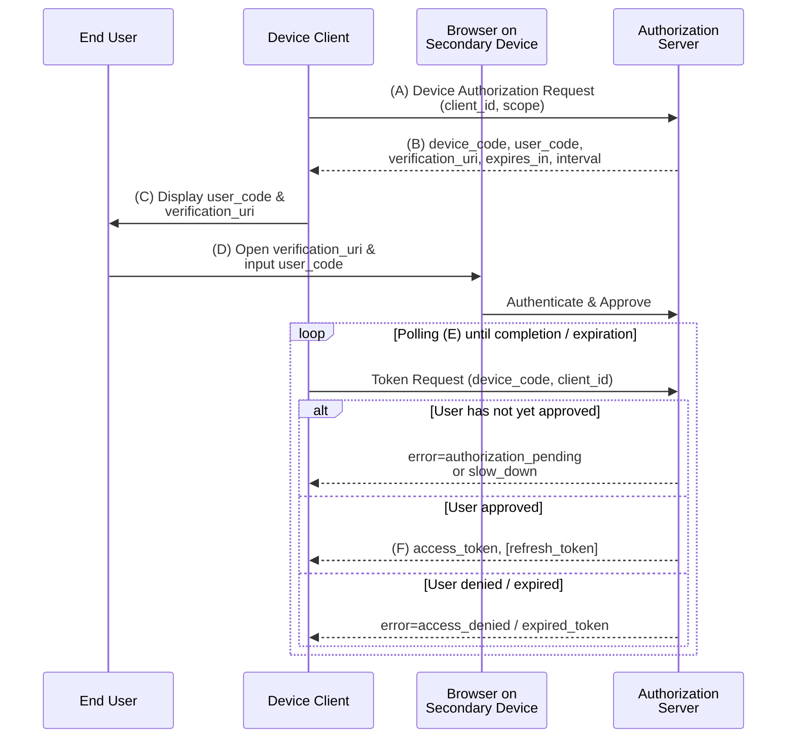

# RFC 8628 - OAuth 2.0 Device Authorization Grant

## 1. 概要

RFC 8628 は、入力機能が限定的、もしくはブラウザを持たないデバイスのために設計された OAuth 2.0 の拡張グラントタイプ「Device Authorization Grant」を定義する仕様である。スマート TV、メディアコンソール、デジタルフォトフレーム、プリンタ、CLI ツールといったデバイスから、ユーザーの保有する別のデバイス（スマートフォンや PC）を通じて認可を完了させるためのプロトコルである。

本仕様は IETF の OAuth Working Group によって 2019 年 8 月に Proposed Standard として発行された。デバイスフローやデバイスコードフローという呼称でも広く知られている。

## 2. 解決する課題

従来の OAuth 2.0 認可コードグラント (RFC 6749) は、リソースオーナーがクライアントと同一のデバイス上でブラウザを操作することを暗黙の前提としている。しかし、以下のような環境ではこの前提が成立しない。

- 物理キーボードが存在しないテレビやセットトップボックス
- ディスプレイが極めて小さい、もしくは存在しない IoT デバイス
- リダイレクトを受け取る Web サーバを内部に持たない CLI アプリケーション

RFC 8628 はこれらのデバイスについて、以下の条件さえ満たせば OAuth 2.0 のセキュリティモデルを保ちつつ認可を取得できる手段を提供する。

- インターネットへのアウトバウンド HTTPS 接続が可能であること
- URI とユーザーコード列をユーザーに伝達する手段（表示・音声・QR コード等）を持つこと
- ユーザーが別途、入力とブラウザに適した二次デバイスを利用できること
- クライアントとユーザーエージェント間の双方向通信を必要としないこと

## 3. 主要概念・用語

- **Device Client**: 認可リクエストを開始する、入力機能が限定的なデバイス上の OAuth クライアント。
- **Device Code**: 認可サーバーが発行する高エントロピーの検証コード。ユーザーには表示されず、デバイスがトークンエンドポイントをポーリングする際に使用する。
- **User Code**: 人間が読み書きできる短いコード。デバイスに表示され、ユーザーが二次デバイス上の検証 URI に手入力する。
- **Verification URI**: ユーザーが二次デバイスのブラウザで開く認可サーバーのエンドポイント URL。ユーザーコード入力 UI を提供する。
- **Verification URI Complete**: ユーザーコードを埋め込んだ完全形の検証 URI。QR コードや NFC など、ユーザーが手入力しなくても済む経路でデバイスから二次デバイスへ伝達するためのオプション。
- **Device Authorization Endpoint**: デバイス認可リクエストを受け付ける認可サーバー側の新しいエンドポイント。

## 4. プロトコルフロー

デバイス認可グラントの全体像を以下に示す。



各ステップの要点は以下のとおりである。

- (A) デバイスクライアントは新たに定義された Device Authorization Endpoint に対し、`client_id` および任意で `scope` を送信する。
- (B) 認可サーバーは `device_code`、`user_code`、`verification_uri`、`expires_in`、任意で `interval`、`verification_uri_complete` を返す。
- (C) デバイスはユーザーコードと検証 URI をユーザーに提示する。
- (D) ユーザーは二次デバイスのブラウザで検証 URI を開き、認証およびユーザーコード入力、認可の同意を行う。
- (E) デバイスは並行してトークンエンドポイントを `interval` 秒以上の間隔でポーリングする。
- (F) ユーザーが承認した時点で、認可サーバーは通常の OAuth 2.0 トークンレスポンス (RFC 6749 §5.1) を返す。

## 5. 詳細解説

### 5.1 Device Authorization Request

デバイスクライアントは認可サーバーの Device Authorization Endpoint へ HTTP POST する。リクエストパラメータは以下のとおり。

- `client_id` (公開クライアントでは必須): RFC 6749 §2.2 に従うクライアント識別子。
- `scope` (任意): 要求するアクセススコープ。

リクエスト例:

```http
POST /device_authorization HTTP/1.1
Host: server.example.com
Content-Type: application/x-www-form-urlencoded

client_id=1406020730&scope=example_scope
```

機密クライアント（confidential client）またはクライアント認証情報を発行されたクライアントは、RFC 6749 §3.2.1 に従い認証情報を提示する必要がある。認可サーバーは未知のパラメータを無視しなければならない（MUST ignore）。

### 5.2 Device Authorization Response

認可サーバーは JSON 形式で以下のフィールドを返す。

| パラメータ                  | 要否     | 説明                                                                               |
| --------------------------- | -------- | ---------------------------------------------------------------------------------- |
| `device_code`               | REQUIRED | デバイスがポーリングに使用する高エントロピーの検証コード。ユーザーには表示しない。 |
| `user_code`                 | REQUIRED | ユーザーが二次デバイスで入力する人間可読のコード。                                 |
| `verification_uri`          | REQUIRED | ユーザーがブラウザで開く URI。                                                     |
| `verification_uri_complete` | OPTIONAL | ユーザーコードを含む完全な URI。QR コード等での伝達向け。                          |
| `expires_in`                | REQUIRED | `device_code` と `user_code` の有効期間（秒）。                                    |
| `interval`                  | OPTIONAL | デバイスがポーリングする最小間隔（秒）。デフォルトは 5 秒。                        |

レスポンス例:

```json
{
  "device_code": "GmRhmhcxhwAzkoEqiMEg_DnyEysNkuNhszIySk9eS",
  "user_code": "WDJB-MJHT",
  "verification_uri": "https://example.com/device",
  "verification_uri_complete": "https://example.com/device?user_code=WDJB-MJHT",
  "expires_in": 1800,
  "interval": 5
}
```

### 5.3 User Interaction

デバイスは `user_code` と `verification_uri` をユーザーに提示し、二次デバイスでアクセスするよう促す。RFC 8628 §3.3 は以下の運用上の指針を示している。

- `verification_uri` 自体には `user_code` を埋め込まない（ユーザーが手入力する際の混乱を避ける）。
- `device_code` はユーザーに決して表示しない。
- 認可サーバー側 UI は「検証 URI → ユーザーコード入力 → 認可同意」というシーケンスを実装する。
- ユーザーが当該認可サーバーに既存アカウントを持たない場合に備え、サインアップ動線を提供してもよい。
- 認可サーバーは可能な範囲でデバイス情報を表示し、ユーザーが正規のデバイスであることを確認できるようにする。

### 5.4 Non-Textual Verification URI Optimization

`verification_uri_complete` を返した場合、デバイスは QR コードや NFC などの非テキスト経路で URI を伝達してもよい。ただし常に以下を併記することが推奨される。

- テキスト形式の `verification_uri`（フォールバックとして）
- `user_code`（ユーザーが二次デバイス上で値の一致を確認するため）

### 5.5 Device Access Token Request

ユーザーが認可を行っている間、デバイスは並行して RFC 6749 のトークンエンドポイントをポーリングする。リクエストパラメータは以下。

- `grant_type` (REQUIRED): 値は固定で `urn:ietf:params:oauth:grant-type:device_code`。
- `device_code` (REQUIRED): デバイス認可レスポンスで受領したコード。
- `client_id` (公開クライアントでは必須): クライアント識別子。

リクエスト例:

```http
POST /token HTTP/1.1
Host: server.example.com
Content-Type: application/x-www-form-urlencoded

grant_type=urn%3Aietf%3Aparams%3Aoauth%3Agrant-type%3Adevice_code
&device_code=GmRhmhcxhwAzkoEqiMEg_DnyEysNkuNhszIySk9eS
&client_id=1406020730
```

### 5.6 Device Access Token Response

ユーザーが認可を完了したら、認可サーバーは RFC 6749 §5.1 に従う通常のトークンレスポンスを返す。完了前およびエラー時には、RFC 6749 §5.2 のエラー形式に従って以下のエラーコードを返す。

| エラーコード            | 意味                               | クライアントの挙動                                               |
| ----------------------- | ---------------------------------- | ---------------------------------------------------------------- |
| `authorization_pending` | ユーザーがまだ認可を完了していない | `interval` 秒以上待ってポーリング継続                            |
| `slow_down`             | ポーリング頻度が高すぎる           | ポーリング間隔を 5 秒延長してから再試行                          |
| `access_denied`         | ユーザーが認可を拒否した           | ポーリングを中止しユーザーに通知                                 |
| `expired_token`         | `device_code` の有効期限が切れた   | ポーリングを中止。必要であれば改めてデバイス認可フローを再開する |

### 5.7 Polling 規約

仕様はクライアントに対し次の挙動を要求する (RFC 8628 §3.5)。

- リクエスト間隔は `interval` 秒（無指定時は 5 秒）以上待つこと。
- `slow_down` を受領した場合、最低 5 秒間隔を延長すること。
- 接続タイムアウト等で応答が得られない場合は自律的に頻度を下げる（指数バックオフ等）。
- `authorization_pending` および `slow_down` 以外のエラーを受領した場合はポーリングを終了すること。

## 6. ユーザーコードの推奨事項

RFC 8628 §6.1 は人間が入力する `user_code` の設計指針を詳述している。

### 6.1 文字集合

仕様は二つの代表的な文字集合を例示する。

- **Base 20** (推奨): `BCDFGHJKLMNPQRSTVWXZ`。母音を除いた子音のみで偶発的な単語生成を防ぎ、視覚的に紛らわしい文字 (0/O、1/l/I 等) を含めない。8 文字で約 34.5 ビットのエントロピー。例: `WDJB-MJHT`。
- **数字のみ**: `0-9`。A〜Z キーボードを持たないロケール向け。同じセキュリティ水準を確保するには長くなる。例: `019-450-730`。

### 6.2 フォーマットと正規化

- ハイフン等の区切りを含めて可読性を高める。
- サーバー側で照合する前に区切り文字や文字集合外の文字を取り除く。
- Base 20 集合の場合、入力を一律で大文字化する。
- 入力ミスを誘発しやすい紛らわしい文字を避ける。

## 7. セキュリティに関する考慮事項

### 7.1 ユーザーコードに対するブルートフォース

`user_code` はユーザビリティ上の制約から短くせざるを得ず、エントロピーは数十ビット程度になる。攻撃者が `user_code` を推測できた場合、自身の認可サーバー上の権限でデバイスにアクセストークンを発行させ、被害者のデバイスを攻撃者のアカウントに紐付けるという、通常のベアラートークン漏洩とは逆方向の被害が発生し得る。仕様は以下を求める。

- 認可サーバーは `user_code` 入力に対しレート制限を必ず実装する。
- 試行回数とエントロピー・有効期間の組み合わせで、実効的なセキュリティ水準を 128 ビット鍵相当に近づける設計を行う。

### 7.2 デバイスコードに対するブルートフォース

`device_code` はユーザーに表示しないため、十分長く高エントロピーにできる。仕様は高エントロピー化と短い有効期間によるブルートフォース耐性の確保を求める。

### 7.3 リモートフィッシング

攻撃者が自分のデバイスでデバイスフローを開始し、被害者にメール等で検証 URI とユーザーコードを送付し、被害者の権限でデバイスを攻撃者アカウントに紐付けさせる攻撃が考えられる。緩和策として仕様は以下を挙げる。

- ユーザー対話の段階で、これが「デバイスを認可する操作」であることを明示する。
- ユーザー自身が当該デバイスを操作している意識があるか確認する。
- 認可サーバー UI でデバイス情報を表示し、ユーザーが手元のデバイスと突き合わせられるようにする。
- 必要に応じて、デバイス側と二次デバイス側の双方にユーザーコードを表示し、一致確認を促す。
- 有効期間を不必要に長くせず、フィッシングウィンドウを縮小する。

### 7.4 セッションスパイ

公共空間に置かれたデバイスでは、攻撃者が表示されたコードを盗み見て先に認可を完了させる恐れがある。デバイスは設置環境を踏まえてコード伝達方法を選択する必要がある。

### 7.5 非機密クライアント

物理的にユーザーの手に渡るデバイスは、埋め込まれた静的なクライアントシークレットを保護できない。したがってデバイスフローのクライアントは原則として公開クライアント（public client）として扱い、RFC 6819 §5.3.1 や RFC 8252 §8.5–8.6 のネイティブアプリ向けセキュリティ考慮事項に従うべきである。

### 7.6 非視覚的なコード伝達

音声合成や BLE 等、画面以外の手段でコードを伝達することは仕様上許容される。ただし「物理的に近接した人にしか到達しない経路」に限るべきとされる。

## 8. ディスカバリ

RFC 8414 (OAuth 2.0 Authorization Server Metadata) を介して、サーバーは以下のメタデータでデバイスフロー対応を表明できる。

- `grant_types_supported` に `urn:ietf:params:oauth:grant-type:device_code` を含める。
- `device_authorization_endpoint` に Device Authorization Endpoint の URL を設定する。

## 9. IANA 登録

RFC 8628 は IANA に対し以下の登録を行う。

- OAuth Parameters Registry: `device_code` (Token Request 用パラメータ)
- OAuth URI Registry: `urn:ietf:params:oauth:grant-type:device_code`
- OAuth Extensions Error Registry: `authorization_pending`, `slow_down`, `access_denied`, `expired_token`
- OAuth Authorization Server Metadata Registry: `device_authorization_endpoint`

## 10. 関連仕様

- [RFC 6749 - The OAuth 2.0 Authorization Framework](./rfc6749.md): 本仕様の基盤となるフレームワーク。
- [RFC 6750 - OAuth 2.0 Bearer Token Usage](./rfc6750.md): 発行されたアクセストークンの利用方法。
- [RFC 8414 - OAuth 2.0 Authorization Server Metadata](./rfc8414.md): `device_authorization_endpoint` メタデータの公開に利用。
- RFC 8252 - OAuth 2.0 for Native Apps: 公開クライアントとして扱う際のセキュリティ指針。
- RFC 6819 - OAuth 2.0 Threat Model and Security Considerations: 公開クライアント関連の脅威モデル。

## 11. 参考文献

- [RFC 8628: OAuth 2.0 Device Authorization Grant](https://datatracker.ietf.org/doc/html/rfc8628)
- [IANA OAuth Parameters Registry](https://www.iana.org/assignments/oauth-parameters/oauth-parameters.xhtml)
