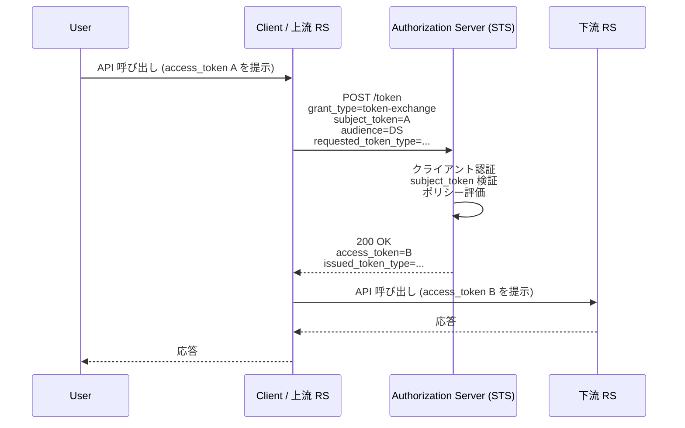
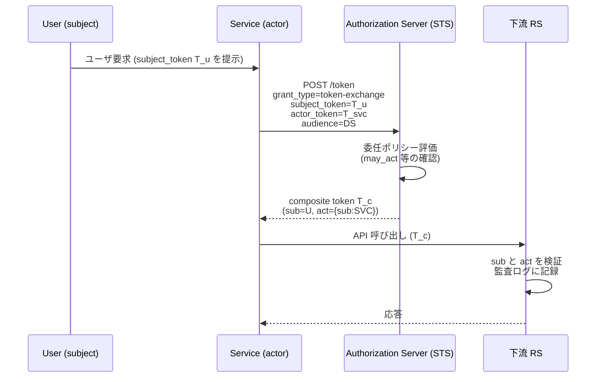

# RFC 8693 - OAuth 2.0 Token Exchange

## 1. 概要

RFC 8693 は、OAuth 2.0 認可サーバを軽量な Security Token Service (STS) として動作させ、あるセキュリティトークンを別の形式・別の用途のセキュリティトークンに交換するためのプロトコルを定義する仕様である。2020 年 1 月に Proposed Standard として発行された。

本仕様は、OAuth 2.0 のフレームワーク (RFC 6749) に新しい grant type `urn:ietf:params:oauth:grant-type:token-exchange` を追加し、HTTP と JSON のみで構成されるシンプルな STS を実現する。WS-Trust に代表される従来の XML/SOAP ベースの STS と比較して、Web API や マイクロサービスでの利用に適している。

主な利用シーンは次のとおりである。

- **委任 (delegation)**: あるサービスが、エンドユーザの代理として別のサービスを呼び出す際に、自身が呼び出していることを明示しつつユーザの権限で API を実行する。
- **偽装 (impersonation)**: あるサービスが、エンドユーザになりすまして別のサービスを呼び出す。下流のサービスから見ると、ユーザ本人が呼び出しているかのように振る舞う。
- **トークン形式の変換**: SAML アサーションを JWT に変換する、リフレッシュトークンを別 audience 向けのアクセストークンに変換するなど、形式や対象の異なるトークン間の変換。
- **権限の縮小**: 広い権限を持つトークンを、特定の下流サービス向けに scope や audience を絞ったトークンに交換する。

## 2. 解決する課題

OAuth 2.0 のコアフレームワーク (RFC 6749) はクライアントとリソースサーバの間のシンプルな関係を前提としている。しかし実際の分散システムでは、リソースサーバが別のリソースサーバを呼び出す多段呼び出し (chained API calls) が広く存在する。この場合、次のような課題が生じる。

- **下流サービス向けトークンの取得**: 上流のリソースサーバが受領したアクセストークンをそのまま下流に渡すと、audience の不一致や過剰な権限の伝播が発生する。下流サービス専用のトークンを安全に取得する手段が必要である。
- **呼び出し主体の表現**: ユーザ A の代理でサービス B が下流サービス C を呼び出すとき、「主体は A、代理実行者は B」という構造を下流サービスに伝える必要がある。単純なアクセストークンの再利用ではこの関係を表現できない。
- **異なるトークン形式間の相互運用**: 企業内では SAML、コンシューマ向けでは OIDC というように、複数のトークン形式が混在する。これらを統一的に変換する標準的な仕組みが必要である。
- **WS-Trust の重さ**: 既存の STS 仕様である WS-Trust は SOAP/XML ベースで、モダンな HTTP/JSON な Web API スタックには馴染まない。

RFC 8693 はこれらの課題に対し、OAuth 2.0 のトークンエンドポイントを STS として再利用する形で軽量な解決策を提供する。

## 3. 主要概念・用語

### 3.1 Security Token Service (STS)

セキュリティトークンを受け取り、別のセキュリティトークンを発行するサービス。RFC 8693 では OAuth 2.0 の認可サーバがこの役割を担う。

### 3.2 Subject Token

交換リクエストの主体 (subject) を表すトークン。トークン交換の結果として発行されるトークンは、この subject の権限・身元を反映する。リクエストパラメータ `subject_token` で送信する。

### 3.3 Actor Token

委任シナリオにおいて、subject の代理として実際に呼び出しを行う主体 (actor) を表すトークン。リクエストパラメータ `actor_token` で送信する。actor_token を含む交換は委任 (delegation) を要求していることを示す。

### 3.4 Delegation (委任) と Impersonation (偽装)

RFC 8693 はこの 2 つを明確に区別する重要な概念として定義する。

- **Impersonation (偽装)**: 主体 A が主体 B になりすます。下流から見ると A と B は区別不可能 (indistinguishable) であり、A の存在は隠蔽される。発行されるトークンには subject (B) のみが含まれる。
- **Delegation (委任)**: 主体 A は自身の身元 (identity) を保持したまま、B の権限の一部を委任されて行動する。下流に対しては「B の代理で A が呼び出している」ことが明示される。発行されるトークン (composite token) には subject (B) と actor (A) の両方が含まれる。

両者は監査・ログ・責任追跡の観点から大きく異なる。delegation では誰が実際に呼び出したか追跡できるが、impersonation ではそれが失われる。

### 3.5 Composite Token

subject と actor の両方を内包するトークン。委任関係を表現する。JWT の場合は `act` クレーム (4 章) で actor を表現する。

## 4. プロトコルフロー

### 4.1 基本的なトークン交換

クライアント (典型的にはリソースサーバ) が、保持している subject_token を別のトークンに交換する基本フローを次に示す。



このフローでは、上流リソースサーバ C が受け取ったアクセストークン A を STS に提示し、下流リソースサーバ DS 向けの新しいアクセストークン B を取得する。B は audience が DS に限定されており、必要なら scope も絞り込まれる。

### 4.2 委任 (Delegation) フロー

actor_token を伴う委任シナリオでは、subject (元のユーザ) と actor (実際の呼び出し主体) の双方が STS に伝達される。



下流リソースサーバは、JWT のクレーム構造から「ユーザ U の代理で SVC が呼び出している」ことを判別し、それに応じたアクセス制御と監査を行う。

## 5. 詳細解説

### 5.1 grant_type と URN

トークン交換リクエストは OAuth 2.0 のトークンエンドポイント (RFC 6749 §3.2) に対する POST であり、`grant_type` パラメータには次の URN を指定する。

```
urn:ietf:params:oauth:grant-type:token-exchange
```

### 5.2 リクエストパラメータ (§2.1)

トークン交換リクエストは次のパラメータを含む。`application/x-www-form-urlencoded` でエンコードされたフォームとして送信される。

| パラメータ             | 必須     | 説明                                                             |
| ---------------------- | -------- | ---------------------------------------------------------------- |
| `grant_type`           | 必須     | 上記 URN 固定値                                                  |
| `subject_token`        | 必須     | 主体を表すセキュリティトークン                                   |
| `subject_token_type`   | 必須     | subject_token の形式を示す URI (5.4 章参照)                      |
| `actor_token`          | 任意     | 代理実行者を表すセキュリティトークン (委任シナリオで使用)        |
| `actor_token_type`     | 条件付き | actor_token が存在する場合は必須                                 |
| `resource`             | 任意     | 発行トークンが向けられる対象リソースの絶対 URI (RFC 8707 と整合) |
| `audience`             | 任意     | 発行トークンが向けられる対象サービスの論理名                     |
| `scope`                | 任意     | 要求するスコープ (RFC 6749 §3.3)                                 |
| `requested_token_type` | 任意     | 要求するトークン形式を示す URI                                   |

`resource` と `audience` はどちらも対象サービスを示すが、`resource` は URI、`audience` は論理名 (任意の文字列) という違いがある。両方を併用することも可能である。

`requested_token_type` を省略した場合、認可サーバはコンテキストに基づき適切な形式 (典型的には `urn:ietf:params:oauth:token-type:access_token`) を選択する。

### 5.3 レスポンス (§2.2)

成功時のレスポンスは HTTP 200 OK で、JSON ボディに次のフィールドを含む。RFC 6749 §5.1 のアクセストークンレスポンスを拡張した構造である。

| フィールド          | 必須     | 説明                                                                                                                  |
| ------------------- | -------- | --------------------------------------------------------------------------------------------------------------------- |
| `access_token`      | 必須     | 発行されたセキュリティトークン (名前は access_token だが、ID Token や SAML アサーションなど任意の形式が入る)          |
| `issued_token_type` | 必須     | 発行トークンの形式を示す URI                                                                                          |
| `token_type`        | 必須     | クライアントがトークンを使う際の方式 (`Bearer` 等)。トークンが OAuth 2.0 のアクセストークンとして使えない場合は `N_A` |
| `expires_in`        | 推奨     | トークンの有効期限 (秒)                                                                                               |
| `scope`             | 条件付き | 発行トークンに付与されたスコープ (要求と異なる場合は必須)                                                             |
| `refresh_token`     | 任意     | リフレッシュトークン (発行される場合)                                                                                 |

エラー時は RFC 6749 §5.2 と同じ形式で `error` フィールドを返す。`invalid_request`、`invalid_client`、`invalid_grant`、`unauthorized_client`、`unsupported_grant_type`、`invalid_scope` などのエラーコードに加え、ポリシー上認められない交換要求には `invalid_target` を返す。

### 5.4 トークン形式識別子 (§3)

`subject_token_type`、`actor_token_type`、`requested_token_type`、`issued_token_type` で用いる URI として、本仕様は次の識別子を IANA に登録している。

| URI                                              | 意味                                             |
| ------------------------------------------------ | ------------------------------------------------ |
| `urn:ietf:params:oauth:token-type:access_token`  | OAuth 2.0 アクセストークン (形式は任意)          |
| `urn:ietf:params:oauth:token-type:refresh_token` | OAuth 2.0 リフレッシュトークン                   |
| `urn:ietf:params:oauth:token-type:id_token`      | OpenID Connect ID Token                          |
| `urn:ietf:params:oauth:token-type:saml1`         | base64url エンコードされた SAML 1.1 アサーション |
| `urn:ietf:params:oauth:token-type:saml2`         | base64url エンコードされた SAML 2.0 アサーション |
| `urn:ietf:params:oauth:token-type:jwt`           | JSON Web Token (RFC 7519)                        |

`access_token` 識別子は具体的なトークン構造を規定しない (不透明文字列・JWT どちらでもよい)。一方 `jwt` 識別子は JWT であることを保証するが、その用途は限定されない。

### 5.5 JWT 用クレーム (§4)

本仕様は、委任とトークン交換の表現のために以下の JWT クレームを新たに、あるいは既存の用法を拡張する形で定義する。これらは IANA の JSON Web Token Claims レジストリに登録されている。

#### 5.5.1 `act` (Actor) クレーム

委任を表現する中核のクレーム。値は JSON オブジェクトで、actor の身元を示す `sub` 等のクレームを含む。

```json
{
  "iss": "https://as.example.com",
  "sub": "user@example.net",
  "aud": "https://api.example.com",
  "exp": 1700000000,
  "act": {
    "sub": "service-b@example.com"
  }
}
```

委任が多段に連なる場合、`act` をネストして委任チェーンを表現できる。

```json
{
  "sub": "user@example.net",
  "act": {
    "sub": "service-b@example.com",
    "act": {
      "sub": "service-a@example.com"
    }
  }
}
```

最も外側 (トップレベル) の `act` が直近の actor であり、内側に向かって過去の委任元を辿る構造である。

#### 5.5.2 `scope` クレーム

JWT 内でスコープを表現する。値はスペース区切りの文字列で、RFC 6749 §3.3 の scope 文法に従う。

#### 5.5.3 `client_id` クレーム

トークン交換リクエストを実行した OAuth 2.0 クライアントの識別子を表す。これはトークン交換時点のクライアントであり、`sub` (主体) や `act` (実行者) とは独立した情報である。

#### 5.5.4 `may_act` クレーム

「この JWT の subject の代理として行動できる主体」を示すクレーム。値は JSON オブジェクトで、許可される actor の身元クレーム (典型的には `sub`) を含む。

```json
{
  "sub": "user@example.net",
  "may_act": {
    "sub": "service-b@example.com"
  }
}
```

このクレームを保持する subject_token を提示してトークン交換を要求するとき、認可サーバは actor_token の主体が `may_act` の値と一致するかを確認することで、委任ポリシーを事前合意ベースで強制できる。

### 5.6 委任と偽装のトークン上の区別

同じトークン交換 API を用いても、発行されるトークンの構造で委任か偽装かが区別される。

- **偽装トークン**: 通常のアクセストークン構造。`sub` のみが含まれ、actor 情報はない。下流からは元のユーザの直接呼び出しに見える。
- **委任トークン (composite)**: `act` クレームを含む。下流はこれを確認することで、実際の呼び出し主体を識別できる。

どちらを発行するかは、リクエスト内容 (actor_token の有無)、クライアント、subject、対象 audience に対する認可サーバのポリシーに基づく。

### 5.7 利用例

#### 例 1: 上流 RS から下流 RS への audience 変換 (偽装)

リソースサーバ A がユーザのアクセストークンを受け取り、それを下流のリソースサーバ B 向けのアクセストークンに交換する。`actor_token` は送らない (偽装)。

```http
POST /token HTTP/1.1
Host: as.example.com
Content-Type: application/x-www-form-urlencoded

grant_type=urn%3Aietf%3Aparams%3Aoauth%3Agrant-type%3Atoken-exchange
&resource=https%3A%2F%2Fbackend.example.com%2Fapi
&subject_token=eyJhbGciOi...
&subject_token_type=urn%3Aietf%3Aparams%3Aoauth%3Atoken-type%3Aaccess_token
```

#### 例 2: 委任 (composite token の発行)

ユーザ U のトークンを subject_token、サービス SVC 自身のトークンを actor_token として送信する。

```http
POST /token HTTP/1.1
Host: as.example.com
Content-Type: application/x-www-form-urlencoded

grant_type=urn%3Aietf%3Aparams%3Aoauth%3Agrant-type%3Atoken-exchange
&audience=urn%3Aexample%3Acooperation-context
&subject_token=...   ← user token
&subject_token_type=urn%3Aietf%3Aparams%3Aoauth%3Atoken-type%3Ajwt
&actor_token=...     ← service token
&actor_token_type=urn%3Aietf%3Aparams%3Aoauth%3Atoken-type%3Ajwt
```

発行される JWT には `sub=U`、`act={sub:SVC}` が含まれる。

#### 例 3: SAML から JWT への変換

レガシーの SAML 環境から OAuth 2.0/JWT 環境への橋渡しとして、SAML 2.0 アサーションを JWT アクセストークンに変換する。

```
subject_token=<base64url-encoded SAML 2.0 Assertion>
subject_token_type=urn:ietf:params:oauth:token-type:saml2
requested_token_type=urn:ietf:params:oauth:token-type:jwt
```

## 6. セキュリティに関する考慮事項

RFC 8693 §5 ではトークン交換に固有のセキュリティ懸念を整理している。

### 6.1 信頼関係とポリシー

トークン交換は本質的に「あるトークンの持ち主に、別の身元を持つトークンを発行する」操作であり、誤った設定や緩いポリシーは権限昇格に直結する。認可サーバは以下を考慮すべきである。

- どのクライアントがどの subject_token を持ち込んで交換を要求できるか
- どの subject に対して、どの actor が委任実行を許可されるか (`may_act` で明示できる)
- どの audience/resource に対して発行できるか
- 発行されるトークンの scope は subject_token の scope を超えないこと

### 6.2 subject_token の盗難・横展開

subject_token が漏洩した場合、攻撃者がそれを使って広範囲のトークン交換を行うリスクがある。Sender-Constrained なトークン (RFC 8705 mTLS-bound、RFC 9449 DPoP) と組み合わせることで、漏洩時の影響を限定できる。

### 6.3 クライアント認証

トークン交換はトークンエンドポイントへのリクエストであり、機密クライアントは適切に認証されるべきである。クライアント認証は、誰が交換を要求したかを記録し、ポリシー判定の根拠とするために重要である。

### 6.4 act クレームの改変防止

委任トークンの `act` クレームは、下流の監査と認可判断の根拠となる。発行トークンが JWT である場合は署名 (RFC 7515) によりこのクレームの完全性を保証する。下流リソースサーバは `act` を含む全クレームの署名を必ず検証する。

### 6.5 audience の限定

発行トークンには明確な `audience` (または `resource`) を設定し、リソースサーバ側でも自身宛てであることを検証する。これにより、あるサービス向けに発行されたトークンが別のサービスで誤って受理される (token redirect 攻撃) を防ぐ。

### 6.6 委任チェーンの長さ

ネストされた `act` クレームによる多段委任は強力だが、チェーンが長くなるほど信頼の根拠が見えづらくなる。実装は許容するチェーン長に上限を設けることが推奨される。

## 7. 関連仕様

RFC 8693 は OAuth 2.0 のエコシステムの中で次の仕様と密接に関係する。

- **RFC 6749 (OAuth 2.0)**: ベースとなる認可フレームワーク。本仕様はその grant type を拡張する。
- **RFC 7519 (JWT)**: 委任表現のための `act`、`may_act` 等のクレームは JWT を前提としている。
- **RFC 7515 (JWS)**: composite token の完全性保証に用いられる。
- **RFC 8707 (Resource Indicators)**: `resource` パラメータの仕様。本仕様の `resource` パラメータと整合する。
- **RFC 9068 (JWT Profile for OAuth 2.0 Access Tokens)**: トークン交換で発行される JWT アクセストークンの標準プロファイル。`act` クレームは RFC 9068 のアクセストークンにも含めることができる。
- **RFC 8705 (Mutual-TLS Client Authentication and Certificate-Bound Access Tokens)** / **RFC 9449 (DPoP)**: 発行されたトークンを sender-constrained にして横展開リスクを抑える。
- **OAuth 2.0 Identity and Authorization Chaining Across Domains (draft)**: マルチドメインの API 呼び出しチェーンに本仕様の概念を応用する取り組み。
- **WS-Trust**: 本仕様の概念的な先行仕様。XML/SOAP 版の STS。

## 8. 参考文献

- [RFC 8693 - OAuth 2.0 Token Exchange](https://www.rfc-editor.org/rfc/rfc8693.html)
- [RFC 6749 - The OAuth 2.0 Authorization Framework](https://www.rfc-editor.org/rfc/rfc6749.html)
- [RFC 7519 - JSON Web Token (JWT)](https://www.rfc-editor.org/rfc/rfc7519.html)
- [RFC 8707 - Resource Indicators for OAuth 2.0](https://www.rfc-editor.org/rfc/rfc8707.html)
- [RFC 9068 - JSON Web Token (JWT) Profile for OAuth 2.0 Access Tokens](https://www.rfc-editor.org/rfc/rfc9068.html)
- [IANA OAuth Parameters Registry](https://www.iana.org/assignments/oauth-parameters/oauth-parameters.xhtml)
- [IANA JSON Web Token Claims Registry](https://www.iana.org/assignments/jwt/jwt.xhtml)
