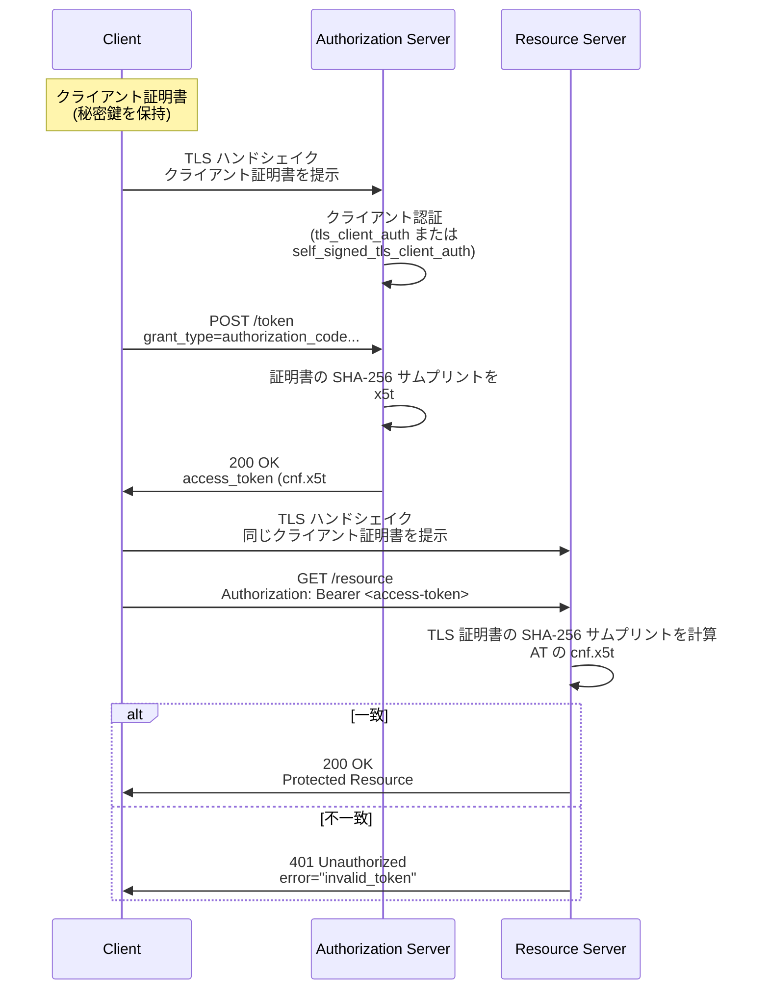

# RFC 8705 - OAuth 2.0 Mutual-TLS Client Authentication and Certificate-Bound Access Tokens

## 概要

RFC 8705 は、OAuth 2.0 において **相互 TLS (Mutual TLS, mTLS)** を用いた二つの独立した機能を定義する仕様です。2020 年 2 月に IETF により標準化されました。

- **mTLS クライアント認証**: クライアントが認可サーバーに対し、X.509 クライアント証明書を用いてトークンエンドポイント等で認証する方式
- **証明書バインドアクセストークン (Certificate-Bound Access Tokens)**: 発行されたアクセストークンを、クライアントが mTLS で提示した X.509 証明書 (の SHA-256 サムプリント) にバインドし、保護リソースへのアクセス時にも同じ証明書の所有を求める仕組み

二つの機能は独立して利用可能ですが、組み合わせることで「クライアント認証」と「アクセストークンの送信者制約 (sender-constrained)」の双方をトランスポート層で実現できます。これは Financial-grade API (FAPI) などの高セキュリティプロファイルが要求する所有証明 (Proof of Possession, PoP) を満たす主要な手段の一つです。

## 解決する課題

### 1. 共有秘密に依存しないクライアント認証

OAuth 2.0 の標準 (RFC 6749) で定められたクライアント認証方式の多くは `client_secret` という共有秘密に依存します。共有秘密は漏洩した場合の影響が大きく、ローテーションも煩雑です。X.509 証明書に基づく認証は公開鍵暗号によって、認可サーバーが秘密鍵を保持しない設計を可能にします。

### 2. Bearer トークンの送信者非制約性

OAuth 2.0 の Bearer トークン (RFC 6750) は「持っている者が利用できる」性質を持ち、漏洩したトークンを攻撃者がそのまま利用できます。RFC 8705 の証明書バインドアクセストークンは、トークン利用時にも mTLS による証明書提示を要求することで、トークンを送信者制約付きにします。秘密鍵を持たない攻撃者は、たとえトークンを盗んでも利用できません。

### 3. 既存の TLS インフラの活用

mTLS は TLS プロトコルに標準で組み込まれた機構であり、HTTP のセマンティクスより前のトランスポート層で動作します。アプリケーション層に新たな署名スキーム (例えば DPoP, RFC 9449) を導入することなく、既存の PKI や TLS ライブラリで PoP を達成できる点が特徴です。

## 主要概念・用語

### クライアント認証方式

RFC 8705 は二つの新しいトークンエンドポイント認証方式を定義します。

- `tls_client_auth` — PKI 方式。CA によって発行されたクライアント証明書をチェーン検証し、Subject DN や Subject Alternative Name (SAN) が事前登録された値と一致することを確認する。
- `self_signed_tls_client_auth` — 自己署名証明書方式。CA チェーン検証は行わず、クライアントが事前に登録した JWK Set 内の `x5c` メンバーにある証明書と、TLS ハンドシェイクで提示された証明書が一致することのみを確認する。

### 証明書バインドアクセストークン

クライアントが TLS ハンドシェイクで提示した X.509 証明書の SHA-256 サムプリント (`x5t#S256`) を、アクセストークンの `cnf` (Confirmation) クレーム (RFC 7800) に埋め込んで発行されるトークンです。保護リソース・認可サーバーは、リソースアクセス時に提示される証明書のサムプリントが一致することを検証します。

### `x5t#S256` サムプリント

X.509 証明書の DER エンコード形式に対する SHA-256 ハッシュを、パディングを取り除いた Base64url でエンコードした値です。JWT の `cnf` クレームのメンバーとして利用されます。

### `mtls_endpoint_aliases`

認可サーバーが mTLS 用の代替エンドポイント URL を公開するためのメタデータです。通常の OAuth エンドポイントとは別ホスト・別パスを使うことで、TLS クライアント証明書の選択ダイアログが通常のブラウザ操作で発生することを防げます。

## プロトコルフロー

### 全体像: mTLS クライアント認証 + 証明書バインドアクセストークン



### PKI 方式 (`tls_client_auth`) の認証

CA チェーンを検証したうえで、証明書内の以下の値のいずれかを事前登録された値と比較します。

- Subject DN (`tls_client_auth_subject_dn`)
- SAN dNSName (`tls_client_auth_san_dns`)
- SAN URI (`tls_client_auth_san_uri`)
- SAN iPAddress (`tls_client_auth_san_ip`)
- SAN rfc822Name (`tls_client_auth_san_email`)

一つのクライアントには上記のうち **ちょうど一つ** を登録します。これにより、CA から再発行された新証明書 (Subject が同じ) を使ったローテーションが、クライアント登録情報を変更することなく可能になります。

### 自己署名証明書方式 (`self_signed_tls_client_auth`) の認証

CA チェーンの検証は行わず、以下を確認します。

- TLS ハンドシェイクで提示された証明書が、クライアントの `jwks` または `jwks_uri` に含まれる JWK の `x5c` パラメータ先頭の証明書と一致すること

JWK Set を更新することで証明書ローテーションが可能です。

## 詳細解説

### Section 2: mTLS クライアント認証

RFC 8705 のクライアント認証はトークンエンドポイント (および同様のクライアント認証を必要とするエンドポイント) で機能します。クライアントは引き続き `client_id` をリクエストに含めることが求められ、TLS で提示された証明書がその `client_id` に紐付く認証情報と照合されます。

PKI 方式と自己署名方式は、いずれもクライアント登録時の `token_endpoint_auth_method` パラメータで選択します。

### Section 3: 証明書バインドアクセストークン

#### JWT アクセストークンの場合

JWT 形式のアクセストークン (RFC 9068 等) は、`cnf` クレーム内に `x5t#S256` メンバーを含めることで証明書にバインドされます。

```json
{
  "iss": "https://server.example.com",
  "sub": "ty.webb@example.com",
  "exp": 1493726400,
  "nbf": 1493722800,
  "cnf": {
    "x5t#S256": "bwcK0esc3ACC3DB2Y5_lESsXE8o9ltc05O89jdN-dg2"
  }
}
```

#### Introspection レスポンスの場合

不透明なアクセストークン (Opaque Token) を利用する場合、保護リソースは RFC 7662 のトークン Introspection レスポンスから `cnf.x5t#S256` を取得します。

```json
{
  "active": true,
  "iss": "https://server.example.com",
  "sub": "ty.webb@example.com",
  "exp": 1493726400,
  "cnf": {
    "x5t#S256": "bwcK0esc3ACC3DB2Y5_lESsXE8o9ltc05O89jdN-dg2"
  }
}
```

#### 保護リソースでの検証手順

1. mTLS で提示されたクライアント証明書を取得する
2. その証明書の DER 表現に対して SHA-256 ハッシュを計算し、Base64url (パディングなし) でエンコードする
3. アクセストークンの `cnf.x5t#S256` の値と比較する
4. 一致しなければ `WWW-Authenticate: Bearer error="invalid_token"` で 401 を返す

保護リソースは CA チェーン検証を行う必要はありません。証明書はあくまで所有証明のための媒体だからです。

### Section 4: パブリッククライアントと証明書バインド

クライアント認証を持たないパブリッククライアントでも、自己署名証明書を生成し、トークンリクエストおよびリソースアクセス時の mTLS で提示することで、証明書バインドアクセストークンを得られます。この場合、認可サーバーはクライアントを認証しているわけではなく、単に「同一の鍵を持つエンティティ」であることを確認しているに過ぎません。

パブリッククライアントの場合、認可サーバーはリフレッシュトークンも同じ証明書にバインドする **べき (SHOULD)** とされています (Section 7.1)。機密クライアント (`tls_client_auth` または `self_signed_tls_client_auth` を利用) の場合は、リフレッシュトークン使用時にもクライアント認証が要求されるため、間接的にバインドされます。

### Section 5: `mtls_endpoint_aliases` メタデータ

認可サーバーの Discovery メタデータ (RFC 8414) に `mtls_endpoint_aliases` を含めることで、mTLS 専用の代替エンドポイントを公開します。

```json
{
  "issuer": "https://server.example.com",
  "token_endpoint": "https://server.example.com/token",
  "mtls_endpoint_aliases": {
    "token_endpoint": "https://mtls.example.com/token",
    "revocation_endpoint": "https://mtls.example.com/revo",
    "introspection_endpoint": "https://mtls.example.com/introspect"
  }
}
```

mTLS を利用するクライアントは、`mtls_endpoint_aliases` に対応するエンドポイントが含まれていれば、そのエイリアス URL を利用しなければなりません (MUST)。エイリアスが定義されていないエンドポイントについては通常のエンドポイント URL を利用します。これにより、通常の OAuth クライアントが mTLS エンドポイントへアクセスして証明書選択ダイアログに困らされる事態を防げます。

なお RFC 8705 は `mtls_endpoint_aliases` 内に並べる具体的なエンドポイントの集合を網羅的には定めておらず、`token_endpoint` / `revocation_endpoint` / `introspection_endpoint` 等を例として示すに留まります。RFC 8628 (デバイス認可) や RFC 9126 (PAR) など、後続仕様で定義されたエンドポイントを必要に応じて追加することが想定されています。

### 認可サーバー / クライアントメタデータの拡張

#### 認可サーバーメタデータ (Section 3.3 / Section 5)

- `tls_client_certificate_bound_access_tokens` (Boolean): サーバーが証明書バインドアクセストークンを発行する能力を持つかを示す。デフォルトは `false`。
- `mtls_endpoint_aliases` (JSON Object): 前述の mTLS エンドポイントエイリアス。

#### クライアントメタデータ (Section 2.1.2 / Section 3.4、登録は RFC 7591 / RFC 7592)

- `tls_client_auth_subject_dn`, `tls_client_auth_san_dns`, `tls_client_auth_san_uri`, `tls_client_auth_san_ip`, `tls_client_auth_san_email`: PKI 方式での照合対象。これらは相互排他であり、クライアントごとにいずれか一つだけを登録する。
- `tls_client_certificate_bound_access_tokens` (Boolean): クライアントが証明書バインドアクセストークンを希望するか。デフォルトは `false`。`true` を指定したクライアントが非 mTLS 接続でトークンエンドポイントへリクエストした場合、エラー応答か非バインドトークン発行かは認可サーバーの裁量とされる。

## セキュリティに関する考慮事項

### TLS ターミネーション

リバースプロキシや TLS アクセラレータが TLS を終端する構成では、バックエンドの認可サーバー / リソースサーバーへクライアント証明書の情報を安全に伝達する必要があります。一般的には HTTP ヘッダー (`X-SSL-Cert` 等) で渡しますが、その経路が信頼境界の内側にあること、外部からは同名ヘッダーを注入できないことを保証しなければなりません。

### TLS バージョン

TLS 1.2 および 1.3 がサポート対象です。BCP 195 に従ったバージョン選定が推奨されます。TLS 1.3 ではクライアント証明書も暗号化されたあとに送信されるため、ネットワーク観測者によるクライアント識別子としての証明書追跡を防げます。

### サムプリントの暗号学的前提

`x5t#S256` の安全性は SHA-256 の第二原像耐性に依存します。将来 SHA-256 が危殆化した場合は、別のハッシュ関数に対応する新たな `cnf` メンバーを定義する必要があります。

### PKI 方式での CA 信頼

PKI 方式 (`tls_client_auth`) を利用する場合、認可サーバーが信頼する CA の集合は厳格に管理しなければなりません。広く信頼された任意の商用 CA を許可すると、攻撃者が同一 Subject の証明書を別 CA から取得して認証を突破する可能性があります。クライアントごとに想定 CA を限定することが推奨されます。

### 暗黙的フロー (Implicit Grant) の非対応

ブラウザの証明書選択 UI が利用性に大きく影響することから、Implicit Grant に対する証明書バインドアクセストークンの発行は明示的にスコープ外とされています。

### X.509 パース実装

X.509 のパースには長年の脆弱性の歴史があります。新たに自前実装するのではなく、TLS スタックが提供する確立した X.509 ライブラリを利用するべきです。

## プライバシーに関する考慮事項

TLS 1.2 以下ではクライアント証明書が平文で送信されるため、ネットワーク観測者がエンドユーザーを追跡可能な識別子として証明書を利用しうる懸念があります。モバイルアプリ等のシングルユーザークライアントでは TLS 1.3 を優先するか、利用範囲を限定することが望まれます。

## 関連仕様

- **RFC 6749** OAuth 2.0 Authorization Framework — クライアント認証方式の拡張先
- **RFC 6750** OAuth 2.0 Bearer Token Usage — Bearer トークンを所有証明ありに拡張する基盤
- **RFC 7800** Proof-of-Possession Key Semantics for JWTs — `cnf` クレームの基盤
- **RFC 7662** OAuth 2.0 Token Introspection — Opaque トークンに対する `cnf` の伝達経路
- **RFC 8414** OAuth 2.0 Authorization Server Metadata — `mtls_endpoint_aliases` 等の公開先
- **RFC 7591 / RFC 7592** OAuth 2.0 Dynamic Client Registration — `tls_client_auth_*` メタデータの登録先
- **RFC 9068** JWT Profile for OAuth 2.0 Access Tokens — JWT 形式のアクセストークンに `cnf` を含める際の標準形
- **RFC 9449** Demonstrating Proof of Possession (DPoP) — アプリケーション層での代替的 PoP 機構
- **FAPI 2.0 Security Profile** — RFC 8705 (mTLS) または RFC 9449 (DPoP) のいずれかを必須とするプロファイル

## 参考文献

- [RFC 8705 - OAuth 2.0 Mutual-TLS Client Authentication and Certificate-Bound Access Tokens](https://www.rfc-editor.org/rfc/rfc8705.html)
- [RFC 7800 - Proof-of-Possession Key Semantics for JSON Web Tokens (JWTs)](https://www.rfc-editor.org/rfc/rfc7800.html)
- [RFC 8414 - OAuth 2.0 Authorization Server Metadata](https://www.rfc-editor.org/rfc/rfc8414.html)
- [BCP 195 - Recommendations for Secure Use of Transport Layer Security (TLS)](https://www.rfc-editor.org/info/bcp195)
