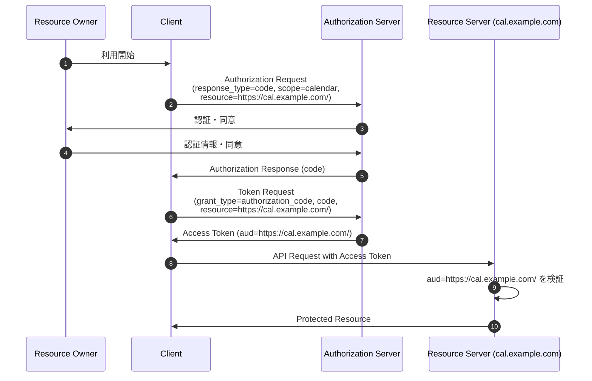
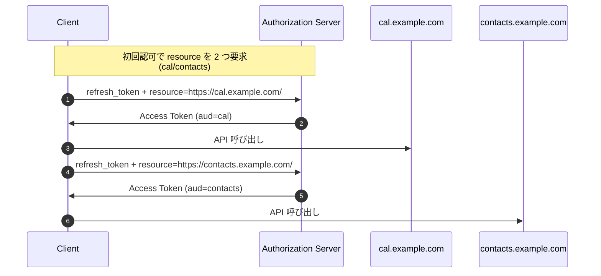

# RFC 8707 - Resource Indicators for OAuth 2.0

## 1. 概要

RFC 8707 は、OAuth 2.0 においてクライアントが「これから取得するアクセストークンをどの保護リソースに対して提示するつもりか」を認可サーバへ明示するための拡張パラメータ `resource` を定義する仕様である。2020 年 2 月に Proposed Standard として発行された。

OAuth 2.0 のコアフレームワーク (RFC 6749) では、認可リクエストやトークンリクエストに含まれるパラメータは原則として `scope` のみで、トークンの利用先 (audience) を表現する標準的な手段は存在しなかった。RFC 8707 はこの空白を埋め、認可サーバが発行するアクセストークンを特定リソースにオーディエンス制限 (audience restriction) するための共通基盤を提供する。

本仕様は単独で利用されるよりも、次のような他仕様と組み合わせて真価を発揮する。

- **RFC 9068 (JWT Profile for OAuth 2.0 Access Tokens)**: `resource` 値を JWT の `aud` クレームに反映する
- **RFC 8693 (Token Exchange)**: 交換後トークンの対象リソースを `resource` で指定する
- **OpenID Connect Native Apps / FAPI / OAuth 2.1**: 「アクセストークンは特定リソースに限定すべき」というベストプラクティスを実現する手段として参照される

## 2. 解決する課題

RFC 6749 における `scope` は、本来「何を要求するか」を表現するパラメータであり、「どこで使うか」を示すものではない。RFC 8707 はこの点を Introduction で次のように指摘している。

> Scope is typically about what access is being requested rather than where that access will be redeemed.

スコープのみで運用される OAuth 2.0 は次のような問題を抱えていた。

- **トークンの転用 (token redirect)**: あるリソースサーバが受領したベアラートークンを、別のリソースサーバへ提示して保護リソースへアクセスする攻撃が成立し得る。トークンが明示的なオーディエンスを持たないためである。
- **暗号化・署名アルゴリズムの選定**: 認可サーバはトークン発行時、最終的に検証する側 (リソースサーバ) の暗号スイートに合わせる必要があるが、対象リソースが不明では適切な選定ができない。
- **コンテンツの最適化**: JWT 内に含めるクレームや暗号化方式は、リソースごとに異なるべき場面がある。
- **マルチテナント環境**: 同一の認可サーバが多数の API/テナントをカバーするとき、スコープ命名規約だけでは衝突を避けつつ宛先を特定するのが困難である。

RFC 8707 は `resource` パラメータを追加することで、これらの課題を統一的に解決する。

## 3. 主要概念・用語

### 3.1 Resource Parameter

認可リクエストおよびトークンリクエストに含めることのできる、新たな OAuth 2.0 リクエストパラメータ。値は保護リソースを示す URI である。

### 3.2 Audience Restriction

発行されたアクセストークンが、特定の受信者 (audience) でのみ有効であるとマークされている状態。JWT であれば `aud` クレーム、Token Introspection (RFC 7662) であればレスポンスの `aud` メンバーで表現される。

### 3.3 Target Resource

`resource` パラメータの値で示される保護リソース。通常は API のベース URI で、論理的なエンドポイント集合を識別する。

### 3.4 `invalid_target` エラー

`resource` 値が無効・未知・誤った形式である、もしくは要求されたリソースとスコープの組み合わせが許容できない場合に認可サーバが返すエラーコード。

## 4. プロトコルフロー

### 4.1 認可コードフロー (Authorization Code) との統合



ポイントは次のとおり。

- 認可リクエストに含めた `resource` は、その認可グラント (認可コード) 全体の制約として記録される。後続のトークンリクエストではこのリストの「サブセット」しか要求できない。
- 認可サーバはアクセストークンをオーディエンス制限し、宛先以外のリソースサーバが受け取っても拒否されるようにする。

### 4.2 リフレッシュトークンフローでの絞り込み



クライアントは単一のリフレッシュトークンから、宛先ごとに別々のアクセストークンを取得できる。これによりリソースサーバ間の権限分離を保ちつつ、ユーザに繰り返し同意を求めずに済む。

## 5. 詳細解説

### 5.1 `resource` パラメータの構文

仕様 Section 2 で次のように定義されている。

- パラメータ名は `resource`
- 値は **絶対 URI** (RFC 3986) でなければならない (MUST)
- URI は **フラグメントを含んではならない** (MUST NOT)
- クエリ成分は原則含むべきでない (SHOULD NOT) が、実装上必要な場合は含めてよい
- 複数の `resource` パラメータを 1 リクエストで送信してよい (MAY)。これはトークンが複数リソースで利用可能であることを示す

クライアントは、自身がアクセスする API/リソースセットに対して最も具体的な URI を指定すべきとされている。

- 単一 API のホスト全体: `https://api.example.com/`
- マルチテナント環境: `https://api.example.com/app/`
- SCIM エンドポイント群を束ねる: `https://apps.example.com/scim/`

### 5.2 認可リクエストでの利用

認可エンドポイントに `resource` を付与した例 (改行は可読性のため):

```
GET /as/authorization.oauth2?response_type=code
    &client_id=s6BhdRkqt3
    &state=tNwzQ87pC
    &redirect_uri=https%3A%2F%2Fclient.example.org%2Fcb
    &scope=calendar%20contacts
    &resource=https%3A%2F%2Fcal.example.com%2F
    &resource=https%3A%2F%2Fcontacts.example.com%2F HTTP/1.1
Host: authorization-server.example.com
```

response_type に応じて適用範囲が異なる。

- `token` (Implicit): 発行されるアクセストークンに直接適用される
- `code` (Authorization Code): 認可グラント全体 (= 認可コードを含む) に適用される。後続のトークンリクエストはサブセットしか指定できない

JWT で保護されたリクエスト (RFC 9101 / JAR) や PAR (RFC 9126) と組み合わせる場合、`resource` クレームは単一値であれば文字列、複数値であれば文字列配列で表現する。

### 5.3 トークンリクエストでの利用

トークンエンドポイントへの例:

```
POST /as/token.oauth2 HTTP/1.1
Host: authorization-server.example.com
Content-Type: application/x-www-form-urlencoded

grant_type=authorization_code
&code=10esc29BWC2qZB0acc9v8zAv9ltc2pko105tQauZ
&client_id=s6BhdRkqt3
&redirect_uri=https%3A%2F%2Fclient.example.org%2Fcb
&resource=https%3A%2F%2Fcal.example.com%2F
```

grant type ごとの扱いは次のとおり。

- **`authorization_code` / `refresh_token`**: 認可リクエスト時に与えられたリソース集合の「サブセット」のみ指定できる。これにより、後から権限の範囲を広げる方向への変更を防ぐ。リフレッシュトークン自体は引き続き元の (完全な) グラントに紐付くため、別の `resource` で再度トークンを取得可能。
- **その他の grant type (`client_credentials`, `password` 等)**: 認可サーバのポリシーに従って `resource` が解釈される。

### 5.4 `resource` と `scope` の組み合わせ

両方が指定された場合のセマンティクスとして、仕様は「要求された各スコープが、要求された各リソースで利用可能であること」を求める。一致しない組み合わせがあるとき、認可サーバの取り得る対応は次のいずれか。

- 可能な限りトークンをダウンスコープして発行する (SHOULD)
- `invalid_target` エラーで拒否する
- `invalid_scope` エラーで拒否する

### 5.5 アクセストークン応答とオーディエンス制限

認可サーバは、`resource` で示されたリソースに対してアクセストークンをオーディエンス制限すべきである (SHOULD)。具体的な実装方法は次の 2 通りが挙げられている。

| 方式                            | 表現箇所                             |
| ------------------------------- | ------------------------------------ |
| JWT アクセストークン (RFC 9068) | `aud` クレーム                       |
| Token Introspection (RFC 7662)  | レスポンス JSON のトップレベル `aud` |

`aud` の値は、クライアントが指定した `resource` URI をそのまま使うのが基本だが、認可サーバは内部的なポリシーに基づき、より一般的な URI や抽象的な識別子 (例えば固有の URN) にマッピングしてもよい。リソースサーバ側はその値を検証することでトークンの転用を防ぐ。

### 5.6 エラー応答: `invalid_target`

```
HTTP/1.1 400 Bad Request
Content-Type: application/json

{
  "error": "invalid_target",
  "error_description": "Requested resource is not allowed for this client."
}
```

`invalid_target` は次の状況で返される。

- `resource` がパースできない (URI 構文違反、フラグメントを含む等)
- `resource` 値が認可サーバから見て未知である
- クライアントに当該リソースへのアクセスが許可されていない
- スコープとリソースの組み合わせが認可サーバのポリシーに反する

認可リクエスト時はリダイレクトを通じた `error` パラメータとして、トークンリクエスト時は HTTP 400 の JSON ボディとして返される。`error_description` で詳細を補足してもよい。

## 6. セキュリティに関する考慮事項

### 6.1 トークン転用 (Token Redirect) の防止

仕様の最も重要なセキュリティ効果は、ベアラートークンが意図しない宛先で悪用されることを防ぐ点にある。RFC 8707 は次のように述べる。

> An audience-restricted access token that is legitimately presented to a resource cannot then be taken by that resource and presented elsewhere for illegitimate access.

オーディエンス制限されたトークンを正規に受け取ったリソースサーバが、それを別のリソースサーバへ転送しても、宛先側で `aud` 検証によって拒否される。これは悪意あるリソースサーバや侵害されたサービスからの横方向移動 (lateral movement) を抑止する。

### 6.2 マルチテナント環境

テナント識別子は URI のパス成分 (またはホスト名) に含めることが望ましい。例:

- 良い例: `https://api.example.com/tenant123/`
- 悪い例: `https://api.example.com/` にスコープでテナントを区別

前者はトークンの `aud` 自体がテナントを内包するため、テナント間のトークン混同が構造的に発生しない。

### 6.3 複数リソースの指定は最小限に

複数の `resource` を指定して 1 つのトークンを発行することは可能だが、その場合トークンは複数オーディエンスを持ち、各リソースサーバは互いを「同じ信頼境界」として扱わざるを得ない。仕様は「単一リソース指定が推奨される」と注意を促す。複雑な依存関係を持つマイクロサービス間で `resource` を多数並べる運用は、トークンスコープの拡散を招きやすい。

### 6.4 リソース URI の正当性検証

クライアントが指定する `resource` は、実際にそのクライアントが通信する正規エンドポイントに対応している必要がある。攻撃者が制御する URI を意図せず指定すると、結果として攻撃者のサーバ宛のトークンを得ることになりうる。仕様は次のように述べる。

> The resource parameter should correspond to the network-addressable location of the protected resource.

抽象識別子 (URN 等) を用いる場合は、その識別子と物理エンドポイントの対応関係を帯域外で確実に検証することが求められる。

### 6.5 プライバシー考慮事項

`resource` パラメータの導入により、認可サーバはクライアントがどのリソースへアクセスしようとしているかを従来よりも詳細に把握できる。これは OAuth 自体が持つトラッキング性をさらに高める可能性があり、ログ保持期間・利用目的の透明性などプライバシーポリシー側での配慮が必要である。

## 7. 関連仕様

- **RFC 6749 (OAuth 2.0)**: 本仕様が拡張するベースフレームワーク。
- **RFC 7662 (Token Introspection)**: `aud` メンバーを通じて `resource` の効果を表現する手段。
- **RFC 9068 (JWT Profile for Access Tokens)**: JWT 形式のアクセストークンで `aud` クレームを必須化しており、`resource` と直接連動する。
- **RFC 8693 (Token Exchange)**: 交換先トークンの宛先を `resource` パラメータで指定でき、本仕様と同じセマンティクスを共有する。
- **RFC 8705 (mTLS / Certificate-Bound Access Tokens)**: オーディエンス制限と所持者証明を組み合わせることで、より強固なトークン保護を実現する。
- **RFC 9126 (PAR)** / **RFC 9101 (JAR)**: `resource` を含むリクエスト全体を安全に伝達する仕組み。
- **RFC 8414 (Authorization Server Metadata)**: `resource` を含めるリクエストに対する認可サーバの対応可否を、メタデータで広告する基盤。
- **OAuth 2.0 Security Best Current Practice (RFC 9700)**: 「アクセストークンは可能な限り audience を限定すべき」というベストプラクティスを規定し、本仕様の利用を推奨する。

## 8. 参考文献

- [RFC 8707 - Resource Indicators for OAuth 2.0](https://datatracker.ietf.org/doc/html/rfc8707)
- [RFC 6749 - The OAuth 2.0 Authorization Framework](https://datatracker.ietf.org/doc/html/rfc6749)
- [RFC 7662 - OAuth 2.0 Token Introspection](https://datatracker.ietf.org/doc/html/rfc7662)
- [RFC 8693 - OAuth 2.0 Token Exchange](https://datatracker.ietf.org/doc/html/rfc8693)
- [RFC 9068 - JSON Web Token (JWT) Profile for OAuth 2.0 Access Tokens](https://datatracker.ietf.org/doc/html/rfc9068)
