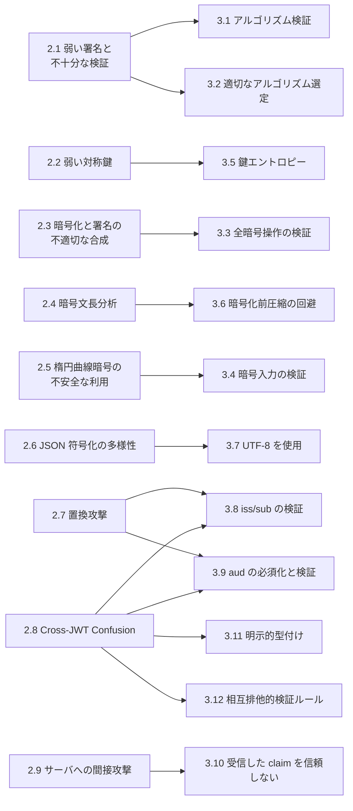
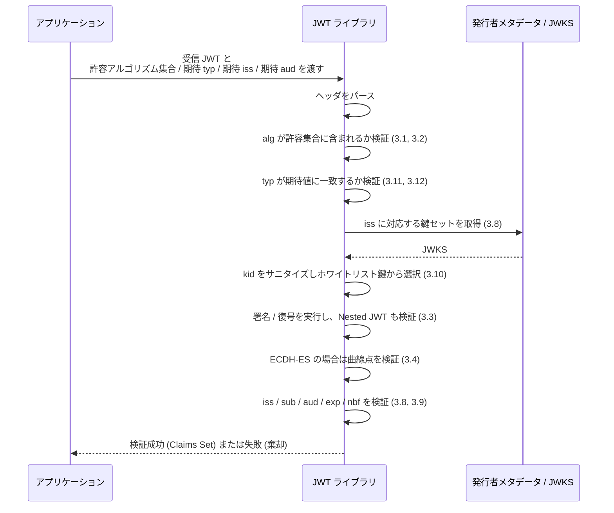

# RFC 8725 - JSON Web Token Best Current Practices

## 1. 概要

RFC 8725 は、JSON Web Token (JWT, RFC 7519) を安全に実装・運用するためのベストカレントプラクティス (BCP) を集約した文書である。IETF の BCP シリーズに BCP 225 として登録されており、2020 年 2 月に発行された。RFC 7519 を Update する位置づけで、JWT を採用するすべての仕様 (OpenID Connect、OAuth 2.0 関連 RFC、Security Event Token など) に横断的に影響する。

JWT は URL セーフな JSON ベースのセキュリティトークン形式であり、JWS (RFC 7515) による署名や JWE (RFC 7516) による暗号化、JWA (RFC 7518) のアルゴリズムを組み合わせて構築される。仕様自体が柔軟であるがゆえに、実装ミスや誤用に起因する攻撃が複数報告されてきた。本 BCP は、それらの実装上・運用上の落とし穴を脅威 (Threats) と対策 (Best Practices) に整理し、JWT を利用する仕様策定者・ライブラリ実装者・運用者が参照すべき指針を示す。

## 2. 解決する課題

JWT 公開以降に観測された実装攻撃は、おおむね次のカテゴリに分類できる。

- 署名検証ロジックの抜け道 (`alg: none` 攻撃、HS256 と RS256 の鍵混同攻撃など)
- 弱い対称鍵やパスワードベース鍵の利用による辞書攻撃
- 暗号化と署名の組み合わせ不備
- 楕円曲線パラメータ検証漏れによる秘密鍵漏洩
- 同一発行者から発行された別用途 JWT の取り違え (Cross-JWT Confusion)
- `kid` / `jku` / `x5u` 等のヘッダ値を信頼することによる SQL インジェクション・SSRF

RFC 8725 はこれらを統一的に整理し、対応する Best Practice を示すことで、JWT の安全な再利用と新規プロファイル設計を支援する。

## 3. 主要概念・用語

| 用語                  | 説明                                                     |
| --------------------- | -------------------------------------------------------- |
| JWT                   | JSON Web Token (RFC 7519)                                |
| JWS                   | JSON Web Signature (RFC 7515)                            |
| JWE                   | JSON Web Encryption (RFC 7516)                           |
| JWA                   | JSON Web Algorithms (RFC 7518)                           |
| Nested JWT            | JWS を JWE で包む (またはその逆) 多重構造の JWT          |
| `alg`                 | JWS/JWE ヘッダの署名・鍵管理アルゴリズム識別子           |
| `enc`                 | JWE のコンテンツ暗号化アルゴリズム識別子                 |
| `typ`                 | JWT の明示的型を示すヘッダパラメータ                     |
| `kid` / `jku` / `x5u` | 鍵識別子・鍵セット URL・X.509 URL を示すヘッダパラメータ |
| `iss` / `sub` / `aud` | Issuer / Subject / Audience claim                        |
| Cross-JWT Confusion   | 別用途のために発行された JWT が誤って受理される攻撃      |

## 4. 脅威と Best Practice の対応関係

RFC 8725 の構成は、Section 2 で 9 種の脅威を列挙し、Section 3 で 12 種の Best Practice を提示する。それぞれの対応関係をまとめると以下のとおり。

## 5. 脅威の詳細 (Section 2)

### 5.1 弱い署名と不十分な署名検証 (2.1)

代表的な攻撃が二つある。

- `alg` ヘッダを `none` に書き換える攻撃。署名検証が `alg` ヘッダの値に従って分岐する実装では、`none` を指定された JWT を「署名検証不要」と解釈して受け入れてしまう。
- RS256 で発行されている JWT の `alg` を HS256 に差し替える攻撃。受信側が RSA 公開鍵を HMAC 共有鍵として利用してしまうと、攻撃者は公開鍵だけで有効な MAC を生成できる。

### 5.2 弱い対称鍵 (2.2)

HS256 等の鍵付き MAC アルゴリズムにおいて、低エントロピーの共有鍵 (人間が記憶できるパスワード等) を直接 MAC 鍵として用いると、オフライン辞書攻撃が成立する。

### 5.3 暗号化と署名の不適切な合成 (2.3)

JWE で復号した後、内部に含まれる JWS の署名検証を省略してしまう実装は、内容の真正性を担保できない。

### 5.4 暗号文長分析による平文漏洩 (2.4)

圧縮を暗号化前に行うと、暗号文長から平文内容を推測されうる。CRIME / BREACH 攻撃の系譜と同様の懸念である。

### 5.5 楕円曲線暗号の不安全な利用 (2.5)

`ECDH-ES` アルゴリズムにおいて、受信した曲線上の点が当該曲線上に存在することを検証しない実装は、Invalid Curve Attack によって受信者の秘密鍵を漏洩しうる。

### 5.6 JSON 符号化の多様性 (2.6)

JSON は UTF-8 以外の符号化 (UTF-16, UTF-32) も理論的には許容しうるが、JWT/JWS/JWE/RFC 8259 の規定により、相互運用環境では UTF-8 のみが許される。符号化の取り違えによる解釈差異は脅威となる。

### 5.7 置換攻撃 (2.7)

ある受信者向けに発行された JWT を、別の受信者へ提示することで権限を悪用する攻撃。OAuth 2.0 のアクセストークンを別のリソースサーバへ提示する攻撃が代表例である。

### 5.8 Cross-JWT Confusion (2.8)

同一発行者が異なる目的のために発行する複数種類の JWT を混同させる攻撃。置換攻撃の特殊形であり、ID Token をアクセストークンとして受理する等の事故を生む。

### 5.9 サーバへの間接攻撃 (2.9)

`kid` を SQL/LDAP クエリにそのまま埋め込むとインジェクションを許す。`jku` / `x5u` を検証せずに参照すると SSRF (Server-Side Request Forgery) の踏み台となる。

## 6. Best Practice の詳細 (Section 3)

### 6.1 3.1 アルゴリズム検証 (Perform Algorithm Verification)

- ライブラリは呼び出し側が「許容するアルゴリズム集合」を明示的に指定できる API を提供すべきである。
- 同一鍵を複数アルゴリズムに流用してはならない。
- 受信した JWT の `alg` / `enc` が、想定する暗号操作と一致することを検証する。

特に `alg: none` を含む全アルゴリズムを許容する実装や、JWT のヘッダの `alg` を盲目的に信用する実装は危険である。

### 6.2 3.2 適切なアルゴリズム選定 (Use Appropriate Algorithms)

- 暗号学的に有効なアルゴリズムのみを許可する。
- 将来のアルゴリズム更改を見据えた cryptographic agility を設計に組み込む。
- `none` アルゴリズムはトランスポート層保護がある場合に限定する。
- RSA PKCS#1 v1.5 暗号化を避け、RSAES-OAEP を採用する。
- ECDSA 署名は RFC 6979 の決定論的アプローチを実装することが推奨される。

### 6.3 3.3 全暗号操作の検証 (Validate All Cryptographic Operations)

すべての暗号操作 (署名検証・復号) を漏れなく実行し、Nested JWT については内側・外側双方を検証する。検証に失敗した場合は JWT 全体を棄却する。

### 6.4 3.4 暗号入力の検証 (Validate Cryptographic Inputs)

`ECDH-ES` を用いる場合、受信した楕円曲線点の検証が必須である。NIST 曲線 (P-256, P-384, P-521) では NIST SP 800-56A Revision 3 Section 5.6.2.3.4 に従う。X25519 / X448 を用いる場合は RFC 8037 のセキュリティ考慮事項を適用する。

### 6.5 3.5 鍵エントロピーの確保 (Ensure Cryptographic Keys Have Sufficient Entropy)

RFC 7515 Section 10.1 および RFC 7518 Section 8.8 に従い十分なエントロピーを確保する。HS256 等の鍵付き MAC 鍵に、人間が記憶可能なパスワードを直接用いてはならない。パスワードを使う場合は鍵暗号化目的に限定し、コンテンツ暗号化鍵そのものに用いない。

### 6.6 3.6 暗号化前圧縮の回避 (Avoid Compression of Encryption Inputs)

平文を暗号化する前に圧縮することは原則として避ける。攻撃者が部分的に平文を制御できる状況では、圧縮後の長さから秘密情報を推測されうる。

### 6.7 3.7 UTF-8 を使用 (Use UTF-8)

ヘッダパラメータと JWT Claims Set の JSON は UTF-8 で符号化・復号する。他の Unicode 符号化を使用してはならない。

### 6.8 3.8 Issuer と Subject の検証 (Validate Issuer and Subject)

`iss` claim が存在する場合、暗号操作に用いる鍵がその発行者に紐づくものであることを検証する。鍵が紐づかない場合は JWT を棄却する。`sub` claim が存在する場合、その値が当該コンテキストで有効であることを検証する。発行者・サブジェクト・両者の組み合わせが無効な場合は棄却する。

OpenID Connect では `jwks_uri` を含む発行者メタデータから公開鍵セットを取得することでこの検証を実装する。RFC 8414 (OAuth Authorization Server Metadata) も同等の仕組みを提供する。

### 6.9 3.9 Audience の必須化と検証 (Use and Validate Audience)

同一発行者が複数受信者向けに JWT を発行する場合、`aud` claim を必須化し、その値が受信者自身と関連することを検証する。`aud` が存在しない、または自身に関連しない場合は棄却する。

### 6.10 3.10 受信した claim を信頼しない (Do Not Trust Received Claims)

- `kid` ヘッダを SQL / LDAP クエリへ展開する際は、検証またはサニタイズを行う。
- `jku` / `x5u` ヘッダはホワイトリストと照合する。GET リクエストにクッキーを付与しない。これらにより SSRF を緩和する。

### 6.11 3.11 明示的型付け (Use Explicit Typing)

`typ` ヘッダパラメータで JWT の用途を明示する。`application/` プレフィックスは省略するのが慣例で、たとえば Security Event Token (RFC 8417) は `secevent+jwt` を用いる。Nested JWT では内側 JWT にも `typ` を付すべきである。新規 JWT 用途では `typ` の指定が強く推奨される。

### 6.12 3.12 異なる JWT 種別に相互排他的な検証ルール (Use Mutually Exclusive Validation Rules)

同一受信者が複数種類の JWT を扱う場合、種別ごとに相互排他的な検証ルールを設けて取り違えを防ぐ。差別化の手段としては以下が挙げられる。

1. 明示的型付け (`typ` 値を分ける)
2. 必須 claim や値を変える
3. ヘッダパラメータを変える
4. 種別ごとに別の鍵を用い、鍵検証で他種別を棄却する
5. `aud` 値を変える
6. `iss` 値を変える

新規アプリケーションでは「明示的型付け」が推奨される。

## 7. 実装フロー例: 受信した JWT の検証

## 8. セキュリティに関する考慮事項

RFC 8725 自体がセキュリティに特化した BCP であり、Section 3 全体が事実上のセキュリティ考慮事項となる。特に以下の点は実装時に強く意識する必要がある。

- 「ライブラリのデフォルト挙動」が安全側に倒れているかを確認する。`alg` ヘッダの値に無条件で従うライブラリは避ける。
- 鍵と用途を 1 対 1 で対応させ、`alg` を切り替えての再利用を許さない。
- 新しい JWT プロファイルを設計する場合は、必ず `typ` を採番し、検証ルールを既存 JWT と相互排他的に設計する。
- `kid` / `jku` / `x5u` を含む「外部参照型」のヘッダは入力として扱い、信頼境界の外側にあるものとして検証する。
- 暗号化と圧縮を併用しない。やむを得ず行う場合は、攻撃者が制御可能な部分を分離する。

## 9. 関連仕様

- [RFC 7519](./rfc7519.md) - JSON Web Token (JWT)。本 BCP が Update する対象。
- [RFC 7515](./rfc7515.md) - JSON Web Signature (JWS)。
- [RFC 7516](./rfc7516.md) - JSON Web Encryption (JWE)。
- [RFC 7518](./rfc7518.md) - JSON Web Algorithms (JWA)。
- [RFC 7517](./rfc7517.md) - JSON Web Key (JWK)。
- [RFC 8417](./rfc8417.md) - Security Event Token (SET)。`typ: secevent+jwt` の代表的利用例。
- [RFC 9068](./rfc9068.md) - JWT Profile for OAuth 2.0 Access Tokens。`typ: at+jwt` を導入し、3.11 / 3.12 を体現するプロファイル。
- [RFC 8414](./rfc8414.md) - OAuth 2.0 Authorization Server Metadata。`jwks_uri` 等の鍵配布を提供。
- NIST SP 800-56A Revision 3 - Pair-Wise Key-Establishment Schemes Using Discrete Logarithm Cryptography。
- [RFC 8037] - CFRG Elliptic Curve ECDH and Signatures in JOSE。
- [RFC 6979] - Deterministic Usage of DSA and ECDSA。

## 10. 参考文献

- IETF, "JSON Web Token Best Current Practices", BCP 225, RFC 8725, February 2020. <https://www.rfc-editor.org/rfc/rfc8725.html>
- IETF Datatracker, RFC 8725. <https://datatracker.ietf.org/doc/rfc8725/>
- IETF, "JSON Web Token (JWT)", RFC 7519. <https://www.rfc-editor.org/rfc/rfc7519.html>
