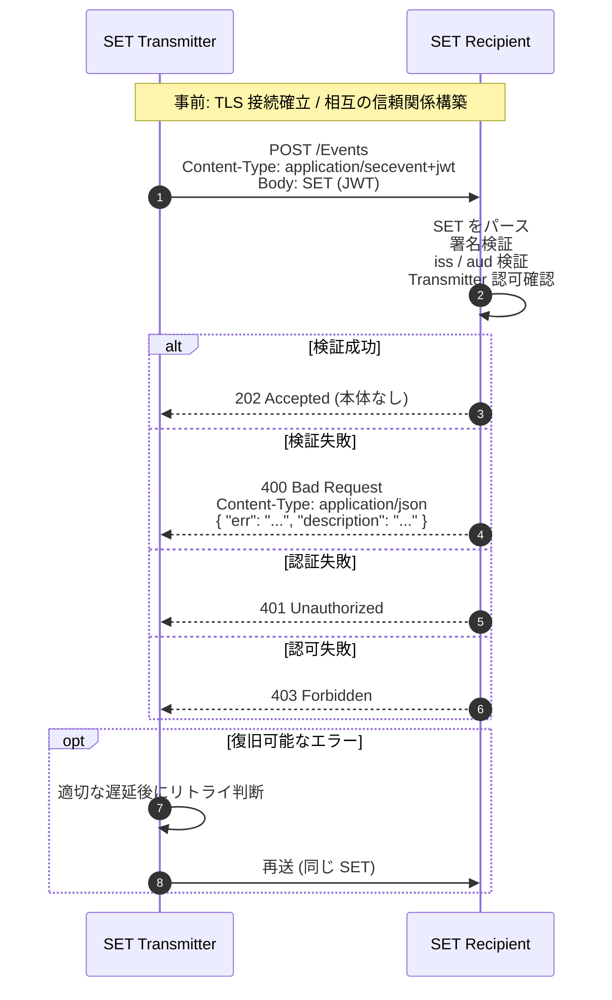
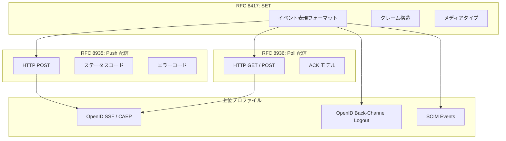

# RFC 8935 - Push-Based Security Event Token (SET) Delivery Using HTTP

## 1. 概要

RFC 8935 は 2020 年 11 月に IETF により発行された標準化提案 (Proposed Standard) で、**Security Event Token (SET) を HTTP POST により Push 配信する**ためのプロトコルを定義する仕様である。SET 自体のデータ構造は RFC 8417 で規定されているが、RFC 8417 はあくまで「イベントを表現するフォーマット」のみを定めており、実際にどのように送信者から受信者へ届けるかは別仕様に委ねられている。本仕様 RFC 8935 はその配信方式のうち、送信者主導の Push 型を担当する。Pull 型の配信は対となる RFC 8936 (Poll-Based SET Delivery) で別途定義される。

Push 配信は、SET Transmitter が SET Recipient のエンドポイントへ HTTP POST を行い、受信者がその場で検証して 202 Accepted を返す、というシンプルなモデルを採る。OpenID Foundation の Shared Signals Framework (SSF) や Continuous Access Evaluation Profile (CAEP) を実装する際に、Stream Configuration が `delivery_method` として `urn:ietf:rfc:8935` を指定したときの具体的な転送プロトコルが本仕様にあたる。

## 2. 解決する課題

RFC 8417 は SET というイベント表現フォーマットを与えたが、それだけでは相互運用可能なエコシステムは成立しない。たとえば以下の点が未解決のまま残されていた。

- どの HTTP メソッド / Content-Type を用いるか
- 受信者がイベントを処理できないときにどう失敗を伝えるか
- 認証・認可をどう行うか
- リトライをどう扱うか
- TLS や鍵管理の最低限の前提は何か

これらが各実装ごとに異なれば、SET の最大の利点である「異なる事業者間でのセキュリティイベント共有」が成立しない。RFC 8935 は、Push モデルにおけるこれら配送レベルの相互運用性を最小限のセットで規定し、SSF / CAEP / Back-Channel Logout などの上位プロファイルが共通基盤として参照できるようにすることを目的としている。

## 3. 主要概念・用語

| 用語            | 説明                                                                                              |
| --------------- | ------------------------------------------------------------------------------------------------- |
| SET             | Security Event Token。RFC 8417 で定義されるイベント表現用の JWT                                   |
| SET Issuer      | SET を発行する主体。`iss` クレームで識別される                                                    |
| SET Transmitter | SET Recipient に対して SET を配信するエンティティ。Issuer と一致することもあれば異なることもある  |
| SET Recipient   | SET を受信して処理する HTTP エンドポイントを運用するエンティティ                                  |
| Push Delivery   | Transmitter が Recipient のエンドポイントへ HTTP POST で能動的に SET を送り届ける配信モデル       |
| Event Stream    | 特定の Transmitter と Recipient のペアの間で合意された、SET の論理的な流れ (本仕様の範囲外で定義) |

SET Transmitter と SET Issuer は概念的に別物である。たとえばアグリゲーターサービスが複数の Issuer から受け取った SET をまとめて別の Recipient に Push する、というモデルも本仕様の枠組みに収まる。受信者は `iss` クレームと Transmitter の身元を区別して検証する必要がある。

## 4. プロトコルフロー

Push 配信の典型的なフローは次のようになる。



Push モデルでは「届ける側」が主導権を持つため、Recipient のエンドポイントは常時 listen している必要がある。一方、Transmitter は応答を待ってから次の SET を送るのか、並行して送るのかを自由に決められる。本仕様はその同時実行性の制御を規定しない。

## 5. 詳細解説

### 5.1 SET の送信 (Section 2.1)

Transmitter は、Recipient が事前に提示した URL に対して HTTP POST リクエストを送る。リクエストは以下の特徴を持つ。

- リクエストボディは RFC 8417 に従う JWT 形式の SET 1 件である (バッチ送信は本仕様の範囲外)
- リクエストヘッダ `Content-Type` は `application/secevent+jwt` でなければならない
- リクエストヘッダ `Accept` には `application/json` を指定する。これは失敗時に Recipient が返す JSON エラーレスポンスを受け取るためである
- オプションで `Accept-Language` ヘッダを送り、人間可読なエラーメッセージの言語を要求できる

リクエスト例 (RFC 8935 Figure 2 相当)。

```http
POST /Events HTTP/1.1
Host: notify.rp.example.com
Accept: application/json
Content-Type: application/secevent+jwt

eyJ0eXAiOiJzZWNldmVudCtqd3QiLCJhbGciOiJSUzI1NiIsImtpZCI6...<以下 JWT 本体>...
```

### 5.2 成功レスポンス (Section 2.2)

Recipient は SET を有効と判定したら **HTTP 202 Accepted** を返し、レスポンスボディは空とする。202 が選ばれているのは、「受理した」ことのみを示し、その先の処理 (関係する内部サブシステムへの通知やセッション無効化等) は非同期で行ってよいという意味づけに合致するためである。仕様は「即座にレスポンスを返すこと」を推奨しており、SET を受け取って堅牢に保存または転送できた時点で 202 を返してよい。

```http
HTTP/1.1 202 Accepted
```

### 5.3 失敗レスポンス (Section 2.3)

SET の検証や認証・認可の各段階でエラーが発生したとき、Recipient は標準的な HTTP ステータスコードと、本仕様で定義する JSON エラーボディを返す。

- ステータスコードは多くの場合 **400 Bad Request** を用いる
- 認証情報の欠落・不正は **401 Unauthorized**、認可されていない Transmitter は **403 Forbidden** を返す (本仕様は一般的な HTTP の慣行に従うと述べている)
- レスポンスの `Content-Type` は `application/json`
- レスポンスボディは下記のフィールドを持つ JSON オブジェクト

| フィールド    | 必須 | 説明                                                                              |
| ------------- | ---- | --------------------------------------------------------------------------------- |
| `err`         | 必須 | 後述する Security Event Token Error Code レジストリに登録されたエラーコード文字列 |
| `description` | 必須 | 人間可読の補足情報。デバッグや運用ログでの追跡用                                  |

`description` が言語依存である場合、Recipient はレスポンスに `Content-Language` ヘッダを付与して言語を明示すべきである。

レスポンス例。

```http
HTTP/1.1 400 Bad Request
Content-Type: application/json
Content-Language: en-US

{
  "err": "invalid_key",
  "description": "Key ID 12345 has been revoked."
}
```

### 5.4 標準エラーコード (Section 2.4)

本仕様は次の 6 種類のエラーコードを初期登録する。

| エラーコード            | 意味                                                                                  |
| ----------------------- | ------------------------------------------------------------------------------------- |
| `invalid_request`       | リクエストが SET としてパースできない、またはイベントペイロードが仕様に準拠していない |
| `invalid_key`           | 署名・暗号化に使われた鍵が無効、期限切れ、失効、または受信者にとって受理不能          |
| `invalid_issuer`        | `iss` クレームが指す Issuer がこの Recipient にとって信頼できないまたは未知           |
| `invalid_audience`      | `aud` クレームが Recipient を含まない、または対応しない値である                       |
| `authentication_failed` | Recipient が Transmitter を認証できなかった                                           |
| `access_denied`         | Transmitter は認証できたが、当該 SET を送信する権限がない                             |

エラーコードは IANA レジストリで管理され、追加には Specification Required (RFC 8126) が必要となる。

### 5.5 受信側の検証手順 (Section 2)

Recipient は SET を受け取ったあと、少なくとも以下を検証することが SHALL レベルで要求される。

1. SET が JWT としてパース可能であること
2. 真正性 (authenticity) が確認できること。すなわち署名検証や、別途確立した安全なチャネル (mTLS 等) に基づき、誰が発行したものかが特定できること
3. `aud` に基づき、自分がイベントの対象受信者として意図されていること
4. `iss` の Issuer が自分が受け取ることに同意している相手であること
5. 当該 Transmitter から SET を受け取ることが認可されていること

これらに失敗した場合は対応するエラーコードを伴った失敗レスポンスを返す。

### 5.6 認証と認可 (Section 3)

本仕様は特定の認証方式を強制せず、標準的な HTTP 認証フレームワーク (RFC 7235) の任意のスキームを利用してよいとする。実運用で広く使われる選択肢は以下である。

- **相互 TLS (mTLS, RFC 8705)**: Transmitter のクライアント証明書で身元を保証する。SSF / CAEP のデプロイで一般的
- **OAuth 2.0 Bearer Token**: Recipient が Transmitter にアクセストークンを発行し、`Authorization: Bearer ...` で提示させる
- **HTTP Basic / Signature**: 限定的なシナリオで利用

認可判定は、認証された Transmitter の identity に加えて、SET の `iss` (発行者) も判断材料となりうる。受信者は「興味のないイベント」については常に自由に無視してよい (Section 3 末尾)。

### 5.7 配信信頼性とリトライ (Section 4)

HTTP の上に薄く乗ったプロトコルである以上、ネットワーク断やタイムアウトで応答が得られないことは避けられない。本仕様は次のように扱いを定義する。

- 応答が得られない、もしくは一時的なエラー (5xx 等) が返ったときに限り、Transmitter は適切な遅延後に再送してよい
- `invalid_request` のような「構造的なエラー」を再送しても成功する見込みは低い
- `access_denied` のように「認証情報を更新すれば成功する可能性がある」エラーは、設定変更後にリトライする価値がある
- 応答が確認できなかった SET の取り扱い (重複配送やロストの許容範囲) は、上位プロファイルの信頼性要件に従う

信頼性が極めて重要な用途では、本仕様より Poll ベース (RFC 8936) を選ぶか、上位プロファイルで at-least-once / exactly-once 相当の制約を追加することが想定されている。

## 6. RFC 8417 (SET) との関係

本仕様は配送レイヤーであり、SET 本体に関する以下の要素はすべて RFC 8417 に従う。

- JWT としてのヘッダ・クレーム構造 (`iss`, `aud`, `iat`, `jti`, `events` 等)
- SET の意味論 (「すでに起きた事実」を表すものであり命令ではない、認証トークンとして再利用してはならない、等)
- メディアタイプ `application/secevent+jwt`

逆に、本仕様は SET の **解釈方法** には踏み込まない。どのイベント識別子をどう処理するか、Subject をどのように突き合わせるかは、CAEP や Back-Channel Logout 等のプロファイルが規定する領域である。RFC 8935 の責務は「1 件の SET を 1 回の HTTP POST で確実に届ける」ことに限定されている。



## 7. セキュリティに関する考慮事項

### 7.1 TLS は必須 (Section 5.3)

SET の輸送は必ず TLS 上で行わなければならない。本仕様は TLS 1.2 を最低限要求し、TLS 1.3 を推奨する。サーバー証明書の検証は RFC 6125 (DNS-ID) または DANE (RFC 6698) に準拠することが期待される。また、TLS そのものの推奨実装プロファイルとして RFC 7525 (BCP 195) に従うことが求められる。

### 7.2 署名付き SET の活用 (Section 5.1, 5.5)

Recipient は、Transmitter の身元と Issuer の身元を分離して扱う。HTTP 接続のレイヤー (mTLS / OAuth) で確認できるのは Transmitter までであり、「誰が SET を発行したか」を保証するには SET 自体への署名 (JWS) が必要となる。とくに後から監査・保管目的で SET を永続化するなら、署名は事実上必須である。

### 7.3 サービス妨害対策 (Section 5.4)

Recipient のエンドポイントは常時公開されるため、攻撃者が大量の不正な SET を送り付ける DoS リスクがある。本仕様は緩和策として、mTLS による事前認証や、レイヤー 4 / レイヤー 7 でのレートリミットを推奨している。

### 7.4 プライバシー (Section 6)

SET は典型的にユーザーのセッション状態やアカウント侵害等の機微な情報を含む。本仕様は次の点に注意するよう促している。

- Subject Identifier が異なる関係者間で名寄せ (correlation) に悪用されるリスクの評価
- TLS による経路保護に加え、機密性が必要なら JWE (RFC 7516) による暗号化も検討
- 関係者間の法的契約や利用者同意の確認

## 8. 関連仕様

- **RFC 8417 (Security Event Token (SET))**: 本仕様が運ぶペイロードのフォーマット
- **RFC 8936 (Poll-Based SET Delivery)**: 同じ問題領域に対する Pull 型の解
- **RFC 7515 (JWS) / RFC 7516 (JWE) / RFC 7519 (JWT)**: SET の暗号学的基盤
- **RFC 8705 (Mutual-TLS Client Authentication)**: Transmitter / Recipient 間の認証手段としてしばしば併用される
- **RFC 7525 (BCP 195) / RFC 8446 (TLS 1.3)**: トランスポートセキュリティのベースライン
- **OpenID Shared Signals Framework / Continuous Access Evaluation Profile**: 本仕様を Stream Configuration の `delivery_method` として参照する代表的な上位プロファイル
- **OpenID Back-Channel Logout 1.0**: SET を logout token として Push 配信する具体ユースケース

## 9. 参考文献

- [RFC 8935: Push-Based Security Event Token (SET) Delivery Using HTTP](https://www.rfc-editor.org/rfc/rfc8935)
- [RFC 8417: Security Event Token (SET)](https://www.rfc-editor.org/rfc/rfc8417)
- [RFC 8936: Poll-Based Security Event Token (SET) Delivery Using HTTP](https://www.rfc-editor.org/rfc/rfc8936)
- [IANA Security Event Token Error Codes Registry](https://www.iana.org/assignments/secevent/secevent.xhtml)
- [OpenID Shared Signals Framework 1.0](https://openid.net/specs/openid-sharedsignals-framework-1_0.html)
