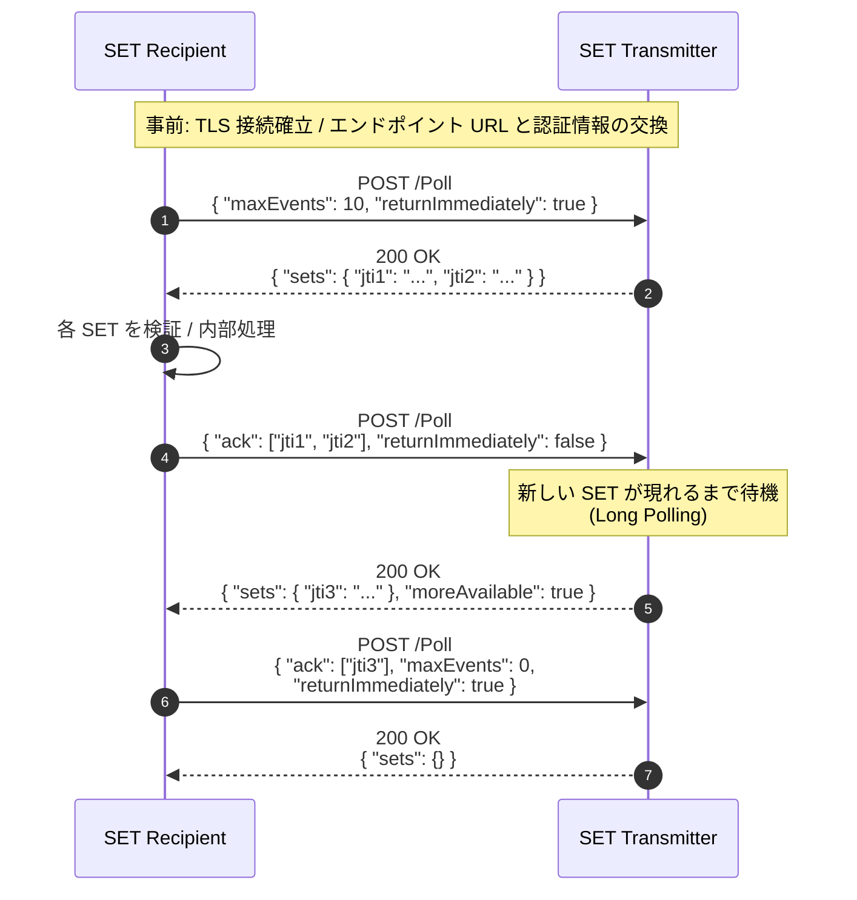
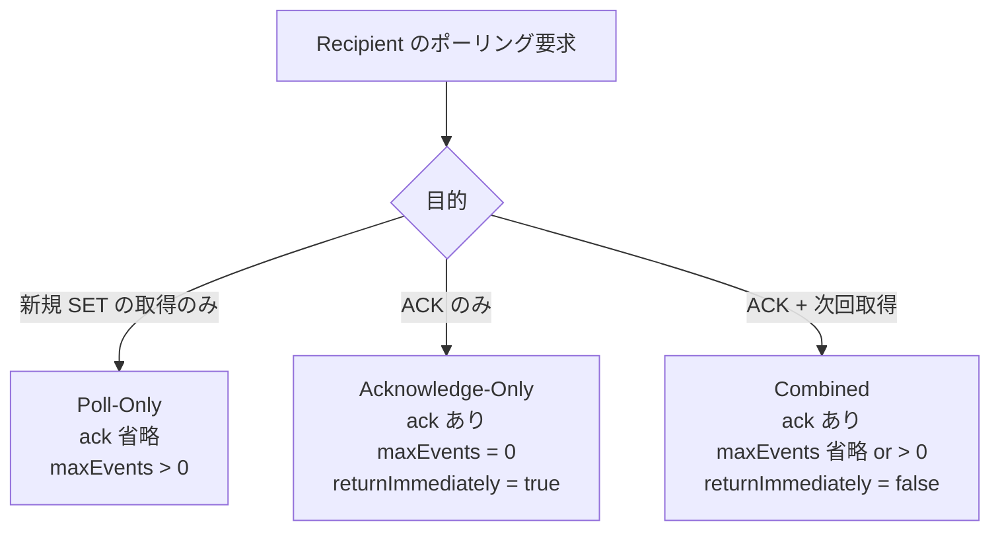
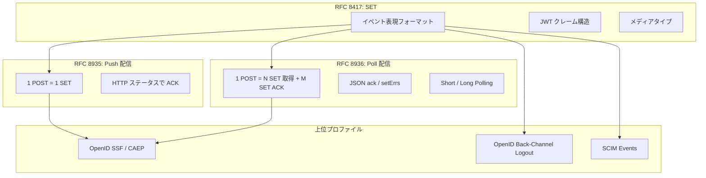

# RFC 8936 - Poll-Based Security Event Token (SET) Delivery Using HTTP

## 1. 概要

RFC 8936 は 2020 年 11 月に IETF により発行された標準化提案 (Proposed Standard) で、**Security Event Token (SET) を HTTP POST に基づくポーリング (Pull 型) で配信する**ためのプロトコルを定義する仕様である。SET 自体のデータ構造は RFC 8417 で規定されており、配信方式のうち Push 型は RFC 8935、Poll 型は本仕様 RFC 8936 が担う。SET 配送系の三仕様 (8417 / 8935 / 8936) のうち、本仕様は最後の 1 ピースとなる「受信者主導の配信モデル」を完成させるものである。

Poll 配信では、SET Recipient が SET Transmitter のエンドポイントに対して HTTP POST を行い、その応答として 0 件以上の SET を受け取る。受信者はその後、正常に処理できた SET の `jti` を `ack` フィールドに列挙して再度 POST し、送信者側のバッファから消化する。Push が「送信者から押し付ける」モデルなのに対し、Poll は「受信者が自分のペースで取りに行く」モデルであり、ネットワーク構成上 Recipient のエンドポイントを公開できない (ファイアウォール内に存在する) 状況や、Recipient の処理スループットに合わせて流量制御したい状況で採用される。

## 2. 解決する課題

RFC 8417 が定義する SET フォーマットは、配信方式に依存しない。一方、現実の SET 配信には以下のような状況が存在する。

- Recipient が NAT / ファイアウォールの内側にあり、公開エンドポイントを持てない
- Recipient が処理可能なレートを Transmitter 側で予測できず、Push では輻輳しやすい
- Recipient がバッチ的にイベントを取得して内部キューに流したい
- 確実な `at-least-once` 配送のため、受信者からの明示的な ACK を必要とする

Push (RFC 8935) はこれらの要件をすべては満たせない。RFC 8935 の Recipient は HTTP のステータスコードでしか応答を返せず、複数 SET の確認応答をまとめたり、明示的に「次の N 件だけ取ってくる」という制御を行うことが困難である。RFC 8936 は、Recipient 主導のポーリングと、SET 単位の確認応答 (`ack`) を組み合わせ、これらの課題を解決する。

## 3. 主要概念・用語

| 用語             | 説明                                                                                  |
| ---------------- | ------------------------------------------------------------------------------------- |
| SET              | Security Event Token。RFC 8417 で定義されるイベント表現用の JWT                       |
| SET Transmitter  | SET をバッファに保持し、Recipient からのポーリングに応答するエンティティ              |
| SET Recipient    | ポーリング要求を発行し、SET を取得・検証・確認応答するエンティティ                    |
| Polling Endpoint | Transmitter が公開する、Recipient が POST するエンドポイント                          |
| Acknowledgement  | Recipient が処理完了した SET の `jti` を Transmitter に通知し、再送義務を解除する操作 |
| Long Polling     | Transmitter 側で新しい SET が現れるまでレスポンスを保留するポーリングモード           |
| `jti`            | JWT ID クレーム (RFC 7519)。Poll プロトコルでは各 SET の識別子として ACK に用いられる |

Push との大きな違いは、**1 回の HTTP 交換に「複数の SET の受け渡し」と「複数の SET の ACK」が同居しうる**点である。Push が「1 POST = 1 SET」であるのに対し、Poll は「1 POST = N SET の取得 + M SET の ACK」となる。

## 4. プロトコルフロー

典型的な Poll 配信のフローは次のとおりである。Recipient は連続するポーリング要求の中で、前回受け取った SET を `ack` で消化しながら次の SET を取得する。



上記フローのポイントは次の三点である。

- 1 回目の POST は ACK を含まず、即座に取得を要求する (`returnImmediately: true`)
- 2 回目の POST は ACK と次回取得を兼ね、Long Polling で待機する
- 3 回目の POST は `maxEvents: 0` を指定することで「取得は不要、ACK のみ」のリクエストとして使用する

## 5. 詳細解説

### 5.1 ポーリング要求 (Section 2.1)

Recipient は Transmitter が公開する Polling Endpoint URL に対して HTTP POST を発行する。リクエストの特徴は次のとおり。

- メソッドは POST。Content-Type は `application/json`
- 認証ヘッダ (`Authorization`) を必要に応じて付与する (Section 3)
- ボディは JSON オブジェクトで、以下のフィールドを取りうる

| フィールド          | 型           | 必須 | 説明                                                                                                                                             |
| ------------------- | ------------ | ---- | ------------------------------------------------------------------------------------------------------------------------------------------------ |
| `maxEvents`         | 数値         | 任意 | 1 回のレスポンスで受け取りたい SET の最大件数。`0` を指定すると「SET は取得しない (ACK 専用)」を意味する                                         |
| `returnImmediately` | 真偽値       | 任意 | `true` の場合、Transmitter は新しい SET が無くても即座に空のレスポンスを返す。`false` または省略時は Long Polling として一定時間待機できる       |
| `ack`               | 文字列配列   | 任意 | 正常に処理した SET の `jti` 一覧。Transmitter はこれらを未処理キューから除去する                                                                 |
| `setErrs`           | オブジェクト | 任意 | エラー扱いとした SET の詳細。キーは `jti`、値は `err` と `description` を持つオブジェクト。RFC 8935 で定義されたエラーコードレジストリを共用する |

リクエスト例 (RFC 8936 Figure 3 相当)。

```http
POST /Poll HTTP/1.1
Host: transmitter.example.com
Content-Type: application/json
Authorization: Bearer eyJ0eXAi...

{
  "maxEvents": 5,
  "returnImmediately": false,
  "ack": [
    "4d3559ec67504aaba65d40b0363faad8",
    "3d0c3cf797584bd193bd0fb1bd4e7d30"
  ]
}
```

### 5.2 ポーリング応答 (Section 2.2)

Transmitter は要求を受理すると HTTP 200 OK を返し、ボディに以下を含む JSON オブジェクトを返す。

| フィールド      | 型                                    | 必須 | 説明                                                                                                                |
| --------------- | ------------------------------------- | ---- | ------------------------------------------------------------------------------------------------------------------- |
| `sets`          | オブジェクト (key: `jti`, value: JWT) | 必須 | 配信する SET 群。キーは SET の `jti`、値はコンパクトシリアライズされた JWT 文字列                                   |
| `moreAvailable` | 真偽値                                | 任意 | バッファに未配信の SET がまだ残っているかどうか。`true` なら Recipient は速やかに次回ポーリングを行うことが望ましい |

新しい SET が無い場合、`sets` は空オブジェクト `{}` となる。Recipient は応答中の SET それぞれについて、RFC 8417 / RFC 8935 と同様の検証手順を実施する。

レスポンス例。

```http
HTTP/1.1 200 OK
Content-Type: application/json

{
  "sets": {
    "4d3559ec67504aaba65d40b0363faad8":
      "eyJ0eXAiOiJzZWNldmVudCtqd3QiLCJhbGciOiJSUzI1NiIsImtpZCI6...",
    "3d0c3cf797584bd193bd0fb1bd4e7d30":
      "eyJ0eXAiOiJzZWNldmVudCtqd3QiLCJhbGciOiJSUzI1NiIsImtpZCI6..."
  },
  "moreAvailable": true
}
```

応答ボディ中の SET は **コンパクトシリアライズされた JWT 文字列** であり、Push 配信時と同じく `application/secevent+jwt` のメディアタイプに準じた中身を持つ。ただし HTTP の Content-Type 自体は JSON であるため、SET 全体はあくまで JSON 文字列値として返される点に注意したい。

### 5.3 ACK と setErrs (Section 2.4)

Recipient は受領した SET について、次回以降のポーリングで `ack` または `setErrs` のいずれかを返す責務を負う。

- 検証・処理が成功した SET: `ack` 配列にその `jti` を入れる
- 検証・処理が失敗した SET: `setErrs` オブジェクトに `jti` をキーとしてエラー情報を入れる

`setErrs` の値は、RFC 8935 で定義された JSON エラーオブジェクト (`err` と `description`) と同一構造である。エラーコードは IANA「Security Event Token Error Codes」レジストリから選ぶ。代表的なものは以下である。

| エラーコード            | 意味                                                           |
| ----------------------- | -------------------------------------------------------------- |
| `invalid_request`       | SET としてパースできない、またはペイロードが仕様に違反している |
| `invalid_key`           | 署名・暗号化に使われた鍵が無効・期限切れ・失効している         |
| `invalid_issuer`        | `iss` クレームの Issuer が信頼できない                         |
| `invalid_audience`      | `aud` クレームに Recipient が含まれていない                    |
| `authentication_failed` | SET の真正性が検証できない                                     |

ACK も `setErrs` も返されなかった SET は「未処理」のままであり、Transmitter は規定の保持期間 (out-of-band で合意) を経過後に再配信してもよい。すなわち本プロトコルは構造的に **at-least-once** の保証を提供し、exactly-once は提供しない。Recipient は `jti` を用いた重複排除を自前で行うことが求められる。

ACK と取得を分離したい場合、`maxEvents: 0` と `returnImmediately: true` を組み合わせることで「ACK 専用リクエスト」として利用できる。

```json
{
  "ack": ["4d3559ec67504aaba65d40b0363faad8", "3d0c3cf797584bd193bd0fb1bd4e7d30"],
  "maxEvents": 0,
  "returnImmediately": true
}
```

### 5.4 ポーリング戦略 (Section 2.1.1)

本仕様は `returnImmediately` フィールドにより、Short Polling と Long Polling の両方をサポートする。

- **Short Polling**: `returnImmediately: true`。Transmitter は新しい SET が無くてもすぐに空のレスポンスを返す。Recipient は次回ポーリングまでの間隔を自分で制御する
- **Long Polling**: `returnImmediately: false` または省略。Transmitter は新しい SET が利用可能になるか、Transmitter 側のタイムアウトに達するまでレスポンスを保留する。RFC 6202 (Long Polling のベストプラクティス) の知見に従うことが推奨される

Long Polling はレイテンシを抑えながら過剰なポーリングを避ける手段として有効だが、Transmitter 側で接続を長時間保持する負荷が生じる。両者の合意で選択する。

### 5.5 リクエストの三類型

実装上、ポーリング要求は以下の三つの典型パターンに分類できる。本仕様の Section 2.1 はそれぞれに対応する。



初回ポーリングや状態を持たない単純な実装では Poll-Only と Combined を交互に使う。スレッドや非同期処理を分離した実装では Acknowledge-Only を別経路で発行することも多い。

### 5.6 エラー応答 (Section 2.3)

ポーリング要求自体に問題がある場合 (パース不能、必須認証情報の欠落など)、Transmitter は HTTP レベルのエラーステータスを返す。

- 400 Bad Request: 構文エラーや必須フィールド違反 (レスポンスボディは本仕様で定義されていない)
- 401 Unauthorized / 403 Forbidden: 認証・認可の失敗

個々の SET の処理エラーは前述のとおり HTTP レベルではなく、次回ポーリングの `setErrs` で Recipient から Transmitter に通知される。この設計により、1 回の応答に含まれた複数 SET のうち一部だけが失敗するケースを自然に表現できる。

### 5.7 認証と認可 (Section 3)

Recipient から Transmitter への HTTP リクエストは認証されなければならない。本仕様は特定の方式を強制せず、標準的な HTTP 認証フレームワーク (RFC 7235) を利用してよいとする。

- **OAuth 2.0 Bearer Token**: 最も一般的な選択肢。Transmitter が Recipient にアクセストークンを発行し、Recipient が `Authorization: Bearer ...` で提示する。Refresh Token (RFC 6749) と組み合わせ、短命なトークンを使うことが推奨される
- **相互 TLS (mTLS, RFC 8705)**: Recipient のクライアント証明書で身元を保証する
- **HTTP Basic**: 限定的な信頼境界内での選択肢

Transmitter は、認証された Recipient の identity に基づいて「どの SET を返すか」を決定する。Recipient ごとに専用のキューを持つ実装が典型的である。

## 6. RFC 8935 (Push 配信) との比較

Push (RFC 8935) と Poll (本仕様 RFC 8936) は同じ問題領域に対する補完的な解である。両者の主要な差分を以下にまとめる。

| 観点                         | RFC 8935 (Push)                               | RFC 8936 (Poll)                                                      |
| ---------------------------- | --------------------------------------------- | -------------------------------------------------------------------- |
| 主導権                       | Transmitter                                   | Recipient                                                            |
| HTTP リクエスト方向          | Transmitter → Recipient                       | Recipient → Transmitter                                              |
| 1 回の交換で扱う SET 数      | 1 件                                          | 任意 (N 件取得 + M 件 ACK)                                           |
| Recipient のネットワーク要件 | 公開エンドポイントが必要                      | アウトバウンド HTTP のみで可                                         |
| ACK モデル                   | HTTP ステータスコード (202 で受理)            | 次回ポーリングの `ack` フィールド                                    |
| 流量制御                     | Transmitter 側のみ                            | Recipient が `maxEvents` で制御可能                                  |
| レイテンシ                   | 低 (即時 Push)                                | Short Polling 間隔 or Long Polling のタイムアウトに依存              |
| 信頼性モデル                 | 再送を Transmitter が判断                     | 構造的に at-least-once (未 ACK の SET は再配信されうる)              |
| メディアタイプ               | リクエストボディが `application/secevent+jwt` | リクエスト・レスポンスとも `application/json` (SET は JSON 内文字列) |

選択基準としては、

- Recipient がエンドポイントを公開できる / レイテンシ重視 → Push
- ファイアウォール越し / 流量制御重視 / 明示的な ACK が欲しい → Poll

となる。OpenID Shared Signals Framework (SSF) では、Stream Configuration の `delivery_method` として `urn:ietf:rfc:8935` (Push) または `urn:ietf:rfc:8936` (Poll) を選択できる。

## 7. RFC 8417 (SET) との関係

本仕様もまた配送レイヤーであり、SET 本体は RFC 8417 に従う。

- JWT としてのヘッダ・クレーム構造 (`iss`, `aud`, `iat`, `jti`, `events` 等)
- メディアタイプ `application/secevent+jwt`
- 「SET はすでに起きた事実を表すものであり命令ではない」「認証トークンとして再利用してはならない」等の意味論

本仕様が追加するのはあくまで「Recipient 主導の取得方法と、複数 SET の ACK 表現」だけである。SET の解釈や意味処理は CAEP / Back-Channel Logout 等の上位プロファイルに委ねられる。



## 8. セキュリティに関する考慮事項

### 8.1 TLS は必須 (Section 4.1)

Poll 配信におけるすべての HTTP リクエスト・レスポンスは TLS 上で行わなければならない。最低 TLS 1.2、推奨 TLS 1.3 (RFC 8446)、サーバー証明書検証は RFC 6125 (DNS-ID) または RFC 6698 (DANE) に従う。TLS の運用は RFC 7525 (BCP 195) の推奨に従う。

### 8.2 認証情報の保護 (Section 4.2)

OAuth 2.0 Bearer Token を使う場合、Recipient はトークンを安全に保管しなければならない。短命なアクセストークンと Refresh Token の組み合わせが推奨される。mTLS を使う場合は秘密鍵の保護が同様に重要である。

### 8.3 配信の堅牢性とリプレイ (Section 4.3)

本プロトコルは構造的に at-least-once であるため、Recipient は同じ SET を複数回受け取りうる。SET の `jti` を用いて重複排除を行うことが必須である。また、Transmitter は ACK が長時間返らない SET を再配信してよいが、無制限にバッファを保持する必要はなく、out-of-band で合意した保持期間を超えたものは破棄してよい。

### 8.4 サービス妨害対策 (Section 4.4)

Polling Endpoint は公開されるため、未認証や過剰なポーリングによる DoS リスクがある。Transmitter は認証された Recipient ごとにレートリミットを適用し、`returnImmediately` の指定にかかわらず一定時間以上の Long Polling 保留を抑制すべきである。

### 8.5 プライバシー (Section 5)

SET は典型的にユーザーのセッション状態やアカウント侵害情報を含む。

- Subject Identifier の名寄せ (correlation) リスクを評価する
- 経路の TLS に加え、機密性が高ければ JWE (RFC 7516) による SET の暗号化を検討する
- 関係者間の法的契約とユーザー同意を確認する

## 9. 関連仕様

- **RFC 8417 (Security Event Token (SET))**: 本仕様が運ぶペイロードのフォーマット
- **RFC 8935 (Push-Based SET Delivery)**: 同じ問題領域に対する Push 型の解。本仕様と対をなす
- **RFC 7515 (JWS) / RFC 7516 (JWE) / RFC 7519 (JWT)**: SET の暗号学的基盤
- **RFC 6202 (Long Polling ベストプラクティス)**: Long Polling の運用上の指針
- **RFC 7235 (HTTP Authentication)**: 認証フレームワーク
- **RFC 6749 (OAuth 2.0)**: Bearer Token を使う場合の発行基盤
- **RFC 8705 (Mutual-TLS Client Authentication)**: mTLS を使う場合の参照仕様
- **RFC 7525 (BCP 195) / RFC 8446 (TLS 1.3)**: トランスポートセキュリティのベースライン
- **OpenID Shared Signals Framework**: Stream Configuration の `delivery_method` として本仕様を参照する代表的な上位プロファイル

## 10. 参考文献

- [RFC 8936: Poll-Based Security Event Token (SET) Delivery Using HTTP](https://www.rfc-editor.org/rfc/rfc8936)
- [RFC 8935: Push-Based Security Event Token (SET) Delivery Using HTTP](https://www.rfc-editor.org/rfc/rfc8935)
- [RFC 8417: Security Event Token (SET)](https://www.rfc-editor.org/rfc/rfc8417)
- [RFC 6202: Known Issues and Best Practices for the Use of Long Polling and Streaming in Bidirectional HTTP](https://www.rfc-editor.org/rfc/rfc6202)
- [IANA Security Event Token Error Codes Registry](https://www.iana.org/assignments/secevent/secevent.xhtml)
- [OpenID Shared Signals Framework 1.0](https://openid.net/specs/openid-sharedsignals-framework-1_0.html)
