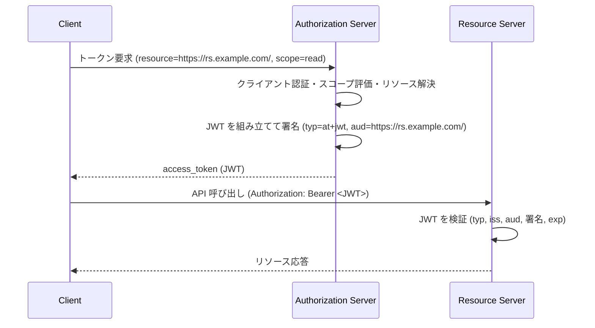

# RFC 9068 - JSON Web Token (JWT) Profile for OAuth 2.0 Access Tokens

## 1. 概要

RFC 9068 は、OAuth 2.0 のアクセストークンを JSON Web Token (JWT) として発行するための標準プロファイルを定義する仕様である。2021 年 10 月に Proposed Standard として発行された。

OAuth 2.0 フレームワーク (RFC 6749) はアクセストークンの形式を規定していない。RFC 6749 はアクセストークンを「クライアントにとって不透明な文字列」と位置付け、具体的な構造はリソースサーバと認可サーバの間でのみ理解できればよいとしている。しかし、多くの商用実装はアクセストークンを JWT (RFC 7519) として発行しており、リソースサーバが直接トークンを検証できる方式を採用してきた。

その結果、ベンダーごとに JWT クレームの構造や検証手順が微妙に異なり、相互運用性が失われていた。RFC 9068 はこの状況を打開し、複数の認可サーバ・リソースサーバを混在させたデプロイでも一貫した検証ロジックが利用できることを目的としている。

## 2. 解決する課題

このプロファイルが解決する主な課題は次のとおりである。

- **相互運用性の欠如**: ベンダーごとに JWT アクセストークンの形式が異なり、認可サーバとリソースサーバを別々のベンダーが提供するデプロイで検証コードを書き分ける必要があった。
- **Cross-JWT Confusion**: 同じ認可サーバが発行する OpenID Connect ID Token と JWT アクセストークンが構造的に区別しにくく、ID Token を誤ってアクセストークンとして受理する (あるいは逆) という攻撃の余地があった。
- **検証手順の曖昧さ**: 必須クレーム、署名アルゴリズム、`aud` の取り扱いなどがベンダー実装に委ねられており、安全な検証手順が確立されていなかった。
- **トークンイントロスペクションの負荷**: RFC 7662 のイントロスペクションはリソースサーバから認可サーバへの追加 HTTP リクエストを必要とする。JWT 形式で自己完結的に検証できればこのオーバーヘッドを回避できる。

## 3. 主要概念・用語

### JWT アクセストークン

このプロファイルに準拠した OAuth 2.0 アクセストークン。RFC 7519 で定義される JWT として表現され、署名され、本仕様の必須クレームと `typ` ヘッダパラメータを備える。

### `typ` ヘッダパラメータ

JWT の用途を示すヘッダ。本プロファイルでは値を `at+jwt` (または `application/at+jwt`) としなければならない。これにより ID Token (`typ` がない、または別の値) との混同を防ぐ。

### `aud` クレームとリソース指標

JWT アクセストークンが向けられているリソースサーバを識別するクレーム。RFC 8707 (Resource Indicators) の `resource` パラメータで要求されたリソースに対応する値が設定される。

### Cross-JWT Confusion

同一発行者が発行する別種類の JWT (例: ID Token と アクセストークン) を取り違える攻撃。`typ` と `aud` の厳密な検証で対策する。

## 4. プロトコルフロー

### 4.1 発行フロー



### 4.2 検証フロー

```mermaid
flowchart TD
    A[アクセストークン受信] --> B{typ が at+jwt か}
    B -- No --> Z[拒否: invalid_token]
    B -- Yes --> C{暗号化が必要な構成か}
    C -- 必要かつ未暗号化 --> Z
    C -- OK --> D{iss が AS メタデータの issuer と一致}
    D -- No --> Z
    D -- Yes --> E{aud に自リソースの識別子が含まれる}
    E -- No --> Z
    E -- Yes --> F{署名検証 (alg≠none, AS の鍵)}
    F -- 失敗 --> Z
    F -- OK --> G{exp が現在時刻より未来}
    G -- No --> Z
    G -- Yes --> H[クレームに従ってアクセス制御を実施]
```

## 5. 詳細解説

### 5.1 ヘッダ要件 (Section 2.1)

- JWT アクセストークンは **必ず署名されなければならない** (MUST be signed)。
- 署名アルゴリズム `alg` に `none` を用いることは禁止される。
- 非対称署名アルゴリズムが推奨される。リソースサーバが認可サーバの公開鍵を取得すれば検証できるため、鍵共有の運用負荷が小さい。
- 認可サーバとリソースサーバは少なくとも `RS256` (RFC 7518) をサポートしなければならない。
- `typ` ヘッダパラメータは `at+jwt` (または完全な media type 表記 `application/at+jwt`) でなければならない。検証側は値の比較を case-insensitive に行うこと。

### 5.2 必須クレーム (Section 2.2)

| クレーム    | 意味                                                                      |
| ----------- | ------------------------------------------------------------------------- |
| `iss`       | トークンを発行した認可サーバの識別子 (RFC 8414 の issuer と一致)          |
| `exp`       | 有効期限 (秒精度の Unix 時刻)                                             |
| `aud`       | 対象リソースの識別子。RFC 8707 の `resource` 値に対応                     |
| `sub`       | サブジェクト識別子。委譲付与ならリソースオーナー、CC 付与ならクライアント |
| `client_id` | トークンを取得したクライアントの識別子 (RFC 8693 と整合)                  |
| `iat`       | 発行時刻                                                                  |
| `jti`       | JWT ID。トークンを一意に識別する文字列                                    |

`sub` の取り扱いについて仕様は次のように規定する。

- 認可付与がエンドユーザを伴う場合、`sub` はリソースオーナーのサブジェクト識別子に対応すべきである。
- クライアント認証情報付与 (Client Credentials Grant) など、リソースオーナーが存在しない場合は、`sub` はクライアントを識別する値であるべきである。このとき、認可サーバはクライアントが任意の `sub` 値 (例: 既存ユーザの識別子) を選択できないようにしなければならない。

### 5.3 認証情報クレーム (Section 2.2.1)

OpenID Connect Core で定義されている次のクレームを任意で含めることができる。

- `auth_time`: エンドユーザが認証された時刻
- `acr`: Authentication Context Class Reference
- `amr`: Authentication Methods References

これらはトークン交換 (RFC 8693) を通じて派生する JWT アクセストークンでも、もとの認証イベントを参照するために維持される。

### 5.4 識別情報クレーム (Section 2.2.2)

ユーザの属性 (`name`, `email`, `preferred_username` など) を含めることができる。ただしクライアントが直接これらのクレームを要求するメカニズムは本プロファイルでは規定されておらず、認可サーバが `client_id`・`scope`・`resource` から判断する。プライバシー上の必要性に応じて最小化すべきである。

### 5.5 認可情報クレーム (Section 2.2.3)

#### `scope` クレーム

認可要求に `scope` パラメータが含まれていた場合、JWT に同名の `scope` クレームを含めるべきである。値は RFC 8693 Section 4.2 と同じく半角空白区切りの文字列とする。`scope` は `aud` で示されるリソースに対して意味のある値でなければならない。

#### `groups` / `roles` / `entitlements`

委譲シナリオ以外の認可情報を表現するため、RFC 7643 (SCIM Core Schema) で定義される `groups`、`roles`、`entitlements` を任意で含めることができる。各値は RFC 7643 Section 4.1.2 のエンコーディングに従う。本仕様の IANA Considerations により、これらは JWT クレームレジストリに登録された。

### 5.6 JWT アクセストークンの要求 (Section 3)

- クライアントが `resource` パラメータ (RFC 8707) を含めた場合、認可サーバは `aud` クレームを `resource` パラメータと同じ値に設定しなければならない。
- `resource` パラメータがない場合、認可サーバはデフォルトのリソース指標を使用すべきである。`scope` パラメータからデフォルトの `aud` を導出することもある。
- 複数の `resource` パラメータが指定され、それらが異なるリソースサーバを参照していて単一の JWT で表現すると曖昧になる場合、認可サーバはエラー `invalid_target` (RFC 8707) などで拒否しなければならない。
- 認可サーバは、付与される認可が曖昧になるような JWT アクセストークンを発行してはならない。

### 5.7 検証手順 (Section 4)

リソースサーバは次の順で検証を実行する。失敗した場合は RFC 6750 に従い `invalid_token` エラーで応答する。

1. **`typ` 検証**: `at+jwt` または `application/at+jwt` でなければ拒否する。
2. **復号 (必要な場合)**: 認可サーバとリソースサーバが事前にネゴシエートしていれば、JWE として復号する。期待していた暗号化が施されていない場合は拒否することが推奨される。
3. **`iss` 検証**: 値が事前に取得した認可サーバの issuer 識別子と完全一致しなければならない。
4. **`aud` 検証**: 値 (文字列または配列) に自リソースサーバを指す識別子が含まれていなければならない。
5. **署名検証**: RFC 7515 に従って署名を検証する。`alg=none` のトークンは拒否しなければならない。鍵は認可サーバが公開した鍵セットから取得する。
6. **`exp` 検証**: 現在時刻が `exp` より前でなければならない。クロックスキュー吸収のため数分程度の許容を設けることは認められる。
7. その他、`iat` の妥当性や `jti` の重複利用検知などを実装側で行う。

### 5.8 例

仕様の Appendix で示される代表的なヘッダとペイロードは次のとおりである。

```json
// Header
{
  "typ": "at+JWT",
  "alg": "RS256",
  "kid": "RjEwOwOA"
}

// Payload
{
  "iss": "https://authorization-server.example.com/",
  "sub": "5ba552d67",
  "aud": "https://rs.example.com/",
  "exp": 1639528912,
  "iat": 1618354090,
  "jti": "dbe39bf3a3ba4238a513f51d6e1691c4",
  "client_id": "s6BhdRkqt3",
  "scope": "openid profile reademail"
}
```

## 6. セキュリティに関する考慮事項

### 6.1 Cross-JWT Confusion の防止

同一発行者が同一クライアント宛に複数種類の JWT (例: ID Token, JWT アクセストークン, ソフトウェアステートメント) を発行する場合、それらを取り違えると深刻な脆弱性につながる。本仕様は次の二段構えで対策する。

- `typ` ヘッダで JWT 種別を明示する。リソースサーバは `at+jwt` 以外を拒否する。
- 認可サーバは、異なるリソース向けに発行するアクセストークンを区別できるような明確な `aud` 値を選ばなければならない。

### 6.2 `sub` 値の制御

クライアント認証情報付与で `sub` にクライアント識別子を入れる場合、クライアントが他のユーザの識別子を `sub` に偽装することを防ぐ仕組みが必要となる。具体的には、認可サーバが `sub` 名前空間とユーザ識別子名前空間を分離し、クライアントが値を選択できないようにする。

### 6.3 鍵管理

認可サーバが ID Token とアクセストークンで異なる鍵を用いるからといって、それだけで Cross-JWT Confusion 攻撃を防げるわけではない。リソースサーバは認可サーバのメタデータで公開された全ての鍵を許容する必要があり、結果として `typ` と `aud` の検証が決定的になる。

### 6.4 曖昧な認可状況の回避

複数の `resource` 値や複数の `scope` 値を同時に含む場合は、それぞれの `scope` が特定のリソースに明確に対応するよう設計しなければならない。曖昧な場合、認可サーバは JWT の発行を拒否する。

## 7. プライバシーに関する考慮事項

JWT は値そのものでクレームを運ぶため、暗号化されていないトークンの中身はクライアントやエンドユーザを含む第三者が直接読み取れる可能性がある。

- **クライアントによる検査の禁止**: OAuth 2.0 の原則どおり、クライアントはアクセストークンの内容を検査してはならない。認可サーバとリソースサーバはいつでもトークン形式を変更できるからである。
- **サブジェクトの相関**: 異なるリソースサーバで同じ `sub` 値を再利用するとサーバ間で利用者を追跡できてしまう。プライバシー要件に応じてリソースごとに `sub` を変える、あるいは呼び出しごとに `sub`/`jti` を変える運用を検討する。
- **機密情報の最小化**: 不要なクレームを含めない、JWE による暗号化、機密クレームのみの暗号化、必要であればオペークトークンへの切り替えなどの選択肢がある。
- **データアクセス権限**: 含めるクレームすべてについて、リソースサーバが当該データにアクセスする権限 (ユーザ同意、データ共有ポリシー) を持つことを認可サーバ側で担保すべきである。

## 8. IANA Considerations

本仕様により以下が登録された。

- **Media Type**: `application/at+jwt`。OAuth 2.0 アクセストークン形式の JWT を識別するために用いる。
- **JWT Claims Registry**: `groups`、`roles`、`entitlements` の 3 つのクレームが登録された。参照仕様は RFC 7643 (SCIM Core Schema) と本仕様 Section 2.2.3.1 である。

## 9. 関連仕様

- [RFC 6749](./rfc6749) - The OAuth 2.0 Authorization Framework
- [RFC 6750](./rfc6750) - OAuth 2.0 Bearer Token Usage
- [RFC 7515](./rfc7515) - JSON Web Signature (JWS)
- [RFC 7519](./rfc7519) - JSON Web Token (JWT)
- [RFC 7662](./rfc7662) - OAuth 2.0 Token Introspection
- [RFC 8414](./rfc8414) - OAuth 2.0 Authorization Server Metadata
- RFC 8693 - OAuth 2.0 Token Exchange (`scope` クレームの定義)
- RFC 8707 - Resource Indicators for OAuth 2.0
- [OpenID Connect Core](./openid-connect-core) - `auth_time`、`acr`、`amr` の出所

## 10. 参考文献

- [RFC 9068 - JSON Web Token (JWT) Profile for OAuth 2.0 Access Tokens](https://www.rfc-editor.org/rfc/rfc9068)
- [IANA Media Types: application/at+jwt](https://www.iana.org/assignments/media-types/application/at+jwt)
- [IANA JSON Web Token Claims](https://www.iana.org/assignments/jwt/jwt.xhtml)
