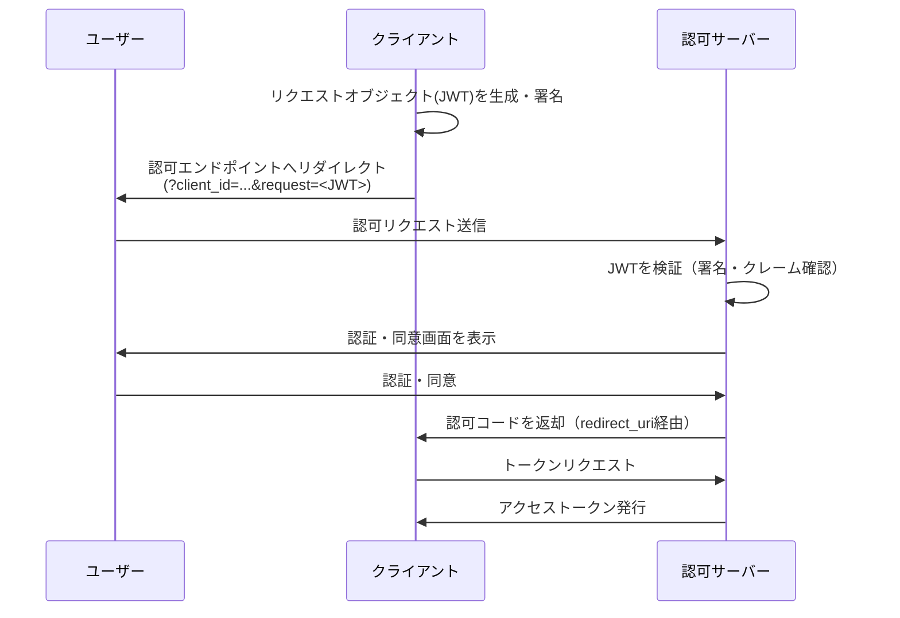
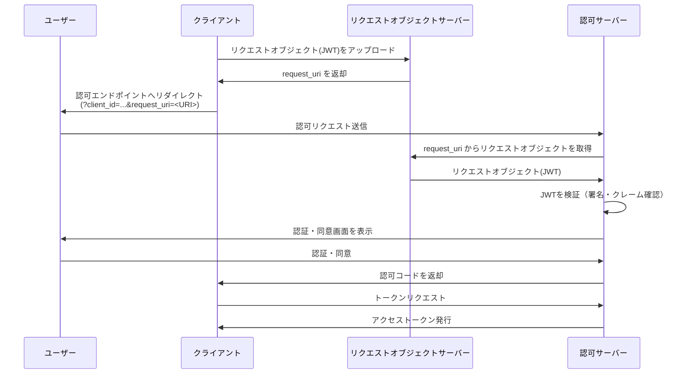
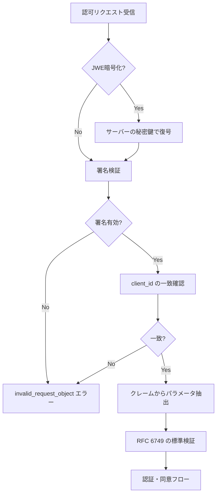
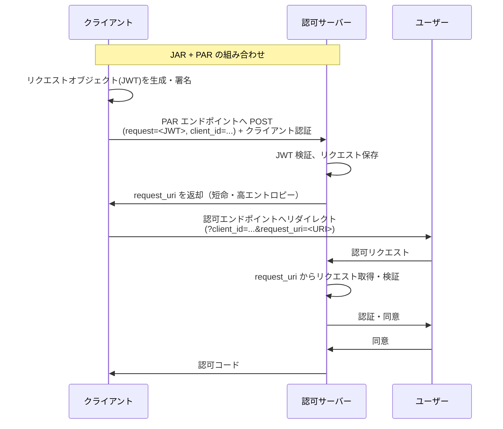

# RFC 9101 - JWT-Secured Authorization Request (JAR)

## 概要

RFC 9101 は、OAuth 2.0 の認可リクエストを JWT（JSON Web Token）を用いて保護する仕様「JWT-Secured Authorization Request (JAR)」を定義する。

従来の OAuth 2.0 では、認可リクエストのパラメータはユーザーエージェント（ブラウザ）経由で URI のクエリ文字列として送信されるため、改ざんや盗聴のリスクがあった。JAR はリクエストパラメータを JWT として符号化・署名することで、完全性の保護・送信元の認証・機密性を実現する。

## 解決する課題

### 標準的な OAuth 2.0 認可リクエストの問題点

RFC 6749 の標準的な認可リクエストには以下の課題がある。

1. **完全性の欠如**: リクエストパラメータはブラウザ経由で送信されるため、途中で改ざんされても検知できない
2. **送信元認証の欠如**: 認可サーバーは、リクエストが正規のクライアントから送信されたことを確認できない
3. **機密性の欠如**: パラメータはブラウザ履歴やリファラーヘッダーに記録される

仕様書の言葉を借りると、「ユーザーエージェントを介した通信は完全性保護がなされておらず、パラメータが汚染される可能性がある」。

### JAR による解決策

JAR は「リクエストオブジェクト」という概念を導入し、認可リクエストパラメータを JWT のクレームとして符号化する。JWS 署名により完全性と送信元認証を、オプションで JWE 暗号化により機密性を実現する。

## 主要概念・用語

### リクエストオブジェクト（Request Object）

認可リクエストパラメータを JWT クレームセットとして符号化した JWT。以下のいずれかの形式で提供される。

- **JWS 署名のみ**: 完全性と送信元認証を提供
- **JWS 署名 + JWE 暗号化（Nested JWT）**: 完全性、送信元認証、機密性をすべて提供

`none` アルゴリズム（署名なし）の利用は、`require_signed_request_object` が `true` の場合は禁止される。

### `request` パラメータ（値渡し）

リクエストオブジェクトの JWT 文字列を直接認可リクエストの URI に含める方式。

```
GET /authorize?client_id=s6BhdRkqt3&request=<JWT文字列>
```

### `request_uri` パラメータ（参照渡し）

リクエストオブジェクトをあらかじめ特定の URI にホストしておき、その URI を認可リクエストに含める方式。

```
GET /authorize?client_id=s6BhdRkqt3&request_uri=https%3A%2F%2Fclient.example.org%2Frequest.jwt
```

URI の長さを抑えられるため、機器の制約が厳しい環境やサードパーティによるリクエスト管理シナリオに適している。

### `require_signed_request_object`

認可サーバーまたはクライアントのメタデータに設定されるブール値フラグ。`true` の場合、サーバーは JAR を使用しないリクエストや `none` アルゴリズムのリクエストを拒否し、標準 OAuth 2.0 へのダウングレード攻撃を防ぐ。

## プロトコルフロー

### 値渡し（`request` パラメータ）フロー



### 参照渡し（`request_uri` パラメータ）フロー



## 詳細解説

### リクエストオブジェクトの構造

リクエストオブジェクトは OAuth 2.0 のリクエストパラメータを JWT クレームとして含む。

```json
{
  "iss": "s6BhdRkqt3",
  "aud": "https://server.example.com",
  "response_type": "code",
  "client_id": "s6BhdRkqt3",
  "redirect_uri": "https://client.example.org/cb",
  "scope": "openid",
  "state": "af0ifjsldkj",
  "nonce": "n-0S6_WzA2Mj",
  "max_age": 86400
}
```

**重要なクレーム**:

| クレーム    | 説明                                                                   |
| ----------- | ---------------------------------------------------------------------- |
| `iss`       | クライアントの識別子。リクエストの送信元を示す                         |
| `aud`       | 認可サーバーの発行者 URI。意図しない宛先での利用を防ぐ                 |
| `client_id` | OAuth 2.0 のクライアント ID（URI の `client_id` と一致する必要がある） |
| その他      | 標準的な OAuth 2.0 リクエストパラメータ                                |

仕様では `iss` と `aud` の包含を SHOULD（推奨）とし、JWT を受け取るエンドポイントへの誤配送を防ぐ。

### 認可サーバーの検証手順

認可サーバーがリクエストを受け取った際の検証手順は以下の通り。



1. **復号**（JWE の場合）: サーバーの秘密鍵で復号する
2. **署名検証**: クライアントの公開鍵で JWS 署名を検証する。アルゴリズム検証は RFC 8725 に従う
3. **`client_id` 確認**: URI の `client_id` パラメータとリクエストオブジェクト内の `client_id` クレームが一致することを確認する
4. **パラメータ抽出**: 値は必ずリクエストオブジェクトのクレームを使用する（URI のクエリパラメータは無視）
5. **標準検証**: RFC 6749 の通常の認可リクエスト検証を適用する

エラーレスポンスは用途に応じて区別される。

- `invalid_request_object`: JWT の形式が不正、署名検証失敗
- `invalid_request_uri`: URI にアクセスできない、または無効

### `request_uri` のセキュリティ要件

参照渡し方式では、URI 自体のセキュリティが重要となる。

- **エントロピー**: URI には 128 ビット以上の暗号論的乱数値を含める。URI の推測攻撃を防ぐ
- **有効期間**: 一度きりの利用、または非常に短い有効期間（一般的な指針として 1 分未満）を推奨。リプレイ攻撃を防ぐ
- **TLS**: HTTPS を必須とし、DNS-ID 証明書検証（RFC 6125）を適用する
- **長さ制限**: 端末の制約や利便性を考慮し、URI 全体は 512 ASCII 文字を超えないことが SHOULD（推奨）

### クライアントメタデータ

クライアントはダイナミッククライアント登録を通じて、使用するアルゴリズムを宣言できる。

| メタデータ名                    | 説明                                                  |
| ------------------------------- | ----------------------------------------------------- |
| `request_object_signing_alg`    | リクエストオブジェクトへの署名アルゴリズム            |
| `request_object_encryption_alg` | リクエストオブジェクトの暗号化アルゴリズム（JWE alg） |
| `request_object_encryption_enc` | リクエストオブジェクトの暗号化アルゴリズム（JWE enc） |
| `require_signed_request_object` | 署名付きリクエストオブジェクトの必須化フラグ          |

### プライバシー保護のための第三者認証

JAR が実現するユニークなユースケースとして、信頼できる第三者による収集制限原則への適合確認がある。

1. **認証フェーズ**: 第三者機関がクライアントのビジネス要件を審査し、取得が認められるクレームを承認する
2. **変換フェーズ**: クライアントはリクエストオブジェクトを第三者機関に提出し、承認された範囲を超えていないことの検証を受ける
3. **提示**: ユーザーは「このリクエストは第三者機関によって収集制限原則への適合性が確認済みである」という保証を受ける

## セキュリティに関する考慮事項

### Cross-JWT 混同攻撃

リクエストオブジェクトが別の JWT コンテキスト（例: RFC 7523 のクライアント認証 JWT）に誤用される可能性がある。

**対策**:

- `sub` クレームにクライアント ID を使用しない
- `typ` ヘッダーパラメータに `oauth-authz-req+jwt` を明示的に設定する
- リクエストオブジェクト専用の鍵セットをその他の JWT 目的と分離する

### DoS 攻撃

悪意ある `request_uri` による攻撃ベクトルがある。

- 極めて大きなレスポンスや応答の遅い URL を指定する攻撃
- `request_uri` が別の JAR リクエストを指す再帰的ループ

**対策**: タイムアウトの実装、レスポンスのメディアタイプ確認、再帰的な `request_uri` の不許可。

### `request_uri` 改ざん

`request_uri` パラメータ自体は署名されていないため、Man-in-the-Browser 攻撃による改ざんが可能。

**対策**: オリジン検証、メディアタイプ確認、タイムアウト実装。

### ダウングレード攻撃の防止

攻撃者が JAR を使用しない通常の OAuth 2.0 フローへのフォールバックを強制する可能性がある。

**対策**: `require_signed_request_object` を `true` に設定し、JAR を必須化する。

## 関連仕様

| 仕様                       | 関連性                                                                              |
| -------------------------- | ----------------------------------------------------------------------------------- |
| [RFC 6749](/specs/rfc6749) | OAuth 2.0 の基盤仕様。JAR はこれを拡張する                                          |
| [RFC 7519](/specs/rfc7519) | JWT の基盤仕様。リクエストオブジェクトは JWT として実装される                       |
| [RFC 7515](/specs/rfc7515) | JWS。リクエストオブジェクトの署名に使用                                             |
| [RFC 7516](/specs/rfc7516) | JWE。リクエストオブジェクトの暗号化に使用                                           |
| [RFC 9126](/specs/rfc9126) | Pushed Authorization Requests (PAR)。JAR と組み合わせることで高いセキュリティを実現 |
| OpenID Connect Core        | OpenID Connect における `request` / `request_uri` パラメータは JAR の前身仕様       |

### JAR と PAR の組み合わせ

JAR（RFC 9101）と PAR（RFC 9126）を組み合わせることで、より高いセキュリティレベルを実現できる。PAR でリクエストオブジェクトを事前にサーバーに送信し、その URI を認可リクエストで使用する構成は、最も推奨される実装パターンの一つとされている。



## 参考文献

- [RFC 9101 原文 - JWT-Secured Authorization Request (JAR)](https://www.rfc-editor.org/rfc/rfc9101)
- [RFC 6749 - The OAuth 2.0 Authorization Framework](https://www.rfc-editor.org/rfc/rfc6749)
- [RFC 9126 - OAuth 2.0 Pushed Authorization Requests](https://www.rfc-editor.org/rfc/rfc9126)
