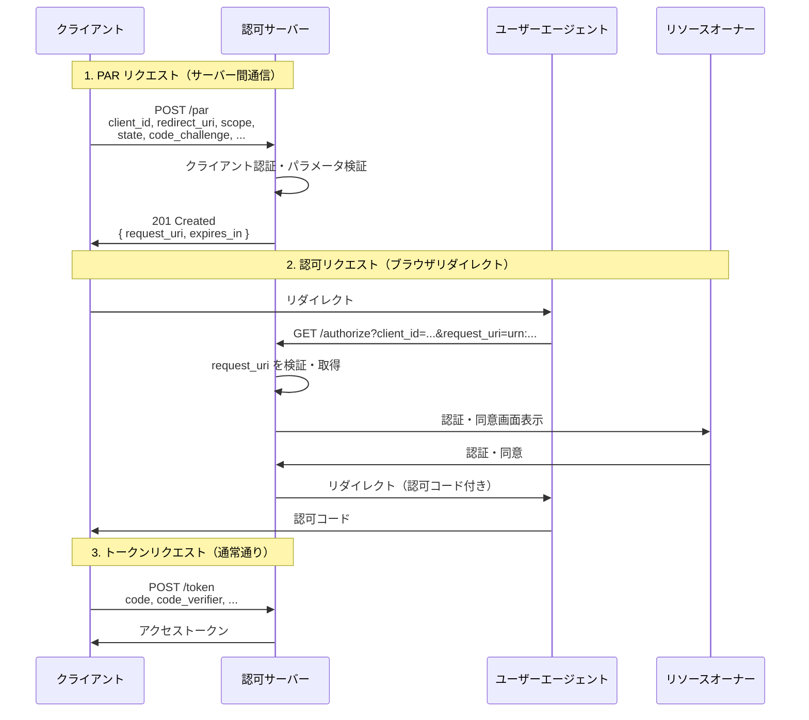

# RFC 9126 - OAuth 2.0 Pushed Authorization Requests

## 概要

RFC 9126は、OAuth 2.0の認可リクエストをユーザーエージェント（ブラウザ）を経由せずに、クライアントから認可サーバーへ直接送信する仕組みである**Pushed Authorization Requests（PAR）**を定義する仕様です。2021年9月にIETFで標準化されました。

従来のOAuth 2.0では、認可リクエストのパラメータをURLのクエリストリングとしてユーザーエージェントを通じて送信していましたが、PARではクライアントが事前に認可サーバーのPARエンドポイントへHTTP POSTでリクエストを送り、その参照URI（`request_uri`）を取得します。その後、このURIのみを使って通常の認可エンドポイントにリダイレクトするため、実際のリクエスト内容はサーバー間通信に留まります。

## 解決する課題

### 1. リクエストパラメータの完全性・機密性の欠如

従来のOAuth 2.0認可フローでは、`scope`、`state`、`redirect_uri`などの認可リクエストパラメータがURLクエリストリングとしてブラウザを通過します。これにより次の問題が生じます。

- **改ざんリスク**: 暗号学的な完全性・真正性の保護がなく、攻撃者がパラメータを改ざんできる可能性があります
- **機密性の欠如**: クエリストリングはブラウザの履歴、Refererヘッダー、サーバーのアクセスログ等に残る可能性があり、リクエスト内容が漏洩するリスクがあります

### 2. URLの長さ制限

Rich Authorization Requests（RAR）やOpenID Connectの拡張パラメータを使用すると、認可リクエストが非常に長くなる場合があります。ブラウザやサーバーはURLの長さに制限を設けることがあるため、処理エラーの原因となります。

### 3. モバイルアプリケーションの制約

ネイティブモバイルアプリでは、プラットフォームのAPI制約によりブラウザの初回リクエストをGETメソッドに限定せざるを得ない場合があり、HTTP POSTでの認可リクエスト送信が困難です。

## 主要概念・用語

| 用語                                      | 説明                                                                                                         |
| ----------------------------------------- | ------------------------------------------------------------------------------------------------------------ |
| **PAR エンドポイント**                    | 認可サーバーが提供するHTTPSエンドポイント。クライアントが認可リクエストをPOSTで事前送信する先                |
| **request_uri**                           | PARエンドポイントへのリクエスト成功時に返却される参照URI。形式は`urn:ietf:params:oauth:request_uri:<参照値>` |
| **expires_in**                            | `request_uri`の有効期間（秒）。一般的に5〜600秒程度                                                          |
| **pushed_authorization_request_endpoint** | 認可サーバーメタデータ（RFC 8414）においてPARエンドポイントのURLを示すパラメータ                             |
| **require_pushed_authorization_requests** | 認可サーバーがPARの使用を必須とするかを示すブール値メタデータ                                                |

## プロトコルフロー

PARを使った認可フローは以下の2段階で構成されます。



### ステップ1: PAR リクエスト

クライアントは認可サーバーのPARエンドポイントへ、認可リクエストパラメータをHTTP POSTで送信します。クライアント認証もこのリクエストに含めます。

```http
POST /par HTTP/1.1
Host: as.example.com
Content-Type: application/x-www-form-urlencoded

response_type=code
&client_id=s6BhdRkqt3
&redirect_uri=https%3A%2F%2Fclient.example.org%2Fcb
&scope=openid%20profile
&state=af0ifjsldkj
&code_challenge=K2-ltc83acc4h0c9w6ESC_rEMTJ3bwc-uCHaoeK1t8U
&code_challenge_method=S256
&client_secret=7Fjfp0ZBr1KtDRbnfVdmIw
```

### ステップ2: PAR レスポンス

リクエストが成功すると、認可サーバーはHTTP 201でJSONレスポンスを返します。

```http
HTTP/1.1 201 Created
Content-Type: application/json

{
  "request_uri": "urn:ietf:params:oauth:request_uri:6esc_11ACC5bwc014ltc14eY22c",
  "expires_in": 60
}
```

### ステップ3: 認可エンドポイントへのリダイレクト

クライアントは取得した`request_uri`を使い、認可エンドポイントへユーザーエージェントをリダイレクトします。

```http
GET /authorize?client_id=s6BhdRkqt3
    &request_uri=urn%3Aietf%3Aparams%3Aoauth%3Arequest_uri%3A6esc_11ACC5bwc014ltc14eY22c
    HTTP/1.1
Host: as.example.com
```

## 詳細解説

### PARエンドポイントの要件

- **HTTPS必須**: PARエンドポイントはHTTPSで提供されなければなりません（MUST）
- **クライアント認証**: クライアントは認可サーバーへの認証が必要です（`client_secret`、JWT等）
- **パラメータ検証**: 認可エンドポイントと同様の検証を実施する必要があります
- **`request_uri`の受け入れ禁止**: PARエンドポイントへのリクエストに`request_uri`パラメータを含めることはできません（既存JAR参照との混在防止）

### `request_uri`の特性

- **一意性**: 暗号学的に推測困難な値であることが必要です
- **クライアント紐付け**: 特定のクライアントにバインドされます
- **シングルユース**: 原則として一度のみ使用可能（一回使用後は無効化が推奨）
- **有効期限**: `expires_in`で指定された秒数内のみ有効

### JAR（RFC 9101）との組み合わせ

PARとJWT-Secured Authorization Request（JAR）を組み合わせることで、さらに高いセキュリティを実現できます。JARでは認可リクエストをJWTとして署名・暗号化しますが、PARを経由することでそのJWTをURLに含めずにサーバーへ送信できます。

```
POST /par HTTP/1.1
Content-Type: application/x-www-form-urlencoded

client_id=s6BhdRkqt3
&request=eyJhbGciOiJSUzI1NiJ9.eyJyZXNwb25zZV90eXBlIjoiY29kZSIsI...
```

### サーバーメタデータ

認可サーバーはRFC 8414のサーバーメタデータでPAR対応を広告できます。

```json
{
  "pushed_authorization_request_endpoint": "https://as.example.com/par",
  "require_pushed_authorization_requests": false
}
```

`require_pushed_authorization_requests`を`true`にすると、すべてのクライアントはPAR経由での認可リクエストが必須となります。

## セキュリティに関する考慮事項

### request_URI の推測攻撃

`request_uri`の値が予測可能な場合、攻撃者が有効なURIを推測できる可能性があります。RFC 9126では、RFC 9101の要件に従い、暗号学的に安全な乱数で生成したURIを使用することを求めています。

### オープンリダイレクト

PARではクライアントが認証されてから`redirect_uri`が検証されるため、未登録のリダイレクトURIを使ったオープンリダイレクト攻撃のリスクが低減されます。認可サーバーは認証済みクライアントからの新規`redirect_uri`のみを受け入れる必要があります（MUST）。

### request_URI のリプレイ攻撃

一度取得した`request_uri`が傍受された場合、攻撃者が同じURIを使い別の認可フローに差し込む可能性があります。これに対して、認可サーバーは`request_uri`を一回限りの使用としてシングルユースにすることが推奨されます（SHOULD）。

### クライアントポリシーの変更

PARリクエスト送信後から認可エンドポイント利用までの間にクライアントのポリシーが変更される可能性があります。認可サーバーは認可エンドポイントでも再度ポリシーを検証することが推奨されます。

### request_URI のスワップ攻撃

あるフローで取得した`request_uri`を別のユーザーの認可フローに使い回す攻撃が考えられます。クライアントはPKCE、ランダムな`state`、OpenID Connectの`nonce`を活用することでこのリスクを低減できます。

## 関連仕様

- **[RFC 6749](/specs/rfc6749)** - OAuth 2.0 Authorization Framework（基盤仕様）
- **[RFC 7636](/specs/rfc7636)** - PKCE（コード傍受攻撃対策）
- **[RFC 8414](/specs/rfc8414)** - Authorization Server Metadata（PARエンドポイントの広告）
- **[RFC 9101](https://www.rfc-editor.org/rfc/rfc9101)** - JWT-Secured Authorization Request (JAR)（PARと組み合わせて使用）
- **[RFC 9396](https://www.rfc-editor.org/rfc/rfc9396)** - Rich Authorization Requests (RAR)（細粒度な認可リクエスト）
- **[OpenID Connect Core](/specs/openid-connect-core)** - OpenID Connect（PARはOIDCリクエストにも対応）

## 参考文献

- [RFC 9126 原文](https://www.rfc-editor.org/rfc/rfc9126)
