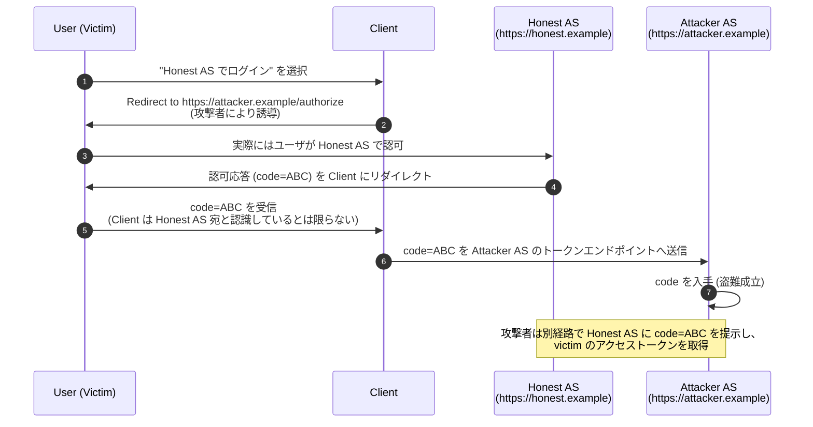
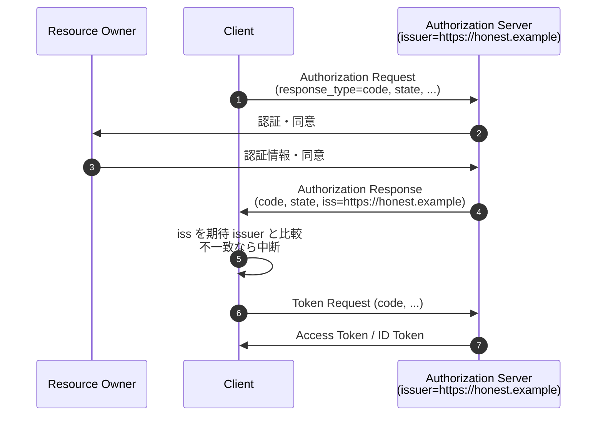

# RFC 9207 - OAuth 2.0 Authorization Server Issuer Identification

## 1. 概要

RFC 9207 は、OAuth 2.0 の認可応答に「どの認可サーバが応答を返したか」を明示する `iss` パラメータを追加する仕様である。2022 年 3 月に Proposed Standard として発行された。

OAuth 2.0 のコアフレームワーク (RFC 6749) では、認可エンドポイントからクライアントへ返される認可応答 (authorization response) に発行元を識別する情報が含まれていなかった。クライアントが複数の認可サーバと連携する場合、攻撃者がこの曖昧さを悪用して認可コードやアクセストークンを別の認可サーバに横取りさせる「Mix-Up 攻撃」が成立し得る。RFC 9207 は認可応答に発行者識別子 (issuer identifier) を必須パラメータとして付加し、クライアント側の検証ロジックを定式化することでこの脅威を防ぐ。

RFC 9700 (OAuth 2.0 Security Best Current Practice) では Mix-Up 攻撃緩和策の一つとして本仕様の採用を直接推奨しており、現代的な OAuth 実装の基幹要件となっている。

## 2. 解決する課題: Mix-Up 攻撃

### 2.1 攻撃の前提

Mix-Up 攻撃は、次の条件下でのみ成立する脅威である。

- クライアントが **複数の独立した認可サーバ** と連携している
- そのうち少なくとも一つが攻撃者の制御下にある (悪意ある AS / 攻撃者所有テナント / 動的クライアント登録で攻撃者が正規 AS と連携した状況)
- クライアントは認可応答を受け取った後、どの AS のトークンエンドポイントへ認可コードを送るかを「ユーザ選択」「セッション状態」などに基づいて決める

### 2.2 攻撃の流れ



ポイントは「クライアントが受け取った認可コードがどの AS で発行されたものかを判別する手段が無い」ことにある。クライアントは内部状態 (例えば `state` に紐付く AS 識別) を頼りに送信先 AS を決めるが、攻撃者が認可リクエスト側を細工することでこの状態を誤らせることが可能である。

### 2.3 `iss` パラメータによる防御

RFC 9207 では、認可応答に AS の発行者識別子を付加する。クライアントは受け取った `iss` が「自分が認可リクエストを送ったはずの AS の `issuer`」と一致するかを検証し、不一致なら処理を停止する。これにより上記シナリオの (5) の段階で異常を検知できる。

## 3. 主要概念・用語

### 3.1 Issuer Identifier

認可サーバを一意に識別する URL。RFC 8414 (Authorization Server Metadata) の `issuer` メタデータと同一であり、`https` スキームを使用し、クエリ・フラグメントを含まない。OpenID Connect Discovery における `issuer` クレームとも一致する。

### 3.2 `iss` Authorization Response Parameter

認可応答 (および認可エラー応答) に追加される新規パラメータ。値は AS の発行者識別子。本仕様により IANA の "OAuth Parameters" レジストリに登録された。

### 3.3 `authorization_response_iss_parameter_supported`

認可サーバが本仕様に対応していることを宣言するメタデータパラメータ。型は Boolean、デフォルト値は `false`。RFC 8414 の Authorization Server Metadata レジストリに登録される。

## 4. プロトコルフロー

### 4.1 認可コードフロー (Authorization Code) との統合



クライアントは認可応答を受け取った時点で `iss` を検証する。この検証はトークンリクエストを送る **前** に実施する必要がある。さもなければ攻撃者の AS へ認可コードを送ってしまう余地が残る。

### 4.2 エラー応答にも `iss` を必須化

RFC 9207 は、認可サーバが返すエラー応答 (例: `error=access_denied`) にも `iss` を含めることを要求する。エラー応答の出所も検証対象とすることで、攻撃者がエラーを偽装して別の攻撃に誘導するシナリオを防ぐ。

```
HTTP/1.1 302 Found
Location: https://client.example/cb?
    error=access_denied
    &state=tNwzQ87pC
    &iss=https%3A%2F%2Fhonest.example
```

## 5. 詳細解説

### 5.1 認可サーバ側の要件 (Section 2.1, 2.3)

仕様は認可サーバに対し次のことを要求する。

- 認可エンドポイントから返すすべての認可応答に `iss` パラメータを **含めなければならない (MUST)**。これは成功応答 (`code`, `token`, `id_token` などを含む) とエラー応答の双方を対象とする
- `iss` の値は当該 AS の発行者識別子であり、その AS が公開する `issuer` メタデータ値と **一致しなければならない (MUST)**
- 値は `https` スキームの URL であり、クエリやフラグメント成分を **含んではならない (MUST NOT)**
- 認可サーバはメタデータ `authorization_response_iss_parameter_supported` を `true` に設定し、本仕様への対応を宣言 **しなければならない (MUST)**

### 5.2 クライアント側の検証手順 (Section 2.3, 2.4)

クライアントは次の手順で `iss` を検証する。

1. 認可応答から `iss` パラメータの値を抽出し、URL デコードする
2. 自身が認可リクエストを送ったと認識している AS の発行者識別子 (構成情報・Discovery で取得済み) と、抽出した `iss` を **RFC 3986 の単純文字列比較 (Simple String Comparison)** で照合する
3. 一致しない場合、認可応答を **拒否しなければならない (MUST)**。後続のトークンリクエストを送ってはならない
4. 当該 AS が `authorization_response_iss_parameter_supported=true` を広告しているにもかかわらず `iss` が応答に含まれていない場合も、応答を **拒否しなければならない (MUST)**

OpenID Connect で ID Token を含む応答を扱う場合、`iss` パラメータの値と ID Token の `iss` クレームは **一致しなければならない (MUST)**。これにより、認可応答とトークン応答の出所が同一であることを二重に保証する。

### 5.3 単純文字列比較の意味

RFC 3986 Section 6.2.1 で定義される Simple String Comparison は、URL の正規化を一切行わずに文字単位の完全一致を要求する比較方式である。これにより、

- 末尾スラッシュの有無 (`https://as.example` と `https://as.example/`) は **別物** として扱われる
- パーセントエンコーディングの違い (`%2F` と `/`) も **別物** として扱われる
- ポート番号のデフォルト値補完 (`:443`) も行われない

クライアントと AS は、メタデータ上の `issuer` 値と認可応答の `iss` 値が文字単位で同一になるよう厳密に管理する必要がある。

### 5.4 メタデータパラメータ (Section 3)

`authorization_response_iss_parameter_supported` は RFC 8414 の Authorization Server Metadata レジストリに登録される Boolean 型パラメータである。OpenID Connect Discovery で公開される Provider Configuration Response も同様のメタデータ形式を共有するため、実運用上は `/.well-known/openid-configuration` 経由でも本パラメータを公開する実装が一般的である。

```json
{
  "issuer": "https://honest.example",
  "authorization_endpoint": "https://honest.example/authorize",
  "token_endpoint": "https://honest.example/token",
  "authorization_response_iss_parameter_supported": true
}
```

クライアントはこの値が `true` のときのみ、認可応答に `iss` が含まれることを期待できる。`false` あるいは未指定の場合は、本仕様に依存しない別の Mix-Up 対策 (後述) を講じる必要がある。

### 5.5 リクエスト側の `iss` との関係

OAuth 2.0 では認可リクエストに `iss` パラメータを含める仕様は本仕様には存在しないが、JAR (RFC 9101) や OpenID Connect の Request Object では JWT のクレームとして `iss` (リクエスト発行者 = クライアント) が用いられる。RFC 9207 の `iss` は **認可応答における AS 発行者識別子** を指し、リクエストオブジェクト内の `iss` (= クライアント) とは意味が異なる。両者を混同しないことが重要である。

## 6. セキュリティに関する考慮事項

### 6.1 整合性保護の有無 (Section 4)

`iss` パラメータ自体はクエリ文字列上で平文伝送され、暗号的に保護されていない。仕様はこの点を明示しつつ、「Mix-Up 攻撃の防止に整合性保護は不要」と結論する。理由は次のとおりである。

- 認可応答は HTTPS で配送され、認可応答全体の機密性・完全性はトランスポート層で確保される
- 攻撃者が認可応答のクエリパラメータを改ざんできる立場にあるのなら、そもそも認可コード自体を盗めるため、`iss` を保護しても意味がない
- Mix-Up 攻撃は「異なる AS の応答を取り違えさせる」ことを狙う攻撃であり、応答に発行元を明示するだけで防げる

### 6.2 発行者識別子の一意性

仕様は「同一クライアントが連携する複数の AS に対して、同じ `issuer` 値が使われてはならない (MUST NOT)」ことを要求する。クライアントが複数 AS の中から発行元を一意に識別できなければ `iss` 検証の意味が失われるためである。マルチテナント環境において AS がテナントごとに `issuer` を分ける場合、各テナントが個別の発行者識別子を持つよう設計する必要がある。

### 6.3 OpenID Connect での二重検証

`response_type` に `id_token` が含まれる OpenID Connect の応答 (`id_token`, `code id_token`, `code id_token token` 等) では、ID Token 内に既に `iss` クレームが含まれている。RFC 9207 はこれに加えて URL クエリパラメータとしての `iss` も必須化する。両者は同一値でなければならず、矛盾する場合はクライアントは応答を拒否する。

### 6.4 代替対策との関係 (JARM ほか)

JWT Secured Authorization Response Mode for OAuth 2.0 (JARM, FAPI で利用される) は、認可応答全体を JWT に包んで返す仕組みであり、JWT 内に `iss` クレームを含む。JARM を採用しているフローでは、認可応答自体が署名され `iss` を含むため、本仕様の `iss` クエリパラメータは冗長になる場合がある。仕様は「JARM などの応答型を採用し既に発行者検証が可能な場合、`iss` パラメータは必須ではないことがある」と述べている。

OpenID Connect の `response_mode=form_post.jwt` 等、応答に署名 JWT を用いる方式も同様の代替となる。

### 6.5 単一 AS しか使わないクライアントの考慮

Mix-Up 攻撃は複数 AS を扱うクライアントに固有の脅威である。しかし「現時点で単一 AS のみ」でも、将来的に対応 AS が増えたときに突然脆弱化するリスクがある。仕様は「単一 AS のみを扱うクライアントであっても、本仕様の検証を実装することが推奨される」と注意を促している。

### 6.6 メタデータの真正性

クライアントが期待する `issuer` 値は、AS の Discovery エンドポイント (例: `/.well-known/openid-configuration`) から取得することが多い。このメタデータ自体が改ざんされていれば検証は無意味になるため、メタデータ取得は HTTPS 経由で行い、サーバ証明書を厳密に検証する必要がある。

## 7. 関連仕様

- **RFC 6749 (OAuth 2.0)**: 本仕様が拡張する認可応答の基盤
- **RFC 8414 (Authorization Server Metadata)**: `authorization_response_iss_parameter_supported` メタデータの登録先
- **RFC 9101 (JAR)** / **RFC 9126 (PAR)**: リクエスト側の保護機構。応答側保護である本仕様と相補的に動作する
- **RFC 9449 (DPoP)**: トークン送信者制限機構。発行者識別と組み合わせることで、認可応答とトークン利用の双方を保護する
- **RFC 9700 (OAuth 2.0 Security BCP)**: Mix-Up 攻撃緩和策として本仕様の採用を推奨
- **OpenID Connect Core 1.0**: ID Token の `iss` クレームと本仕様の `iss` パラメータの整合性を要求
- **OpenID Connect Discovery 1.0**: AS の `issuer` 値の公開機構
- **JARM (OpenID Financial-grade API)**: 認可応答全体を JWT で保護する代替手段

## 8. 参考文献

- [RFC 9207 - OAuth 2.0 Authorization Server Issuer Identification](https://datatracker.ietf.org/doc/html/rfc9207)
- [RFC 8414 - OAuth 2.0 Authorization Server Metadata](https://datatracker.ietf.org/doc/html/rfc8414)
- [RFC 9700 - Best Current Practice for OAuth 2.0 Security](https://datatracker.ietf.org/doc/html/rfc9700)
- [RFC 6749 - The OAuth 2.0 Authorization Framework](https://datatracker.ietf.org/doc/html/rfc6749)
- [RFC 3986 - Uniform Resource Identifier (URI): Generic Syntax](https://datatracker.ietf.org/doc/html/rfc3986)
