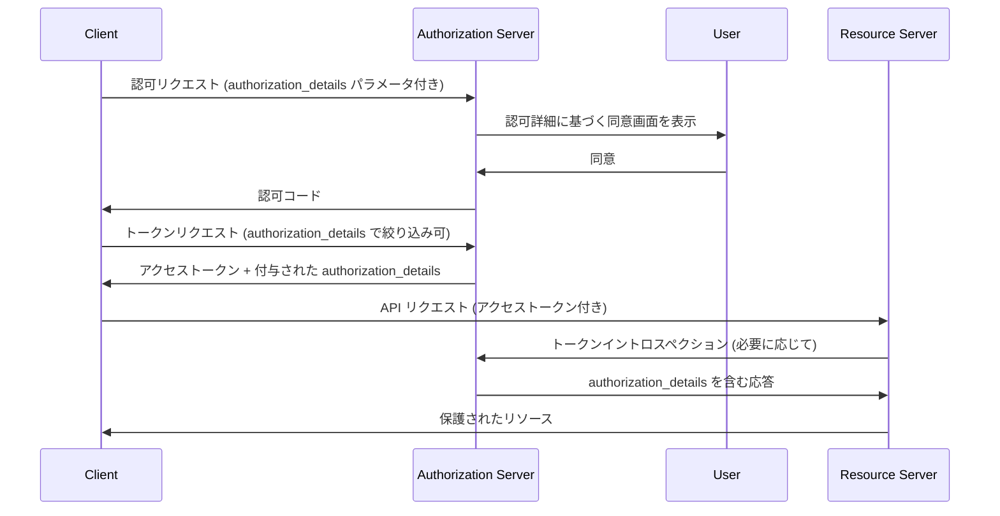

# RFC 9396 - OAuth 2.0 Rich Authorization Requests

## 概要

RFC 9396 は、OAuth 2.0 の認可リクエストに `authorization_details` パラメータを追加する拡張仕様である。2023年5月に RFC として公開された。

従来の `scope` パラメータでは表現できなかった複雑できめ細かい認可要件を、JSON データ構造を用いて記述できるようにする。これにより、「口座番号 DE02100100109307118603 宛に 123.50 ユーロを送金する」といった具体的な操作の認可が可能となる。

## 解決する課題

### scope パラメータの限界

OAuth 2.0 の `scope` パラメータはシンプルな文字列のスペース区切りリストであり、粗粒度のアクセス制御（「プロフィールの読み取り権限」「メールの送信権限」など）には適している。しかし、以下のような高度なユースケースでは表現力が不足する:

- **銀行 API**: 特定の口座から特定の宛先へ特定の金額を送金する権限
- **文書署名**: 特定のドキュメントに特定の署名鍵を使用して署名する権限
- **ヘルスケア**: 特定の患者の特定の期間のデータに限定したアクセス権限
- **税務データ**: 特定の申告期間のデータへの読み取り専用アクセス

これらのケースでは、`scope` だけでは「何に対して」「どのような操作を」「どの範囲で」許可するかを正確に表現することができない。RAR（Rich Authorization Requests）はこの課題を解決するために策定された。

## 主要概念・用語

### authorization_details パラメータ

`authorization_details` は JSON オブジェクトの配列であり、各オブジェクトが一つの認可要件を表す。

**必須フィールド:**

| フィールド | 説明                                                                           |
| ---------- | ------------------------------------------------------------------------------ |
| `type`     | 認可詳細タイプの識別子。このフィールドの値によって他のフィールドの解釈が決まる |

**標準オプションフィールド:**

| フィールド   | 説明                                                |
| ------------ | --------------------------------------------------- |
| `locations`  | アクセス先リソースの URL の配列                     |
| `actions`    | 許可する操作の種類の配列（例: `["read", "write"]`） |
| `datatypes`  | アクセスするデータ種別の配列                        |
| `identifier` | 特定のリソースを指定する識別子                      |
| `privileges` | 権限レベルや種別の配列                              |

`type` フィールドの値に応じて、上記以外の任意のフィールドを追加することができる。

### type の登録

`type` 識別子の値は IANA レジストリ（"OAuth Authorization Details Types"）に登録するか、`https://` スキームの URI を使用する。特定ドメイン内での実験的利用には `_` プレフィックスを使用できる。

## プロトコルフロー



### 認可リクエスト

`authorization_details` パラメータは URL エンコードした JSON 配列として認可エンドポイントに送信する:

```
GET /authorize?response_type=code
  &client_id=s6BhdRkqt3
  &state=xyz
  &authorization_details=%5B%7B%22type%22%3A%22payment_initiation%22%2C...%7D%5D
```

認可サーバは、受け取った `authorization_details` の内容に基づいてユーザーへの同意画面を構成する。

### トークンリクエスト

クライアントはトークンリクエスト時にも `authorization_details` を指定でき、以前の認可で許可された範囲より**狭い**権限のトークンを要求できる。認可サーバは、元の認可スコープを超えたリクエストを拒否しなければならない。

### トークンレスポンス

認可サーバは実際に付与した `authorization_details` をトークンレスポンスに含めて返す:

```json
{
  "access_token": "2YotnFZFEjr1zCsicMWpAA",
  "token_type": "Bearer",
  "expires_in": 3600,
  "authorization_details": [
    {
      "type": "payment_initiation",
      "actions": ["initiate", "status", "cancel"],
      "locations": ["https://example.com/payments"],
      "instructedAmount": {
        "currency": "EUR",
        "amount": "123.50"
      }
    }
  ]
}
```

なお認可サーバは `authorization_details` の内容を**エンリッチメント**（補完）することができる。例えばユーザーが同意画面で特定の口座を選択した場合、その口座情報を `authorization_details` に追加してからアクセストークンを発行できる。

## 詳細解説

### authorization_details の記述例

#### 支払い開始

```json
[
  {
    "type": "payment_initiation",
    "actions": ["initiate", "status", "cancel"],
    "locations": ["https://example.com/payments"],
    "instructedAmount": {
      "currency": "EUR",
      "amount": "123.50"
    },
    "creditorName": "Merchant A",
    "creditorAccount": {
      "iban": "DE02100100109307118603"
    },
    "remittanceInformationUnstructured": "Ref Number Merchant"
  }
]
```

#### 複数の認可詳細の組み合わせ

一つのリクエストに複数の `authorization_details` オブジェクトを含めることで、異なるリソースサーバーへの権限を同時に要求できる:

```json
[
  {
    "type": "account_information",
    "actions": ["list_accounts", "read_balances", "read_transactions"],
    "locations": ["https://example.com/accounts"]
  },
  {
    "type": "payment_initiation",
    "actions": ["initiate", "status", "cancel"],
    "locations": ["https://example.com/payments"],
    "instructedAmount": {
      "currency": "EUR",
      "amount": "123.50"
    }
  }
]
```

#### きめ細かいデータアクセス制御

同じ `type` の異なる操作・データ種別の組み合わせ:

```json
[
  {
    "type": "customer_information",
    "locations": ["https://example.com/customers"],
    "actions": ["read"],
    "datatypes": ["contacts"]
  },
  {
    "type": "customer_information",
    "locations": ["https://example.com/customers"],
    "actions": ["write"],
    "datatypes": ["photos"]
  }
]
```

### リソースサーバーへの権限情報の伝達

認可詳細情報はリソースサーバーに以下の方法で伝達される:

**1. JWT アクセストークンのクレームとして**

JWT アクセストークンに `authorization_details` をトップレベルのクレームとして含める。これによりリソースサーバーはトークン検証時に認可詳細を直接参照できる。

**2. トークンイントロスペクション経由**

RFC 7662 のイントロスペクションレスポンスに `authorization_details` フィールドとして含める。リソースサーバーはイントロスペクションエンドポイントに問い合わせることで権限情報を取得できる。

### scope との併用

`authorization_details` と `scope` は同一の認可リクエスト内で併用できる。ただし、同じ API に対して両方を使用することは推奨されない。既存の `scope` ベースのシステムとの後方互換性が必要な場合に限り、移行期間として併用を検討するとよい。

## セキュリティに関する考慮事項

### 改ざん防止

`authorization_details` の完全性が重要な場合（特にブラウザを経由するフローでは中間者攻撃のリスクがある）、クライアントは以下のいずれかを使用してリクエストを保護しなければならない:

- **署名付きリクエストオブジェクト（JAR: RFC 9101）**: リクエストパラメータを JWT に含めてデジタル署名する
- **Pushed Authorization Requests（PAR: RFC 9126）**: リクエストを事前に認可サーバーに直接送信してから認可フローを開始する

特に、大きな `authorization_details` オブジェクトを含むリクエストでは URI 長の制限問題も生じるため、PAR の使用が推奨されている。

### インジェクション攻撃の防止

認可サーバーは受け取った `authorization_details` を適切にサニタイズし、インジェクション攻撃を防止しなければならない。

### 文字列比較

`authorization_details` 内のすべての文字列比較は RFC 8259 に従って実施する。正規化や変換を行ってはならない。

### locations フィールドによるオーディエンス制限

`locations` フィールドを使用することで、特定のリソースサーバーに対してのみ有効なアクセストークンを発行できる。これにより、不正なリソースサーバーが他のサーバー向けのトークンを利用する混乱した代理人問題を防ぐことができる。

## 関連仕様

| 仕様                       | 関連                                                                             |
| -------------------------- | -------------------------------------------------------------------------------- |
| [RFC 6749](/specs/rfc6749) | OAuth 2.0 Authorization Framework（基盤仕様）                                    |
| [RFC 9126](/specs/rfc9126) | Pushed Authorization Requests（大きな authorization_details の安全な送信に推奨） |
| [RFC 9101](/specs/rfc9101) | JWT-Secured Authorization Request（リクエストの署名による改ざん防止）            |
| [RFC 7662](/specs/rfc7662) | Token Introspection（リソースサーバーへの authorization_details の伝達）         |
| [RFC 8414](/specs/rfc8414) | Authorization Server Metadata（認可サーバーの RAR サポート表明）                 |

認可サーバーメタデータでは `authorization_details_types_supported` フィールドを使用して、サポートする `type` の一覧を公開できる。

## 参考文献

- [RFC 9396 原文 (IETF)](https://www.rfc-editor.org/rfc/rfc9396)
- [OAuth 2.0 Rich Authorization Requests (IANA Registry)](https://www.iana.org/assignments/oauth-parameters/oauth-parameters.xhtml#authorization-details)
