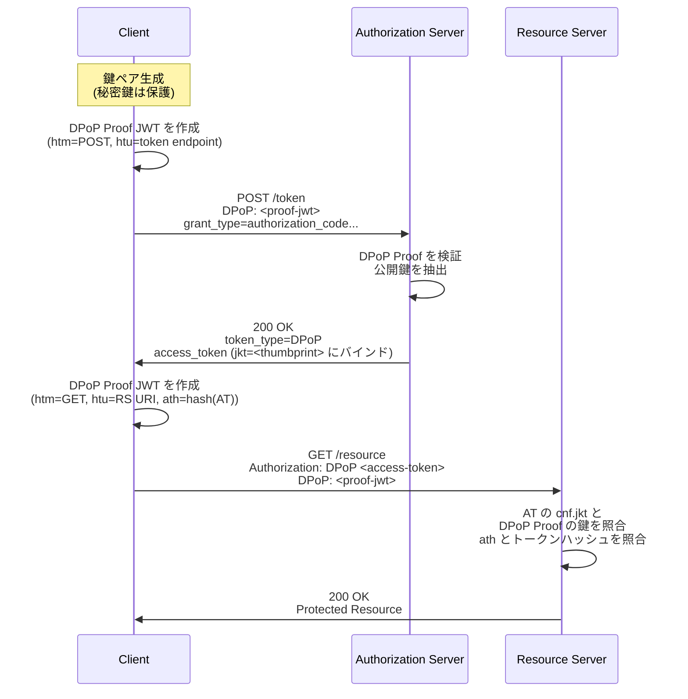
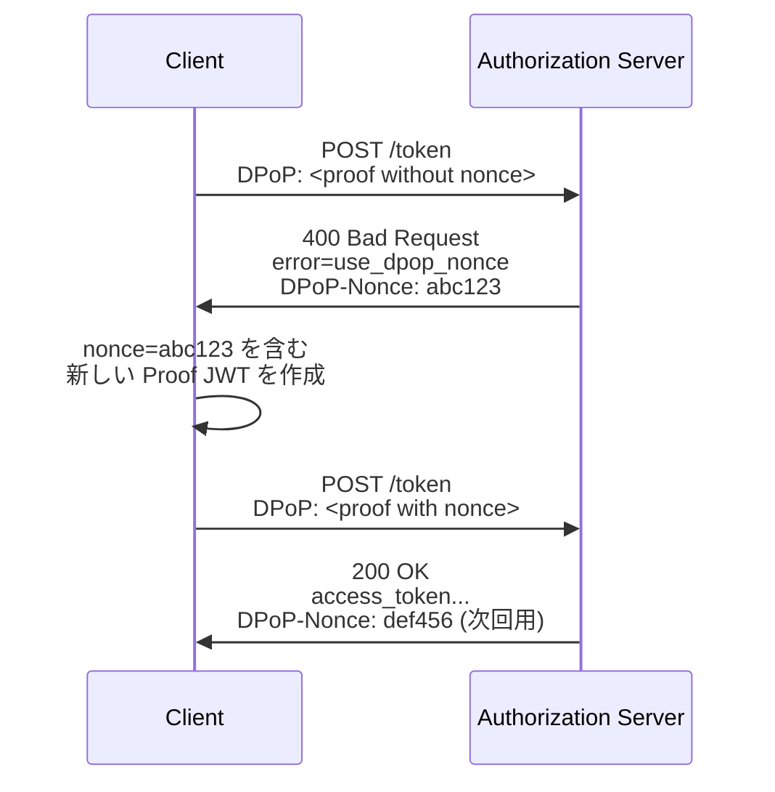

# RFC 9449 - OAuth 2.0 Demonstrating Proof of Possession (DPoP)

## 概要

RFC 9449 は、OAuth 2.0 のアクセストークンおよびリフレッシュトークンに対して、アプリケーションレベルでの所有証明 (Proof of Possession, PoP) を実現するメカニズム **DPoP (Demonstrating Proof of Possession)** を定義する仕様です。2023 年 9 月に IETF により標準化されました。

DPoP は、クライアントが生成した公開鍵 / 秘密鍵ペアにトークンをバインドし、各 HTTP リクエストに対してその鍵での署名 (DPoP Proof JWT) を付随させることで、トークンを送信者制約付き (sender-constrained) にします。これによって、たとえアクセストークンが漏洩したとしても、対応する秘密鍵を持たない攻撃者はトークンを再利用できません。

DPoP は、相互 TLS (RFC 8705) のようなトランスポート層の所有証明手段を利用できない、あるいは利用したくないクライアント (典型的には SPA やネイティブアプリ等のパブリッククライアント) を主なターゲットとしています。

## 解決する課題

### 1. Bearer トークンの脆弱性

OAuth 2.0 の Bearer トークン (RFC 6750) は「持っている者が利用できる」という性質を持ち、漏洩したアクセストークンを攻撃者が取得した場合、そのまま保護リソースへのアクセスに利用できます。XSS、ブラウザ拡張機能、ログへの混入、マルウェアによるメモリ読み取り等、漏洩経路は多岐にわたります。

### 2. 既存の所有証明手段の制約

相互 TLS によるクライアント認証およびトークンバインディング (RFC 8705) はトークンを送信者制約付きにする確立した手段ですが、以下の制約があります。

- ブラウザ JavaScript からは TLS クライアント証明書を直接制御できない
- ネイティブアプリやモバイル環境では証明書プロビジョニングが難しい
- リバースプロキシ等の TLS 終端構成と相性が悪い

DPoP はアプリケーション層 (JWT 署名) で同等の保証を提供し、こうした環境でも利用可能にすることを目的とします。

### 3. リプレイ攻撃の検知

DPoP Proof JWT には `jti` (JWT ID) と `iat` (発行時刻)、さらにサーバー提供の `nonce` を含めることで、サーバー側でリプレイを検知・拒否できます。

## 主要概念・用語

### DPoP Proof JWT

クライアントが各 HTTP リクエストごとに生成・署名する JWT。HTTP リクエストの `DPoP` ヘッダーで送信されます。JWS (RFC 7515) で署名された JSON Web Token であり、JOSE ヘッダーに公開鍵を埋め込み、ペイロードに対象となる HTTP メソッドと URI を記載します。

### DPoP-Bound Access Token

DPoP Proof JWT に含まれる公開鍵にバインドされたアクセストークン。`token_type` が `DPoP` となり、`cnf` クレーム (RFC 7800) に公開鍵の SHA-256 サムプリント (`jkt`) が含まれます。

### JWK SHA-256 Thumbprint (`jkt`)

公開鍵 (JWK) の正規化表現に対する SHA-256 ハッシュを Base64url エンコードした値で、RFC 7638 で定義される識別子。DPoP では、アクセストークンに鍵をバインドするための識別子として `cnf` クレーム内で利用されます。

### Access Token Hash (`ath`)

保護リソースアクセス時の DPoP Proof JWT に含めるクレームで、提示するアクセストークンの SHA-256 ハッシュを Base64url エンコードした値です。Proof JWT と特定のアクセストークンの結びつきを保証します。

### DPoP Nonce

サーバーがクライアントに提供する不予測な値。`DPoP-Nonce` HTTP レスポンスヘッダーで配布され、後続の DPoP Proof JWT の `nonce` クレームに含めることが求められます。事前生成された Proof JWT の利用を防ぎます。

## プロトコルフロー

### トークン取得から保護リソースアクセスまで



### サーバー提供 Nonce を用いるフロー



## 詳細解説

### DPoP Proof JWT の構造

DPoP Proof JWT は JWS Compact Serialization 形式の JSON Web Token です。

#### JOSE ヘッダー

| パラメータ | 値                                                       | 説明                                           |
| ---------- | -------------------------------------------------------- | ---------------------------------------------- |
| `typ`      | `"dpop+jwt"`                                             | JWT の用途を明示する固定値                     |
| `alg`      | 非対称アルゴリズム識別子 (例: `ES256`, `RS256`, `EdDSA`) | `none` および対称アルゴリズムは禁止            |
| `jwk`      | 公開鍵を表す JWK                                         | 秘密鍵成分を含めてはならない。検証に利用される |

#### ペイロードクレーム (必須)

| クレーム | 説明                                                                            |
| -------- | ------------------------------------------------------------------------------- |
| `jti`    | リプレイ防止のための一意な識別子。96 ビット以上の擬似乱数か UUIDv4 が推奨される |
| `htm`    | 対応する HTTP リクエストのメソッド (例: `POST`, `GET`)                          |
| `htu`    | 対応する HTTP リクエストの URI。クエリおよびフラグメントは除外する              |
| `iat`    | DPoP Proof JWT の発行時刻 (Unix 秒)                                             |

#### ペイロードクレーム (条件付き必須)

| クレーム | 説明                                                                                             |
| -------- | ------------------------------------------------------------------------------------------------ |
| `ath`    | アクセストークンの SHA-256 ハッシュを Base64url エンコードした値。保護リソースアクセス時には必須 |
| `nonce`  | サーバーが `DPoP-Nonce` ヘッダーで提供した値。サーバーが nonce を要求している場合に必須          |

### サンプル DPoP Proof JWT (デコード後)

```
ヘッダー:
{
  "typ": "dpop+jwt",
  "alg": "ES256",
  "jwk": {
    "kty": "EC",
    "crv": "P-256",
    "x": "...",
    "y": "..."
  }
}

ペイロード:
{
  "jti": "-BwC3ESc6acc2lTc",
  "htm": "POST",
  "htu": "https://server.example.com/token",
  "iat": 1716422000
}
```

### トークンエンドポイントでの動作

クライアントはトークンリクエストに `DPoP` ヘッダーを付与します。認可サーバーは Proof JWT を検証し、`jwk` の公開鍵から SHA-256 サムプリントを計算してアクセストークンにバインドします。

成功レスポンスでは次のように `token_type` が `DPoP` となります。

```http
HTTP/1.1 200 OK
Content-Type: application/json

{
  "access_token": "Kz~8mXK1EalYznwH-LC-1fBAo.4Ljp~zsPE_NeO.gxU",
  "token_type": "DPoP",
  "expires_in": 2677,
  "refresh_token": "Q..Zkm29lexi8VnWg2zPW1x-tgGad0Ibc3s3EwM_Ni4-g"
}
```

JWT 形式のアクセストークン (RFC 9068) の場合、`cnf` クレームに以下のように鍵サムプリントが含まれます。

```json
{
  "iss": "https://server.example.com",
  "sub": "...",
  "aud": "...",
  "exp": 1716425600,
  "cnf": {
    "jkt": "0ZcOCORZNYy-DWpqq30jZyJGHTN0d2HglBV3uiguA4I"
  }
}
```

### 保護リソースエンドポイントでの動作

クライアントは `Authorization` ヘッダーに `DPoP` スキームでアクセストークンを送り、`DPoP` ヘッダーに新しい Proof JWT を付加します。この Proof JWT には `ath` クレーム (アクセストークンの SHA-256 ハッシュ) が必須となります。

```http
GET /protectedresource HTTP/1.1
Host: resource.example.org
Authorization: DPoP eyJhbGciOiJFUzI1NiIsImtpZCI6IkJlQUx...
DPoP: eyJ0eXAiOiJkcG9wK2p3dCIsImFsZyI6IkVTMjU2Iiwia...
```

リソースサーバーは次を検証します。

1. アクセストークンの `cnf.jkt` と、DPoP Proof JWT の `jwk` の SHA-256 サムプリントが一致する
2. DPoP Proof JWT の `ath` クレームが、提示されたアクセストークンの SHA-256 ハッシュと一致する
3. `htm` / `htu` がアクセス対象のリクエストと一致する

### `dpop_jkt` 認可リクエストパラメータ

認可コードフローにおいて、認可コードを特定の DPoP 公開鍵にバインドするためのパラメータです。認可リクエストに `dpop_jkt`（公開鍵の SHA-256 サムプリント）を含めることで、認可コードが他の鍵で交換されることを防ぎます。これにより、認可リクエスト時点から鍵バインディングが連鎖し、エンドツーエンドでの所有証明が成立します。

### サーバー提供 Nonce のメカニズム

サーバーは、事前生成された DPoP Proof JWT による攻撃を防ぐため、`DPoP-Nonce` ヘッダーで不予測な値を提供できます。

- クライアントが nonce 無しでリクエストを送ると、サーバーは `error=use_dpop_nonce` および `DPoP-Nonce` ヘッダーで応答する
- クライアントは `nonce` クレームを含む新しい Proof JWT を作成して再送する
- 認可サーバーとリソースサーバーはそれぞれ独立に nonce を管理する

### エラーレスポンス

| エラーコード         | 用途                                                                                   |
| -------------------- | -------------------------------------------------------------------------------------- |
| `invalid_dpop_proof` | DPoP Proof JWT の検証に失敗した場合に返される                                          |
| `use_dpop_nonce`     | サーバーが nonce を要求しており、`DPoP-Nonce` ヘッダーで配布した値を使う必要がある場合 |

ステータスコードは、認可サーバーからは 400 Bad Request、リソースサーバーからは 401 Unauthorized が返されます。

### メタデータ拡張

- 認可サーバーメタデータ (RFC 8414) に `dpop_signing_alg_values_supported` が追加され、サポートする署名アルゴリズムを公開する
- 動的クライアント登録 (RFC 7591) に `dpop_bound_access_tokens` (boolean) が追加され、クライアントが常に DPoP バインディングを要求することを示す

## セキュリティに関する考慮事項

### リプレイ防止

DPoP Proof JWT は短時間 (数秒〜数分) のみ受理し、サーバーは受理した `jti` を保持してウィンドウ内でのリプレイを拒否する必要があります。`iat` も検証し、過剰に古い / 未来の Proof JWT を拒否します。

### 事前生成 (Pre-generation) 攻撃

悪意あるコードが将来の時刻に対する Proof JWT を事前に大量生成し、後でクライアント環境を侵害した際に利用する攻撃が考えられます。対策としては以下が挙げられます。

- サーバー提供 `nonce` の活用 (Proof JWT の有効期間をサーバー側で制御できる)
- 短寿命なアクセストークンと、`ath` クレームによる特定トークンへの紐づけ
- WebCrypto の非エクスポータブル秘密鍵を用いた鍵の保護

### Nonce ダウングレード

サーバーが一度 nonce を発行した後は、`nonce` クレームを持たない Proof JWT を拒否する必要があります。

### XSS / 信頼されないコード

DPoP は XSS そのものを防ぎませんが、非エクスポータブル鍵 (WebCrypto の `extractable: false`) を組み合わせることで、攻撃者が秘密鍵自体を持ち出して別環境でトークンを利用することを防げます。一方、攻撃者が同一の実行コンテキスト内で Proof JWT を作成して利用することは防げないため、CSP 等の補完的対策が必要です。

### HTTP リクエスト保護の範囲

DPoP Proof JWT は HTTP メソッドと URI のみを署名対象とし、ボディやその他のヘッダーは保護しません。リクエスト全体の機密性・完全性は引き続き TLS に依存します。

### ハッシュアルゴリズム

`jkt`、`ath`、`dpop_jkt` のすべてで SHA-256 が用いられます。アルゴリズム交渉が無いことで実装が単純化される一方、SHA-256 の衝突 / プリイメージ耐性に依存します。

### リフレッシュトークン

パブリッククライアントに対して発行されるリフレッシュトークンは、対応するアクセストークンと同じ DPoP 公開鍵にバインドされます。コンフィデンシャルクライアントの場合は既存のクライアント認証で十分とみなされ、バインドは必須ではありません。

## 関連仕様

- **RFC 6749 - OAuth 2.0 Authorization Framework**: DPoP がトークン取得に利用する基本フレームワーク
- **RFC 6750 - OAuth 2.0 Bearer Token Usage**: DPoP が代替するトークン提示方式
- **RFC 7515 - JSON Web Signature (JWS)**: DPoP Proof JWT の署名形式
- **RFC 7517 - JSON Web Key (JWK)**: 公開鍵の表現
- **RFC 7519 - JSON Web Token (JWT)**: DPoP Proof JWT および JWT アクセストークンの基盤
- **RFC 7638 - JWK Thumbprint**: `jkt` および `dpop_jkt` の計算方式
- **RFC 7800 - Proof-of-Possession Key Semantics for JWTs**: `cnf` クレームの定義
- **RFC 8414 - OAuth 2.0 Authorization Server Metadata**: `dpop_signing_alg_values_supported` の公開
- **RFC 8705 - OAuth 2.0 Mutual-TLS Client Authentication**: もう一つの送信者制約付きトークン手段
- **RFC 9068 - JWT Profile for OAuth 2.0 Access Tokens**: `cnf.jkt` を含む JWT アクセストークン
- **RFC 9126 - OAuth 2.0 Pushed Authorization Requests**: `dpop_jkt` を含む認可リクエストの保護

## 参考文献

- [RFC 9449 - OAuth 2.0 Demonstrating Proof of Possession (DPoP)](https://datatracker.ietf.org/doc/html/rfc9449)
- [RFC 7800 - Proof-of-Possession Key Semantics for JWTs](https://datatracker.ietf.org/doc/html/rfc7800)
- [RFC 7638 - JSON Web Key (JWK) Thumbprint](https://datatracker.ietf.org/doc/html/rfc7638)
- [RFC 8705 - OAuth 2.0 Mutual-TLS Client Authentication and Certificate-Bound Access Tokens](https://datatracker.ietf.org/doc/html/rfc8705)
- [IANA - OAuth Parameters](https://www.iana.org/assignments/oauth-parameters/oauth-parameters.xhtml)
