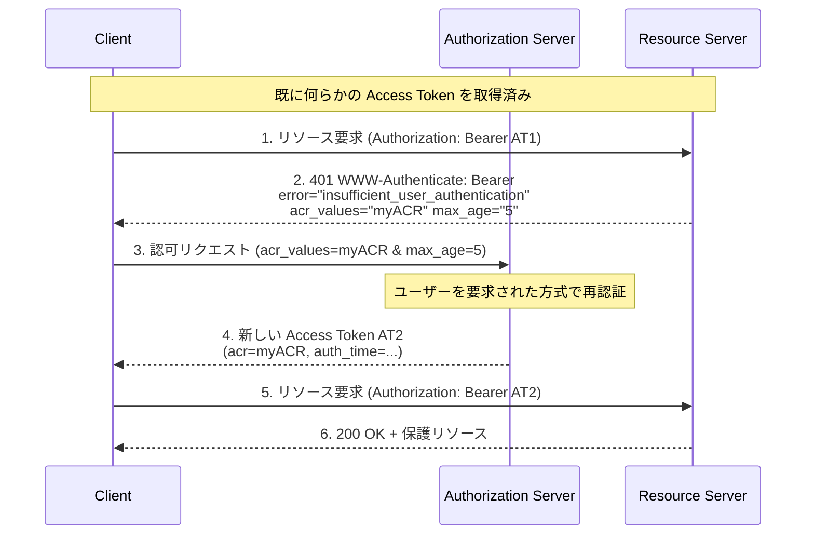

# RFC 9470 - OAuth 2.0 Step Up Authentication Challenge Protocol

## 1. 概要

RFC 9470 は、OAuth 2.0 のリソースサーバーがアクセストークンに紐づく認証イベントの強度が不十分であると判断した際に、クライアントへ「より強い認証」を要求するための標準化されたチャレンジ／応答プロトコルを定義する。2023 年 9 月に Vittorio Bertocci (Auth0/Okta) と Brian Campbell (Ping Identity) によって Proposed Standard として発行された。

具体的には、リソースサーバーが `WWW-Authenticate` ヘッダに新しいエラーコード `insufficient_user_authentication` と `acr_values` / `max_age` パラメータを含めて返し、クライアントは認可サーバーへ同等のパラメータを付けて再度認可リクエストを行う。認可サーバーは要求された認証コンテキストを満たす形でユーザーを認証し直し、その結果を新しいアクセストークンの `acr` / `auth_time` クレームとして表現する。

OpenID Connect の `acr_values` / `max_age` パラメータと、`auth_time` / `acr` クレームの概念を、OAuth 2.0 の世界で再利用しつつ、リソースサーバー起点の動的なステップアップ要求を可能にした点が本仕様の中核である。

## 2. 解決する課題

OAuth 2.0 (RFC 6749) や Bearer Token Usage (RFC 6750) は、リソースサーバーが「アクセストークンがそもそも有効か」を判定する仕組みは提供していたが、「そのトークンが発行されたときの認証が十分強かったか」を表明したり、不十分な場合に動的にステップアップを要求したりするメカニズムは持たなかった。

実運用では、同じ API でも操作内容によって必要な保証レベルが異なる。例えば次のような要件がよくある。

- 残高照会はパスワードのみの認証で済むが、送金実行には MFA（多要素認証）を必須にしたい
- 直近数分以内に再認証したユーザーにしか高リスク操作を許可したくない
- 同じスコープでもリソースサーバーが状況に応じて求める認証強度を動的に変えたい

従来この種の要件は独自実装で解決されていたが、相互運用性に乏しく、リソースサーバー／認可サーバー／クライアントの責務分担も曖昧だった。RFC 9470 は、リソースサーバーが標準的なチャレンジを返すことで、クライアントが標準的な認可リクエストへ翻訳でき、認可サーバーが標準的なクレームで結果を伝えられる、というエンドツーエンドのプロトコルを定義することでこの問題を解決する。

## 3. 主要概念・用語

### 3.1 認証コンテキストクラス参照 (acr)

`acr` (Authentication Context Class Reference) は OpenID Connect Core で導入された概念で、「どのような方式でユーザーが認証されたか」を識別する文字列識別子である。値の意味は認可サーバーとリソースサーバー間で事前に合意する。例として `urn:mace:incommon:iap:silver`、`phr`（phishing-resistant）、`mfa` などのプロファイル値が利用される。

### 3.2 認証時刻 (auth_time)

`auth_time` はユーザーが認証されたエポック秒（1970-01-01T00:00:00Z UTC からの経過秒数）を表す数値クレーム。「直近 N 秒以内に再認証されているか」を判定するために使用する。

### 3.3 insufficient_user_authentication エラー

RFC 9470 が新規に IANA 登録する OAuth エラーコード。「アクセストークン自体は有効だが、それに紐づく認証イベントがリソースサーバーの要件を満たさない」ことを示す。

### 3.4 acr_values / max_age パラメータ

`WWW-Authenticate` ヘッダおよび認可リクエストの両方で利用される、要求する認証強度を表現するパラメータ。

- `acr_values`: 受理可能な `acr` の値をスペース区切りで優先度順に列挙
- `max_age`: 最後の認証イベントからの経過秒数の上限（非負整数）

## 4. プロトコルフロー

RFC 9470 が定義する一連のやりとりは、リソースサーバーのチャレンジを起点とする 6 ステップで構成される。



### ステップごとの解説

1. クライアントは保持しているアクセストークン AT1 でリソースアクセスを試みる
2. リソースサーバーは AT1 の `acr` / `auth_time` が当該リクエストの要件を満たさないと判断し、`401 Unauthorized` とともに `WWW-Authenticate: Bearer` ヘッダを返却する。エラーコードは `insufficient_user_authentication`、必要に応じて `acr_values` および／または `max_age` を含める
3. クライアントは受け取ったパラメータをそのまま認可リクエストの `acr_values` / `max_age` にコピーし、認可サーバーへ送る
4. 認可サーバーはユーザーを要求された強度で認証し、要件を満たした場合は新しいアクセストークン AT2 を発行する。AT2 には実際に達成された `acr` と `auth_time` が反映される。要件を満たせない場合は OpenID Connect の Unmet Authentication Requirements 仕様 (`unmet_authentication_requirements`) に従ったエラーを返す
5. クライアントは AT2 を用いてリソースアクセスを再試行する
6. リソースサーバーは AT2 の `acr` / `auth_time` を検証し、要件を満たしていればリソースを返却する

## 5. 詳細解説

### 5.1 リソースサーバーが返すチャレンジ（Section 3）

リソースサーバーは、OAuth 2.0 Bearer Token Usage (RFC 6750) で定義された `WWW-Authenticate: Bearer` のフォーマットを拡張する形でチャレンジを返す。新しいエラーコードと 2 つの新しいパラメータが追加される。

`acr` 要件のみのチャレンジ例（Figure 2 相当）:

```http
HTTP/1.1 401 Unauthorized
WWW-Authenticate: Bearer error="insufficient_user_authentication",
  error_description="A different authentication level is required",
  acr_values="myACR"
```

`max_age` 要件のみのチャレンジ例（Figure 3 相当）:

```http
HTTP/1.1 401 Unauthorized
WWW-Authenticate: Bearer error="insufficient_user_authentication",
  error_description="More recent authentication is required",
  max_age="5"
```

両方を同時に指定することも可能で、その場合、両方の条件を満たすトークンが要求される。

仕様は、`Bearer` トークン以外（例: DPoP, RFC 9449）でも同様の拡張が適用できるよう設計されており、チャレンジ自体はトークン種別に依存しない。

### 5.2 クライアントの動作（Section 4）

クライアントはチャレンジで受け取った `acr_values` / `max_age` を、認可リクエスト URL のクエリパラメータ（または PAR / JAR を利用している場合はそれらの中）にそのまま再送する。

認可リクエスト例（Figure 4 相当）:

```
GET /authorize?response_type=code
  &client_id=s6BhdRkqt3
  &scope=purchase
  &state=af0ifjsldkj
  &redirect_uri=https%3A%2F%2Fclient.example.org%2Fcb
  &acr_values=myACR HTTP/1.1
Host: as.example.net
```

クライアントは複数のリソースサーバーから異なる要件を受け取った場合に備え、現在のアクセストークンに紐づく `acr` / `auth_time` を内部で追跡することが推奨される。これにより、不要な再認証を抑制できる。

### 5.3 認可サーバーの動作（Section 5）

認可サーバーは受け取った `acr_values` / `max_age` に従ってユーザーを認証する。要件を満たせた場合、その値を発行するアクセストークンに反映させる。要件を満たせない場合は OpenID Connect Core で定義される `unmet_authentication_requirements` エラーを返す。

なお、`acr_values` / `max_age` 自体は OpenID Connect Core で既に定義されているパラメータであり、RFC 9470 はそれらを OAuth 2.0 の世界（つまり ID トークンを伴わないフロー）でも一貫した意味で解釈できるようにする。

### 5.4 認証コンテキストの伝達（Section 6）

リソースサーバーは新しいアクセストークン AT2 から `acr` / `auth_time` を取得する必要がある。RFC 9470 は具体的な伝達手段として 2 つを取り上げている。

#### 5.4.1 JWT アクセストークン (Section 6.1)

RFC 9068（JWT Profile for OAuth 2.0 Access Tokens）に従う JWT アクセストークンでは、ペイロードに以下のクレームを含める。

```json
{
  "iss": "https://as.example.com",
  "sub": "248289761001",
  "aud": "https://rs.example.com",
  "exp": 1646343798,
  "iat": 1646340198,
  "auth_time": 1646340198,
  "acr": "myACR"
}
```

リソースサーバーは署名検証後、`acr` / `auth_time` を直接読み取って判定できる。

#### 5.4.2 トークンイントロスペクション (Section 6.2)

不透明トークンを使う場合、リソースサーバーは RFC 7662 のトークンイントロスペクションを通じて認証コンテキストを取得する。応答には `acr` および `auth_time` を含める。

```json
{
  "active": true,
  "scope": "purchase",
  "client_id": "s6BhdRkqt3",
  "username": "jdoe",
  "exp": 1646343798,
  "auth_time": 1646340198,
  "acr": "myACR"
}
```

RFC 9470 はこの目的のために、トークンイントロスペクション応答パラメータとして `acr` / `auth_time` を IANA に登録している。

### 5.5 認可サーバーメタデータ（Section 7）

認可サーバーは RFC 8414（OAuth 2.0 Authorization Server Metadata）で公開するメタデータに `acr_values_supported` を含めることで、サポートする `acr` 値をクライアントへ広告できる。これは OpenID Connect Discovery 1.0 で定義されているメタデータと同名・同意味であり、両仕様間で整合的に運用できる。

### 5.6 認証要件の比較（Section 8）

具体的にどの `acr` がどの操作に必要か、どの認証手段（パスキー、SMS OTP、ハードウェアキー等）が `acr` 値にマップされるかは、本仕様の範囲外である。リソースサーバーと認可サーバー間でポリシーを合意する必要がある。一般には、業界プロファイル（例: NIST SP 800-63 の IAL/AAL、eIDAS の LoA、Identity Assurance プロファイル等）を参照することが多い。

## 6. セキュリティに関する考慮事項

RFC 9470 の Section 9 は以下を主要な注意点として挙げる。

### 6.1 情報漏えいリスク

`acr_values` パラメータがチャレンジ／認可リクエストに含まれることで、認証済みユーザーやリソース自体に関する情報が意図せず露出する可能性がある。例えば「この API には金融機関グレードの認証が必要」というポリシーが、攻撃者にリソースの価値を示唆してしまう場合がある。

### 6.2 チャレンジ検証順序

リソースサーバーは、トークンの一般的な妥当性検証（署名検証、有効期限、scope 等）と、`acr` / `auth_time` の検証のどちらを先に行ってもよい。ただし、トークンを保持していない攻撃者にも「どんな認証要件が課されているか」を露呈すると、情報漏えいや偵察の手助けになり得るため、通常は先にトークン自体の有効性を検証することが推奨される。

### 6.3 悪意あるリソースサーバー

悪意あるリソースサーバーが過剰な認証強度を要求し、ユーザーの認証情報や再認証行動を不必要に引き出す攻撃が考えられる。クライアントは信頼できるリソースサーバーに対してのみチャレンジを尊重し、不審な要件は拒否またはユーザーへ明示する設計が望ましい。

### 6.4 リプレイと改ざん

`acr` / `auth_time` を含むアクセストークンは、JWT であれば認可サーバーの署名で保護され、不透明トークンであればイントロスペクションエンドポイントの TLS で保護される。クライアントがチャレンジから認可リクエストへパラメータを転送する際にも、`state` などを併用して CSRF を防ぐべきである。

## 7. 関連仕様

- [RFC 6749](./rfc6749.md) - OAuth 2.0 Authorization Framework: 基盤となる認可フレームワーク
- [RFC 6750](./rfc6750.md) - OAuth 2.0 Bearer Token Usage: `WWW-Authenticate: Bearer` 拡張の基底
- [RFC 7662](./rfc7662.md) - OAuth 2.0 Token Introspection: 不透明トークン経由で `acr` / `auth_time` を取得する手段
- [RFC 8414](./rfc8414.md) - OAuth 2.0 Authorization Server Metadata: `acr_values_supported` 公開先
- [RFC 9068](./rfc9068.md) - JWT Profile for OAuth 2.0 Access Tokens: JWT アクセストークン中での `acr` / `auth_time` 表現
- [RFC 9449](./rfc9449.md) - DPoP: チャレンジ拡張は Bearer 以外のスキームでも適用可能
- [OpenID Connect Core 1.0](./openid-connect-core.md) - `acr_values` / `max_age` パラメータおよび `acr` / `auth_time` クレームの原典
- [OpenID Connect for Identity Assurance 1.0](./openid-connect-4-identity-assurance.md) - 高保証 ID を扱う場面でステップアップ要件が頻出
- OpenID Connect Core 1.0 Section 3.1.2.6 - `unmet_authentication_requirements` エラー定義

## 8. 参考文献

- [RFC 9470: OAuth 2.0 Step Up Authentication Challenge Protocol (HTML)](https://www.rfc-editor.org/rfc/rfc9470.html)
- [IETF Datatracker: RFC 9470](https://datatracker.ietf.org/doc/rfc9470/)
- [OpenID Connect Core 1.0 incorporating errata set 2](https://openid.net/specs/openid-connect-core-1_0.html)
- [RFC 6749: The OAuth 2.0 Authorization Framework](https://www.rfc-editor.org/rfc/rfc6749.html)
- [RFC 6750: The OAuth 2.0 Authorization Framework: Bearer Token Usage](https://www.rfc-editor.org/rfc/rfc6750.html)
- [RFC 7662: OAuth 2.0 Token Introspection](https://www.rfc-editor.org/rfc/rfc7662.html)
- [RFC 8414: OAuth 2.0 Authorization Server Metadata](https://www.rfc-editor.org/rfc/rfc8414.html)
- [RFC 9068: JSON Web Token (JWT) Profile for OAuth 2.0 Access Tokens](https://www.rfc-editor.org/rfc/rfc9068.html)
