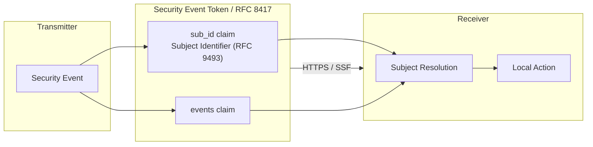
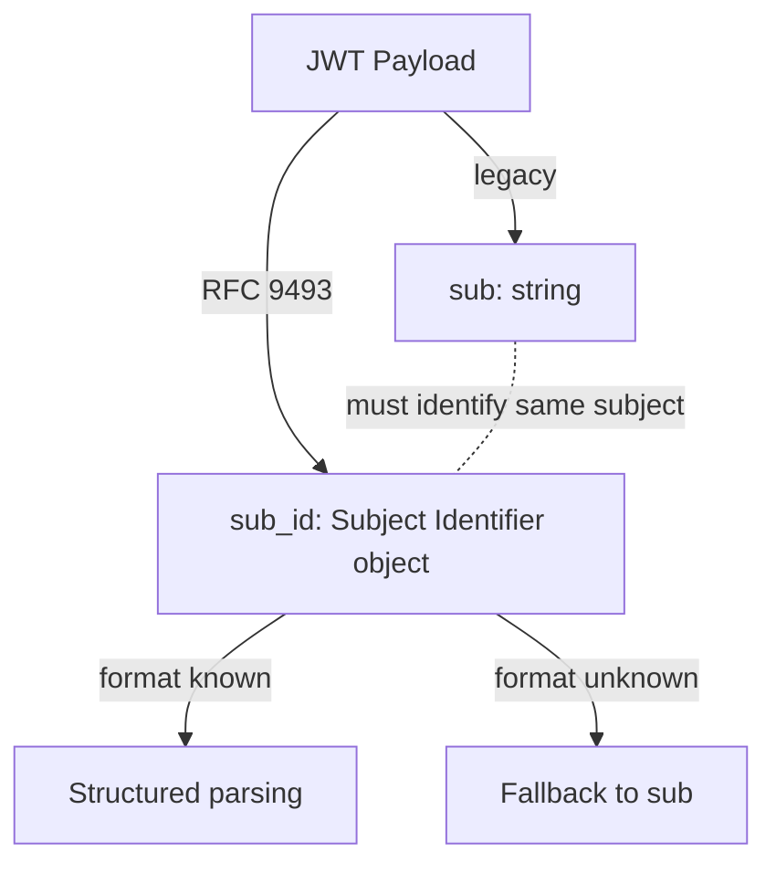

# RFC 9493 - Subject Identifiers for Security Event Tokens

## 概要

RFC 9493 は、Security Event Token (SET, RFC 8417) を始めとするセキュリティイベントの送受信において、イベントの「主体 (subject)」を一意かつ多様な方法で表現するための構造化された識別子フォーマット **Subject Identifier** を定義する。

従来 JWT (RFC 7519) の `sub` クレームは単一の文字列でしか主体を表せないため、メールアドレス、電話番号、不透明な内部 ID、分散型識別子 (DID) など複数の識別手段を一貫して扱うことが困難であった。RFC 9493 はこれを JSON オブジェクトとして構造化し、Shared Signals Framework (OpenID SSF)、Continuous Access Evaluation Profile (CAEP)、RISC Profile などの上位プロファイルが共通の主体表現を利用できる土台を提供する。

仕様は 2023 年 12 月に IETF Security Events (SECEVENT) ワーキンググループから RFC として発行された。

## 解決する課題

セキュリティイベントの配送では、「誰に関するイベントか」を送信側と受信側で確実に合意する必要がある。しかし現実には以下の事情から、単一の文字列識別子では不十分である。

- 同一の主体 (ユーザ、デバイス、サービスアカウント) が、利用するコンテキストごとに異なる識別子を持つ
- 主体の種類 (人、組織、デバイス、セッション) ごとに自然な識別形式が異なる (メール、電話番号、acct URI、DID、Issuer/Subject ペア等)
- 受信側にとっての主体識別子と送信側にとっての主体識別子が一致しないことがある
- 複数の識別子を同時に提示することで受信側にマッチングを助ける必要がある

RFC 9493 はこれらを統一的に扱うため、「**識別子フォーマット (Identifier Format)** を `format` メンバーで宣言する JSON オブジェクト」という単純で拡張可能な枠組みを提供する。

## 主要概念・用語

### Subject Identifier

主体を識別するための JSON オブジェクト。必ず `format` メンバーを持ち、`format` の値によってオブジェクト内に出現すべき他のメンバーが決定される。

### Identifier Format

Subject Identifier の構造を定義する名前付きのスキーマ。RFC 9493 は 8 種類のフォーマットを定義し、IANA レジストリ "Security Event Identifier Formats" でさらに拡張可能とする。

### Subject

識別子が指し示す対象。RFC 9493 は意図的に「主体は人か、デバイスか、サービスか」といった意味論を規定せず、「識別子の構造と文法」のみを扱う。これにより同じフォーマットを多様な対象に再利用できる。

## オブジェクトの基本構造

Subject Identifier は以下の規約に従う JSON オブジェクトである。

- `format` メンバー必須。値は IANA レジストリに登録されたフォーマット名 (小文字、数字、`_`、`-` のみ)
- 各フォーマット定義で指定されたメンバーのみ出現可能
- フォーマット定義外の任意メンバーを許可しない (拡張は新フォーマット登録で行う)
- 識別対象の本質的性質 (人か機械か等) について主張してはならない

## 全体像

Subject Identifier がセキュリティイベント配送のどこに位置するかを以下に示す。



## 定義されている 8 種類のフォーマット

RFC 9493 セクション 3.2 は次のフォーマットを定義する。各フォーマットの必須メンバーと用途を整理する。

### account

`acct:` URI (RFC 7565) で主体を表す。ホスト部とローカル部を持ち、人間可読でドメインに紐付く ID 表現に適する。

```json
{
  "format": "account",
  "uri": "acct:example.user@service.example.com"
}
```

- 必須: `uri`

### email

RFC 5322 準拠のメールアドレス。

```json
{
  "format": "email",
  "email": "user@example.com"
}
```

- 必須: `email`

### iss_sub

JWT の発行者 (`iss`) と発行者内主体 (`sub`) のペア。OpenID Connect 等で発行された ID Token と整合的に主体を表す中核フォーマット。

```json
{
  "format": "iss_sub",
  "iss": "https://issuer.example.com/",
  "sub": "145234573"
}
```

- 必須: `iss`, `sub`

### opaque

送信側だけが意味を持つ不透明文字列 (UUID、ハッシュ等)。受信側は内容を解釈してはならず、等価比較のみが許される。

```json
{
  "format": "opaque",
  "id": "11112222333344445555"
}
```

- 必須: `id`

### phone_number

E.164 形式の電話番号。国コード付きのフル E.164 文字列で表現する。

```json
{
  "format": "phone_number",
  "phone_number": "+12065550100"
}
```

- 必須: `phone_number`

### did

W3C Decentralized Identifier。DID URL または素の DID を許容する。

```json
{
  "format": "did",
  "url": "did:example:123456"
}
```

- 必須: `url`

### uri

任意の RFC 3986 URI。`account` や `did` などより具体的なフォーマットが当てはまらない場合のジェネリックフォールバック。

```json
{
  "format": "uri",
  "uri": "urn:example:resource:abcd"
}
```

- 必須: `uri`

### aliases

同一主体を表す複数の Subject Identifier をまとめる「集合フォーマット」。受信側のマッチング成功率を高める用途に用いる。

```json
{
  "format": "aliases",
  "identifiers": [
    { "format": "email", "email": "user@example.com" },
    { "format": "phone_number", "phone_number": "+12065550100" }
  ]
}
```

- 必須: `identifiers` (Subject Identifier の配列)
- 制約: `aliases` の入れ子は禁止

## `sub_id` JWT クレーム

RFC 7519 の `sub` クレームは文字列値に限定されるため、JSON オブジェクトである Subject Identifier を入れることができない。RFC 9493 セクション 4 はこのギャップを埋めるため、新たな JWT クレーム **`sub_id`** を定義した。

- 値は Subject Identifier である必要がある
- `sub` と `sub_id` の両方が存在する場合は同一主体を示さなければならない
- 受信側が `sub_id` のフォーマットを解釈できない場合、フォールバックとして `sub` を利用してよい

これにより、既存の JWT 消費者と Subject Identifier 対応の新しい消費者の双方を破壊せずに共存させられる。

### `sub` と `sub_id` の関係



## SET と Shared Signals での利用

Security Event Token (RFC 8417) は、サブジェクトに関するイベント (例: セッション失効、リスクレベル変化、アカウントクレデンシャル変更) を JWT として配送する仕組みである。SET の `events` クレーム内の各イベントペイロードは、誰に関するイベントなのかを Subject Identifier で示す。

OpenID Foundation の以下プロファイルは Subject Identifier を中核データ型として参照する。

- **OpenID Shared Signals Framework (SSF) 1.0**: ストリーム設定や検証応答で対象主体を Subject Identifier で記述
- **OpenID Continuous Access Evaluation Profile (CAEP) 1.0**: セッション失効や認証レベル変更などのイベントペイロードで主体を Subject Identifier で表現
- **OpenID RISC Profile**: アカウント侵害・凍結などのリスクイベントで主体を Subject Identifier で表現

Subject Identifier の標準化により、これらのプロファイルは「主体表現」の細部に踏み込まずに自身のイベントセマンティクスへ集中できる。

### SET の中での配置例

```json
{
  "iss": "https://idp.example.com/",
  "jti": "756E69717565206964656E746966696572",
  "iat": 1493929421,
  "aud": ["https://sp.example.org/"],
  "events": {
    "https://schemas.openid.net/secevent/caep/event-type/session-revoked": {
      "subject": {
        "format": "iss_sub",
        "iss": "https://idp.example.com/",
        "sub": "user-12345"
      }
    }
  }
}
```

## 識別子フォーマットを新規定義する際の規律

RFC 9493 セクション 5 は IANA への新規フォーマット登録に対し以下を求めている。

- フォーマット名は小文字英数字、`_`、`-` のみで構成
- 登録ポリシーは **Specification Required**
- フォーマット定義は識別子の構造・文法のみを規定し、識別対象の本質的性質を規定しない
- 必須メンバーと任意メンバーを明確化
- セキュリティとプライバシーへの影響を記述

## セキュリティに関する考慮事項

セクション 7 は以下を整理している。

- **機密性・完全性は提供しない**: Subject Identifier 自体は暗号保護を含まない。JWS 署名、TLS、暗号化など外側の層で保護すること
- **比較規則の遵守**: フォーマットによって等価判定の規則 (大文字小文字、正規化等) が異なるため、各フォーマット定義に従うこと
- **不透明識別子の取り扱い**: `opaque` フォーマットの値はパースしてはならず、等価比較のみが許される
- **未知フォーマットの扱い**: 解釈できないフォーマットを含むイベントは破棄するか保留するなど、誤った主体への適用を避ける運用が必要

## プライバシーに関する考慮事項

セクション 6 は次のリスクに注意を喚起する。

- **相関リスク**: 単一主体に対し複数識別子を同時送信 (特に `aliases`) すると、受信側が把握していなかった同一性情報まで漏洩する可能性がある。受信側が既にその関連性を承知している場合に限り使用すべき
- **PII の伝送**: `email` や `phone_number` は個人情報そのものである。可能なら `iss_sub` や `opaque` でペアワイズ識別子を採用するなど、プライバシー保護を優先する設計が望まれる
- **目的限定**: 配送される識別子は、合意されたイベント処理目的を超えて使用してはならない

## IANA 登録

RFC 9493 は次の IANA 登録を行った。

- 新規レジストリ: **Security Event Identifier Formats** (Specification Required)
  - 初期登録: `account`, `email`, `iss_sub`, `opaque`, `phone_number`, `did`, `uri`, `aliases`
- JSON Web Token Claims レジストリへの `sub_id` クレーム登録

## 関連仕様

- [RFC 8417 - Security Event Token (SET)](./rfc8417.md): Subject Identifier を主体表現として利用する基盤フォーマット
- [RFC 7519 - JSON Web Token (JWT)](./rfc7519.md): `sub` / `sub_id` クレームの土台
- [OpenID Shared Signals Framework 1.0](./openid-shared-signals-framework.md): Subject Identifier を中核データ型として参照
- [OpenID Continuous Access Evaluation Profile 1.0](./openid-caep.md): イベントペイロードで Subject Identifier を利用
- [RFC 8935 - Push-Based Security Event Token Delivery](./rfc8935.md) / [RFC 8936 - Poll-Based Security Event Token Delivery](./rfc8936.md): SET の配送方式
- RFC 7565 - The 'acct' URI Scheme
- RFC 5322 - Internet Message Format
- W3C Decentralized Identifiers (DIDs) v1.0

## 参考文献

- [RFC 9493 - Subject Identifiers for Security Event Tokens](https://www.rfc-editor.org/rfc/rfc9493.html)
- [IANA Security Event Identifier Formats Registry](https://www.iana.org/assignments/secevent/secevent.xhtml)
- [IANA JSON Web Token Claims Registry](https://www.iana.org/assignments/jwt/jwt.xhtml)
