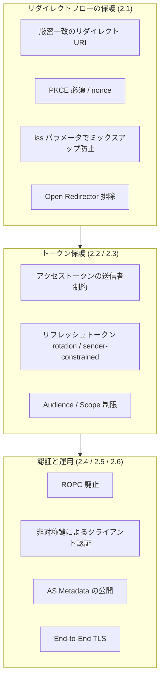
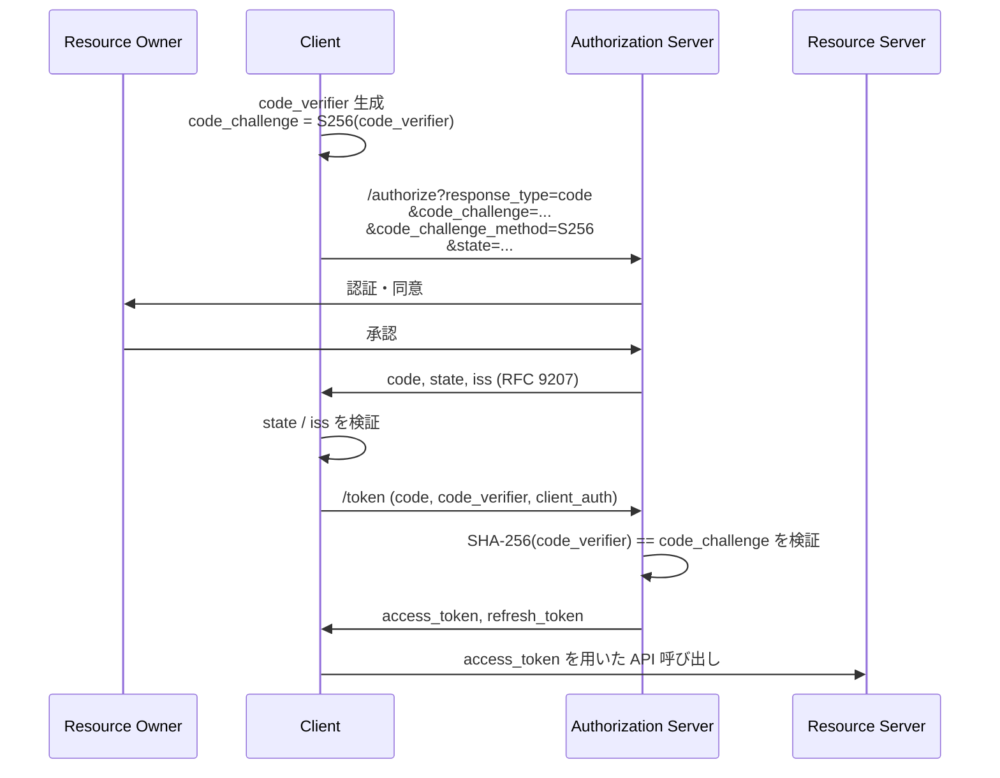
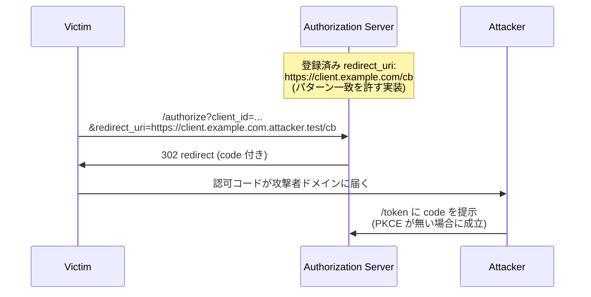
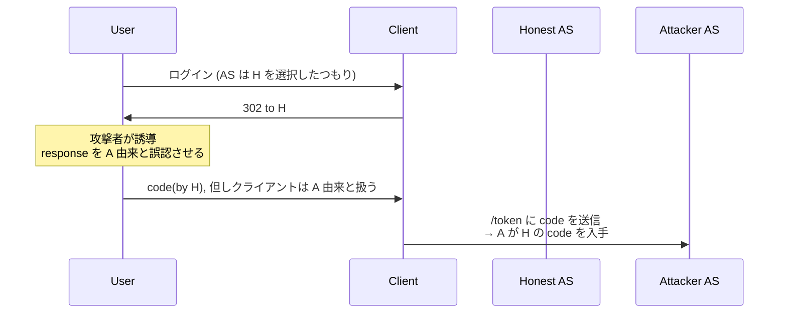

# RFC 9700 - OAuth 2.0 セキュリティに関する Best Current Practice

## 概要

RFC 9700 は、OAuth 2.0 を安全に実装・運用するための現代的な指針を体系化した IETF の Best Current Practice (BCP 240) です。2025 年 1 月に発行され、RFC 6749 (OAuth 2.0 Authorization Framework)、RFC 6750 (Bearer Token)、RFC 6819 (OAuth 2.0 Threat Model and Security Considerations) を更新する位置付けにあります。

本仕様は、OAuth 2.0 が当初の想定を超えて Open Banking や eGovernment などの高保証領域、さらにマルチテナント環境や動的クライアント管理シナリオに広く展開されてきた現実を踏まえ、攻撃者モデルを拡張し、過去十数年の運用経験から得られた具体的な攻撃と対策を集約しています。

RFC 9700 は新しいプロトコル機能を導入するのではなく、既存の RFC 群 (PKCE, mTLS, DPoP, Resource Indicators, JWT Access Token 等) を「いつ・どのように使うべきか」を規定する性格の文書である点が特徴です。

## 解決する課題

### 1. 既知の脆弱パターンが繰り返し悪用されている

OAuth 2.0 のリリース後も、不十分なリダイレクト URI 検証、認可コードインジェクション、ミックスアップ攻撃などの基本的な脆弱性が継続的に発見・悪用されてきました。RFC 6819 では脅威モデルが網羅されていたものの、推奨される具体的な対策が必ずしも単一の現代的指針として整理されていませんでした。

### 2. OAuth の適用範囲の拡大

Open Banking、eID、ヘルスケア等の高保証領域では、Bearer トークンの素朴な利用や、シンプルな state ベースの CSRF 対策では不十分です。Sender-Constrained Token、Audience Restriction、Authorization Server Metadata、PKCE 必須化などの厳格な実装が必要になります。

### 3. 動的・多発行者環境

複数の認可サーバーと連携するクライアント (例: 多数の銀行を扱うアグリゲーター) では、ミックスアップ攻撃のような新しい脅威クラスが顕在化しました。RFC 9700 はこうした動的環境を前提に攻撃者モデルを拡張しています。

### 4. ブラウザ挙動の進化

リファラポリシー、Cross-Origin の制約、postMessage、SameSite Cookie など、ブラウザのセキュリティモデルの変化に応じた現実的な指針が必要となりました。

## 攻撃者モデル (Section 3)

RFC 9700 は RFC 6819 を拡張し、以下の 5 種類の攻撃者を定義します。A3 / A4 / A5 は単独ではなく、A1 もしくは A2 と組み合わさって発生することが多いとされます。

| 攻撃者               | 能力                                                                                                                                                                                       |
| -------------------- | ------------------------------------------------------------------------------------------------------------------------------------------------------------------------------------------ |
| A1: Web Attacker     | 任意の数のエンドポイント (ブラウザ、サーバー) を運用できる。OAuth クライアントを登録し、独自の AS/RS を運用し、ユーザーを任意の URI に誘導できる。ただし自分宛でないメッセージは読めない。 |
| A2: Network Attacker | A1 の能力に加えてネットワーク全体を制御。TLS 等で暗号学的に保護されていないメッセージは盗聴・改ざん・偽装可能。                                                                            |
| A3: Response Reader  | 認可レスポンスの内容を読めるが改ざんはできない。リダイレクト URI 検証不備、ブラウザ履歴、ミックスアップ等で発生。                                                                          |
| A4: Request Reader   | 認可リクエストの内容を読めるが改ざんはできない。                                                                                                                                           |
| A5: Token Acquirer   | RS 侵害、設定ミス、ソーシャルエンジニアリング等を通じて発行済みアクセストークンを取得できる。                                                                                              |

## ベストプラクティスの全体像 (Section 2)

以下、主要な指針を整理します。

### 2.1 リダイレクトベースフローの保護

#### 厳密一致のリダイレクト URI

認可サーバーは登録済みリダイレクト URI と要求された URI を「完全文字列一致」で比較しなければなりません (MUST)。例外はネイティブアプリの `localhost` URI におけるポート番号のみで、RFC 8252 で許容されています。ワイルドカードや前方一致は禁止です。

#### Open Redirector の排除

クライアントおよび認可サーバーは、クエリパラメータで指定された任意の URI へブラウザを転送する Open Redirector エンドポイントを公開してはなりません (MUST NOT)。Open Redirector は認可コードやトークンの抽出に悪用されます。

#### CSRF 対策の三択

クライアントは以下のいずれかで CSRF を防止する必要があります。

- AS が PKCE をサポートしているなら PKCE に依拠する
- OpenID Connect の `nonce` を用いる
- `state` パラメータをユーザーエージェント上のセッションにバインドされた一回限りの CSRF トークンとして用いる

なお PKCE による CSRF 対策を選ぶ場合、AS が実際に PKCE をサポートしていることを必ず確認しなければなりません (MUST)。

#### ミックスアップ攻撃の防止

複数の AS と連携するクライアントは、レスポンスに付与される発行者識別子を検証することでミックスアップ攻撃を防ぐ必要があります。

- 推奨: RFC 9207 の `iss` パラメータ
- 代替: ID Token の `iss` クレーム、JARM の `iss`
- 二次的選択肢: AS ごとに異なるリダイレクト URI を用いる

クライアントは認可リクエストを送った発行者を必ず保存しなければなりません (MUST)。

### 2.1.1 認可コードグラント

- パブリッククライアントは PKCE (RFC 7636) を必須 (MUST) で利用する
- 機密クライアントも PKCE の利用を推奨 (RECOMMENDED)
- `code_challenge_method` は `S256` を推奨 (`plain` は code_verifier をリクエストに露出させる)
- `code_challenge` / `code_verifier` はトランザクション固有で、クライアントおよびユーザーエージェントに安全にバインドされる必要がある
- AS は PKCE をサポートし、トークンエンドポイントで `code_verifier` の正当性を必ず検証しなければならない (MUST)
- AS は PKCE Downgrade を防ぐため、当初の認可リクエストに `code_challenge` がなかった場合、`code_verifier` を含むトークンリクエストを拒否しなければならない (MUST)
- PKCE のサポートは AS メタデータ (RFC 8414) の `code_challenge_methods_supported` で発見できるようにすべき

OpenID Connect の機密クライアントは、文書化された前提のもとで `nonce` + ID Token クレームによって PKCE の代替を行うことが許されます。

### 2.1.2 インプリシットグラントの非推奨

認可レスポンスでアクセストークンを直接返す `response_type=token` 系のフローは、漏洩・リプレイ・インジェクションへの対策手段が限定的であり、また送信者制約の標準的手段が存在しません。

クライアントはアクセストークンインジェクションおよび漏洩経路を防げない限りインプリシットグラントを使用すべきではない (SHOULD NOT)、と位置付けられました。代替として `response_type=code`、もしくは `code id_token` のようにトークンエンドポイント側でトークンが発行される応答型を用います。

### 2.2 トークンリプレイの防止

#### 2.2.1 アクセストークン

AS および RS は、以下のいずれかの送信者制約メカニズムを採用すべきです (SHOULD)。

- RFC 8705: Mutual TLS for OAuth 2.0
- RFC 9449: OAuth 2.0 DPoP

これらを用いると、トークンが漏洩しても対応する鍵 (TLS クライアント証明書 / DPoP 鍵) を保持しない攻撃者は再利用できません。

#### 2.2.2 リフレッシュトークン

- パブリッククライアントのリフレッシュトークンは、送信者制約付きにするか、もしくは Refresh Token Rotation を実装しなければならない (MUST)
- 機密クライアントのリフレッシュトークンは、RFC 6749 によりすでに発行先クライアントに紐付けられている前提

Refresh Token Rotation を行う AS は、過去のリフレッシュトークンの再利用を検知した時点で、関連するアクセス・リフレッシュトークン群を全て失効させるべきです。

### 2.3 アクセストークンの権限制限

トークンの権限は、アプリケーションのユースケースに対して最小である必要があります。

| 制限の種類           | 実現手段                | 関連 RFC                    |
| -------------------- | ----------------------- | --------------------------- |
| Audience Restriction | `aud` クレーム          | RFC 9068 (JWT Access Token) |
| Resource 指定        | `resource` パラメータ   | RFC 8707                    |
| 操作の制限           | `scope` パラメータ      | RFC 6749                    |
| 詳細な権限           | `authorization_details` | RFC 9396 (RAR)              |

RS は受信したトークンが自身宛 (audience が一致する) でなければ要求を拒否しなければなりません (MUST)。

### 2.4 Resource Owner Password Credentials Grant の廃止

ROPC グラントは使用してはなりません (MUST NOT)。理由は以下のとおりです。

- クライアントに直接平文の認証情報を渡すため、攻撃面が AS だけでなくクライアントにも広がる
- ユーザーに「クライアント上で資格情報を入力する」習慣を植え付け、フィッシングへの耐性を下げる
- 多要素認証、ステップアップ認証、パスキー等の暗号学的資格情報認証と本質的に非互換

### 2.5 クライアント認証

AS は実装モデルが許す限りクライアント認証を強制すべきです。推奨される認証方式は非対称鍵に基づくものです。

- RFC 8705: Mutual TLS
- RFC 7521 / RFC 7523: Private Key JWT

非対称鍵方式では AS 側に対称秘密 (`client_secret`) を保管する必要がなく、漏洩時の影響が限定されます。

### 2.6 その他の推奨事項

- AS は RFC 8414 に基づくメタデータを公開し、クライアントはそれを利用して設定すべき
- AS は、クライアントがリソースオーナーと混同されうるクレーム (例: `client_id`) を任意に決定できないようにすべき (SHOULD NOT allow)
- クライアントと RS の間は BCP 195 に従う End-to-End TLS を推奨
- 認可レスポンスを暗号化されない HTTP で運ぶことは禁止。例外は RFC 8252 のネイティブアプリのループバックリダイレクトのみ
- postMessage 等のブラウザ内通信を用いる場合、メッセージの送信者と受信者の origin を厳密に検証しなければならない (MUST)
- トークン/メタデータ/JWKS/Dynamic Registration エンドポイントは CORS をサポートしてよいが、認可エンドポイントは CORS をサポートしてはならない (リダイレクト先であって XHR で叩く対象ではないため)

## 攻撃と緩和策 (Section 4)

Section 4 は具体的な攻撃シナリオごとに脅威と対策を列挙します。本節では主要な攻撃を抜粋します。

### 4.1 不十分なリダイレクト URI 検証

対策:

- リダイレクト URI の完全一致 (MUST)
- PKCE による認可コードのクライアントバインディング
- form_post モードの利用
- ワンタイム使用と再利用検知時のトークン失効

### 4.2 Referer ヘッダ経由の漏洩

認可レスポンスを受け取るページに外部リソースや他サイトへのリンクが存在すると、`Referer` ヘッダで code / state / token が漏洩します。

対策:

- 認可ページおよびクライアントのリダイレクト先ページから外部リンク・サードパーティリソースを排除する (SHOULD NOT include)
- `Referrer-Policy: no-referrer` を設定する
- form_post モードを用いる

### 4.3 ブラウザ履歴経由の漏洩

URL に含まれる code やアクセストークンはブラウザ履歴に残ります。

- アクセストークンを URI クエリで渡してはならない (MUST NOT)
- 認可コードを使い、ワンタイム使用を徹底する
- form_post モードを用いる

### 4.4 ミックスアップ攻撃

複数の AS を扱うクライアントに対し、攻撃者が制御する偽 AS と本物の AS を取り違えさせる攻撃。

対策:

- RFC 9207 の `iss` パラメータをレスポンスに含め、クライアントが検証 (SHOULD)
- ID Token / JARM の `iss` クレーム検証
- クライアントは認可リクエストを送った発行者を必ず記録しておく (MUST)
- AS ごとに異なるリダイレクト URI を割り当てる (代替)

### 4.5 認可コードインジェクション

攻撃者が取得した認可コードを、被害者のクライアントセッションに注入し、被害者のリソースを攻撃者アカウントに紐付ける攻撃。

- パブリッククライアントは PKCE を必須 (MUST)
- 機密クライアントは PKCE 推奨、もしくは OpenID Connect `nonce` で代替
- code_challenge / nonce はトランザクション固有でクライアントとユーザーエージェントに安全にバインド

### 4.6 アクセストークンインジェクション

インプリシットフローでは攻撃者が盗んだトークンを応答に注入できる。state は CSRF にしか効かず、トークンが攻撃者のものに置き換わっても気付けない。

- 認可コードフローへの移行 (SHOULD)
- OpenID Connect の `at_hash` クレーム
- 送信者制約付きアクセストークン

### 4.7 CSRF

- ユーザーエージェントセッションにバインドされた `state`、PKCE、もしくは `nonce`
- いずれもトランザクション固有でなければならない (MUST)

### 4.8 PKCE ダウングレード攻撃

PKCE がオプションの AS で、攻撃者が `code_challenge` を取り除いて発行された code を、後から自身の `code_verifier` で交換する攻撃。

- AS は元の認可リクエストに `code_challenge` がなかった場合、`code_verifier` を含むトークンリクエストを拒否しなければならない (MUST)
- すべてのフローで PKCE を必須にする運用が推奨

### 4.9 / 4.10 RS でのトークン漏洩・盗用トークンの悪用

- 送信者制約付きトークン (mTLS / DPoP) を用いる (SHOULD)
- Audience 制限 (`aud`, `resource`, `scope`, `authorization_details`)
- RS はトークンを「秘密情報」として扱い、平文ログや横断的なストレージを避ける

### 4.11 Open Redirection

クライアント・AS のいずれも、クエリで与えた任意 URI に転送するエンドポイントを公開してはならない (MUST NOT)。

### 4.12 307 リダイレクト

HTTP 307 はメソッドとボディを保持するため、認証情報を含む POST が攻撃者のエンドポイントに転送されるおそれがある。

- AS はユーザー認証情報を含みうるリクエストをリダイレクトする際、それらを誤って転送しないよう注意しなければならない (MUST)
- 303 等の安全なステータスコードを用いる

### 4.13 TLS 終端リバースプロキシ

TLS 終端後の内部区間で資格情報が平文になりうる。BCP 195 に従い End-to-End TLS を推奨。

### 4.14 リフレッシュトークン保護

- パブリッククライアントのリフレッシュトークンは送信者制約付きにするか rotation を行う (MUST)
- rotation 時には過去トークン再利用検出 → トークンファミリ全失効を実装

### 4.15 クライアントによるリソースオーナー詐称

AS は、クライアントが `client_id` 等のリソースオーナーと混同されうるクレーム値を自由に決定できるようにすべきでない (SHOULD NOT)。

### 4.16 クリックジャッキング

- `X-Frame-Options` ヘッダ
- CSP `frame-ancestors` ディレクティブ

### 4.17 ブラウザ内通信フローへの攻撃

postMessage 等を用いる場合、送信者と受信者の origin を厳密に検証しなければならない (MUST)。`targetOrigin` を必ず指定する。

## クライアント実装者向けチェックリスト

実装観点で RFC 9700 の要点をまとめると次のようになります。

- 認可コードフローのみ使用し、PKCE (`S256`) を常に有効化する
- `state` をユーザーエージェントセッションにバインドして検証する
- 認可レスポンス受信時に `iss` (RFC 9207) を検証する
- アクセストークンを URL クエリに載せない。Bearer トークンの保持期間と保存場所を最小化する
- 可能な限りトークンを送信者制約付きにする (mTLS または DPoP)
- リフレッシュトークンを利用する場合は rotation 検知を実装する
- AS Metadata (RFC 8414) を初期化時に取得し、PKCE / DPoP / mTLS 対応を確認する
- クライアント認証は Private Key JWT もしくは mTLS を優先する
- RS では `aud` を必ず検証し、scope/resource/authorization_details で要求を絞り込む
- ブラウザ向けクライアントでは `Referrer-Policy: no-referrer`、CSP、`X-Frame-Options` を設定する
- ROPC グラントは実装しない

## 関連仕様

- RFC 6749: The OAuth 2.0 Authorization Framework
- RFC 6750: The OAuth 2.0 Authorization Framework: Bearer Token Usage
- RFC 6819: OAuth 2.0 Threat Model and Security Considerations (RFC 9700 で更新)
- RFC 7636: Proof Key for Code Exchange (PKCE)
- RFC 8252: OAuth 2.0 for Native Apps
- RFC 8414: OAuth 2.0 Authorization Server Metadata
- RFC 8705: Mutual-TLS Client Authentication and Certificate-Bound Access Tokens
- RFC 8707: Resource Indicators for OAuth 2.0
- RFC 9068: JSON Web Token (JWT) Profile for OAuth 2.0 Access Tokens
- RFC 9126: OAuth 2.0 Pushed Authorization Requests (PAR)
- RFC 9207: OAuth 2.0 Authorization Server Issuer Identification
- RFC 9396: OAuth 2.0 Rich Authorization Requests (RAR)
- RFC 9449: OAuth 2.0 Demonstrating Proof of Possession (DPoP)
- BCP 195: Recommendations for Secure Use of TLS and DTLS

## 参考文献

- [RFC 9700 - Best Current Practice for OAuth 2.0 Security](https://datatracker.ietf.org/doc/html/rfc9700)
- [BCP 240](https://datatracker.ietf.org/doc/bcp240/)
- [RFC 6819 - OAuth 2.0 Threat Model and Security Considerations](https://datatracker.ietf.org/doc/html/rfc6819)
- [OAuth Working Group](https://datatracker.ietf.org/wg/oauth/about/)
