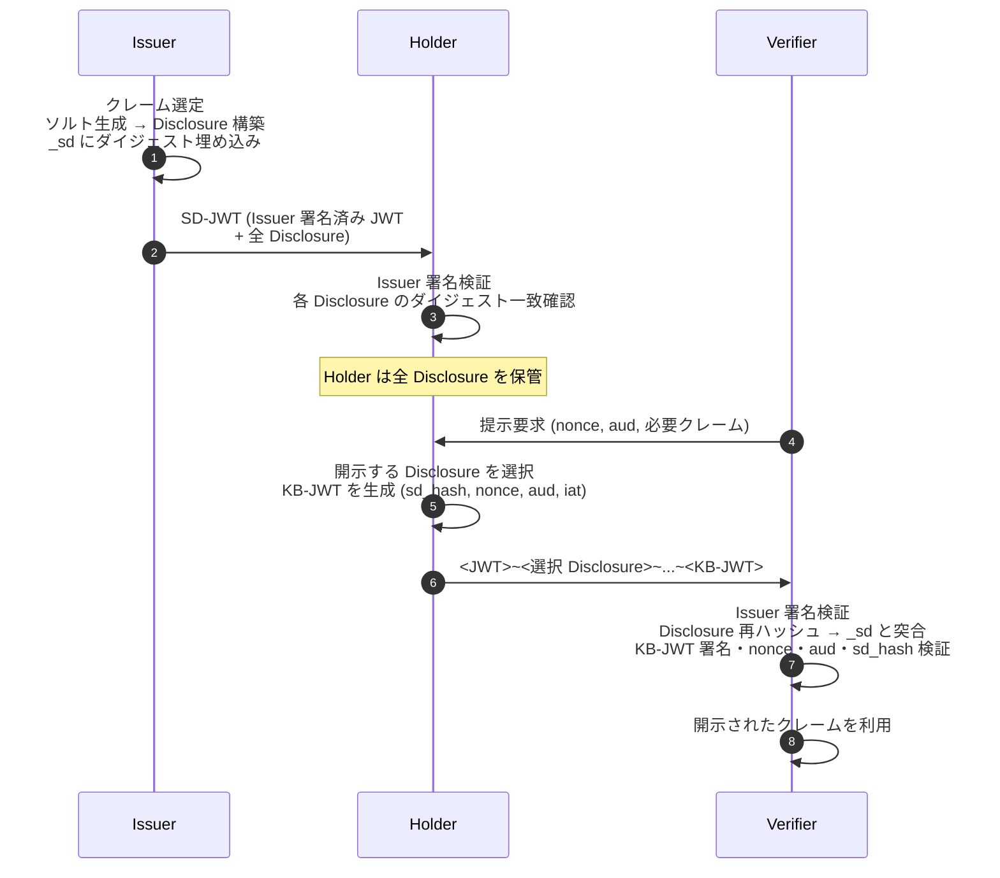
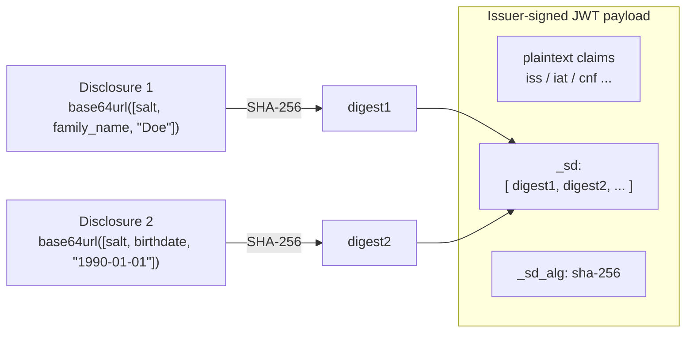
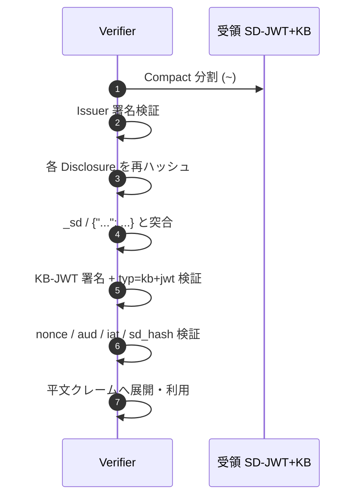

# RFC 9901 - Selective Disclosure for JWTs (SD-JWT)

## 1. 概要

RFC 9901 「Selective Disclosure for JWTs (SD-JWT)」 は、JSON Web Signature (JWS) のペイロードとして用いられる JSON データ構造に対し、個々の要素を選択的に開示できる仕組みを定義する Standards Track の仕様である。2025 年 11 月に IETF OAuth WG から発行された。

従来の JWT はペイロード全体が平文の JSON として配布されるため、受け取った Verifier は意図せず全クレームを観測できてしまう。SD-JWT は Issuer があらかじめ「選択的に開示し得るクレーム」をハッシュ化して JWT に埋め込み、対応する平文 (Disclosure) を別チャネル的に同梱することで、Holder が Verifier に対し必要なクレームのみを取捨選択して提示できるようにする。

SD-JWT は W3C Verifiable Credentials Data Model 2.0 と組み合わせる SD-JWT VC (draft-ietf-oauth-sd-jwt-vc) や、OpenID for Verifiable Credential Issuance / Presentation (OID4VCI / OID4VP) のクレデンシャル形式の中心的選択肢として参照されており、EUDI Wallet をはじめとするデジタル ID ウォレットの基盤仕様となっている。

## 2. 解決する課題

通常の JWT (RFC 7519) を ID クレデンシャルとして用いる場合、以下の課題がある。

- **過剰開示**: 年齢確認のためだけに身分証相当の JWT を提示すると、氏名・住所・生年月日など、確認に不要なクレームまで Verifier に渡る。
- **リンクアビリティ**: 同一 JWT を複数の Verifier に提示するとペイロードのハッシュなどから容易に名寄せできる。
- **改ざん耐性とのトレードオフ**: 一部クレームのみ削って提示すると Issuer の署名検証が破綻する。

SD-JWT は次の三点で課題を解く。

- Issuer がクレームを **ソルト付きハッシュ** として JWT に埋め込み、平文 (Disclosure) を別途配布する。
- Holder は **提示するクレームに対応する Disclosure のみ** を Verifier に渡し、不要な Disclosure を抑止する。
- Verifier は受け取った Disclosure を再ハッシュして JWT 内のダイジェストと突き合わせるため、署名検証と選択的開示が両立する。

加えて、Holder の鍵に紐付く Key Binding JWT (KB-JWT) を併用することで、第三者が Disclosure を横流ししても提示できないようにする。

## 3. 主要概念・用語

| 用語                     | 定義                                                                                               |
| ------------------------ | -------------------------------------------------------------------------------------------------- |
| Issuer                   | SD-JWT を生成し署名する主体                                                                        |
| Holder                   | SD-JWT と全 Disclosure を受領・保管し、Verifier に対し部分提示を行う主体                           |
| Verifier                 | SD-JWT (および KB-JWT) を検証し、開示されたクレームを利用する主体                                  |
| Disclosure               | `[salt, claim_name, claim_value]` または `[salt, value]` の JSON 配列を base64url 符号化した文字列 |
| SD-JWT                   | Issuer 署名済み JWT と 0 個以上の Disclosure を `~` で連結したもの                                 |
| SD-JWT+KB                | SD-JWT の末尾に Key Binding JWT を付したもの                                                       |
| Key Binding JWT (KB-JWT) | Holder の鍵で署名され、提示中の SD-JWT に `sd_hash` で結び付く JWT                                 |
| `_sd` クレーム           | 当該オブジェクト階層で選択開示可能な子プロパティのダイジェスト配列                                 |
| `_sd_alg` クレーム       | ダイジェスト計算に用いるハッシュアルゴリズム名 (省略時 `sha-256`)                                  |
| `...` (三点リーダー)     | 配列要素を選択開示するためのキー。`{"...": "<digest>"}` の形で配列内に置く                         |

## 4. SD-JWT 構造とフロー

### 4.1 直列化形式

SD-JWT の主たる直列化形式は **Compact Serialization** であり、チルダ `~` を区切り文字とする。

```
<Issuer-signed JWT>~<Disclosure 1>~<Disclosure 2>~...~<Disclosure N>~[<KB-JWT>]
```

- 末尾の `~` は常に存在する。KB-JWT がない場合は最後のセグメントが空文字列となる。
- SD-JWT+KB の場合は KB-JWT を末尾の `~` の後ろに置く (この時末尾 `~` の後にトークンが続く)。
- 各 Disclosure は base64url 文字列であり、復号すると `[salt, claim_name, claim_value]` などの JSON 配列が現れる。

JWS JSON Serialization 形式 (Flattened / General) も §8 で定義され、非保護ヘッダに `disclosures` 配列および `kb_jwt` を格納する。`sd_hash` 計算時は一時的に Compact Serialization に組み立て直す。

### 4.2 全体フロー



### 4.3 Disclosure と `_sd` の関係



## 5. 詳細解説

### 5.1 Disclosure の生成 (§4.2.1, §4.2.2)

オブジェクトプロパティ用 Disclosure は 3 要素配列 `[salt, claim_name, claim_value]` として生成する。

- `salt`: 暗号学的乱数。最低 128 bit のエントロピーが推奨される (§9.3)。クレームごとに必ず一意。
- `claim_name`: `_sd` および `...` は使用不可。当該オブジェクト内で平文クレームと衝突してはならない。
- `claim_value`: 任意の JSON 値 (文字列・数値・真偽値・オブジェクト・配列)。

配列要素用 Disclosure は `[salt, value]` の 2 要素配列とする。配列内での位置自体が同一性を担うため `claim_name` を持たない。

生成された JSON 配列を UTF-8 で直列化し base64url 符号化したものが Disclosure 文字列となる。

### 5.2 ダイジェスト計算 (§4.2.3)

Disclosure 文字列 (base64url 符号化済み文字列そのもの) を US-ASCII バイト列とみなし、`_sd_alg` で指定されたハッシュ関数を適用、得られたダイジェストを base64url 符号化する。

```
digest = base64url( HASH( ASCII( disclosure_string ) ) )
```

ここで重要なのは「base64url 復号した後のバイト列をハッシュするのではなく、base64url 文字列自体をハッシュする」点である。これにより Issuer と Verifier の間で正規化の揺れが生じない。

### 5.3 `_sd` クレームによる埋め込み (§4.2.4.1)

オブジェクトプロパティの Disclosure は、当該プロパティが本来属するオブジェクトに対して新設する `_sd` 配列にダイジェストを格納する。`_sd` 配列は順序が元のクレーム順を漏らさないようシャッフル (アルファベット順または乱順) する。`_sd` は階層のどのオブジェクトにも出現可能で、ネストしたオブジェクト内の選択開示も表現できる。

### 5.4 配列要素の選択開示 (§4.2.4.2)

配列要素を選択開示したい場合、対象位置に `{"...": "<digest>"}` というオブジェクトを置く。Verifier 側では Disclosure を再ハッシュしてダイジェストが一致した要素のみ平文 value に置換し、開示されなかった `{"...": ...}` 要素は最終クレームから取り除く。

### 5.5 `_sd_alg` (§4.1.1)

- 値は IANA「Named Information Hash Algorithm Registry」由来の大文字小文字を区別する文字列。
- 省略時は `sha-256` とみなされる。全実装は `sha-256` を必須サポート。
- ペイロードのトップレベルにのみ出現可能で、ネストしたオブジェクト内には置けない。
- 弱いハッシュ (例: `sha-1`) は §9.4 により禁止される。

### 5.6 デコイダイジェスト (§4.2.5)

選択開示可能なクレーム数を Verifier から隠蔽したい場合、Issuer は対応する Disclosure を持たないダミーダイジェスト (decoy) を `_sd` に混入できる。ダミーは暗号学的乱数のハッシュとし、実際のダイジェストと同じハッシュアルゴリズムで生成する。Holder は decoy に対応する Disclosure を持たないため、Verifier も区別不能となる。プライバシ強化のオプション機構である (§10.4)。

### 5.7 Key Binding JWT (§4.3)

Holder の鍵保有を Verifier に示すための JWT で、次のように構成する。

JOSE Header:

- `typ`: 必須。固定値 `kb+jwt` (RFC 8725 §3.11 の explicit typing)。
- `alg`: 必須。`none` は不可。

Payload:

- `iat`: 必須。KB-JWT 生成時刻 (RFC 7519 形式)。
- `aud`: 必須。意図する Verifier の識別子 (単一の文字列)。
- `nonce`: 必須。Verifier が要求したリクエスト固有のフレッシュネス値。
- `sd_hash`: 必須。提示する SD-JWT (`<JWT>~<Disclosure>~...~`) の base64url ハッシュ。末尾 `~` を含めた文字列に対して計算する。

Issuer 側 JWT のペイロードには Holder の公開鍵が `cnf` クレーム (RFC 7800) として埋め込まれ、Verifier はそこから取り出した鍵で KB-JWT の署名を検証する。

### 5.8 Issuer / Holder / Verifier の検証手順 (§7)

Holder が Issuer から受領した SD-JWT を検証する手順 (§7.2):

1. Issuer 署名済み JWT の署名を検証。
2. `_sd_alg` の値が許容範囲にあるか確認。
3. 受領した全 Disclosure を再ハッシュし、`_sd` あるいは `{"...": "<digest>"}` 中のダイジェストに一致するかを確認。
4. どのダイジェストにも紐付かない Disclosure が存在しないことを確認。
5. `exp` `nbf` などの時刻クレームを検証。

Holder が Verifier に提示する際 (§7.2):

1. 開示する Disclosure を選択し、不要なものを除外。
2. 選択した Disclosure それぞれが JWT もしくは他の選択 Disclosure と digest で連結することを確認 (孤立 Disclosure の混入防止)。
3. Compact Serialization を組み立て、必要なら KB-JWT を生成し付与。

Verifier の検証 (§7.3):

1. Key Binding を要求するか否かは Verifier ポリシーで決定する (KB-JWT が付いているかどうかで判断しない)。
2. Issuer 公開鍵で JWT 署名を検証。
3. Key Binding を要求する場合、`cnf` から Holder 公開鍵を取り出し、KB-JWT の署名・`typ=kb+jwt`・`iat` のフレッシュネス・`nonce`・`aud` を検証。
4. 受領した SD-JWT 部分から `sd_hash` を計算し、KB-JWT 内 `sd_hash` と一致するか確認。
5. 各 Disclosure のダイジェストを `_sd` / `{"...": ...}` と突き合わせて平文クレームに展開。
6. 展開後のクレームを通常の JWT クレーム検証規則に従って評価。



## 6. セキュリティに関する考慮事項

§9 および §10 で議論されている主な論点を抜粋する。

- **ソルトのエントロピー (§9.3)**: 各 Disclosure のソルトは独立した暗号学的乱数で、最低 128 bit。同じクレーム名であってもクレームごとに別のソルトを用い、辞書攻撃や名寄せを防ぐ。
- **クレーム名の衝突 (§9.3)**: `_sd` に含まれるダイジェストが復号後に既存平文クレームと同名の値を生成しないよう Issuer は注意する。Verifier は衝突検出時にエラーとする。
- **ハッシュアルゴリズム (§9.4)**: `_sd_alg` は preimage / second preimage 耐性を備えた現代的ハッシュに限る。`sha-256` 以上が必須。
- **Key Binding (§9.5)**: KB-JWT は Holder の鍵保有と提示意思を示す唯一の手段。Verifier は KB-JWT の有無で要否を判定せず、ポリシーで要求する。`nonce` と `aud` を確認することで、再生・他 Verifier への横流しを防ぐ。
- **`alg=none` 禁止 (§9.1)**: Issuer 署名済み JWT も KB-JWT も `none` アルゴリズムを用いてはならない。
- **未参照 Disclosure の検出 (§9.2)**: ダイジェストに対応しない Disclosure が紛れた場合、Issuer 由来でないクレームを Verifier が誤って受け入れる恐れがあるため、必ず拒否する。
- **デコイダイジェスト (§10.4)**: 選択開示可能なクレーム総数を秘匿しうるが、過剰な decoy はトークンサイズを増やすため利用は意図的に行う。
- **プライバシ (§10)**: Verifier 間でリンクアビリティを下げるには、Issuer がクレデンシャル発行を分割するか、バッチ発行で同一 Holder に複数 SD-JWT を渡し、提示先ごとに使い分ける運用が推奨される。SD-JWT 自体は完全なアンリンカビリティを保証しない。

## 7. 関連仕様

- [RFC 7515](./rfc7515) — JSON Web Signature: SD-JWT の Issuer 署名済み JWT および KB-JWT の基盤。
- [RFC 7519](./rfc7519) — JSON Web Token: クレーム表現と検証規則。
- [RFC 8725](./rfc8725) — JWT BCP: `typ` ヘッダによる explicit typing (`kb+jwt`) の根拠。
- RFC 7800 — `cnf` (Proof-of-Possession Key) クレーム: Holder 鍵の埋め込み。
- [W3C VC Data Model 2.0](./vc-data-model-2.0) — クレデンシャルモデル。SD-JWT VC はそのバインディング形式の一つ。
- draft-ietf-oauth-sd-jwt-vc — SD-JWT を VC 用途に特化させたメディアタイプ `application/sd-jwt-vc` のプロファイル。
- [OpenID for Verifiable Credential Issuance 1.0](./openid4vci) — SD-JWT VC の発行プロトコル。
- [OpenID for Verifiable Presentations 1.0](./openid4vp) — SD-JWT(+KB) を提示するプロトコル。
- IANA Named Information Hash Algorithm Registry — `_sd_alg` で使用するハッシュアルゴリズム名の登録簿 (RFC 6920)。

## 8. 参考文献

- [RFC 9901 — Selective Disclosure for JWTs (SD-JWT)](https://www.rfc-editor.org/rfc/rfc9901.html)
- [IETF Datatracker: draft-ietf-oauth-selective-disclosure-jwt](https://datatracker.ietf.org/doc/draft-ietf-oauth-selective-disclosure-jwt/)
- [RFC 8725 — JSON Web Token Best Current Practices](https://www.rfc-editor.org/rfc/rfc8725.html)
- [RFC 7800 — Proof-of-Possession Key Semantics for JWTs](https://www.rfc-editor.org/rfc/rfc7800.html)
- [RFC 6920 — Naming Things with Hashes (Named Information Hash Algorithm Registry)](https://www.rfc-editor.org/rfc/rfc6920.html)
