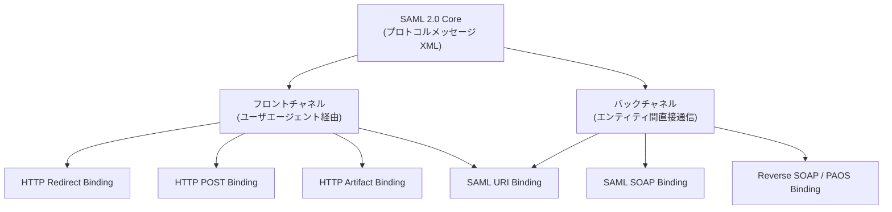
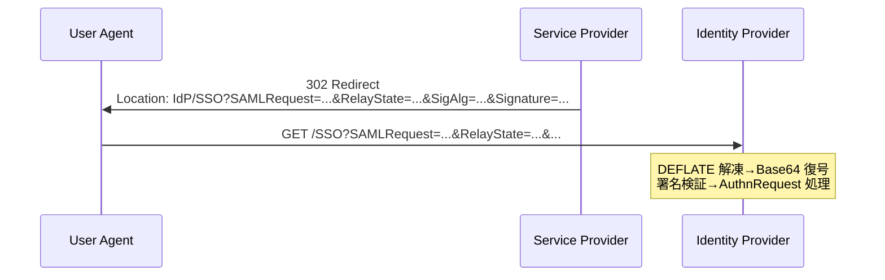
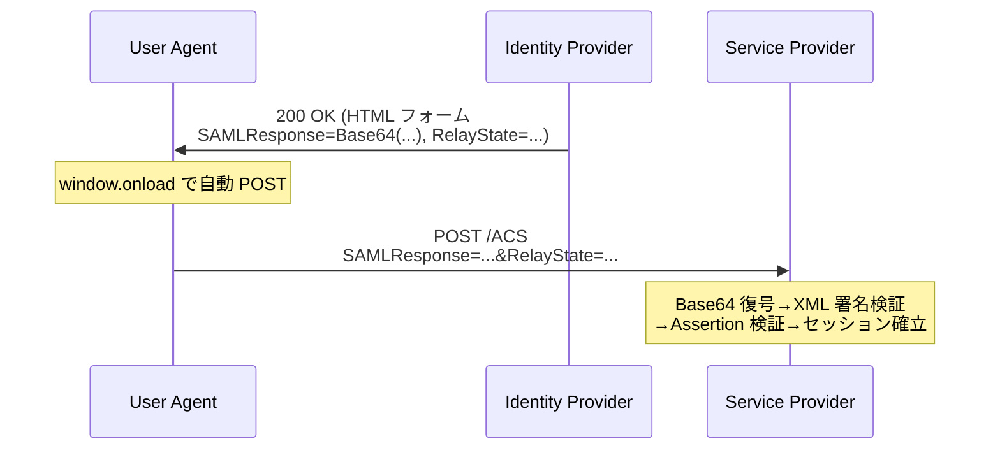
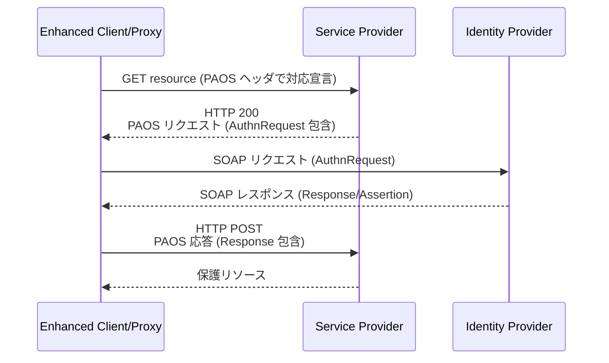

# SAML 2.0 Bindings - Bindings for the OASIS Security Assertion Markup Language

## 概要

**SAML 2.0 Bindings 仕様 (`saml-bindings-2.0-os`)** は、SAML 2.0 Core で定義されたプロトコルメッセージ (例えば `<AuthnRequest>` や `<Response>`) を、HTTP や SOAP といった具体的な下位プロトコル上でどのように運搬するかを規定する OASIS 標準である。2005 年 3 月に OASIS Standard として承認され、Core / Bindings / Profiles / Metadata から構成される SAML 2.0 仕様群の中で、**「メッセージの搬送経路 (transport)」** という関心事を独立した一冊として切り出している。

Bindings 仕様は単独で使うものではない。Core が定義した XML メッセージを Bindings がワイヤフォーマットに包み、その組み合わせを Web Browser SSO Profile などの Profiles 仕様が利用シナリオに応じて束ねる、という三層構造の中間層に位置する。本記事では、Bindings 仕様が定義する 6 つのバインディング (HTTP Redirect, HTTP POST, HTTP Artifact, SAML SOAP, Reverse SOAP/PAOS, SAML URI) を一次情報に沿って解説する。

## 解決する課題

SAML 2.0 Core は XML スキーマとしてメッセージ構造と意味論を厳密に定義するが、それを「どうやって相手に届けるか」は意図的に分離されている。これは以下の要請に応えるためである。

- 同一の `<AuthnRequest>` を、ブラウザ経由のフロントチャネルでも、サーバー間のバックチャネルでも再利用したい
- ブラウザがメッセージを中継する場合、HTTP リダイレクトとフォーム POST という二系統の素朴な仕組みを使い分けたい
- 大きな署名付きアサーションを URL に乗せられないケースに備えて、メッセージを「参照」だけ渡し本体は別経路で取りに行く手段が要る
- Web ブラウザだけでなく、SOAP クライアントや拡張クライアント (ECP) も SAML に参加できる

Bindings 仕様は、これら多様な搬送要件を 6 種類のバインディングとして整理し、それぞれにメッセージ符号化規則・必須パラメータ・セキュリティ要件を与えることで、相互運用可能な実装を可能にする。

## バインディング全体像



各バインディングは、Core が定義した抽象メッセージに対して以下を規定する。

- メッセージのシリアライズ方法 (生 XML、Base64、DEFLATE 圧縮、URL エンコード等)
- 運搬チャネル (HTTP GET / HTTP POST / SOAP / 任意の URI スキーム)
- 必須・任意の付随パラメータ (`RelayState`、`SigAlg`、`Signature`、`SAMLart` 等)
- 署名・機密性に関する要件と注意点
- エラー応答方法

## 主要概念・用語

### フロントチャネルとバックチャネル

- **フロントチャネル**: メッセージがエンドユーザのブラウザ (User Agent) を経由して中継される経路。リクエスタとレスポンダは直接通信せず、ブラウザがリダイレクトやフォーム送信でメッセージを運ぶ。HTTP Redirect / HTTP POST / HTTP Artifact が該当する。
- **バックチャネル**: SAML エンティティ同士が SOAP/HTTP で直接通信する経路。SAML SOAP Binding がこれに該当する。HTTP Artifact Binding はフロントとバックの両方を併用する。

### RelayState

`RelayState` は SAML プロトコルメッセージとは独立して伝搬される短い不透明トークンである。要求者がレスポンダにメッセージを送るときに `RelayState` を付与すると、レスポンダはそれを応答メッセージに同じ値で添付して返す。これにより、要求者は応答受信時に「どの初期コンテキストから始まったやり取りか」を復元できる (例: SP がユーザの元の遷移先 URL を保持する用途)。

`RelayState` の長さは **80 バイト以下** に制限される。値が大きい場合は、SP 側でセッションに保存し、識別子だけを `RelayState` として渡す方式が推奨される。`RelayState` には機密情報を含めるべきではなく、また改竄から保護する必要がある場合は整合性確保の仕組みを別途用意する必要がある。

### SAML Artifact

Artifact は「メッセージ本体を別途取得するための参照」である。フロントチャネルの帯域制約 (URL 長など) を回避し、かつメッセージ本体をバックチャネル経由で授受したい場合に用いる。フォーマットは Type Code (2 バイト) で識別される拡張可能な構造で、SAML 2.0 が標準で定義するのは Type Code `0x0004` の 44 バイトアーティファクトである。

| フィールド      | 長さ      | 内容                                                    |
| --------------- | --------- | ------------------------------------------------------- |
| `TypeCode`      | 2 バイト  | `0x0004` (SAML 2.0 標準アーティファクト)                |
| `EndpointIndex` | 2 バイト  | 発行側の Artifact Resolution Service エンドポイント番号 |
| `SourceID`      | 20 バイト | 発行者の EntityID の SHA-1 ハッシュ                     |
| `MessageHandle` | 20 バイト | 暗号学的に安全な乱数で生成されたメッセージ識別子        |

受信側は `SourceID` から発行者を特定し、`EndpointIndex` でアーティファクト解決エンドポイントを選び、SOAP で `<ArtifactResolve>` を投げて元のメッセージを取得する。

## HTTP Redirect Binding

### 用途と特性

`urn:oasis:names:tc:SAML:2.0:bindings:HTTP-Redirect` で識別される。HTTP GET のクエリ文字列にメッセージを載せる、最も軽量なフロントチャネルバインディングである。比較的小さなメッセージ (典型的には `<AuthnRequest>` や `<LogoutRequest>`) に適する。URL 長制限により、大きな署名付き応答の搬送には適さない。

### メッセージ符号化

メッセージは以下の順で変換され、`SAMLRequest` または `SAMLResponse` クエリパラメータに格納される。

1. XML をシリアライズ
2. **DEFLATE 圧縮** ([RFC 1951](https://www.rfc-editor.org/rfc/rfc1951)。zlib ヘッダ・チェックサム無し)
3. **Base64 エンコード** ([RFC 4648](https://www.rfc-editor.org/rfc/rfc4648))
4. **URL エンコード**

`RelayState` も同じ HTTP 要求のクエリパラメータとして付加される。

### 署名

メッセージ署名が必要な場合、**XML Signature を XML 内に埋め込むのではなく**、クエリパラメータとして外部署名する方式を採る。これは XML を圧縮・再シリアライズする過程でカノニカライゼーション結果が崩れることを避けるためである。署名は次のクエリパラメータで運ばれる。

| パラメータ  | 内容                                                                           |
| ----------- | ------------------------------------------------------------------------------ |
| `SigAlg`    | 署名アルゴリズム URI (例: `http://www.w3.org/2001/04/xmldsig-more#rsa-sha256`) |
| `Signature` | 署名値の Base64 表現                                                           |

署名対象文字列は、`SAMLRequest=...&RelayState=...&SigAlg=...` (送出するメッセージに応じて `SAMLRequest` か `SAMLResponse` のいずれか) を URL エンコードした上で連結したものである。受信側は同じ規則で署名対象文字列を再構築し検証する。



## HTTP POST Binding

### 用途と特性

`urn:oasis:names:tc:SAML:2.0:bindings:HTTP-POST` で識別される。フロントチャネルで `<AuthnRequest>` や `<Response>` などの大きなメッセージを運ぶ標準的な手段で、Web Browser SSO Profile の応答経路として最も広く実装されている。

### メッセージ符号化

XML を **Base64 エンコード** し (DEFLATE 圧縮は適用しない)、HTML フォームの隠しフィールド `SAMLRequest` または `SAMLResponse` の値とする。`RelayState` も同様に隠しフィールドで添付する。フォームは自動 POST する XHTML として配信される。

```html
<form method="POST" action="https://idp.example.com/SSO">
  <input type="hidden" name="SAMLRequest" value="PHNhbWxw..." />
  <input type="hidden" name="RelayState" value="token123" />
  <noscript><button type="submit">Continue</button></noscript>
</form>
<script>
  window.onload = function () {
    document.forms[0].submit();
  };
</script>
```

### 署名

HTTP POST Binding ではメッセージ署名は **XML Signature を XML 内に埋め込む** 方式 (`<ds:Signature>` 要素を Core 仕様で定められた位置に挿入) を採る。HTTP Redirect Binding と異なり、クエリパラメータ署名は使用しない。



## HTTP Artifact Binding

### 用途と特性

`urn:oasis:names:tc:SAML:2.0:bindings:HTTP-Artifact` で識別される。フロントチャネルではメッセージ本体ではなく **アーティファクト (短い参照)** だけを送り、受信側がバックチャネル SOAP で本体を取得する。これにより、URL 長制限の回避、メッセージ本体のブラウザ非経由化 (機密性向上)、署名検証コストの集約などが実現できる。

### 送信

アーティファクトは Base64 エンコードされ、HTTP GET のクエリパラメータ `SAMLart` または HTTP POST フォームの隠しフィールド `SAMLart` で送られる。`RelayState` も同様に付随できる。

### 解決

受信側 (アーティファクト受領者) は、`SAMLart` の `SourceID` から発行者を特定 (通常はメタデータと照合) し、その発行者の **Artifact Resolution Service** に対して `<samlp:ArtifactResolve>` を SAML SOAP Binding で送る。発行者は対応するメッセージを `<samlp:ArtifactResponse>` に包んで返す。`ArtifactResolve` / `ArtifactResponse` は通常 (相互) クライアント認証付き TLS で保護される。

```mermaid
sequenceDiagram
    participant UA as User Agent
    participant IdP as Identity Provider
    participant SP as Service Provider
    IdP->>UA: 302 Redirect / 200 POST フォーム<br/>SAMLart=...&RelayState=...
    UA->>SP: GET /ACS?SAMLart=...
    Note over SP: SourceID から IdP を特定
    SP->>IdP: POST /ArtifactResolution<br/>SOAP &lt;ArtifactResolve&gt;
    IdP-->>SP: SOAP &lt;ArtifactResponse&gt;<br/>本来の &lt;Response&gt; を内包
    Note over SP: Assertion を検証してセッション確立
```

アーティファクトは **一度しか解決できない** ことが推奨される。`MessageHandle` の乱数性とともに、リプレイ攻撃に対する基本的な防御を構成する。

## SAML SOAP Binding

### 用途と特性

`urn:oasis:names:tc:SAML:2.0:bindings:SOAP` で識別される。SAML メッセージを SOAP 1.1 エンベロープの `<SOAP-ENV:Body>` に直接埋め込んでバックチャネルで授受する。Artifact Resolution、Attribute Query、Authentication Query、Assertion ID Request など、エンティティ間で同期的に行うほぼ全てのプロトコル交換で利用される。

### メッセージ形式

```xml
<SOAP-ENV:Envelope xmlns:SOAP-ENV="http://schemas.xmlsoap.org/soap/envelope/">
  <SOAP-ENV:Body>
    <samlp:ArtifactResolve ...>
      ...
    </samlp:ArtifactResolve>
  </SOAP-ENV:Body>
</SOAP-ENV:Envelope>
```

- HTTP POST で運ばれる場合、`Content-Type: text/xml` と `SOAPAction` ヘッダが付く (`SOAPAction` の値は空文字でよい)
- SAML プロトコルメッセージは SOAP ヘッダではなく Body の直下に置く
- メッセージレベルの認証・機密性・完全性は XML Signature / XML Encryption もしくは TLS (相互認証含む) で担保する

## Reverse SOAP (PAOS) Binding

### 用途と特性

`urn:oasis:names:tc:SAML:2.0:bindings:PAOS` で識別される。**PAOS は "SOAP" を逆に綴った造語**で、通常の SOAP とは要求/応答の役割が反転する。HTTP クライアント (User Agent) が HTTP の応答として SOAP リクエストを受け取り、後続の HTTP 要求のボディに SOAP 応答を載せて返すモデルを採る。

このバインディングは **Enhanced Client or Proxy (ECP) Profile** の中核として設計されている。ECP は通常のブラウザでは扱いきれない高度な認証 (証明書認証、Kerberos など) や、企業内プロキシ環境で IdP を中継するシナリオを想定したクライアントである。

### フロー概略



ECP プロファイルでは、ECP が SP と IdP の両方と直接やり取りすることで、ブラウザのリダイレクト連鎖を介さずに SSO を完結できる。ヘッダには `PAOS` HTTP 拡張 (`PAOS: ver="urn:liberty:paos:2003-08"; ...` 等) を用いる。

## SAML URI Binding

### 用途と特性

`urn:oasis:names:tc:SAML:2.0:bindings:URI` で識別される。リクエスト/レスポンスを HTTP メッセージとして交換するのではなく、**SAML アサーション (または関連リソース) を URI で参照する** ことに特化したバインディングである。具体的には、HTTP/HTTPS の URL から `<samlp:AssertionIDRequest>` 相当のセマンティクスで `<Assertion>` を取得する。

### 取得モデル

クライアントは事前共有の URL に対して HTTP GET を行い、サーバは要求されたアサーションを XML ボディとして返す。アクセス制御は HTTP の認証機構 (Basic / mTLS など) と URL に埋め込まれた識別子の機密性に依存する。実装上の利用は限定的だが、レガシーシステムから単一のアサーションを URL で取り回したいシナリオで用いられる。

## バインディングの比較

| バインディング    | チャネル          | 主用途                                              | 符号化                                | 署名方式                          |
| ----------------- | ----------------- | --------------------------------------------------- | ------------------------------------- | --------------------------------- |
| HTTP Redirect     | フロント (GET)    | 小さな要求 (`AuthnRequest`, `LogoutRequest`)        | DEFLATE → Base64 → URL                | クエリ署名 (`SigAlg`/`Signature`) |
| HTTP POST         | フロント (POST)   | 大きな応答 (`Response`, `LogoutResponse`)           | Base64 (隠しフィールド)               | XML Signature 埋め込み            |
| HTTP Artifact     | フロント + バック | 機密性重視・大型メッセージ                          | 44 バイトアーティファクト + SOAP 解決 | XML Signature (本体側)            |
| SAML SOAP         | バック            | Attribute Query, Artifact Resolution, ID Request 等 | SOAP 1.1 Envelope                     | XML Signature / TLS               |
| Reverse SOAP/PAOS | バック (反転)     | ECP プロファイル (拡張クライアント)                 | SOAP 1.1 Envelope + PAOS ヘッダ       | XML Signature / TLS               |
| SAML URI          | -                 | アサーションの URL 参照                             | HTTP GET レスポンスの XML             | XML Signature                     |

## Profile との関係

各 Profile は、要求と応答にどのバインディングを使うかを規定する。例えば Web Browser SSO Profile では、よくある組み合わせとして以下が見られる。

- **SP→IdP**: HTTP Redirect で `<AuthnRequest>` を送る (リクエストが小さいため)
- **IdP→SP**: HTTP POST で `<Response>` を返す (署名付きアサーション本体が大きいため)
- 機密性が特に重要な配置では **両方向ともに Artifact** を採用し、メッセージ本体がブラウザを通らないようにする

Single Logout Profile では、フロントチャネルでログアウト要求/応答を連鎖させる場合は HTTP Redirect/POST を、バックチャネルで一括で送る場合は SAML SOAP を選択する。

## セキュリティに関する考慮事項

Bindings 仕様の付録 (Security and Privacy Considerations) は、すべてのバインディングに共通する要請として以下を強調する。

### 通信路の保護

- フロントチャネルでは原則として TLS を用い、メッセージ本体の盗聴や RelayState の改竄を防ぐ
- バックチャネル (SOAP / Artifact Resolution) では相互 TLS 認証を強く推奨し、`SOAPAction` の偽装やリプレイを抑止する

### メッセージ署名と完全性

- HTTP Redirect Binding ではクエリ署名のみが利用可能。URL に含まれない値 (例えば `RelayState` の改竄) は別途検出する仕組みが必要
- HTTP POST Binding では XML Signature が標準的な選択肢で、署名対象範囲 (Reference URI) を明示し、`<ds:KeyInfo>` 経由の鍵差し替え攻撃を考慮した検証が必要

### リプレイ攻撃と一意性

- `<samlp:Response>` の `ID` 属性、`<Assertion>` の `IssueInstant`、`Conditions/NotOnOrAfter`、`SubjectConfirmationData/NotOnOrAfter` を組み合わせて、応答のリプレイを防ぐ
- アーティファクトは MessageHandle の十分なエントロピーと「一度しか解決できない」運用で再利用を阻止する

### RelayState の取り扱い

- 80 バイト制限を守る
- 改竄が問題になる場合は、セッションサイドに状態を保持し RelayState には識別子のみ載せる
- 認証完了前の段階で `RelayState` だけで認可判断を行わない (検証された Assertion を信頼の基点とする)

### 機密情報の URL 経由送出

- HTTP Redirect では URL がブラウザ履歴・プロキシログ・Referer ヘッダ等に残る可能性があるため、機密情報を含むメッセージはこのバインディングを避ける
- 機密性が必要な応答は HTTP POST もしくは HTTP Artifact を選択する

## 関連仕様

- [SAML 2.0 Core](./saml-core-2.0): アサーション構造とプロトコルメッセージの定義
- [RFC 1951 - DEFLATE Compressed Data Format](https://www.rfc-editor.org/rfc/rfc1951): HTTP Redirect Binding の圧縮形式
- [RFC 4648 - Base64](https://www.rfc-editor.org/rfc/rfc4648): 各バインディングでの Base64 エンコーディング
- [XML Signature](https://www.w3.org/TR/xmldsig-core/): HTTP POST / SOAP / Artifact での署名
- [XML Encryption](https://www.w3.org/TR/xmlenc-core/): Assertion / NameID の暗号化
- SAML 2.0 Profiles (Web Browser SSO / Single Logout / ECP 等): Bindings と Core の利用シナリオ
- SAML 2.0 Metadata: 各エンドポイント (SSO / SLO / Artifact Resolution / Attribute / ECP) の所在表現

## 参考文献

- [Bindings for the OASIS Security Assertion Markup Language (SAML) V2.0 (OASIS Standard, 2005)](https://docs.oasis-open.org/security/saml/v2.0/saml-bindings-2.0-os.pdf)
- [SAML 2.0 Technical Overview](https://docs.oasis-open.org/security/saml/Post2.0/sstc-saml-tech-overview-2.0.html)
- [Profiles for the OASIS Security Assertion Markup Language (SAML) V2.0](https://docs.oasis-open.org/security/saml/v2.0/saml-profiles-2.0-os.pdf)
- [Security and Privacy Considerations for the OASIS SAML V2.0 Specification](https://docs.oasis-open.org/security/saml/v2.0/saml-sec-consider-2.0-os.pdf)
