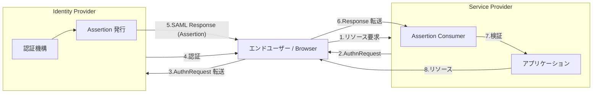
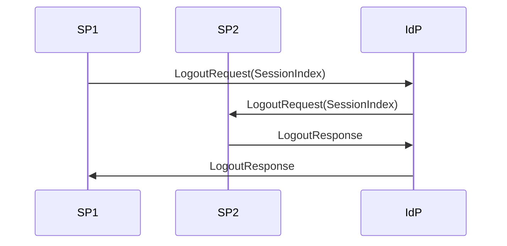
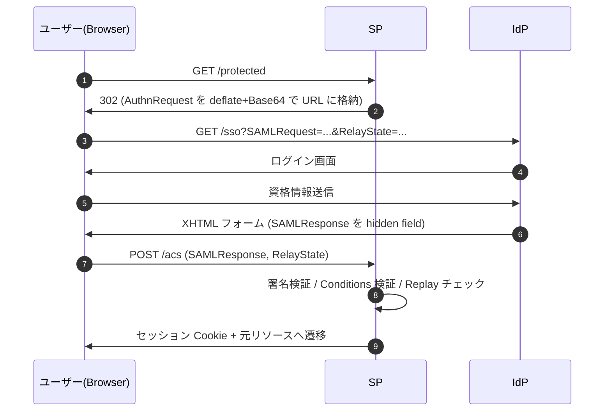

# SAML 2.0 Core - Assertions and Protocols for the OASIS Security Assertion Markup Language

## 概要

**SAML（Security Assertion Markup Language）2.0** は、認証情報・属性情報・認可決定情報を表す XML ベースのアサーション形式と、それを当事者間で交換するためのプロトコルを定めた OASIS 標準である。2005 年 3 月に OASIS Standard として承認された SAML V2.0 は、エンタープライズ領域における Web シングルサインオン (SSO) と属性連携の事実上の基盤となっており、現在でも OpenID Connect と並んでフェデレーションプロトコルの二大潮流の一翼を担っている。

SAML 2.0 仕様は複数のドキュメントから構成されるが、その中核となるのが本記事で扱う **Core 仕様 (`saml-core-2.0-os`)** である。Core 仕様はアサーションの構造と、それを要求・応答するプロトコルメッセージの XML スキーマと処理規則を定義する。実際の HTTP/SOAP 上での運搬方法は Bindings 仕様で、特定のユースケース（Web Browser SSO 等）の組み合わせ手順は Profiles 仕様で別途規定される。

## 解決する課題

Web の普及に伴い、組織は多数の Web アプリケーションをユーザーに提供するようになった。各アプリケーションが個別に認証を行うと以下の問題が生じる。

- ユーザーはアプリごとに認証情報を管理する必要があり、ユーザビリティとセキュリティの両面で課題がある
- 組織内の認証ポリシーやアイデンティティ管理を一元化できない
- 組織間でユーザー情報を安全に連携する標準的な手段がない

SAML 2.0 は、信頼関係を結んだ **Identity Provider (IdP)** と **Service Provider (SP)** の間で、ユーザーの認証結果と属性をデジタル署名付きの XML アサーションとして交換する枠組みを提供することで、これらの課題に対処する。SAML 1.1 や Shibboleth、Liberty Alliance ID-FF 1.2 を統合・拡張する形で策定された。

## 主要概念・用語

### エンティティ

- **アサーション主体 (Asserting Party / Identity Provider)**: アサーションを発行する側
- **依拠主体 (Relying Party / Service Provider)**: アサーションを消費して認可判断を行う側
- **Subject (主体)**: アサーションが言及する対象（通常はエンドユーザー）

### 仕様の階層構造

SAML 2.0 は仕様の関心事を 4 つの層に分離している。

| 層        | 役割                                                       | 主な仕様ドキュメント                       |
| --------- | ---------------------------------------------------------- | ------------------------------------------ |
| Assertion | 認証・属性・認可決定を表現する XML 構造                    | Core                                       |
| Protocol  | アサーションを要求・応答するメッセージ                     | Core                                       |
| Binding   | プロトコルメッセージを HTTP・SOAP 等にマッピングする方法   | Bindings                                   |
| Profile   | 特定ユースケースで Assertion/Protocol/Binding を組み合わせ | Profiles, Authentication Context, Metadata |

この分離により、同じアサーション構造を Web ブラウザ経由・SOAP API 経由など複数の搬送経路で再利用できる。

## アーキテクチャ概観



SAML 2.0 では、IdP と SP は事前に **メタデータ** を交換して相互の信頼関係 (公開鍵、エンドポイント、サポートするバインディング、NameID 形式等) を確立する。ランタイムにはユーザーエージェント (ブラウザ等) を介してプロトコルメッセージが流れる。

## Assertion の構造

`<saml:Assertion>` 要素は SAML の中核データ構造であり、以下の主要な子要素を持つ。

```xml
<saml:Assertion
    xmlns:saml="urn:oasis:names:tc:SAML:2.0:assertion"
    Version="2.0"
    ID="..."
    IssueInstant="2026-05-24T10:00:00Z">
  <saml:Issuer>https://idp.example.com</saml:Issuer>
  <ds:Signature>...</ds:Signature>
  <saml:Subject>...</saml:Subject>
  <saml:Conditions NotBefore="..." NotOnOrAfter="...">...</saml:Conditions>
  <saml:AuthnStatement>...</saml:AuthnStatement>
  <saml:AttributeStatement>...</saml:AttributeStatement>
</saml:Assertion>
```

### Issuer

アサーションの発行者を識別する。通常 IdP のエンティティ ID (URI) が入る。

### Signature

XML 署名 (W3C XML Signature) によりアサーション全体の完全性と発行者を保証する。`<saml:Assertion>` 自身に対する enveloped signature として配置される。Response 自体への署名と、Assertion への署名は別物であり、プロファイルによって要求されるものが異なる。

### Subject

アサーションが対象とする主体を表す。

```xml
<saml:Subject>
  <saml:NameID Format="urn:oasis:names:tc:SAML:2.0:nameid-format:persistent">
    abc123...
  </saml:NameID>
  <saml:SubjectConfirmation Method="urn:oasis:names:tc:SAML:2.0:cm:bearer">
    <saml:SubjectConfirmationData
        NotOnOrAfter="..."
        Recipient="https://sp.example.com/acs"
        InResponseTo="..."/>
  </saml:SubjectConfirmation>
</saml:Subject>
```

#### NameID Format

主体の識別子の形式を示す。代表的なものに以下がある。

- `urn:oasis:names:tc:SAML:1.1:nameid-format:emailAddress`
- `urn:oasis:names:tc:SAML:1.1:nameid-format:unspecified`
- `urn:oasis:names:tc:SAML:2.0:nameid-format:persistent` — IdP/SP ペアに対して永続的だが他 SP からは相関不能なオパーク識別子
- `urn:oasis:names:tc:SAML:2.0:nameid-format:transient` — セッション限りの一時識別子。プライバシー保護に有効
- `urn:oasis:names:tc:SAML:2.0:nameid-format:entity` — エンティティ ID 形式

#### SubjectConfirmation Method

依拠主体がアサーションの提示者と Subject の対応をどう確認するかを示す。

- `urn:oasis:names:tc:SAML:2.0:cm:bearer` — 提示すること自体を以て確認とみなす。Web Browser SSO で広く用いられる
- `urn:oasis:names:tc:SAML:2.0:cm:holder-of-key` — Subject が証明鍵を保持していることを暗号的に証明する
- `urn:oasis:names:tc:SAML:2.0:cm:sender-vouches` — アサーションを送信する第三者が Subject を代弁する

### Conditions

アサーションが有効と見なされる条件を表す。

| 条件                  | 意味                                                                     |
| --------------------- | ------------------------------------------------------------------------ |
| `NotBefore`           | この時刻以前にアサーションを処理してはならない                           |
| `NotOnOrAfter`        | この時刻以降にアサーションを処理してはならない                           |
| `AudienceRestriction` | 列挙された Audience (通常 SP のエンティティ ID) 以外で使用してはならない |
| `OneTimeUse`          | 一度だけ使用可能。依拠主体はリプレイ防止のキャッシュを保持する           |
| `ProxyRestriction`    | アサーションをさらに別の主体に転送する際の制限 (Count, Audience)         |

### Statement

アサーションが運ぶ「主張」の本体。3 種類が定義される。

- **AuthnStatement**: Subject が認証された事実、時刻 (`AuthnInstant`)、セッションインデックス (`SessionIndex`)、認証コンテキスト (`AuthnContextClassRef`)
- **AttributeStatement**: 任意の名前付き属性の集合
- **AuthzDecisionStatement**: 特定リソースに対する認可判断 (Permit/Deny/Indeterminate) — Core で定義されるが利用は限定的で、後継として XACML が推奨される

#### Authentication Context

`AuthnContextClassRef` は、IdP がどのような方法で Subject を認証したかを URI で示す。標準クラスは別仕様 (Authentication Context) で定義され、例として以下がある。

- `urn:oasis:names:tc:SAML:2.0:ac:classes:Password`
- `urn:oasis:names:tc:SAML:2.0:ac:classes:PasswordProtectedTransport`
- `urn:oasis:names:tc:SAML:2.0:ac:classes:Kerberos`
- `urn:oasis:names:tc:SAML:2.0:ac:classes:X509`
- `urn:oasis:names:tc:SAML:2.0:ac:classes:Smartcard`
- `urn:oasis:names:tc:SAML:2.0:ac:classes:MobileTwoFactorContract`
- `urn:oasis:names:tc:SAML:2.0:ac:classes:TimeSyncToken`

SP は AuthnRequest で `RequestedAuthnContext` を指定し、要求する保証レベルを伝達できる。

## プロトコル

Core 仕様は以下のリクエスト／レスポンス対を定義する。すべて `<samlp:RequestAbstractType>` および `<samlp:StatusResponseType>` を基底とする。

| 要求                   | 応答                    | 用途                                                  |
| ---------------------- | ----------------------- | ----------------------------------------------------- |
| `AuthnRequest`         | `Response`              | 認証要求 → 認証 Assertion の発行                      |
| `AssertionIDRequest`   | `Response`              | アサーション ID を指定して取得                        |
| `AttributeQuery`       | `Response`              | Subject の属性を問い合わせる                          |
| `AuthzDecisionQuery`   | `Response`              | 認可判断を問い合わせる                                |
| `ArtifactResolve`      | `ArtifactResponse`      | アーティファクトを実アサーション/メッセージに解決する |
| `ManageNameIDRequest`  | `ManageNameIDResponse`  | NameID の変更・終了                                   |
| `LogoutRequest`        | `LogoutResponse`        | Single Logout                                         |
| `NameIDMappingRequest` | `NameIDMappingResponse` | 別の NameID 形式へのマッピング                        |

### AuthnRequest と Response

最も中心的なメッセージ対。

```xml
<samlp:AuthnRequest
    xmlns:samlp="urn:oasis:names:tc:SAML:2.0:protocol"
    ID="..." Version="2.0" IssueInstant="..."
    Destination="https://idp.example.com/sso"
    AssertionConsumerServiceURL="https://sp.example.com/acs"
    ProtocolBinding="urn:oasis:names:tc:SAML:2.0:bindings:HTTP-POST">
  <saml:Issuer>https://sp.example.com</saml:Issuer>
  <samlp:NameIDPolicy
      Format="urn:oasis:names:tc:SAML:2.0:nameid-format:persistent"
      AllowCreate="true"/>
  <samlp:RequestedAuthnContext Comparison="exact">
    <saml:AuthnContextClassRef>
      urn:oasis:names:tc:SAML:2.0:ac:classes:PasswordProtectedTransport
    </saml:AuthnContextClassRef>
  </samlp:RequestedAuthnContext>
</samlp:AuthnRequest>
```

主要な属性・要素:

- `ForceAuthn`: 既存セッションがあっても再認証を強制
- `IsPassive`: ユーザーインタラクション無しでの認証を要求
- `AssertionConsumerServiceURL` / `ProtocolBinding`: 応答の戻り先 (メタデータで事前登録された値と一致する必要あり)
- `NameIDPolicy`: 要求する NameID 形式
- `RequestedAuthnContext`: 要求する認証コンテキスト

`Response` は `Status` 要素と 0 個以上の `Assertion` を含む。`InResponseTo` 属性で対応する `AuthnRequest` の `ID` を参照する。

### Status コード

`<samlp:Status>` は階層的なコードでエラー詳細を表現する。トップレベルは以下のいずれか。

- `urn:oasis:names:tc:SAML:2.0:status:Success`
- `urn:oasis:names:tc:SAML:2.0:status:Requester` — 要求側の不備
- `urn:oasis:names:tc:SAML:2.0:status:Responder` — 応答側の不備
- `urn:oasis:names:tc:SAML:2.0:status:VersionMismatch` — バージョン不一致

第二階層のサブステータスとして `AuthnFailed`, `InvalidAttrNameOrValue`, `InvalidNameIDPolicy`, `NoAuthnContext`, `NoAvailableIDP`, `NoPassive`, `NoSupportedIDP`, `PartialLogout`, `ProxyCountExceeded`, `RequestDenied`, `RequestUnsupported`, `RequestVersionDeprecated`, `RequestVersionTooHigh`, `RequestVersionTooLow`, `ResourceNotRecognized`, `TooManyResponses`, `UnknownAttrProfile`, `UnknownPrincipal`, `UnsupportedBinding` などが定義される。

### Single Logout

SAML 2.0 で新たに導入された機能。ユーザーがあるセッションでログアウト操作を行ったとき、関連する全ての SP セッションを終了させる。



`LogoutRequest` は `SessionIndex` と `NameID` を含み、各 SP は対応するセッションを終了する。すべての SP からの応答が `Success` でない場合、IdP は `PartialLogout` を返すことができる。

### Artifact

メッセージ自体の代わりに短い参照 (Artifact) を渡し、受信側がそれを Artifact Resolution Profile (SOAP バックチャネル) で実メッセージに解決する仕組み。ブラウザ経由で大きな署名済み XML を露出させずに済み、URL 長制限を回避できる。

## Web Browser SSO Profile（代表的なフロー）

Core 単独ではなく、Bindings と Profiles を組み合わせて使用される代表例として SP-initiated Web Browser SSO (HTTP Redirect + HTTP POST) のフローを示す。



`RelayState` は SP が初期 URL や状態を IdP 経由で持ち回るための不透明な値である。

## Bindings の主な種類

| Binding             | 概要                                                                    | 主用途                                |
| ------------------- | ----------------------------------------------------------------------- | ------------------------------------- |
| HTTP Redirect       | メッセージを deflate+Base64+URL encode してクエリに格納。署名は別途付加 | 短い AuthnRequest, LogoutRequest      |
| HTTP POST           | HTML フォーム自動 POST で Base64 メッセージを送信                       | Response (大きく署名付き)             |
| HTTP Artifact       | 短い Artifact を渡し、受信側が SOAP で本体を取得                        | ブラウザに XML を露出させたくない場合 |
| SAML SOAP           | SOAP 1.1 メッセージとして直接交換                                       | バックチャネル (属性問い合わせ等)     |
| Reverse SOAP (PAOS) | SOAP リクエストを HTTP レスポンスで送る                                 | ECP (Enhanced Client or Proxy)        |
| SAML URI            | URI で参照されたアサーションを取得                                      | アサーション取得                      |

## 主な Profile

- **Web Browser SSO Profile**: 上記の SP-initiated / IdP-initiated SSO
- **Enhanced Client or Proxy (ECP) Profile**: ブラウザ以外のリッチクライアント（メールクライアント等）向け
- **Single Logout Profile**: バックチャネル/フロントチャネルでの全体ログアウト
- **Artifact Resolution Profile**: アーティファクト解決
- **Name Identifier Management Profile**: NameID の変更・終了の通知
- **Name Identifier Mapping Profile**: 別 SP 向けの NameID への変換
- **Assertion Query/Request Profile**: 属性問い合わせ等

## セキュリティに関する考慮事項

SAML 2.0 はメッセージ XML 自体に署名・暗号化を施せる強力な仕組みを持つが、誤った実装は深刻な脆弱性につながる。Core 仕様および Security and Privacy Considerations 仕様に基づき、依拠主体が守るべき主な点を整理する。

### 署名検証

- `<saml:Assertion>` への署名と `<samlp:Response>` への署名は別物であり、プロファイルが要求するものを必ず検証する
- メタデータで事前登録された IdP の公開鍵のみを信頼する（KeyInfo の内容を盲信しない）
- XML Signature の **wrapping attack** (署名対象でない箇所に偽 Assertion を挿入する) は古典的な脆弱性であり、署名対象 ID と参照の整合性を厳格に検証する

### Replay 防止

- `Response` の `InResponseTo` を、送信した `AuthnRequest` の ID と突き合わせる
- `Assertion` の ID をキャッシュし、同一 ID の二重消費を拒否する
- `Conditions/@NotOnOrAfter` と `SubjectConfirmationData/@NotOnOrAfter` を厳密に検査する
- 時刻同期 (NTP 等) を維持する

### Audience と Recipient の検証

- `AudienceRestriction` に自エンティティ ID が含まれることを検証
- `SubjectConfirmationData/@Recipient` が自身の Assertion Consumer Service URL と一致することを検証

### Bearer Assertion の弱点

`bearer` 確認方法は提示者を Subject と等価とみなすため、Assertion を盗まれた場合に攻撃者がなりすませる。TLS による搬送、短い `NotOnOrAfter`、`OneTimeUse`、HTTP-only Cookie への即時昇格などで露出時間を最小化する。

### 暗号化

機微な NameID や属性を含む場合、`<saml:EncryptedID>`, `<saml:EncryptedAssertion>`, `<saml:EncryptedAttribute>` で XML Encryption を適用できる。XML Encryption も Bleichenbacher 系攻撃が知られているため、AEAD 系の最新アルゴリズムを選択する。

### XML 固有の脅威

- XML External Entity (XXE) 攻撃を防ぐためパーサで外部実体解決を無効化する
- XSLT/XPath インジェクションを避ける
- SAML メッセージはネスト深度・サイズ上限を設定し DoS を防ぐ

## OAuth 2.0 / OpenID Connect との関係

SAML 2.0 はエンタープライズ Web SSO の標準として広く展開され続けている一方、モバイル・SPA・API アクセスといった現代的ユースケースでは OAuth 2.0 / OpenID Connect が事実上の標準となった。両者は競合というより補完関係にあり、以下のような橋渡しが規定されている。

- **RFC 7522 — SAML 2.0 Bearer Assertion Profiles for OAuth 2.0**: SAML Assertion を OAuth 2.0 のクライアント認証・認可付与として用いるための仕様

歴史的経緯としても、SAML 2.0 で確立された IdP/SP モデル、メタデータ、認証コンテキスト、Audience/Replay 防止の考え方は、後発の OpenID Connect（ID Token の `aud`, `nonce`, `acr`, Discovery 等）に色濃く受け継がれている。

## 関連仕様

- SAML 2.0 Bindings (`saml-bindings-2.0-os`)
- SAML 2.0 Profiles (`saml-profiles-2.0-os`)
- SAML 2.0 Metadata (`saml-metadata-2.0-os`)
- SAML 2.0 Authentication Context (`saml-authn-context-2.0-os`)
- SAML 2.0 Conformance (`saml-conformance-2.0-os`)
- SAML 2.0 Security and Privacy Considerations (`saml-sec-consider-2.0-os`)
- SAML 2.0 Glossary (`saml-glossary-2.0-os`)
- W3C XML Signature, XML Encryption
- [RFC 7522](./rfc7522.md) - SAML 2.0 Bearer Assertion Profiles for OAuth 2.0

## 参考文献

- [Assertions and Protocols for the OASIS Security Assertion Markup Language (SAML) V2.0 (OASIS Standard, 15 March 2005)](https://docs.oasis-open.org/security/saml/v2.0/saml-core-2.0-os.pdf)
- [SAML V2.0 OASIS Standard Specification Set](https://www.oasis-open.org/standard/saml/)
- [SAML V2.0 Errata (Approved Errata, May 2012)](https://docs.oasis-open.org/security/saml/v2.0/)
- [SAML V2.0 Technical Overview](https://www.oasis-open.org/committees/security/)
