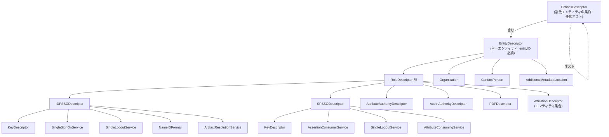
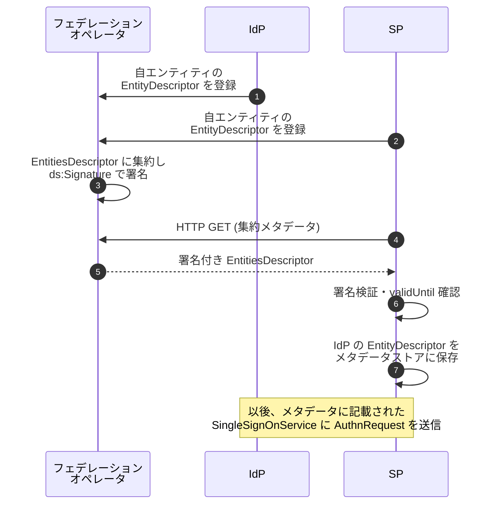

# SAML 2.0 Metadata - Metadata for the OASIS Security Assertion Markup Language

## 概要

**SAML 2.0 Metadata 仕様 (`saml-metadata-2.0-os`)** は、SAML 2.0 を相互運用するエンティティ (Identity Provider、Service Provider、属性発行者、属性消費者、ポリシー決定点等) が互いの構成情報、すなわち **エンドポイント URL・対応バインディング・対応プロトコル・公開鍵・対応属性・連絡先情報・組織情報・有効期限** を機械可読な XML 文書として表現・交換するための OASIS 標準である。2005 年 3 月に Core / Bindings / Profiles と同時に OASIS Standard として承認され、SAML 2.0 仕様群の中で **「相互運用に必要な設定情報の発見と配布」** を担う層を構成する。

メタデータは SAML フェデレーションの基盤であり、新たな IdP と SP の組み合わせを稼働させるためには、双方が相手のメタデータを取得し、信頼に値すると判定した上で取り込む工程が必須となる。本記事では、Metadata 仕様が定義する文書構造、ロール記述子の階層、鍵情報の表現、有効期限と署名による信頼の伝搬、メタデータの公開・取得方式について一次情報に基づき解説する。

## 解決する課題

SAML 2.0 Core / Bindings / Profiles は「メッセージの形式」「搬送経路」「組合せ」を定義するが、相互運用を成立させるためにはさらに以下の情報を IdP と SP の間で正確に共有する必要がある。

- **エンドポイントの所在**: `<AuthnRequest>` を送る先の URL、`<Response>` を受ける先の URL (AssertionConsumerService)、ログアウト要求の宛先 (SingleLogoutService) などを、対応するバインディング (HTTP Redirect / POST / Artifact / SOAP) と共に交換する必要がある
- **公開鍵情報**: 署名検証鍵・暗号化鍵をエンティティごとに把握する必要がある。フェデレーション参加者が増減するたびにこれを手動で交換するのは現実的でない
- **対応プロトコル・対応バインディングの宣言**: 相手がどの SAML プロトコル (SSO・SLO・属性照会・成果物解決等) と、どのバインディングをサポートしているかを事前に知る必要がある
- **エンドユーザー向け情報**: 表示名・ロゴ・プライバシーポリシー URL 等、検出 UI に表示する情報
- **運用情報**: 連絡先 (技術担当・セキュリティ担当)、組織名、メタデータの有効期限・キャッシュ可能期間

これらを ad hoc な email・スプレッドシート・Wiki 共有で運用するとフェデレーション規模に応じて破綻する。Metadata 仕様は **「機械可読・署名検証可能・有効期限付き」** の XML 文書としてこれら情報をパッケージ化し、フェデレーションオペレータがメタデータアグリゲートを定期的に配布する運用モデルを実現する。

## 文書全体像



ルート要素は **`<EntityDescriptor>`** (単一エンティティ) または **`<EntitiesDescriptor>`** (複数エンティティの集約) であり、いずれも `ds:Signature` による XML 署名を伴うことができる。実運用では、フェデレーションオペレータがメンバーの `<EntityDescriptor>` を集約した `<EntitiesDescriptor>` を署名付きで公開する形態が一般的である。

## 名前空間

仕様で使用される主な名前空間を以下に示す。

| プレフィックス | 名前空間 URI                            | 役割                                              |
| -------------- | --------------------------------------- | ------------------------------------------------- |
| `md`           | `urn:oasis:names:tc:SAML:2.0:metadata`  | コアのメタデータ要素                              |
| `ds`           | `http://www.w3.org/2000/09/xmldsig#`    | XML Signature                                     |
| `xenc`         | `http://www.w3.org/2001/04/xmlenc#`     | XML Encryption (`EncryptionMethod` 等)            |
| `saml`         | `urn:oasis:names:tc:SAML:2.0:assertion` | アサーションスキーマからの再利用 (`Attribute` 等) |

加えて、後発の拡張仕様として **MDUI** (Metadata UI、`urn:oasis:names:tc:SAML:metadata:ui`)、**MDRPI** (Registration / Publication Info、`urn:oasis:names:tc:SAML:metadata:rpi`)、**MDATTR** (Entity Attributes、`urn:oasis:names:tc:SAML:metadata:attribute`)、**ALG** (Algorithm Support、`urn:oasis:names:tc:SAML:metadata:algsupport`) などが標準化されており、`<Extensions>` 要素配下で利用される。本仕様自身は `<Extensions>` の存在を定義するが、その中身は別仕様または合意に委ねる。

## 主要要素の詳細

### EntitiesDescriptor

複数の `<EntityDescriptor>` あるいは `<EntitiesDescriptor>` をネストして含めるコンテナ。フェデレーション単位や運用単位でメタデータを束ねる際に用いる。

主な属性:

- `Name`: 集合の名称 (任意)
- `ID`: 文書内識別子 (`ds:Signature` の参照対象に使う)
- `validUntil`: 集約全体としての有効期限 (任意)
- `cacheDuration`: キャッシュ可能期間 (XML Schema の `duration` 型、例 `PT12H`)

集約レベルで `ds:Signature` を付けると、含まれる全 `<EntityDescriptor>` を 1 回の署名検証でまとめて信頼できる。

### EntityDescriptor

単一エンティティの記述。必須属性は **`entityID`** であり、エンティティをグローバルに識別する URI (実務上は HTTPS URL が多い) を与える。`entityID` は SAML プロトコルメッセージの `<Issuer>` と一致しなければならない。

主な属性:

- `entityID` (必須): エンティティの一意識別子。URI、最大 1024 文字
- `validUntil`: メタデータの有効期限 (この時刻を過ぎたメタデータは利用してはならない)
- `cacheDuration`: 取得側がキャッシュしてよい最長期間

子要素として、後述する 1 つ以上の **ロール記述子**、`<Organization>`、`<ContactPerson>`、`<AdditionalMetadataLocation>` を取る。`<AffiliationDescriptor>` を子に持つ場合は、ロール記述子と排他的になる。

### ロール記述子 (RoleDescriptor) の階層

すべてのロール記述子は抽象型 **`RoleDescriptorType`** を継承する。共通属性として以下を持つ。

- `protocolSupportEnumeration` (必須): 当該ロールがサポートする SAML プロトコル名前空間のスペース区切り列。SAML 2.0 プロトコルなら `urn:oasis:names:tc:SAML:2.0:protocol`、SAML 1.x との混在も可能
- `ID` / `validUntil` / `cacheDuration`: 文書内識別子と寿命
- `errorURL`: 認証エラー時にユーザーを誘導する URL (任意)

共通子要素として `<KeyDescriptor>`、`<Organization>`、`<ContactPerson>` を取る。

具体的なロールは以下の通り。

| ロール記述子                   | 役割                                                                     | 主要な追加子要素                                                                                                 |
| ------------------------------ | ------------------------------------------------------------------------ | ---------------------------------------------------------------------------------------------------------------- |
| `IDPSSODescriptor`             | SSO を行う IdP                                                           | `SingleSignOnService`、`NameIDMappingService`、`AssertionIDRequestService`、`AttributeProfile`、`saml:Attribute` |
| `SPSSODescriptor`              | SSO を受ける SP                                                          | `AssertionConsumerService`、`AttributeConsumingService`、属性 `AuthnRequestsSigned` / `WantAssertionsSigned`     |
| `AuthnAuthorityDescriptor`     | 認証文 (Authentication Statement) を問い合わせで発行する認証権威         | `AuthnQueryService`、`AssertionIDRequestService`                                                                 |
| `AttributeAuthorityDescriptor` | 属性照会に応答する属性権威                                               | `AttributeService`、`AssertionIDRequestService`、`AttributeProfile`、`saml:Attribute`                            |
| `PDPDescriptor`                | 認可決定 (`XACMLAuthzDecisionQuery` 等) に応答する Policy Decision Point | `AuthzService`、`AssertionIDRequestService`                                                                      |

さらに、`IDPSSODescriptor` と `SPSSODescriptor` はさらに抽象型 **`SSODescriptorType`** を共通の親に持ち、以下の SSO 共通要素を取る。

- `ArtifactResolutionService`: HTTP Artifact バインディングのアーティファクト解決エンドポイント
- `SingleLogoutService`: シングルログアウトのエンドポイント
- `ManageNameIDService`: 名前識別子管理プロトコルのエンドポイント
- `NameIDFormat`: サポートする NameID 形式の URI

### AffiliationDescriptor

複数の `entityID` を 1 つの「アフィリエーション」としてまとめる記述子。共通の永続識別子 (Persistent NameID) を共有する SP 群を 1 グループとして扱う場合などに用いる。`affiliationOwnerID` 属性と 1 つ以上の `<AffiliateMember>` を持つ。

### エンドポイント要素

SAML プロトコルメッセージを送受信する全エンドポイントは、共通の抽象型 **`EndpointType`** を継承する。共通属性は以下。

- `Binding` (必須): 当該エンドポイントが受け付けるバインディングの URI (例: `urn:oasis:names:tc:SAML:2.0:bindings:HTTP-POST`)
- `Location` (必須): エンドポイントの URI
- `ResponseLocation`: 応答だけを別の URL で受ける場合に指定

さらに `IndexedEndpointType` を継承するエンドポイント (`AssertionConsumerService`、`ArtifactResolutionService`、`AttributeConsumingService`) は以下を持つ。

- `index` (必須): エンドポイントの番号 (`<AuthnRequest>` の `AssertionConsumerServiceIndex` 等から参照される)
- `isDefault`: 既定のエンドポイントかどうか

主なエンドポイント要素を以下に示す。

| 要素                        | 所属ロール                   | 用途                                            |
| --------------------------- | ---------------------------- | ----------------------------------------------- |
| `SingleSignOnService`       | IDPSSODescriptor             | `<AuthnRequest>` を受信                         |
| `AssertionConsumerService`  | SPSSODescriptor              | `<Response>` を受信                             |
| `SingleLogoutService`       | IDP / SP SSO Descriptor      | `<LogoutRequest>` / `<LogoutResponse>` を送受信 |
| `ArtifactResolutionService` | IDP / SP SSO Descriptor      | `<ArtifactResolve>` を SOAP で受信              |
| `ManageNameIDService`       | IDP / SP SSO Descriptor      | `<ManageNameIDRequest>` を受信                  |
| `NameIDMappingService`      | IDPSSODescriptor             | `<NameIDMappingRequest>` を受信                 |
| `AssertionIDRequestService` | 各ロール                     | `<AssertionIDRequest>` を受信                   |
| `AttributeService`          | AttributeAuthorityDescriptor | `<AttributeQuery>` を受信                       |
| `AuthnQueryService`         | AuthnAuthorityDescriptor     | `<AuthnQuery>` を受信                           |
| `AuthzService`              | PDPDescriptor                | `<AuthzDecisionQuery>` を受信                   |

### KeyDescriptor

公開鍵情報を表す要素。`<ds:KeyInfo>` を内包し、その下に `<ds:X509Data>`、`<ds:KeyValue>` などの XML Signature 標準要素を含める。

主な属性・子要素:

- `use` 属性: `signing` か `encryption` のいずれかを取る。未指定の場合は両方の用途で利用可能
- `<ds:KeyInfo>` (必須): 鍵そのものの情報。実務上は `<ds:X509Data>/<ds:X509Certificate>` で X.509 証明書 (DER を Base64 エンコード) を埋め込む形態が圧倒的に多い
- `<EncryptionMethod>` (任意、複数可): 暗号化用途の鍵に対して、サポートする `Algorithm` を列挙

仕様自身は X.509 PKI を前提にしておらず、鍵を **メタデータに直接埋め込む** ことを推奨する設計になっている。後発の **SAML 2.0 Metadata Interoperability Profile** はこの設計を強調し、**「証明書のチェーンや有効期限・失効状態は信用せず、鍵そのものをメタデータ内の `<KeyDescriptor>` で照合する」** という運用モデルを明確化している。

### Organization と ContactPerson

`<Organization>` は組織名 (`OrganizationName`)、表示名 (`OrganizationDisplayName`)、URL (`OrganizationURL`) を多言語 (`xml:lang`) で記述する。

`<ContactPerson>` は連絡先を表し、`contactType` 属性 (`technical` / `support` / `administrative` / `billing` / `other`) で種別を区別する。子要素として `Company`、`GivenName`、`SurName`、`EmailAddress`、`TelephoneNumber` を持つ。

### Extensions

`<Extensions>` は前述の MDUI・MDRPI・MDATTR・ALG といった拡張要素を入れるためのコンテナで、`<EntityDescriptor>` 直下、各ロール記述子直下、エンドポイント要素直下などに置ける。

## メタデータの発見と配布

メタデータをどのように配布・取得するかについて、Metadata 仕様自身は 2 種類の方式を定義する。

### Well-Known Location 方式

`entityID` が `https:` で始まる URL である場合、その URL を HTTP `GET` すると、当該エンティティの `<EntityDescriptor>` (またはそれを含む `<EntitiesDescriptor>`) が `application/samlmetadata+xml` で返ってくる、という最もシンプルな取得規約。仕様上、`entityID` URL は当該エンティティ自身が管理するため、エンティティが自前でメタデータを公開できる。

### メタデータの集約配布

実用では、フェデレーションオペレータ (例: 学術連携の eduGAIN、研究機関の InCommon 等) がメンバーから収集した `<EntityDescriptor>` を `<EntitiesDescriptor>` にまとめて署名し、定期的に HTTP で配布するモデルが主流である。取得側は集約メタデータをダウンロードし、署名検証してから自分のメタデータストアへ取り込む。



### Metadata Query Protocol (MDQ)

集約配布はフェデレーション全体を毎回ダウンロードするため、大規模化すると効率が悪い。これを解決するため、IETF で **Metadata Query Protocol** (`draft-young-md-query` 系) が定義され、`{base}/entities/{entityID}` のような URL に HTTP `GET` するとそのエンティティのメタデータのみが返るシンプルな問い合わせ方式が広く実装されている。RFC 8414 (OAuth 2.0 Authorization Server Metadata) や OpenID Connect Discovery が同様の「`.well-known` ベースの単体配布」を後年に採用したことと対比すると、SAML 2.0 がいち早くメタデータ駆動運用に踏み込んでいたことが分かる。

## 信頼の確立 - 有効期限と署名

メタデータは「信頼に値する出所」から取得し、改竄されていないことを検証してから利用しなければならない。仕様は以下の信頼担保メカニズムを定義する。

### XML Signature

`<EntityDescriptor>` および `<EntitiesDescriptor>` は **オプションの `ds:Signature` 子要素** を持てる。署名は当該要素 (とその全子孫) を対象とし、Enveloped Signature の形をとる。Metadata Interoperability Profile では、署名アルゴリズムや正規化アルゴリズムを `urn:oasis:names:tc:SAML:metadata:algsupport` 拡張で宣言することが推奨される。

集約メタデータでは通常、ルートの `<EntitiesDescriptor>` 1 つに署名するため、集約内の個別 `<EntityDescriptor>` を取り出した時点でその署名性は失われる点に注意が必要である (取得側はパース・抽出後も「どの集約から来たか」を覚えておく必要がある)。

### validUntil と cacheDuration

- **`validUntil`**: その時刻を過ぎたメタデータを利用してはならない (絶対時刻)
- **`cacheDuration`**: 取得時点から相対的にこの期間を超えてキャッシュしてはならない (相対時間)

取得側はメタデータを定期的に再取得し、`validUntil` を超えていないこと、署名が有効であることを確認した上で、自分のメタデータストアを更新する。

### Metadata Interoperability Profile (MDIOP)

仕様策定後、運用上の知見から **SAML 2.0 Metadata Interoperability Profile** (OASIS Committee Specification) が策定された。要点は以下。

- 信頼の単位は **エンドユーザーごとの X.509 証明書チェーン検証ではなく、メタデータ内の `<ds:X509Certificate>` (あるいは `<ds:KeyValue>`) そのもの** とする
- 証明書の `notBefore` / `notAfter` や CRL / OCSP は **無視する** (鍵そのものはメタデータの `validUntil` で寿命管理される)
- 結果として、メタデータを正しく署名検証し最新に保つ運用さえあれば、各エンティティの証明書は「鍵の運び手」として自己署名でよい

この運用モデルは現在の SAML フェデレーション (eduGAIN、InCommon、SWITCHaai 等) の事実上の標準である。

## SP / IdP のメタデータ抜粋例

`<SPSSODescriptor>` の代表的な記述例 (簡略化) を示す。

```xml
<md:EntityDescriptor
    xmlns:md="urn:oasis:names:tc:SAML:2.0:metadata"
    xmlns:ds="http://www.w3.org/2000/09/xmldsig#"
    entityID="https://sp.example.com/saml/metadata"
    validUntil="2026-12-31T23:59:59Z">
  <md:SPSSODescriptor
      AuthnRequestsSigned="true"
      WantAssertionsSigned="true"
      protocolSupportEnumeration="urn:oasis:names:tc:SAML:2.0:protocol">
    <md:KeyDescriptor use="signing">
      <ds:KeyInfo>
        <ds:X509Data>
          <ds:X509Certificate>MIID...==</ds:X509Certificate>
        </ds:X509Data>
      </ds:KeyInfo>
    </md:KeyDescriptor>
    <md:KeyDescriptor use="encryption">
      <ds:KeyInfo>
        <ds:X509Data>
          <ds:X509Certificate>MIID...==</ds:X509Certificate>
        </ds:X509Data>
      </ds:KeyInfo>
    </md:KeyDescriptor>
    <md:SingleLogoutService
        Binding="urn:oasis:names:tc:SAML:2.0:bindings:HTTP-Redirect"
        Location="https://sp.example.com/saml/slo"/>
    <md:NameIDFormat>
      urn:oasis:names:tc:SAML:2.0:nameid-format:persistent
    </md:NameIDFormat>
    <md:AssertionConsumerService
        index="0" isDefault="true"
        Binding="urn:oasis:names:tc:SAML:2.0:bindings:HTTP-POST"
        Location="https://sp.example.com/saml/acs"/>
    <md:AttributeConsumingService index="0" isDefault="true">
      <md:ServiceName xml:lang="ja">サンプル SP</md:ServiceName>
      <md:RequestedAttribute
          Name="urn:oid:0.9.2342.19200300.100.1.3"
          NameFormat="urn:oasis:names:tc:SAML:2.0:attrname-format:uri"
          FriendlyName="mail" isRequired="true"/>
    </md:AttributeConsumingService>
  </md:SPSSODescriptor>
  <md:Organization>
    <md:OrganizationName xml:lang="ja">サンプル株式会社</md:OrganizationName>
    <md:OrganizationDisplayName xml:lang="ja">サンプル</md:OrganizationDisplayName>
    <md:OrganizationURL xml:lang="ja">https://example.com/</md:OrganizationURL>
  </md:Organization>
  <md:ContactPerson contactType="technical">
    <md:EmailAddress>mailto:saml-admin@example.com</md:EmailAddress>
  </md:ContactPerson>
</md:EntityDescriptor>
```

`<IDPSSODescriptor>` 側は、`SingleSignOnService` および (必要なら) `ArtifactResolutionService`、`NameIDMappingService`、サポートする `NameIDFormat`、IdP が発行できる属性を表す `saml:Attribute` 群などを記述する。

## セキュリティに関する考慮事項

仕様の Security Considerations は以下を要請する。

- **メタデータの真正性検証**: 取得したメタデータは必ず署名検証または別途の信頼経路 (TLS + 信頼済みダウンロード元) で出所を確認すること
- **鍵運用の単一情報源化**: SAML プロトコルメッセージの署名検証鍵・暗号化鍵は、必ずメタデータ内の `<KeyDescriptor>` を真として扱うこと。プロトコルメッセージに同梱された `<ds:KeyInfo>` を独立に信用してはならない
- **有効期限の遵守**: `validUntil` を過ぎたメタデータの使用は禁止。`cacheDuration` を超えた長期キャッシュも禁止
- **メタデータ取得経路の保護**: 取得経路 (HTTPS) の整合性は必須。中継のキャッシュサーバが改竄しないことを担保するには、メタデータ自身の `ds:Signature` が最も確実
- **エンドポイント URL の検証**: メタデータに記載された URL に向けて自動的にメッセージを送信する設計上、悪意ある (あるいは誤った) URL が登録されると攻撃に転用される。フェデレーションオペレータは登録時に URL の所有権を確認する運用が必要
- **連絡先情報の取り扱い**: `<ContactPerson>` の email は機械的に収集されうるため、フェデレーション運営は注意が必要

## 関連仕様

- **SAML 2.0 Core (`saml-core-2.0-os`)**: アサーション・プロトコルメッセージの構造定義。`entityID` と `<Issuer>` の整合がメタデータと結びつく
- **SAML 2.0 Bindings (`saml-bindings-2.0-os`)**: エンドポイント要素の `Binding` 属性に指定される URI を定義
- **SAML 2.0 Profiles (`saml-profiles-2.0-os`)**: メタデータと相互参照される具体的なシナリオ (Web Browser SSO、SLO、ECP 等)
- **SAML 2.0 Metadata Interoperability Profile**: 鍵の信頼モデルを X.509 PKI ではなくメタデータ内鍵に統一する運用プロファイル
- **SAML V2.0 Metadata Extensions for Registration and Publication Information (MDRPI)**: `<RegistrationInfo>` / `<PublicationInfo>` を `<Extensions>` 配下で定義
- **SAML V2.0 Metadata Extensions for Login and Discovery User Interface (MDUI)**: 表示名・ロゴ・プライバシーポリシー URL を `<Extensions>` 配下で定義
- **SAML V2.0 Metadata Profile for Algorithm Support**: 署名・暗号化アルゴリズムのサポート宣言
- **Metadata Query Protocol (MDQ)**: 単一エンティティのメタデータを HTTP で取得する問い合わせプロトコル
- **OAuth 2.0 Authorization Server Metadata (RFC 8414)** / **OpenID Connect Discovery 1.0**: 同様の発想を JSON / `.well-known` ベースで実装した後発のメタデータ仕様。SAML メタデータと比較すると、自己主張型 (self-asserted) かつ単一エンティティ単体の配布を前提とする点が対照的

## 参考文献

- OASIS Standard, [Metadata for the OASIS Security Assertion Markup Language (SAML) V2.0](https://docs.oasis-open.org/security/saml/v2.0/saml-metadata-2.0-os.pdf) (`saml-metadata-2.0-os`)
- OASIS Committee Specification, [SAML V2.0 Metadata Interoperability Profile Version 1.0](https://docs.oasis-open.org/security/saml/Post2.0/sstc-metadata-iop.html)
- OASIS Committee Specification, [SAML V2.0 Metadata Extensions for Registration and Publication Information Version 1.0](https://docs.oasis-open.org/security/saml/Post2.0/saml-metadata-rpi/v1.0/saml-metadata-rpi-v1.0.html)
- OASIS Committee Specification, [SAML V2.0 Metadata Extensions for Login and Discovery User Interface Version 1.0](https://docs.oasis-open.org/security/saml/Post2.0/sstc-saml-metadata-ui/v1.0/sstc-saml-metadata-ui-v1.0.html)
- IETF Internet-Draft, [Metadata Query Protocol](https://datatracker.ietf.org/doc/html/draft-young-md-query)
- W3C, [XML Signature Syntax and Processing Version 1.1](https://www.w3.org/TR/xmldsig-core1/)
