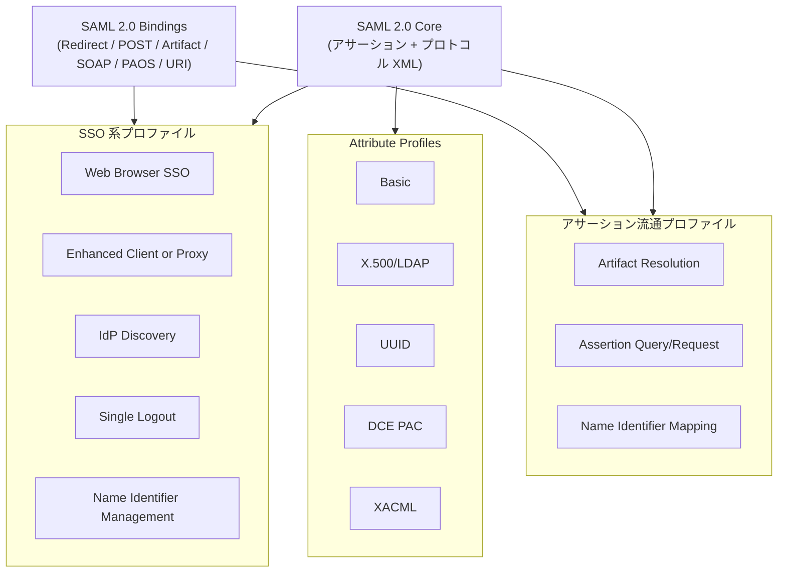
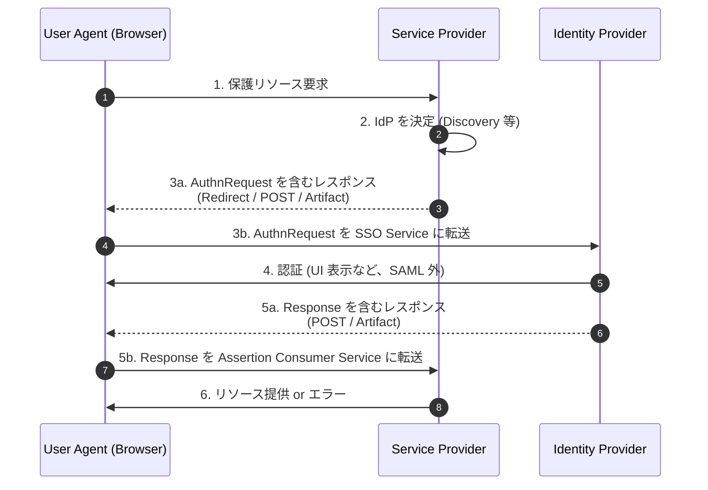
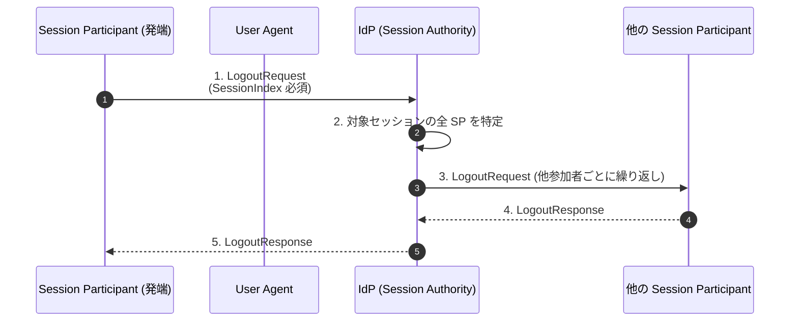
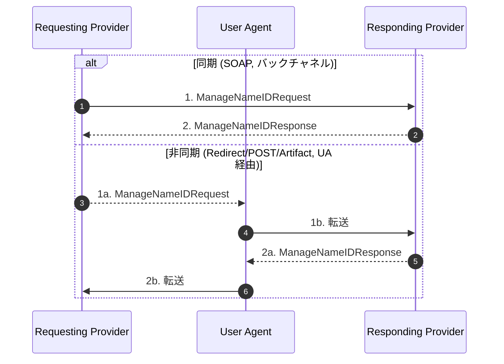
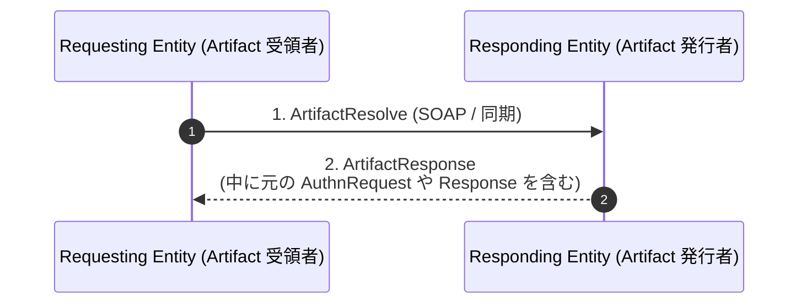
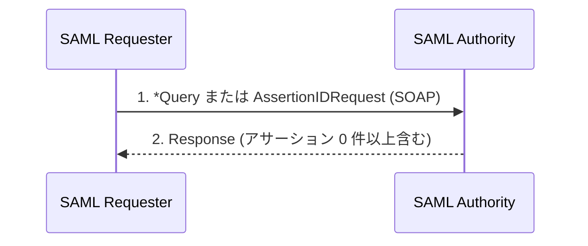

# SAML 2.0 Profiles - Profiles for the OASIS Security Assertion Markup Language

## 概要

**SAML 2.0 Profiles 仕様 (`saml-profiles-2.0-os`)** は、SAML 2.0 Core で定義されたアサーション・プロトコルメッセージと、Bindings で定義された運搬手段を、具体的なユースケースに合わせてどう組み合わせて使うかを規定する OASIS 標準である。2005 年 3 月に OASIS Standard として承認され、Core / Bindings / Profiles / Metadata から構成される SAML 2.0 仕様群の中で、最も「アプリケーションに近い層」を担う。

Profiles 仕様は単独で動作する仕様ではなく、Core が定義した抽象的なメッセージ (例えば `<AuthnRequest>` や `<LogoutRequest>`) と、Bindings が定義した搬送経路 (HTTP Redirect、HTTP POST、HTTP Artifact、SOAP、PAOS 等) を、特定の業務シナリオ向けに **「どのメッセージを誰が誰に対して、どの順序で、どのバインディングで送るか」** という形にレシピ化したものである。本記事では、Profiles 仕様が定義する以下の主要プロファイル群を一次情報に沿って解説する。

- **SSO 系**: Web Browser SSO Profile、Enhanced Client or Proxy (ECP) Profile、Identity Provider Discovery Profile、Single Logout Profile、Name Identifier Management Profile
- **アサーション流通系**: Artifact Resolution Profile、Assertion Query/Request Profile、Name Identifier Mapping Profile
- **属性系**: Basic / X.500・LDAP / UUID / DCE PAC / XACML の各 Attribute Profile

## 解決する課題

SAML 2.0 は意図的に「アサーション (何を主張するか)」「プロトコル (どんなメッセージで要求・応答するか)」「バインディング (どう運ぶか)」「プロファイル (どう組み合わせるか)」を分離している。この分離は柔軟性を生む一方で、相互運用性の観点では問題を生む。

- SP が `<AuthnRequest>` を HTTP Redirect で送り、IdP が `<Response>` を HTTP POST で返す、というような組み合わせを実装ごとに勝手に決められると相互接続できない
- SLO (Single Logout) のような複数当事者を巻き込む処理では、誰が誰に何を送り、エラー時にどう振る舞うかを明文化しないと整合性が崩れる
- 属性を SAML アサーションに格納する場合、属性名の命名規則と値の表現方法を揃えないと、属性の意味を取り違える

Profiles 仕様は、これら頻出シナリオに対して **「必須の組み合わせ・順序・処理規則」** を確定させることで、SAML 実装の相互運用性を担保する。

## プロファイル全体像



各プロファイルは仕様内で **「Required Information」** という枠で識別 URI・連絡先・SAML Confirmation Method 等を明示し、機械的に参照可能になっている。例えば Web Browser SSO Profile の識別子は `urn:oasis:names:tc:SAML:2.0:profiles:SSO:browser`、ECP は `urn:oasis:names:tc:SAML:2.0:profiles:SSO:ecp` と URN で割り当てられている。

## 主体確認方式 (Subject Confirmation)

Profiles 仕様の冒頭 (第 3 章) では、後続の各プロファイルで参照される 3 種類の Subject Confirmation 方式を定義している。これらは `<saml:SubjectConfirmation>` の `Method` 属性に指定される URI で識別される。

| 方式           | URI                                             | 内容                                                           |
| -------------- | ----------------------------------------------- | -------------------------------------------------------------- |
| Holder of Key  | `urn:oasis:names:tc:SAML:2.0:cm:holder-of-key`  | 鍵 (公開鍵証明書等) を提示できる主体のみがアサーションを使える |
| Sender Vouches | `urn:oasis:names:tc:SAML:2.0:cm:sender-vouches` | アサーションを送信した中継者の主張で主体を確認する             |
| Bearer         | `urn:oasis:names:tc:SAML:2.0:cm:bearer`         | アサーションを「持っている」者が主体とみなされる               |

Web Browser SSO や ECP は Bearer を使う前提でセキュリティ対策が組まれている。

## Web Browser SSO Profile

最も使われる SAML プロファイル。ユーザーのブラウザを中継者として、SP と IdP の間で `<AuthnRequest>` と `<Response>` を交換する。

### フロー



仕様では 6 ステップを次のように規定している。

1. ユーザがセキュリティコンテキストを持たない状態で、SP の保護リソースに HTTP リクエストを行う
2. SP は IdP の所在を決定する。手段は実装依存だが、`4.3 Identity Provider Discovery Profile` を使ってもよい
3. SP が `<AuthnRequest>` を発行する。**HTTP Redirect / HTTP POST / HTTP Artifact** のいずれかのバインディングを使える
4. IdP が利用者を識別する。新規認証か既存セッション再利用かは SAML の範囲外。`<AuthnRequest>` の `ForceAuthn=true` があれば必ず新規認証する
5. IdP が `<Response>` を発行する。**HTTP POST または HTTP Artifact** のみ可。Redirect は URL 長制限のため禁止 ("MUST NOT")
6. SP が `<Response>` を検証し、セキュリティコンテキストを確立してリソースを返す

### SP-initiated と IdP-initiated

仕様 4.1.5 では **Unsolicited Response** を認めており、IdP が `<AuthnRequest>` を受けずに `<Response>` を SP に届けることで、いわゆる「IdP 起点 SSO」を実現する。この場合、

- `<Response>` は `InResponseTo` 属性を含んではならない
- Bearer の `<SubjectConfirmationData>` も `InResponseTo` を持ってはならない
- SP のメタデータでデフォルトに指定された `<md:AssertionConsumerService>` エンドポイントに送るべき (SHOULD)

### バインディング組み合わせ

SP の `<AuthnRequest>` 送信は 3 種、IdP の `<Response>` 返却は 2 種から選べるので、形式上 6 通りの組み合わせがある。実運用で典型的なのは次の 2 パターンである。

- **Redirect-POST**: 短い `<AuthnRequest>` をリダイレクトで送り、長くなりがちな `<Response>` を POST で返す。最も普及している組み合わせ
- **POST-POST**: 双方向 POST。`<AuthnRequest>` も POST フォームで送る場合に使う
- **Artifact-Artifact**: メッセージ本体を参照として渡し、SP/IdP が SOAP バックチャネルで `<ArtifactResolve>` を使って実体を取得する。フロントチャネルに機微な内容を載せない

### セキュリティ規定

- `<AuthnRequest>` の HTTP 交換は SSL 3.0 / TLS 1.0 推奨 (RECOMMENDED)
- `<AssertionConsumerServiceURL>` / `<AssertionConsumerServiceIndex>` が SP のものであることを IdP は必ず検証 (MUST)、検証しないと MITM 攻撃を受ける
- HTTP POST バインディングを使う場合、`<Response>` 内の `<Assertion>` は必ず署名される (MUST)
- Bearer アサーションのリプレイ防止のため、SP は `NotOnOrAfter` の期間中、使用済み `ID` を保持しなければならない (MUST)

### メタデータ

SP の `<md:SPSSODescriptor>` には `AuthnRequestsSigned` や `WantAssertionsSigned`、複数の `<md:AssertionConsumerService>` (`index`、`isDefault` 付き) を記述する。IdP の `<md:IDPSSODescriptor>` には `WantAuthnRequestsSigned` や `<md:SingleSignOnService>` を記述する。

## Enhanced Client or Proxy (ECP) Profile

「拡張クライアントまたはプロキシ」と呼ばれる、SAML プロトコルを理解する非ブラウザクライアント (ネイティブアプリ、WAP ゲートウェイ等) 向けのプロファイル。SP と IdP の間に挟まる ECP が、Reverse SOAP (PAOS) と SAML SOAP の両バインディングを使い分けて認証を仲介する。

### ECP の前提条件

仕様 4.2.2 では ECP を次の 2 条件を満たすクライアントまたはプロキシと定義する。

- 利用者が使いたい IdP を知っている (または取得できる) ため、SP は Web Browser SSO のステップ 2 (Discovery) を実質スキップできる
- PAOS バインディング (Reverse SOAP) を扱える

### フロー

```mermaid
sequenceDiagram
    autonumber
    participant ECP as Enhanced Client or Proxy
    participant SP as Service Provider
    participant IdP as Identity Provider

    ECP->>SP: 1. リソース要求<br/>(Accept: application/vnd.paos+xml<br/>PAOS: ver=...;ecp)
    SP-->>ECP: 2. AuthnRequest を SOAP Envelope の Body に入れて<br/>HTTP 200 で返却 (PAOS)
    ECP->>ECP: 3. IdP を決定
    ECP->>IdP: 4. AuthnRequest を SAML SOAP バインディングで送信
    IdP->>IdP: 5. 利用者を認証 (SAML 外)
    IdP-->>ECP: 6. Response を SAML SOAP で返却<br/>(SP 宛にターゲットされた SOAP Envelope)
    ECP->>SP: 7. Response を PAOS (HTTP POST) で SP に届ける
    SP-->>ECP: 8. リソース提供 or エラー
```

### 重要な技術要素

- SP から ECP への応答 SOAP Envelope には、PAOS リクエストヘッダブロックや `<ecp:Request>` ヘッダブロックが付き、ECP が IdP に転送する際に剥がす
- IdP は `<ecp:Response>` ヘッダブロックに `AssertionConsumerServiceURL` を格納し、ECP は SP から受け取った `responseConsumerURL` と一致するかを必ず検証する (MUST)。不一致なら SOAP fault を返し、SAML Response は SP に送らない。これは ECP を悪用した宛先すり替え攻撃への対策
- SOAP ヘッダの `mustUnderstand` は 1、`actor` は `http://schemas.xmlsoap.org/soap/actor/next`
- セキュリティ規定 (4.2.5): `<AuthnRequest>` は署名すべき (SHOULD)、`<Response>` 内のアサーションは必ず署名 (MUST)、SP は TLS サーバ認証で ECP に対し認証されるべき (SHOULD)

## Identity Provider Discovery Profile

複数 IdP が存在するフェデレーション環境で、SP が「この利用者はどの IdP を使っているか」を発見するためのプロファイル。**Common Domain Cookie** という仕組みを使う。

### Common Domain Cookie の仕様

- Cookie 名は **`_saml_idp`** 固定 (MUST)
- 値は IdP の Entity ID (URI) を base64 エンコードしたものをスペース区切りで連結し、それを URL エンコード
- `Path=/`、`Domain=.<common-domain>` (先頭ピリオド必須)、**Secure 属性必須** (MUST)
- 最後に使われた IdP がリスト末尾に来るように追加 (古い同一エントリは削除可)

### フロー

```mermaid
sequenceDiagram
    participant UA as User Agent
    participant IdP as Identity Provider
    participant CD as Common Domain Server
    participant SP as Service Provider

    Note over IdP,CD: Cookie 書き込みフェーズ
    IdP->>UA: 認証完了
    IdP->>UA: Common Domain の DNS エイリアスへ Redirect
    UA->>CD: HTTPS 要求
    CD-->>UA: Set-Cookie: _saml_idp=...; Domain=.common.example
    CD->>UA: IdP または SP へ Redirect

    Note over UA,SP: Cookie 読み出しフェーズ
    UA->>SP: 保護リソース要求
    SP->>UA: Common Domain サーバへ Redirect
    UA->>CD: Cookie 付き要求
    CD-->>SP: IdP リストを伝達 (実装依存)
```

実装方法 (4.3.2、4.3.3) の詳細は **non-normative** として例示される程度で、組織が選んだ任意の手段で Cookie を書き読みすればよい。

## Single Logout Profile

利用者が IdP セッションを終了させ、それを契機に同じ IdP が発行したアサーションで成立している全 SP のセッションを連鎖的に終了させるプロファイル。

### 用語

- **Session Authority**: セッションを管理する IdP
- **Session Participant**: アサーションを受けてローカルセッションを張った SP (および他の IdP)

### フロー



### バインディングと特性

SLO は **同期 (SOAP)** と **非同期フロントチャネル (Redirect / POST / Artifact)** の両方を組み合わせ可能。クッキーで張ったセッションを潰すにはユーザエージェントの介在が必要なので、フロントチャネルが現実的に必要となる。

### 主要規定

- 発端が Session Participant の場合、`<LogoutRequest>` に少なくとも 1 つの `<SessionIndex>` を含める (MUST)
- 発端が Session Authority の場合、`<SessionIndex>` を省略して「全セッション終了」を意味させてもよい
- `<LogoutRequest>` の主体識別子は、対応する認証アサーションの識別子と Core 仕様 3.3.4 のマッチング規則で強く一致しなければならない (MUST)
- 要求者・応答者ともに、署名またはバインディング固有機構で相手に対して自身を認証し、メッセージ完全性を確保する (MUST)
- HTTP POST / Redirect を使う場合、`<LogoutResponse>` は署名必須 (MUST)
- メタデータエンドポイントは `<md:SingleLogoutService>`

### 実運用上の難しさ

仕様自体は単純だが、複数 SP に対する伝播の途中で一部 SP が応答不能だと、ユーザから見れば「ログアウトしたつもりが別 SP に残っていた」という不整合が起こり得る。仕様も Session Participant が起点となるときはフロントチャネルを使うことを推奨 (SHOULD) しており、これにより IdP がブラウザを使って全 SP に伝播する機会を最大化する。

## Name Identifier Management Profile

IdP と SP が共有する持続的識別子の **形式変更・値変更・エイリアス追加・利用終了** を通知するためのプロファイル。Core 仕様 3.6 の `<ManageNameIDRequest>` / `<ManageNameIDResponse>` を使う。

シナリオ例:

- IdP が利用者のプライバシ強化のため、SP に対する pseudonym を新しい値に切り替える
- SP が自分側のエイリアスを IdP に登録し、以降の通信で IdP がそれを含めるようにする
- どちらかの当事者が「以降この識別子を発行・受理しない」と通告する

### フロー



メタデータは `<md:ManageNameIDService>`、メッセージは HTTP POST / Redirect を使う場合署名必須 (MUST)。

## Artifact Resolution Profile

HTTP Artifact バインディングと組で使われる、Artifact (短い参照値) を実際の SAML プロトコルメッセージへ解決するためのプロファイル。



### 規定

- 同期バインディング (典型的には SAML SOAP バインディング) を使う (MUST)
- 要求者は応答者に対して認証すべき (SHOULD)。Artifact バインディングを使うプロファイルが「認証必須」と上書きしてもよい
- 応答者は要求者に対して必ず認証する (MUST)
- メタデータは `<md:ArtifactResolutionService>` (indexed)、Artifact の `EndpointIndex` フィールドで参照される

## Assertion Query/Request Profile

既存のアサーションを ID で取り直したり、主体に関する属性・認証・認可決定を新規にクエリするためのプロファイル。`<AssertionIDRequest>`、`<SubjectQuery>`、`<AuthnQuery>`、`<AttributeQuery>`、`<AuthzDecisionQuery>` の 5 種類のメッセージに対応する。



メタデータは `<md:AssertionIDRequestService>`、`<md:AuthnQueryService>`、`<md:AttributeService>`、`<md:AuthzService>` と用途別に分かれる。バックチャネル前提の同期バインディング (SOAP) を使う。

## Name Identifier Mapping Profile

ある SP/IdP が持っている主体の識別子を、別の SP 向けの識別子にマッピング (変換) させるためのプロファイル。Core 仕様 3.8 の `<NameIDMappingRequest>` / `<NameIDMappingResponse>` を使う。

要点 (7.4.2):

- IdP は返却する識別子をほとんどのケースで暗号化すべき (SHOULD) — `<EncryptedID>` として返し、要求者はそのまま他のメッセージに転載できる
- 利用範囲を制限するには、識別子を `<Subject>` に格納した statement なしの `<Assertion>` を作り、その `<Conditions>` で時間・利用 RP を縛り、暗号化して `<EncryptedID>` の中身にする (7.4.2.1)

メタデータは `<md:NameIDMappingService>`。

## SAML Attribute Profiles

第 8 章では、SAML アサーション内の `<saml:Attribute>` の **命名規則と値表現** を統一するため、5 つの Attribute Profile を定める。属性 NameFormat URI でどの Profile に従っているかを示す。

### Basic Attribute Profile

- 識別子: `urn:oasis:names:tc:SAML:2.0:profiles:attribute:basic`
- `NameFormat=urn:oasis:names:tc:SAML:2.0:attrname-format:basic`
- 値は XML Schema 組み込み型 (`xs:string` 等) で表現、`xsi:type` 必須

```xml
<saml:Attribute NameFormat="urn:oasis:names:tc:SAML:2.0:attrname-format:basic"
                Name="FirstName">
  <saml:AttributeValue xsi:type="xs:string">By-Tor</saml:AttributeValue>
</saml:Attribute>
```

### X.500/LDAP Attribute Profile

- 識別子: `urn:oasis:names:tc:SAML:2.0:profiles:attribute:X500`
- `NameFormat=urn:oasis:names:tc:SAML:2.0:attrname-format:uri`
- 属性名は RFC 3061 の `urn:oid:<OID>` 形式 (例: `urn:oid:2.5.4.42` = givenName)
- `FriendlyName` で人間可読名を補助
- 値は LDAP 構文の UTF-8 文字列をそのまま、それ以外は ASN.1 OCTET STRING を base64 エンコード。プロファイル固有 XML 属性 `x500:Encoding="LDAP"` を付与
- 比較は LDAP マッチングルールに従う

```xml
<saml:Attribute
    xmlns:x500="urn:oasis:names:tc:SAML:2.0:profiles:attribute:X500"
    NameFormat="urn:oasis:names:tc:SAML:2.0:attrname-format:uri"
    Name="urn:oid:2.5.4.42" FriendlyName="givenName">
  <saml:AttributeValue xsi:type="xs:string"
      x500:Encoding="LDAP">Steven</saml:AttributeValue>
</saml:Attribute>
```

### UUID Attribute Profile

- 識別子: `urn:oasis:names:tc:SAML:2.0:profiles:attribute:UUID`
- 属性ソースが UUID/GUID で属性や値を識別する場合に使う
- 命名は UUID URN 名前空間に従う

### DCE PAC Attribute Profile

- 識別子: `urn:oasis:names:tc:SAML:2.0:profiles:attribute:DCE`
- DCE (Distributed Computing Environment) の Privilege Attribute Certificate を SAML 属性として表現
- Realm、Principal、Primary Group、Groups、Foreign Groups の各属性を定義

### XACML Attribute Profile

- 識別子: `urn:oasis:names:tc:SAML:2.0:profiles:attribute:XACML`
- XACML が要求する属性表現と SAML 属性を相互運用させるため、命名と値表現を XACML 寄りに整列

## セキュリティに関する考慮事項

仕様全体を通じて繰り返し強調されるポイントを整理する。

- **TLS の利用**: ほぼ全プロファイルで、HTTP 交換は SSL 3.0 / TLS 1.0 上で行うこと推奨 (RECOMMENDED)
- **署名**: HTTP POST / Redirect を使うフロントチャネル交換では、`<Response>` 内の `<Assertion>` (Web Browser SSO/ECP) や `<LogoutResponse>` / `<ManageNameIDResponse>` (SLO/NIM) は署名必須 (MUST)。Artifact バインディングは SOAP バックチャネル側で認証が利くため緩和されている
- **宛先検証**: Web Browser SSO では `<AssertionConsumerServiceURL>` / 同 `Index` が要求 SP のものであることを IdP が必ず確認 (MUST)。ECP では ECP が `responseConsumerURL` と `AssertionConsumerServiceURL` の一致を確認 (MUST)。いずれも欠落すると MITM/宛先すり替えを許す
- **Bearer リプレイ防止**: SP は `NotOnOrAfter` の期間中、使用済み `<Assertion>` の `ID` を保持しリプレイを拒否 (MUST)
- **メタデータ信頼**: 各種エンドポイント決定にメタデータを使う場合、メタデータの完全性と発信元の真正性が前提となる (詳細は Metadata 仕様)

## 関連仕様

- **SAML 2.0 Core**: アサーションとプロトコルメッセージの構造定義
- **SAML 2.0 Bindings**: 本プロファイル群が用いる HTTP Redirect / POST / Artifact、SOAP、PAOS の運搬規則
- **SAML 2.0 Metadata**: `<md:SingleSignOnService>` / `<md:AssertionConsumerService>` / `<md:SingleLogoutService>` 等のエンドポイント記述
- **SAML 2.0 Authentication Context**: `<RequestedAuthnContext>` で参照する認証コンテキスト分類
- **SAML 2.0 Security and Privacy Considerations**: 各プロファイル横断のセキュリティ脅威分析
- **Kantara SAML V2.0 Errata (saml-core-errata-2.0)**: Core / Profiles に対する正誤表

## 参考文献

- OASIS, "Profiles for the OASIS Security Assertion Markup Language (SAML) V2.0", OASIS Standard, 15 March 2005. <https://docs.oasis-open.org/security/saml/v2.0/saml-profiles-2.0-os.pdf>
- OASIS, "Assertions and Protocols for the OASIS Security Assertion Markup Language (SAML) V2.0", OASIS Standard, 15 March 2005. <https://docs.oasis-open.org/security/saml/v2.0/saml-core-2.0-os.pdf>
- OASIS, "Bindings for the OASIS Security Assertion Markup Language (SAML) V2.0", OASIS Standard, 15 March 2005. <https://docs.oasis-open.org/security/saml/v2.0/saml-bindings-2.0-os.pdf>
- OASIS, "Metadata for the OASIS Security Assertion Markup Language (SAML) V2.0", OASIS Standard, 15 March 2005. <https://docs.oasis-open.org/security/saml/v2.0/saml-metadata-2.0-os.pdf>
- OASIS Security Services TC, SAML 2.0 仕様トップページ. <https://www.oasis-open.org/standards/#samlv2.0>
