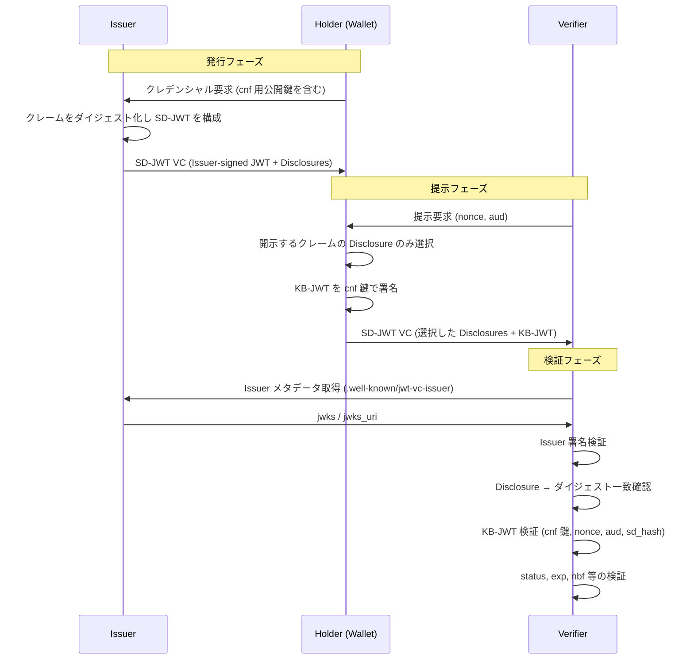
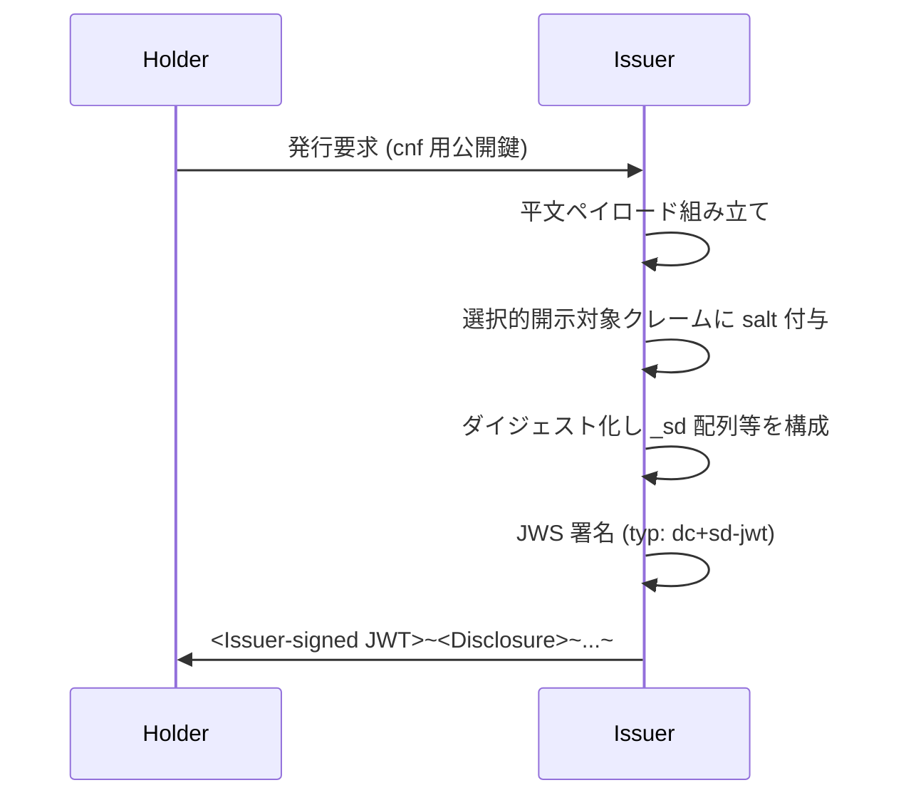
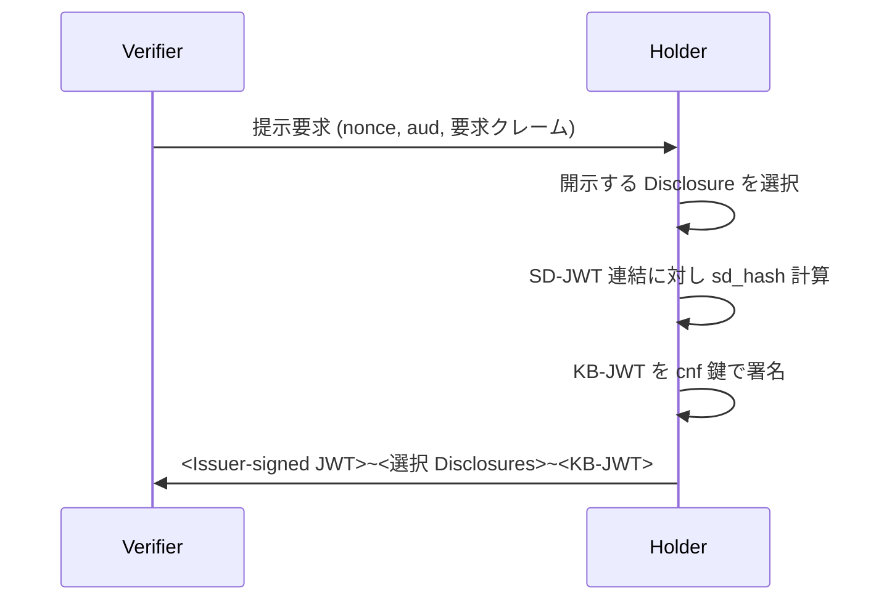

# SD-JWT VC - SD-JWT-based Verifiable Digital Credentials

## 概要

SD-JWT-based Verifiable Digital Credentials（以下 SD-JWT VC）は、検証可能なデジタルクレデンシャル（Verifiable Digital Credential, VC）を JSON ペイロードと JWS 署名で表現し、Selective Disclosure for JWTs（SD-JWT, RFC 9901）の選択的開示機構に乗せて発行・提示するためのデータフォーマットおよび処理規則を定義する仕様である。本記事執筆時点では `draft-ietf-oauth-sd-jwt-vc-16` として IETF OAuth WG で策定中であり、Intended Status は Proposed Standard である。

SD-JWT VC は、OpenID for Verifiable Credential Issuance（OpenID4VCI）や OpenID for Verifiable Presentations（OpenID4VP）といったウォレット系プロトコルにおける「実際にやり取りされるクレデンシャル本体」のフォーマットとして採用されており、W3C Verifiable Credentials Data Model とは別系統の、JWT 中心の VC フォーマットとして位置付けられる。

## 解決する課題

JWT は OAuth / OpenID Connect の世界で広く使われてきたが、ウォレットに格納する長寿命のクレデンシャル用途では以下の課題があった。

- **選択的開示が困難**: 通常の JWS 署名付き JWT は、署名対象を変えずに一部クレームだけ提示することができない。氏名・生年月日・住所などを含む身分証クレデンシャルを、必要な要素だけ Verifier に渡せない。
- **Holder の鍵保有証明（Key Binding）が標準化されていない**: クレデンシャルが提示者本人のものであることを暗号的に示す仕組みが、JWT 単体には存在しない。
- **クレデンシャル種別（type）の表現が曖昧**: W3C VC では `type` 配列が使われるが、JWT の世界では「このトークンはどの種類のクレデンシャルか」を一意かつ拡張可能に示す共通の枠組みが無かった。
- **失効・状態管理の参照方法が標準化されていない**: 長寿命のクレデンシャルにおいて、失効・一時停止などの状態をどう参照するかが個別実装になっていた。
- **Issuer の公開鍵の発見手順が標準化されていない**: ウォレットや Verifier が Issuer の鍵を取得する方法が共通化されていなかった。

SD-JWT VC は、RFC 9901 の SD-JWT を土台に、これらの課題に対する共通の解を VC ドメインに提供する。

## 主要概念・用語

- **Issuer**: SD-JWT VC を発行する主体。署名鍵を保有し、クレデンシャルに対して JWS 署名を行う。
- **Holder**: Issuer から発行されたクレデンシャルをウォレット等に保持し、必要に応じて Verifier に提示する主体。
- **Verifier**: Holder から提示された SD-JWT VC を検証する主体。
- **SD-JWT VC**: RFC 9901 で定義された SD-JWT 形式を用いて符号化された検証可能なデジタルクレデンシャル。
- **Issuer-signed JWT**: SD-JWT VC の本体である Issuer 署名付き JWT。選択的開示の対象となるクレームはダイジェスト化されて格納される。
- **Disclosure**: 選択的開示対象クレームの平文値を保持する文字列。RFC 9901 で定義される。
- **Key Binding**: クレデンシャルに紐付く暗号鍵（`cnf` クレームで参照される鍵）を Holder が保有していることの証明機構。
- **KB-JWT (Key Binding JWT)**: Holder が Verifier へ提示する際に追加する、Key Binding 目的の署名付き JWT。
- **vct (Verifiable Credential Type)**: クレデンシャル種別を示す衝突耐性のある識別子。
- **Type Metadata**: `vct` 識別子に紐づくクレデンシャル種別の表示情報・スキーマ情報・拡張関係を記述したメタデータ。
- **Status List**: クレデンシャルの状態（有効・失効・一時停止など）を一括で表現するリスト。`status` クレームから参照する。

## 全体フロー

SD-JWT VC の発行から提示・検証までの全体像を示す。



## SD-JWT VC のフォーマット

SD-JWT VC は RFC 9901 の SD-JWT と同じく、以下の要素を `~`（チルダ）で連結した文字列として表現される。

```
<Issuer-signed JWT>~<Disclosure 1>~<Disclosure 2>~...~<Disclosure N>~<KB-JWT>
```

- **Issuer-signed JWT**: Issuer による署名付き JWT 本体。後述の SD-JWT VC 固有クレームを含む。
- **Disclosure**: 選択的開示対象クレームの値を salt と共に符号化した文字列。Holder が開示すると判断したものだけが含まれる。
- **KB-JWT**: 提示フェーズで Holder が付与する Key Binding JWT。発行直後など Holder からの提示が伴わない段階では存在しない（末尾は `~` で終わる）。

### JOSE ヘッダ

Issuer-signed JWT の JOSE ヘッダには、以下のような `typ` を指定する。

```json
{
  "alg": "ES256",
  "typ": "dc+sd-jwt"
}
```

`typ` 値 `dc+sd-jwt` は、ペイロードが SD-JWT VC 仕様に従うことを示す。仕様策定の過程で、メディアタイプおよび `typ` 値は当初の `vc+sd-jwt` から `dc+sd-jwt` に変更されており、相互運用性の観点から実装は両方を受け入れることが推奨される。

### メディアタイプ

SD-JWT VC のメディアタイプは `application/dc+sd-jwt` である（旧称 `application/vc+sd-jwt`）。

## JWT クレーム

SD-JWT VC は、以下の登録済み JWT クレームに関する必須性と選択的開示可否の規約を定める。

| クレーム        | 用途                           | 必須性                                   | 選択的開示 |
| --------------- | ------------------------------ | ---------------------------------------- | ---------- |
| `vct`           | クレデンシャル種別識別子       | 必須                                     | 不可       |
| `vct#integrity` | Type Metadata の完全性ハッシュ | 任意                                     | 不可       |
| `iss`           | Issuer の識別子（HTTPS URI）   | 任意                                     | 不可       |
| `iat`           | 発行時刻                       | 任意                                     | 可         |
| `nbf`           | 有効開始時刻                   | 任意                                     | 不可       |
| `exp`           | 有効期限                       | 任意                                     | 不可       |
| `cnf`           | Key Binding 鍵の参照           | Key Binding サポート時必須、それ以外任意 | 不可       |
| `status`        | Status List 参照               | 任意                                     | 不可       |
| `sub`           | Subject 識別子                 | 任意                                     | 可         |

`exp` `nbf` `iss` `cnf` `vct` `vct#integrity` `status` といった「クレデンシャル全体の検証可能性に直結するクレーム」は、Holder の意思で隠せないように選択的開示の対象外とされている。一方で `sub` `iat` などプライバシー観点で隠したい場合があるクレームは、選択的開示の対象とすることができる。

業務固有のクレーム（氏名、生年月日、住所など）は、Issuer の方針に基づき選択的開示の対象とするかどうかを決定する。

## vct と Type Metadata

`vct` クレームは、クレデンシャル種別を一意に示す **Collision-Resistant Name** である。一般的には Issuer が管理する HTTPS URL を使用する。

```
"vct": "https://credentials.example.com/identity_credential"
```

`vct` は単なる識別子だが、これに紐づく **Type Metadata** を別途公開することで、Verifier やウォレットがクレデンシャル種別を解釈するための情報を取得できる。Type Metadata は典型的には以下のような JSON で表現される。

```json
{
  "vct": "https://betelgeuse.example.com/education_credential/v42",
  "name": "Education Credential",
  "description": "An education credential for Betelgeuse residents",
  "extends": "https://example.com/base_education_credential",
  "display": [
    {
      "lang": "ja-JP",
      "name": "学習証明"
    }
  ],
  "claims": [
    {
      "path": ["name"],
      "mandatory": true,
      "sd": "allowed",
      "display": [{ "lang": "ja-JP", "label": "氏名" }]
    }
  ]
}
```

主なフィールド:

- `vct`（必須）: 対象となる種別識別子
- `name` / `description`（任意）: 人間可読な説明
- `extends`（任意）: 他の Type Metadata を継承する場合の親 `vct`
- `extends#integrity`（任意）: `extends` で参照するドキュメントの完全性ハッシュ
- `display`（任意）: 言語ごとの表示情報
- `claims`（任意）: 各クレームに関するメタデータ（必須性 `mandatory`、選択的開示の可否 `sd`、表示ラベル等）

`extends` による継承はチェーンを形成し得るが、循環参照（circular extends）は検出して拒否しなければならない。

なお、Issuer-signed JWT 側に `vct#integrity` クレームを含めると、その `vct` に対応する Type Metadata の完全性を Verifier がハッシュで検証できる。Type Metadata の取得後にハッシュを比較することで、想定したメタデータ定義に基づいてクレデンシャルが解釈されることを保証する。

## cnf と Key Binding

Holder が「このクレデンシャルは自分のものである」ことを示すため、Issuer はクレデンシャルに `cnf`（Confirmation）クレームを埋め込み、Holder の公開鍵を参照する。

```json
"cnf": {
  "jwk": {
    "kty": "EC",
    "crv": "P-256",
    "x": "TCAER19Zvu3OHF4j4W4vfSVoHIP1ILilDls7vCeGemc",
    "y": "ZxjiWWbZMQGHVWKVQ4hbSIirsVfuecCE6t4jT9F2HZQ"
  }
}
```

Key Binding が必須のユースケースでは、Holder は提示時に **KB-JWT** を生成し、`cnf` で参照される鍵で署名する。KB-JWT のペイロード例:

```json
{
  "nonce": "1234567890",
  "aud": "https://example.com/verifier",
  "iat": 1777056840,
  "sd_hash": "h28cichc0OJXvc9F9XOdMRPuPE0eXB1PxpqSNybMrLLU"
}
```

- `nonce`: Verifier から提示要求と共に与えられる値。リプレイ攻撃を防ぐ。
- `aud`: 提示先 Verifier の識別子。誤った相手への送信を検出する。
- `iat`: KB-JWT の発行時刻。
- `sd_hash`: 提示する SD-JWT（Issuer-signed JWT と Disclosure 群を連結した文字列）のハッシュ。提示物自体への束縛として機能する。

検証フローは RFC 9901 の Key Binding JWT 検証手順に従い、`cnf` 鍵での署名検証、`aud`・`nonce`・`iat`・`sd_hash` の検証を行う。

## 失効・状態管理

`status` クレームは、クレデンシャルの状態（有効・失効・一時停止など）を表す Status List への参照を保持する。Status List 自体は OAuth Status List 仕様（`draft-ietf-oauth-status-list`）で定義され、JWT 形式の Status List Token として配布される。Verifier はクレデンシャルを検証する際、`status` から参照される Status List を取得し、当該クレデンシャルのインデックスに対応するビット列を確認することで、現在の状態を判定する。

これにより、個々のクレデンシャル単位ではなく、Issuer が一括管理するリスト上での状態反映が可能となり、プライバシーと運用性のバランスを取った失効管理が実現される。

## Issuer メタデータの発見

Verifier は Issuer の公開鍵を取得するため、`iss` クレームを起点に well-known エンドポイントを問い合わせる。`iss` の URL は HTTPS であり、クエリ・フラグメントを含まないこと、また `/.well-known/jwt-vc-issuer` は URL のホスト部とパス部の**間**に挿入される点に注意する。

```
iss = https://example.com
→ GET https://example.com/.well-known/jwt-vc-issuer

iss = https://example.com/tenant/1234
→ GET https://example.com/.well-known/jwt-vc-issuer/tenant/1234
```

レスポンスは JSON で、以下のフィールドを含む。

- `issuer`（必須）: `iss` 値と完全一致しなければならない
- `jwks` または `jwks_uri`: いずれか一方を必ず含め、両方を同時に含めてはならない

Verifier はここから取得した鍵集合を用いて、Issuer-signed JWT の署名を検証する。`kid` ヘッダパラメータを併用することで、鍵集合中の該当鍵を特定する。

## ペイロード例

選択的開示前の論理的なペイロード例を示す（実際の Issuer-signed JWT では `given_name` 等はダイジェスト化されている）。

```json
{
  "iss": "https://credentials.example.com",
  "iat": 1735689600,
  "exp": 1883000000,
  "vct": "https://credentials.example.com/identity_credential",
  "cnf": {
    "jwk": {
      "kty": "EC",
      "crv": "P-256",
      "x": "TCAER19Zvu3OHF4j4W4vfSVoHIP1ILilDls7vCeGemc",
      "y": "ZxjiWWbZMQGHVWKVQ4hbSIirsVfuecCE6t4jT9F2HZQ"
    }
  },
  "status": {
    "status_list": {
      "idx": 0,
      "uri": "https://example.com/statuslists/1"
    }
  },
  "given_name": "Taro",
  "family_name": "Yamada",
  "email": "taro@example.com",
  "address": {
    "street_address": "1-2-3 Kasumigaseki",
    "locality": "Chiyoda-ku",
    "region": "Tokyo"
  }
}
```

提示時、Holder は `given_name` のみを開示すると決めた場合、対応する Disclosure 文字列のみを SD-JWT の連結に含め、それ以外は省略する。Verifier 側ではダイジェスト一致確認により改ざんが無いことを保証しつつ、開示された値のみを取得する。

## 発行・提示フローの詳細

### 発行



### 提示



### 検証

検証側は以下の順序で処理する。

1. 構文の分解と Disclosure 群・KB-JWT の分離（RFC 9901 準拠）
2. `iss` から `.well-known/jwt-vc-issuer` を取得し、Issuer 公開鍵を入手
3. Issuer-signed JWT の署名検証
4. `vct` の確認と、必要に応じた Type Metadata の取得・整合性検証
5. 各 Disclosure をダイジェスト化し、Issuer-signed JWT 内のダイジェストと突合
6. KB-JWT が必要なユースケースでは、`cnf` の鍵で署名検証、`aud`・`nonce`・`iat`・`sd_hash` を確認
7. `exp` `nbf` の時刻検証
8. `status` から Status List を取得し、当該クレデンシャルが失効していないかを確認

## セキュリティに関する考慮事項

SD-JWT VC は RFC 9901（SD-JWT）および RFC 7519（JWT）のセキュリティ考慮事項をすべて継承した上で、固有の論点を追加している。

- **SSRF 対策**: Issuer メタデータ取得や Type Metadata 取得時に外部 URL を解決するため、サーバサイドリクエストフォージェリを防ぐためのアドレス・スキーム制限が必要。
- **Type Metadata の信頼**: `vct` 識別子の発行者と Type Metadata の公開者が一致するか、または公開者が認可されているかの確認が必要。任意の第三者が任意の `vct` についてメタデータを発行できると、誤解釈のリスクが生じる。
- **circular extends の検出**: Type Metadata の `extends` チェーンが循環していないことを検出し、無限ループを防止しなければならない。
- **Issuer 認可の代替にしない**: ある Type Metadata が他の `vct` を `extends` していても、それは「実 Issuer がその種別を発行する権限を持つ」ことを意味しない。Verifier は Issuer 自体の信頼判断を別途行う必要がある。
- **テキスト情報のエスケープ**: `display.name` などのテキスト情報をそのまま UI にレンダリングすると XSS 等のリスクがあるため、適切なエスケープが必要。
- **Key Binding の必要性判断**: ユースケースに応じて KB-JWT を要求するかを Verifier が明確に決定し、不要に省略しないこと。
- **エコシステム検証ルールの整合性**: 公開鍵の取得手段（`.well-known` ベースや別の信頼アンカーベース）が複数存在しうるため、各エコシステムで一貫した検証規則を運用する。

## 関連仕様

- **RFC 9901**: Selective Disclosure for JWTs (SD-JWT)。SD-JWT VC の基盤フォーマット。
- **RFC 7519**: JSON Web Token (JWT)。
- **RFC 7515 / 7517 / 7518**: JWS / JWK / JWA。署名と鍵表現の基盤。
- **OpenID for Verifiable Credential Issuance (OpenID4VCI)**: SD-JWT VC をクレデンシャル形式の一つとして扱う発行プロトコル。
- **OpenID for Verifiable Presentations (OpenID4VP)**: SD-JWT VC を提示するプロトコル。
- **draft-ietf-oauth-status-list**: `status` クレームから参照される Status List Token の仕様。
- **W3C Verifiable Credentials Data Model 2.0**: 同じく VC を扱うが、JSON-LD 中心の別系統フォーマット。

## 参考文献

- IETF Datatracker: [draft-ietf-oauth-sd-jwt-vc](https://datatracker.ietf.org/doc/draft-ietf-oauth-sd-jwt-vc/)
- 最新版本文: [draft-ietf-oauth-sd-jwt-vc-16](https://datatracker.ietf.org/doc/html/draft-ietf-oauth-sd-jwt-vc-16)
- RFC 9901: [Selective Disclosure for JWTs (SD-JWT)](https://www.rfc-editor.org/rfc/rfc9901.html)
- IETF OAuth Working Group: [Status List Draft](https://datatracker.ietf.org/doc/draft-ietf-oauth-status-list/)
