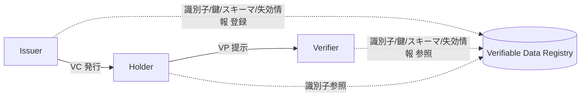
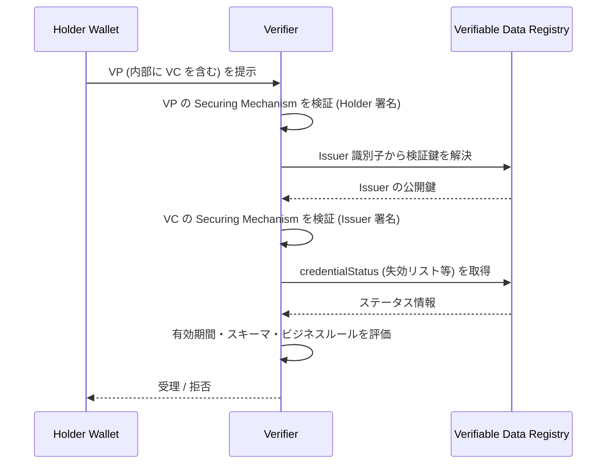

# W3C Verifiable Credentials Data Model v2.0

## 概要

Verifiable Credentials Data Model v2.0 (以下 VCDM 2.0) は、W3C Verifiable Credentials Working Group が策定した、Web 上で表明・伝達・検証可能な「クレデンシャル」の共通データモデル仕様である。物理世界の運転免許証・卒業証書・社員証などに相当するデジタル証明書を、発行者 (Issuer)・所持者 (Holder)・検証者 (Verifier) の三者間で安全に流通させるための表現形式と必須要素、および暗号的な保護 (securing) の枠組みを規定する。

VCDM 1.1 (2022 年勧告) を継承しつつ、`@context` URL の刷新、`issuanceDate`/`expirationDate` から `validFrom`/`validUntil` への置き換え、`name`/`description` のクレデンシャル本体への昇格、Securing Mechanism の仕様分離など、相互運用性と将来拡張性を高めるための整理が行われたバージョンである。W3C DID Core 1.0 と組み合わせて、ポータブルかつ Subject 主導のデジタルアイデンティティスタックの中核を成す。

## 解決する課題

従来の Web 上のアイデンティティ表現には次のような課題があった。

- フェデレーション認証 (SAML, OpenID Connect) は IdP が常時オンラインであり、IdP・RP 間でクレデンシャルの所在と検証可能性が結合してしまう
- IdP は Subject に関するアサーションを発行する都度、検証者 (RP) と直接通信する必要があり、検証者ごとに Subject の動向が可観測になる
- 紙やプラスチックの証明書は持ち運びや改ざん防止に優れる一方、デジタル流通や機械可読性、選択的開示の点で制限が大きい
- 既存の X.509 証明書はデータモデルが PKI に強く結合しており、任意のクレーム表現や柔軟な失効・更新運用に向かない

VCDM 2.0 はこれらに対し、以下の特徴を持つクレデンシャル表現を提供する。

- Issuer・Holder・Verifier の三者モデルにより、Holder を介した間接伝達と Issuer/Verifier 間の非通信が可能 (Issuer は Verifier を知らずに済む)
- JSON-LD ベースの拡張可能な claim 表現と、Securing Mechanism による暗号的保護を分離
- 選択的開示・非相関化・最小開示などプライバシ保護機構との親和性
- Verifiable Data Registry を任意化し、DID, Web, 台帳など多様な信頼基盤と組み合わせ可能

## 主要概念・用語

| 用語                         | 定義                                                                       |
| ---------------------------- | -------------------------------------------------------------------------- |
| Claim                        | Subject についての主張 (例: 「Alice は学士号を持つ」)                      |
| Credential                   | Issuer が発行する 1 つ以上の Claim の集合                                  |
| Verifiable Credential (VC)   | Securing Mechanism により改ざん検出と発行者検証が可能な Credential         |
| Presentation                 | Holder が 1 つ以上の VC から構成して Verifier に提示するデータ             |
| Verifiable Presentation (VP) | Securing Mechanism により改ざん検出と提示者検証が可能な Presentation       |
| Issuer                       | Subject に関する Claim を主張し、VC を生成して Holder に渡すエンティティ   |
| Holder                       | VC を保持し、Verifier に対して VP を生成・提示するエンティティ             |
| Verifier                     | VP (または VC) を受け取り、その validity を検証するエンティティ            |
| Subject                      | Claim の対象となるエンティティ。多くの場合 Holder と一致するが必須ではない |
| Verifiable Data Registry     | 識別子・スキーマ・検証鍵・失効情報などを保持する基盤 (DID 台帳・Web 等)    |
| Securing Mechanism           | VC/VP に対し改ざん検出と作成者検証を提供する暗号的仕組み                   |

## エコシステムと三者モデル

VCDM 2.0 の中核は、Issuer・Holder・Verifier の三者と、それらが参照する Verifiable Data Registry から成る「三者モデル (three-party model)」である。



- Issuer は VC を Holder に発行するのみで、Verifier と直接通信する必要はない
- Holder は受け取った VC を自らのウォレットに保管し、必要に応じて VP を構成して Verifier に提示する
- Verifier は Issuer の公開鍵・スキーマ・失効状態などを Verifiable Data Registry から取得し、独立に検証できる

この分離により、Issuer は Verifier の存在を知る必要がなく、Verifier ごとに Holder のアクセスを観測できないという「非相関化」が成立する。これは OAuth/OIDC の二者間トークンとは構造的に異なる重要な性質である。

## クレデンシャルの構造

### 基本構造

VC は JSON (JSON-LD 互換) の文書であり、以下の必須要素を持つ。

| プロパティ          | 必須 | 説明                                                                   |
| ------------------- | ---- | ---------------------------------------------------------------------- |
| `@context`          | 必須 | 先頭は `https://www.w3.org/ns/credentials/v2`。意味論を規定            |
| `type`              | 必須 | 配列。`VerifiableCredential` を必ず含み、具体型を追加できる            |
| `issuer`            | 必須 | Issuer の識別子 (URL や DID)。または `id` を持つオブジェクト           |
| `credentialSubject` | 必須 | Subject に関する Claim の集合                                          |
| `validFrom`         | 任意 | クレデンシャルが有効になる日時 (`XMLSCHEMA11-2` の dateTimeStamp 形式) |
| `validUntil`        | 任意 | クレデンシャルが失効する日時                                           |
| `id`                | 任意 | クレデンシャル自体の識別子                                             |
| `name`              | 任意 | 人間可読な名称                                                         |
| `description`       | 任意 | 人間可読な説明                                                         |
| `credentialStatus`  | 任意 | 失効状態を確認する仕組み (例: `BitstringStatusList`)                   |
| `credentialSchema`  | 任意 | クレーム構造の検証に用いるスキーマ                                     |
| `termsOfUse`        | 任意 | 利用条件                                                               |
| `evidence`          | 任意 | Issuer が Claim を発行する根拠                                         |
| `refreshService`    | 任意 | クレデンシャル更新サービスの情報                                       |

VCDM 1.1 では `issuanceDate`/`expirationDate` であった日時プロパティは、VCDM 2.0 で `validFrom`/`validUntil` に整理された (発行時点と有効開始時点の混同を避けるため)。

### VC の例

```json
{
  "@context": [
    "https://www.w3.org/ns/credentials/v2",
    "https://www.w3.org/ns/credentials/examples/v2"
  ],
  "id": "http://university.example/credentials/3732",
  "type": ["VerifiableCredential", "ExampleDegreeCredential"],
  "issuer": "https://university.example/issuers/565049",
  "validFrom": "2010-01-01T00:00:00Z",
  "credentialSubject": {
    "id": "did:example:ebfeb1f712ebc6f1c276e12ec21",
    "degree": {
      "type": "ExampleBachelorDegree",
      "name": "Bachelor of Science and Arts"
    }
  }
}
```

上記はまだ Securing されていない「未保護のクレデンシャル」であり、流通させるには後述の Securing Mechanism による署名が必要である。

### Presentation の構造

VP は Holder が 1 つ以上の VC を内包して構成する文書であり、`type` に `VerifiablePresentation` を含む。Holder の鍵で署名することで、提示者と提示時点のバインドを Verifier に対して証明できる。

```json
{
  "@context": ["https://www.w3.org/ns/credentials/v2"],
  "type": ["VerifiablePresentation"],
  "verifiableCredential": [
    {
      /* VC */
    }
  ]
}
```

## Securing Mechanism

VCDM 2.0 は、データモデル本体から「暗号的保護の方式」を切り離し、Securing Mechanism として外部仕様で規定する設計を採用している。これにより、用途や運用環境に応じて方式を選択できる。

主要な Securing Mechanism は次の通り。

| Securing Mechanism                              | 種別           | 概要                                                                     |
| ----------------------------------------------- | -------------- | ------------------------------------------------------------------------ |
| Data Integrity (VC Data Integrity 1.0)          | Embedded Proof | VC 本体に `proof` プロパティを埋め込み、JSON-LD 文書に対する署名を行う   |
| VC-JOSE-COSE (Securing VCs using JOSE and COSE) | Enveloping     | VC 全体を JWT / SD-JWT / COSE_Sign1 などで包み、JOSE/COSE 標準で署名する |
| SD-JWT VC (IETF)                                | Enveloping     | SD-JWT による選択的開示と互換な形式で VC を表現                          |

### Embedded Proof (Data Integrity)

`proof` プロパティを VC 内に直接保持する方式で、JSON-LD 正規化 (RDF Dataset Canonicalization) を介してハッシュ化・署名する。BBS+ などの選択的開示対応スイートと組み合わせやすい。

```json
{
  "@context": ["https://www.w3.org/ns/credentials/v2"],
  "type": ["VerifiableCredential"],
  "issuer": "did:example:issuer",
  "credentialSubject": { "id": "did:example:subject" },
  "proof": {
    "type": "DataIntegrityProof",
    "cryptosuite": "eddsa-rdfc-2022",
    "created": "2026-01-01T00:00:00Z",
    "verificationMethod": "did:example:issuer#key-1",
    "proofPurpose": "assertionMethod",
    "proofValue": "z58DAdFfa9SkqZMVPxAQp..."
  }
}
```

### Enveloping Proof (VC-JWT / SD-JWT VC)

VC 全体を JWT (または COSE) のペイロードに格納し、JOSE/COSE のヘッダ・署名で保護する。`typ` ヘッダで `vc+jwt` や `vc+sd-jwt` などを示し、Verifier はまず JWT を検証してからクレデンシャルとして処理する。SD-JWT 形式を採用すると、Disclosure 単位で Holder が開示するクレームを選択できる。

### 検証フロー

Verifier が VP を受け取った際の典型的な検証プロセスを示す。



## ステータスとスキーマ

### credentialStatus

`credentialStatus` プロパティで、失効や一時停止などの状態を確認する仕組みを参照できる。VCDM 2.0 の文脈では、Bitstring Status List (W3C) などのプライバシ配慮された方式が想定される。Verifier は Issuer ごとのステータスエンドポイントに問い合わせることなく、ビットストリングを取得してインデックスから状態を判定できる。

### credentialSchema

`credentialSchema` プロパティは、`credentialSubject` の構造を検証するためのスキーマ (JSON Schema や独自スキーマ言語) を参照する。Verifier は受領した VC が想定する claim 構造に準拠しているかを機械的に確認できる。

## 用語・モデル上の重要な区別

- **Validation と Verification**: 「Verification」は Securing Mechanism と必須プロパティの形式的な検証を指し、「Validation」はビジネス的な妥当性 (発行者が信頼に値するか、Claim が業務要件を満たすか) を指す。VCDM 2.0 は前者のみを規定し、後者は各 Verifier のポリシに委ねる
- **Holder と Subject**: 多くのユースケースでは一致するが、保護者が子供の VC を保持する場合のように分離できる
- **Bearer VC**: `credentialSubject.id` を持たない VC は所持の事実のみで利用可能 (bearer 的) になる。プライバシ向上に有用だが、盗難リスクとのトレードオフがある

## セキュリティに関する考慮事項

- **鍵管理**: Issuer・Holder の鍵漏えいは VC/VP の偽造に直結する。HSM・セキュアエレメントの利用が推奨される
- **リプレイ攻撃**: VP には `nonce` や `audience` を含めてリプレイを防ぐ必要がある (Securing Mechanism 側で規定)
- **改ざん検出**: Securing Mechanism が正しく適用されていない VC は信頼してはならない
- **失効確認**: 高リスクなトランザクションでは `credentialStatus` の取得と検証を必須とする
- **アルゴリズム同意**: Issuer と Verifier の双方がサポートする署名アルゴリズム・cryptosuite を合意する必要がある

## プライバシに関する考慮事項

VCDM 2.0 は、デザイン全体を通じてプライバシ保護を重視している。

- **選択的開示**: SD-JWT VC や BBS+ ベースの Data Integrity スイートにより、必要な claim のみを開示できる
- **非相関化 (Unlinkability)**: 同一の VC を複数 Verifier に提示するとき、Issuer 署名がそのまま相関子になりうる。Pairwise な Subject 識別子や ZKP ベースの再ランダム化が推奨される
- **最小開示**: 例えば「年齢が 18 歳以上」など、原値の代わりに述語的な claim を発行する
- **Holder バインディング**: VC に Subject の鍵を埋め込む場合、鍵そのものが相関子になりうる。1 回限りの鍵や鍵ローテーションが検討される
- **メタデータ漏えい**: `credentialSchema` や `termsOfUse` の URL から Issuer / Verifier の挙動が観測される可能性があり、Hosted Status List やキャッシュ運用が推奨される

仕様自身も、「Verifiability of a credential does not imply the truth of claims encoded therein」と明記しており、Verifier 側での独立した Validation が不可欠であることを強調している。

## 関連仕様

- **W3C DID Core 1.0**: VC の Issuer / Subject / Holder の識別子として広く用いられる
- **W3C VC Data Integrity 1.0**: Embedded Proof の Securing Mechanism
- **Securing Verifiable Credentials using JOSE and COSE (VC-JOSE-COSE)**: Enveloping Proof の Securing Mechanism
- **IETF SD-JWT / SD-JWT VC**: 選択的開示に対応する Enveloping 形式
- **W3C Bitstring Status List**: プライバシ配慮型の失効ステータス
- **OpenID for Verifiable Credential Issuance (OID4VCI)**: OAuth ベースの VC 発行プロトコル
- **OpenID for Verifiable Presentations (OID4VP)**: OAuth/OIDC ベースの VP 提示プロトコル
- **W3C Digital Credentials API**: ブラウザ経由で VP をやり取りする Web API

## 参考文献

- [Verifiable Credentials Data Model v2.0 (W3C Recommendation)](https://www.w3.org/TR/vc-data-model-2.0/)
- [Verifiable Credentials Data Integrity 1.0](https://www.w3.org/TR/vc-data-integrity/)
- [Securing Verifiable Credentials using JOSE and COSE](https://www.w3.org/TR/vc-jose-cose/)
- [Bitstring Status List v1.0](https://www.w3.org/TR/vc-bitstring-status-list/)
- [Verifiable Credentials Working Group](https://www.w3.org/groups/wg/vc/)
