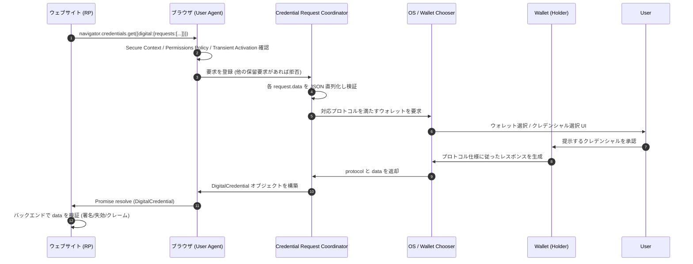
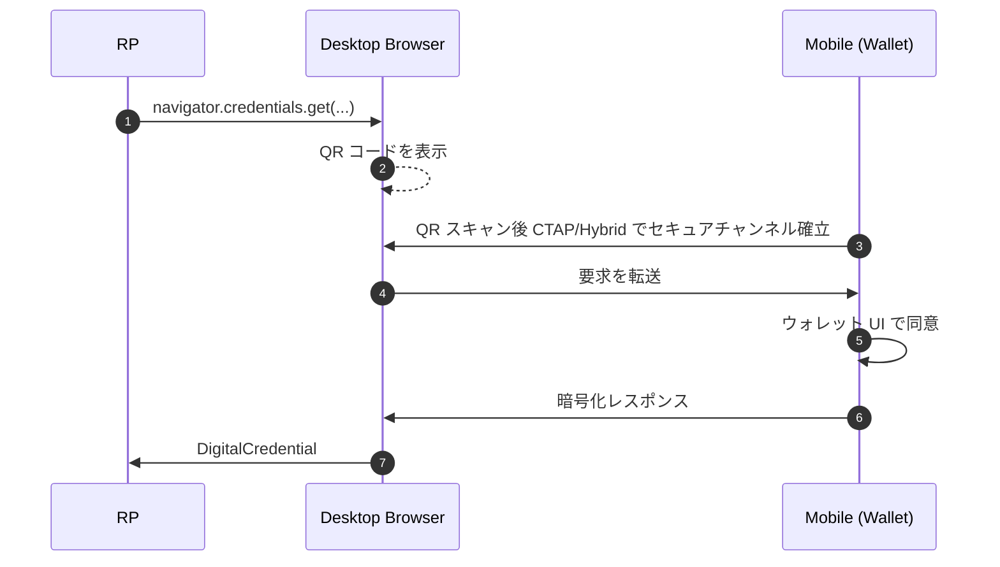

# W3C Digital Credentials API - ブラウザ仲介によるクレデンシャル提示・発行 API

## 概要

Digital Credentials API (以下 DC API) は、Web プラットフォーム上で動作するウェブサイト (Verifier または Issuer) が、ユーザエージェント (ブラウザ) を介してユーザのデジタルウォレットに対しクレデンシャルの提示要求または発行要求を行うための JavaScript API である。W3C Federated Identity Working Group (旧 FedID CG を経て WG に昇格) で策定されており、2026 年 5 月 14 日付の Working Draft が最新版となっている。

DC API 自体はクレデンシャルの構造、署名アルゴリズム、トラストモデルを規定しない。仕様はあくまで「ブラウザがどのように OS / ウォレットとの仲介を行い、Web 側に結果を返すか」というプラットフォームレイヤを定義し、実際のクレデンシャルプロトコル (OpenID for Verifiable Presentations 1.0、ISO/IEC 18013-7 など) は別途定義された「プロトコル」識別子で参照する設計を採る。

WebAuthn が「認証器との通信プロトコル (CTAP) を仲介するブラウザ API」として定着したのと同様に、DC API は「ウォレットとの通信プロトコル (OID4VP / OID4VCI / mdoc) を仲介するブラウザ API」と位置付けられる。

## 解決する課題

スマートフォン OS のウォレットには mDL (モバイル運転免許証)、EUDI Wallet、各種 Verifiable Credential が蓄積されつつあるが、これらをウェブから利用するための統一インターフェースは長く存在しなかった。各 RP がカスタム URI スキームやアプリリンクで個別対応する状況は以下の問題を生んでいた。

- フィッシング耐性の欠如: 任意のオリジンがカスタム URI 経由でウォレットに直接話しかける構造はオリジン拘束を欠く
- クロスデバイス UX の断片化: PC ブラウザからモバイルウォレットを呼び出すフローが各実装でバラバラ
- 同意 UI の信頼性: ウォレットに渡すデータの正当性をブラウザが検査できない
- ブラウザによるユーザ保護不能: 悪質な RP に対するレートリミットやポリシー強制がプラットフォームレベルで効かない

DC API はこれらをブラウザ標準化することで、Web プラットフォームのセキュリティモデル (オリジン、Secure Context、Permissions Policy、Transient Activation) をクレデンシャル交換にも適用する。

## 主要概念・用語

- Credential Request Coordinator: 仕様が定義する内部状態機械。RP からの要求受付、ユーザエージェントによる検証、ウォレット選択、応答の引き渡しまでを一貫して管理する。複数の並行要求の防止 (API flooding 対策) を担う。
- Presentation Protocol: 既存クレデンシャルの提示に用いるプロトコル。`openid4vp-v1-unsigned` などの識別子で指定する。
- Issuance Protocol: 新規クレデンシャルの発行に用いるプロトコル。`openid4vci-v1` が登録されている。
- Transient Activation: ユーザのジェスチャ (クリック、タップ等) によって付与される短期間のアクティベーション状態。DC API 呼び出しはこれを消費し、サイレント呼び出しを防止する。
- User Mediation: ユーザの明示的な同意操作を必須とする概念。DC API では `mediation` メンバの値にかかわらず常に required 相当の挙動を取る。
- Encrypted Response: ウォレットがブラウザに返すレスポンスは原則として RP の公開鍵で暗号化されたペイロードを含み、ブラウザは内容を解釈しない。

## API サーフェス

DC API は Credential Management Level 1 を拡張し、`navigator.credentials.get()` および `navigator.credentials.create()` の `digital` メンバとして組み込まれる。

### WebIDL

```webidl
typedef (DigitalCredentialPresentationProtocol
         or DigitalCredentialIssuanceProtocol) DigitalCredentialProtocol;

[Exposed=Window, SecureContext]
interface DigitalCredential : Credential {
  object toJSON();
  readonly attribute DigitalCredentialProtocol protocol;
  readonly attribute object data;
  static boolean userAgentAllowsProtocol(DOMString protocol);
};

partial dictionary CredentialRequestOptions {
  DigitalCredentialRequestOptions digital;
};

dictionary DigitalCredentialRequestOptions {
  required sequence<DigitalCredentialGetRequest> requests;
};

dictionary DigitalCredentialGetRequest {
  required DOMString protocol;
  required object data;
};

partial dictionary CredentialCreationOptions {
  DigitalCredentialCreationOptions digital;
};

dictionary DigitalCredentialCreationOptions {
  required sequence<DigitalCredentialCreateRequest> requests;
};

dictionary DigitalCredentialCreateRequest {
  required DOMString protocol;
  required object data;
};
```

### 提示要求 (get)

```javascript
const credential = await navigator.credentials.get({
  digital: {
    requests: [
      {
        protocol: "openid4vp-v1-unsigned",
        data: {
          response_type: "vp_token",
          nonce: "n-0S6_WzA2Mj",
          client_metadata: {
            vp_formats_supported: {
              "dc+sd-jwt": { "sd-jwt_alg_values": ["ES256"] },
            },
          },
          dcql_query: {
            credentials: [
              {
                id: "pid",
                format: "dc+sd-jwt",
                claims: [{ path: ["age_over_18"] }],
              },
            ],
          },
        },
      },
    ],
  },
});

// credential.protocol === "openid4vp-v1-unsigned"
// credential.data はプロトコル固有のレスポンスオブジェクト
```

`requests` 配列に複数のプロトコル候補を並べることができ、ユーザエージェントは利用可能なウォレットが対応するものを選択する。これにより RP は「OID4VP もサポート、mdoc もサポート」といったフォールバックを表現できる。

### 発行要求 (create)

```javascript
const credential = await navigator.credentials.create({
  digital: {
    requests: [
      {
        protocol: "openid4vci-v1",
        data: {
          /* OID4VCI Credential Offer に相当する情報 */
        },
      },
    ],
  },
});
```

発行フローは 2026 年 5 月時点でなお調整中で、OpenID Foundation 側の OID4VCI 連携作業と並行して進められている。

### 機能検出

```javascript
if (
  "DigitalCredential" in window &&
  DigitalCredential.userAgentAllowsProtocol("openid4vp-v1-unsigned")
) {
  // DC API および当該プロトコルが利用可能
}
```

`userAgentAllowsProtocol()` はブラウザがサポートを公言するプロトコル識別子を判定する静的メソッドで、機能検出に用いる。

## プロトコルレジストリ

仕様は本文中の表として「サポートされるプロトコル」を列挙する形式を採る (独立した IANA 風レジストリ文書は持たない)。2026 年 5 月時点の登録は以下の通り。

| 識別子                     | 種別 | 参照                                      | 備考                              |
| -------------------------- | ---- | ----------------------------------------- | --------------------------------- |
| `openid4vp-v1-unsigned`    | 提示 | OpenID for Verifiable Presentations 1.0   | 署名なし要求                      |
| `openid4vp-v1-signed`      | 提示 | OpenID for Verifiable Presentations 1.0   | 単一 JWS で要求を署名             |
| `openid4vp-v1-multisigned` | 提示 | OpenID for Verifiable Presentations 1.0   | JWS JSON Serialization で複数署名 |
| `org-iso-mdoc`             | 提示 | ISO/IEC 18013-7:2025 Annex C              | mDL を含む mdoc 形式のウェブ提示  |
| `openid4vci-v1`            | 発行 | OpenID for Verifiable Credential Issuance | 発行フロー (Web 統合は調整中)     |

新規プロトコルは仕様の改版 (Working Draft の更新) を通じて追加される。識別子の安定性を担保するため、署名方式や前提とするバインディングが異なる派生は別識別子として分離する方針が取られている。

## 全体フロー

### 単一デバイス (Same-Device) フロー



### クロスデバイス (Cross-Device) フロー

PC ブラウザがモバイルウォレットを利用する場合、ユーザエージェントは QR コード等を表示し、FIDO2 で用いられる CTAP を流用したエンドツーエンド暗号化チャンネルを介してレスポンスを受領する。仕様は近接性チェック (proximity check) と CTAP の利用を「SHOULD」レベルで推奨する。



## Credential Management Level 1 との統合

DC API は Credential Management Level 1 の `Credential` 階層に `DigitalCredential` を追加する形で統合される。これにより以下の既存セマンティクスを継承する。

- `navigator.credentials.get()` / `create()` の Promise インターフェース
- `AbortSignal` による要求のキャンセル
- Secure Context (`https://` または `localhost`) 必須
- 並行要求の抑制 (Coordinator により単一要求のみ active)

一方、`mediation` メンバは DC API では常に `required` 相当の挙動となり、`silent` や `optional` を指定しても無視 (エラーは投げない) される。これによりサイレント取得や条件付き UI 省略が原理的に不可能となっている。

## Permissions Policy 統合

iframe からの誤用を防ぐため、二つの Policy-Controlled Feature が定義される。

- `digital-credentials-get`: `get()` 経由の提示要求を許可するか。デフォルト allowlist は `'self'`
- `digital-credentials-create`: `create()` 経由の発行要求を許可するか。デフォルト allowlist は `'self'`

クロスオリジンの iframe (例: 埋め込みウィジェット) は、トップレベルドキュメントが明示的に `allow="digital-credentials-get"` を付与しない限り API を呼び出せない。

## セキュリティに関する考慮事項

仕様は脅威モデルとして以下を「In-Scope」として扱う。

- Request tampering (要求改ざん): Secure Context 必須と Permissions Policy で緩和
- API flooding (API 連打による UI 攻撃): Transient Activation 消費と Coordinator による排他制御で緩和
- Unauthorized cross-origin access: Permissions Policy で緩和
- リプレイ攻撃: プロトコル側 (OID4VP の `nonce` 等) に委譲

「Out-of-Scope」として、クレデンシャル自体の真正性検証、Issuer 信頼判断、属性スキーマの検証は明確に対象外とされる。これらは RP のバックエンドおよびトラストフレームワークが担う。

DC API は「ブラウザはクレデンシャルの内容に対して中立である」という設計原則を取るため、ブラウザはコンテンツのフィルタリングや属性の最小化を能動的に行わない。プライバシー保護は (1) プロトコル設計、(2) ウォレットの UI、(3) Permissions Policy の組合せに依存する。

## プライバシーに関する考慮事項

仕様の Privacy Considerations 章は以下を中核的設計目標として掲げる。

- Private by default: 何の操作もしないかぎりウェブサイトはクレデンシャル情報にアクセスできない
- Unencrypted request, opaque encrypted response: 要求はブラウザが検査可能な形 (JSON) で渡し、応答はプロトコルにより暗号化された不透明なペイロードとできる
- Selective Disclosure / Unlinkability: SD-JWT VC や mdoc の選択的開示、BBS+ 等によるアンリンク可能提示をプロトコル層で許容
- Verifier Authorization: Verifier 認可情報をプロトコルで運ぶことを許容 (ブラウザは内容に立ち入らない)

「リクエストは平文、レスポンスは暗号化」という非対称設計は、ブラウザがリクエストの正当性 (例: オリジンとの整合性、過剰な属性要求の検知) を将来的に検査する余地を残しつつ、レスポンス側の PII をユーザエージェントから秘匿することを可能にしている。

## アクセシビリティと自動テスト

仕様は WebDriver BiDi に対する拡張ポイントを定義し、自動テスト環境でウォレットをモックして DC API フローを検証できる枠組みを用意する。これにより RP は CI でクロスブラウザの E2E テストを実行可能になる。

## 関連仕様

- Credential Management Level 1 (`navigator.credentials` の基底仕様)
- WebAuthn Level 3 (同じ Credential 階層を共有する `PublicKeyCredential`)
- FedCM (Federated Credential Management API、フェデレーション認証用の姉妹 API)
- OpenID for Verifiable Presentations 1.0 (`openid4vp-v1-*` プロトコルの定義元)
- OpenID for Verifiable Credential Issuance 1.0 (`openid4vci-v1` プロトコルの定義元)
- ISO/IEC 18013-5 (mDL 基本仕様) および ISO/IEC 18013-7:2025 (mDL のオンライン提示、`org-iso-mdoc` の定義元)
- Permissions Policy (`digital-credentials-get` / `digital-credentials-create` の枠組み)

FedCM が「IdP との連携を能動的に仲介する」のに対し、DC API は「ウォレットとの通信を受動的に転送する」設計であり、両者は対象問題と仲介の度合いが異なる。

## 参考文献

- [W3C Digital Credentials API (Working Draft, 14 May 2026)](https://www.w3.org/TR/digital-credentials/)
- [W3C Federated Identity Working Group](https://www.w3.org/groups/wg/fedid/)
- [Credential Management Level 1](https://www.w3.org/TR/credential-management-1/)
- [OpenID for Verifiable Presentations 1.0](https://openid.net/specs/openid-4-verifiable-presentations-1_0.html)
- [OpenID for Verifiable Credential Issuance 1.0](https://openid.net/specs/openid-4-verifiable-credential-issuance-1_0.html)
- [ISO/IEC 18013-7:2025 — Personal identification — ISO-compliant driving licence — Part 7: Mobile driving licence (mDL) add-on functions](https://www.iso.org/standard/82772.html)
- [Permissions Policy](https://www.w3.org/TR/permissions-policy/)
