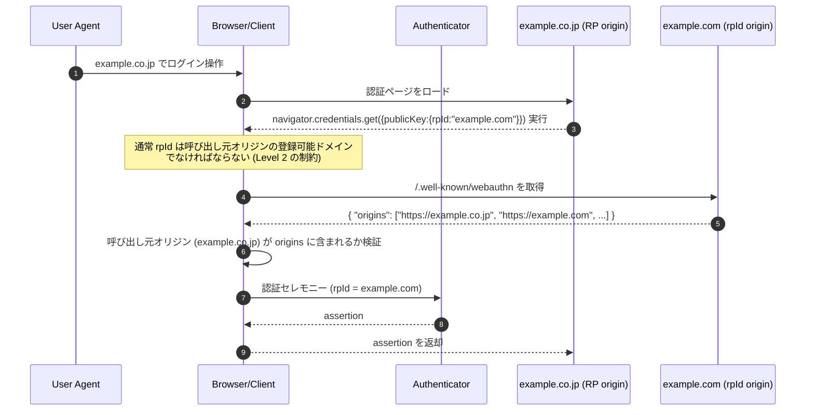
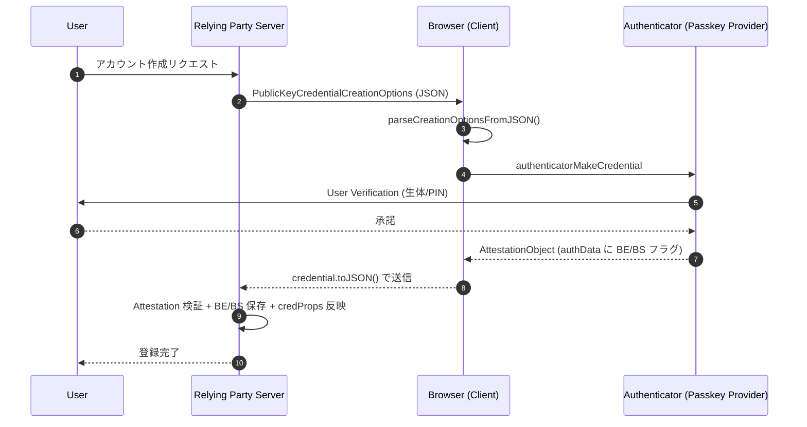
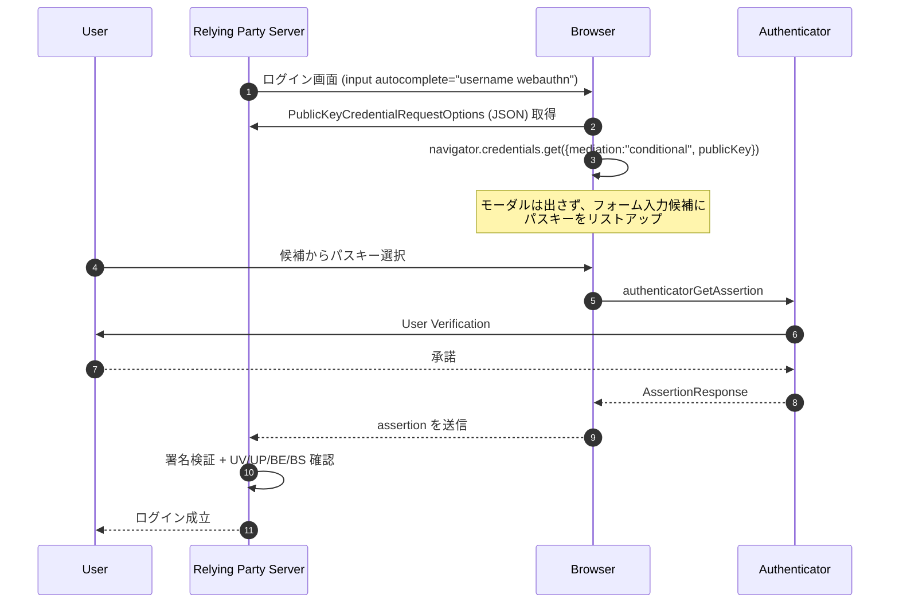

# WebAuthn - Web Authentication API Level 3

## 概要

**Web Authentication: An API for accessing Public Key Credentials - Level 3** (以下 WebAuthn Level 3) は、W3C Web Authentication Working Group と FIDO Alliance が共同で策定する Web 上の公開鍵認証 API の最新版である。2026 年 1 月 13 日付で **Candidate Recommendation Snapshot** として公開された。

WebAuthn Level 2 (2021 年 4 月 W3C 勧告) を基盤としつつ、パスキー (passkey) のクロスデバイス同期、Conditional Mediation によるオートフィル UI、Related Origins (関連オリジン) での認証情報共有、PRF / largeBlob 拡張、JSON シリアライズ API、Signal Methods などのモダンな運用要求に応える機能群が大幅に追加されている。

本記事は Level 2 解説記事（[WebAuthn - Web Authentication API Level 2](./webauthn.md)）と対をなすもので、Level 3 における Level 2 からの主要な差分にフォーカスして解説する。基本概念 (Relying Party / Authenticator / 登録・認証セレモニー / Attestation 等) は Level 2 記事を参照されたい。

## 解決する課題

Level 2 公開以降、WebAuthn を取り巻く環境は以下のように大きく変化した。

- **パスキーの登場**: Apple/Google/Microsoft の各プラットフォームが、認証情報をクラウド経由でデバイス間同期する「マルチデバイス Credential」を提供し、Single Sign On 体験に近い形で公開鍵認証を利用できるようになった
- **オートフィル UX の普及**: パスワードと同じ感覚で、ログイン画面のユーザ名フィールドにパスキー候補が一覧表示される UI が求められるようになった
- **関連オリジン間でのアカウント共有**: `example.com` と `example.co.jp` のように、同一サービスを複数 eTLD+1 で運用する RP が増え、登録済みの Credential を別オリジンでも再利用したい要求が生じた
- **鍵素材の派生 (PRF)**: パスキーをマスタとして E2E 暗号鍵を派生させたい等、認証以外の用途への拡張需要
- **クレデンシャル状態の同期**: RP 側で削除されたアカウント情報を、ユーザの Authenticator 上のメタデータ (パスキーリスト) と整合させる仕組みの不在

Level 3 はこれらの実運用課題を解決するため、API・拡張・Authenticator Data の意味論を更新している。

## 仕様ステータスと主要編集者

- 仕様 URL: <https://www.w3.org/TR/webauthn-3/>
- ステータス: W3C Candidate Recommendation Snapshot (2026-01-13)
- Editor's Draft: <https://w3c.github.io/webauthn/>
- 主要編集者: Tim Cappalli (Okta), Michael B. Jones (Self-Issued Consulting), Akshay Kumar (Microsoft), Emil Lundberg (Yubico), Matthew Miller (Cisco)

## Level 2 からの差分サマリ

| カテゴリ                  | Level 3 での追加・変更                                                                       |
| ------------------------- | -------------------------------------------------------------------------------------------- |
| 用語                      | Passkey, Multi-Device Credential, Single-Device Credential を正式定義                        |
| Authenticator Data フラグ | BE (Backup Eligibility), BS (Backup State) を bit 3 / bit 4 に追加                           |
| API                       | `getClientCapabilities()`, `parseCreationOptionsFromJSON()`, `parseRequestOptionsFromJSON()` |
| API                       | `signalUnknownCredential()`, `signalAllAcceptedCredentials()`, `signalCurrentUserDetails()`  |
| Mediation                 | Conditional Mediation を `navigator.credentials.get({mediation: "conditional"})` で正式化    |
| マルチオリジン            | Related Origin Requests (§5.11) を導入し `/.well-known/webauthn` で検証                      |
| 拡張                      | PRF 拡張 (§10.1.4)、largeBlob 拡張 (§10.1.5) を追加                                          |
| Attestation Format        | Compound Attestation Statement Format (§8.9) を追加                                          |
| アルゴリズム              | EdDSA (Ed25519) など推奨アルゴリズムを引き続き整理                                           |
| ユーザ情報                | `signalCurrentUserDetails` による name / displayName 等の更新フロー                          |

## 用語: Passkey とマルチデバイス Credential

Level 3 §4 で次の用語が新たに正式定義された。

- **Multi-Device Credential**: バックアップ・同期されることが想定された Public Key Credential Source。例として iCloud Keychain や Google Password Manager で同期されるパスキー
- **Single-Device Credential**: 単一の Authenticator にバインドされ、外部に複製されない Credential。例として YubiKey 等のセキュリティキー上の鍵
- **Passkey**: Discoverable Credential (Resident Key) であり、ユーザ検証 (User Verification) が可能な Public Key Credential のこと。Multi-Device / Single-Device のいずれの形態も取り得る

Discoverable Credential である点が重要で、ログイン時に `allowCredentials` を空にしてもクライアントが Credential を発見でき、ユーザ名なしログイン (usernameless) や Conditional Mediation を実現する基礎となる。

## Authenticator Data の BE / BS フラグ

§6.1 Authenticator Data のフラグバイトは、Level 2 で UP/UV/AT/ED が定義されていたが、Level 3 では以下のように bit 3/4 が追加された。

| Bit | 略号 | 名称                     | 意味                                                                      |
| --- | ---- | ------------------------ | ------------------------------------------------------------------------- |
| 0   | UP   | User Presence            | ユーザが物理的に存在し操作したことの確認                                  |
| 1   | RFU1 | Reserved                 | 予約                                                                      |
| 2   | UV   | User Verified            | ユーザ検証 (生体認証 / PIN 等) が成功                                     |
| 3   | BE   | Backup Eligibility       | この Credential はバックアップ対象 (= Multi-Device Credential になり得る) |
| 4   | BS   | Backup State             | この Credential は現在バックアップ済み (= 別デバイスにも存在し得る)       |
| 5   | RFU2 | Reserved                 | 予約                                                                      |
| 6   | AT   | Attested Credential Data | Authenticator Data に Attested Credential Data が含まれる                 |
| 7   | ED   | Extension Data           | Authenticator Data に拡張データが含まれる                                 |

§6.1.3 Credential Backup State より要点を整理する。

- **BE はパーマネント**: ある Public Key Credential Source について BE フラグの値は永続的で、登録後に変化しない
- **BS は可変**: Credential が実際に複製・同期された後で初めて 1 になり、デバイス間同期の停止等で再び 0 になり得る
- BE=0 のとき BS=1 は不正な組み合わせ

RP はこれらを Authenticator Data から取り出して保存し、次回以降の認証セレモニーで、BS フラグが想定外に変動した場合に追加のリスク評価 (例: 異なるデバイスからの初回ログイン警告) を行うことが推奨される。

## 主要 API の追加・変更

### `getClientCapabilities()`

§5.1.7。クライアント (ブラウザ + プラットフォーム Authenticator) が提供する機能を事前に問い合わせる静的メソッド。返り値は `record<DOMString, boolean>` の Promise で、§5.8.7 で定義される `ClientCapability` 列挙型の値をキーに、サポート可否を真偽値で返す。Level 3 で標準化された主な能力名は次のとおり。

- `conditionalCreate`、`conditionalGet`
- `hybridTransport`、`passkeyPlatformAuthenticator`、`userVerifyingPlatformAuthenticator`
- `relatedOrigins`
- `signalAllAcceptedCredentials`、`signalCurrentUserDetails`、`signalUnknownCredential`

これにより、RP は事前に「Conditional Mediation が使えるか」「Related Origins をサポートするか」を判定し、ログインフォームの UI を出し分けられる。

### JSON シリアライズ / デシリアライズ

§5.1.8/5.1.9。サーバから取得した JSON を直接 API オプションに変換する静的メソッドを追加。

- `PublicKeyCredential.parseCreationOptionsFromJSON(json)` → `PublicKeyCredentialCreationOptions`
- `PublicKeyCredential.parseRequestOptionsFromJSON(json)` → `PublicKeyCredentialRequestOptions`
- 既存の `PublicKeyCredential.prototype.toJSON()` と合わせ、`challenge` や `user.id` 等の `BufferSource` フィールドを Base64URL 文字列として一貫的に扱える

Level 2 では各 RP が独自に Base64URL ↔ ArrayBuffer 変換コードを書く必要があったが、Level 3 ではブラウザ標準化されたため誤実装のリスクが下がる。

### Signal Methods

§5.1.10。RP が Authenticator (より正確には Credential Manager) に対して、Credential のメタデータ変化を通知する API。

| メソッド                                | 用途                                                                                      |
| --------------------------------------- | ----------------------------------------------------------------------------------------- |
| `signalUnknownCredential(options)`      | RP が知らない Credential ID で認証要求が来たとき、その Credential の削除を要求            |
| `signalAllAcceptedCredentials(options)` | 特定ユーザに対し RP が受け入れる Credential ID の完全リストを通知し、それ以外の削除を促す |
| `signalCurrentUserDetails(options)`     | ユーザの `name` / `displayName` を更新 (例: メールアドレス変更時にパスキーリストへ反映)   |

これにより、RP 側でアカウントを削除した／パスキーを失効させたケースで、ユーザのパスワードマネージャやプラットフォームのパスキー UI に古い項目が残り続ける問題が解消される。

## Conditional Mediation

§5.1.4。Credential Management Level 1 で定義された `mediation` パラメータの値に `"conditional"` を追加 (実装としては Level 2 後の更新で先行導入されていたものを Level 3 で正式取り込み)。

```js
const credential = await navigator.credentials.get({
  mediation: "conditional",
  publicKey: {
    challenge,
    rpId: "example.com",
    userVerification: "preferred",
  },
});
```

- ブラウザは通常のモーダル UI を出さず、`<input autocomplete="username webauthn">` の入力候補としてパスキーを提示する
- ユーザがパスキー候補をタップしたタイミングで初めて Authenticator のユーザ検証が起動する
- ユーザがパスワードを選択したり何も操作しなかった場合、`get()` は解決しない (またはユーザがフォームを送信した時点で別の手段に切り替えられる)
- HTML 側では `autocomplete` 属性に `"webauthn"` トークンを追加する必要がある

これは「パスワード or パスキー」を二者択一で迫らない自然な UX を可能にし、パスキー普及のために導入された最重要 UX 改善である。

## Related Origin Requests

§5.11。複数の eTLD+1 で同一サービスを運営する RP のために、登録済み Credential を別オリジンから利用できるようにする仕組み。

### フロー



### 重要なポイント

- 呼び出し元 origin と `rpId` の登録可能ドメインが一致しない場合、ブラウザは `https://<rpId>/.well-known/webauthn` を取得する
- レスポンスは `application/json` で配信され、トップレベル JSON オブジェクトには `origins` キーが必要。値は web origin 文字列の配列で、呼び出し元 origin がリストにあれば認証セレモニーを継続する
- 仕様は **登録可能オリジンラベル (registrable origin label) を少なくとも 5 つまでサポート**することを WebAuthn Client に要求している。クライアントは濫用防止のため上限を設けることが推奨される
- これによりブランド統合 (買収・国別ドメイン展開等) 後もユーザは同じパスキーを使い続けられる

## 新規 / 注目される拡張

### PRF 拡張 (§10.1.4)

Credential に紐づく擬似ランダム関数 (PRF) の出力を RP が取得できる登録・認証両用の拡張。仕様上 PRF は任意長の `BufferSource` を 32 バイトの `BufferSource` に写像すると定義されており、CTAP2 の `hmac-secret` 拡張の上に実装することも、それ以外の手段で実装することも認められている。`hmac-secret` を用いる場合は User Verification ありの PRF が必ず選択され、入力にはコンテキスト文字列とのハッシュが施されたうえで認証器に渡される。

```js
// 認証時
navigator.credentials.get({
  publicKey: {
    challenge,
    allowCredentials: [...],
    extensions: {
      prf: {
        eval: {
          first: new Uint8Array([...]), // 32 バイト程度の salt1
          second: new Uint8Array([...]), // 任意。salt2 (2 値派生する場合)
        },
      },
    },
  },
});

// レスポンス
credential.getClientExtensionResults().prf.results.first; // 32 バイトの PRF 出力
```

- 認証セレモニーでは `extensions.prf.eval` (任意の credential 共通の入力) または `extensions.prf.evalByCredential` (credential ID ごとの入力) で評価値を指定可能
- 各 `eval` は `first` (必須) と `second` (任意) の 2 つの入力からなり、結果も `results.first` / `results.second` として 32 バイトずつ返る
- 用途としては E2E 暗号鍵の派生、デバイス間で安定した暗号鍵共有が必要なアプリ (パスキーで保護されたノートアプリの本文暗号化等) が想定される

### largeBlob 拡張 (§10.1.5)

Credential 単位で最大数 KB のバイナリデータを Authenticator 上に保存する拡張。X.509 証明書チェーンや CRL を Credential と一緒に持ち運ぶといった用途が想定される。

```js
extensions: {
  largeBlob: {
    write: new Uint8Array([...]), // 書き込み
    // or read: true,             // 読み出し
  }
}
```

### credProps と Backup 状態の関係 (§10.1.3 / §6.1.3)

`credProps` 拡張 (§10.1.3) の出力ディクショナリ `CredentialPropertiesOutput` 自体は Level 2 同様 `rk` (Discoverable Credential かどうか) のみを公開する。一方、Level 3 では Credential が Multi-Device か Single-Device かを判別するための情報が Authenticator Data の **BE / BS フラグ**として標準化された。RP は登録セレモニーで取得した `authData` から BE / BS を読み取り、Credential レコードの `backupEligible` / `backupState` 抽象プロパティとして保存し、以降の認証セレモニーで参照する (§7.1 ステップ 16〜18)。

## Attestation Statement Format の追加

§8 では Level 2 で既に定義されていた Packed / TPM / Android Key / Android SafetyNet / FIDO U2F / None / Apple Anonymous の各形式に加え、Level 3 で次の形式が新規に定義された。

- **§8.9 Compound Attestation Statement Format**: 複数の Attestation Statement を 1 つの Credential に紐づける形式。複数の信頼ドメインが関与するケースで使用される

`pubKeyCredParams` で推奨される署名アルゴリズムには引き続き EdDSA (COSE alg = -8、`crv` = 6 で Ed25519) を含む現代的な曲線が利用できる。仕様サンプル (§5.1.3) では EdDSA / ES256 / RS256 を許容する `pubKeyCredParams` の記述が例示されている。

## 登録フロー (Level 3 の追加機能込み)



## 認証フロー (Conditional Mediation 利用例)



## セキュリティに関する考慮事項

### マルチデバイス Credential のリスク評価

- BE=1 の Credential は、ユーザのアカウント連携 (Apple ID / Google アカウント等) を奪取された場合、攻撃者の別デバイスにも複製される可能性がある
- 高保証が必要な操作 (高額送金、管理操作等) では BE=0 の Single-Device Credential を別途要求する選択肢を検討する
- BS フラグの遷移を監視し、初めて他デバイスから利用されたタイミングでユーザ通知や追加検証を行う

### Related Origins の悪用防止

- `/.well-known/webauthn` の `origins` リストは RP が完全に管理する。サブドメイン乗っ取りやリスト作成ミスにより、信頼すべきでない origin からパスキーが利用される事故を防ぐ必要がある
- ブラウザは origins リストのキャッシュ TTL を比較的短く設定するが、RP もリストの正確性を CI 等で継続検証することが望ましい

### Conditional Mediation のフィッシング

- Conditional Mediation はパスキーが第一選択肢として提示されるため、ユーザがパスワード入力を試みる前にパスキーで認証完了する確率が高い
- ただし、ユーザ識別子 (username) の入力前に認証が成立するため、RP は assertion 内の `userHandle` を必ず参照してユーザを確定する必要がある

### PRF 拡張による派生鍵管理

- PRF の入力 (salt) は RP が完全に管理する。salt が漏洩しても認証器の秘密鍵を逆算することは困難だが、salt と認証器が揃えば同一の派生鍵が生成される
- 派生鍵は RP に送信せず、可能な限りクライアント側でのみ利用する E2E 暗号化アーキテクチャに用いる

### Signal Methods の悪用

- RP は `signalUnknownCredential` 等の通知を、認証セレモニー成功と独立した API 呼び出しとして発行できる
- 攻撃者が RP セッションを乗っ取った場合、ユーザのパスキーリストを意図せず編集される可能性があるため、RP は Signal 発行前に再認証を要求することが推奨される

## 関連仕様

- [WebAuthn Level 2 (W3C Recommendation, 2021)](./webauthn.md): Level 3 のベースライン。基本概念はこちらを参照
- [CTAP 2.x (FIDO Alliance)](https://fidoalliance.org/specs/fido-v2.2-rd-20230321/fido-client-to-authenticator-protocol-v2.2-rd-20230321.html): Authenticator と Client 間プロトコル。`hmac-secret` 等が PRF 拡張の土台
- [Credential Management Level 1 (W3C)](https://www.w3.org/TR/credential-management-1/): `navigator.credentials.get()` / `create()` の基底 API。`mediation` パラメータの定義元
- [W3C Federated Credential Management API (FedCM)](./fedcm.md): WebAuthn と相補的に Web 上のアカウント体験を再設計する仕組み
- [W3C Digital Credentials API](./w3c-digital-credentials.md): VC/mDL 提示のための API。WebAuthn と同じ Credential Management の枠組み上に位置する
- [FIDO Alliance Passkeys 解説](https://fidoalliance.org/passkeys/): パスキーの実装パターン

## 参考文献

- [Web Authentication: An API for accessing Public Key Credentials - Level 3 (W3C Candidate Recommendation Snapshot, 2026-01-13)](https://www.w3.org/TR/webauthn-3/)
- [WebAuthn Level 3 Editor's Draft (w3c.github.io/webauthn)](https://w3c.github.io/webauthn/)
- [WHATWG: Credential Management - mediation](https://www.w3.org/TR/credential-management-1/#dom-credentialmediationrequirement-conditional)
- [Explainer: Related Origin Requests](https://github.com/w3c/webauthn/wiki/Explainer:-Related-origin-requests)
- [Explainer: PRF Extension](https://github.com/w3c/webauthn/wiki/Explainer:-PRF-extension)
- [Explainer: Credential Backup State](https://github.com/w3c/webauthn/wiki/Explainer:-Backup-State)
- [FIDO Alliance: Multi-Device FIDO Credentials (Passkeys)](https://fidoalliance.org/white-paper-multi-device-fido-credentials/)
