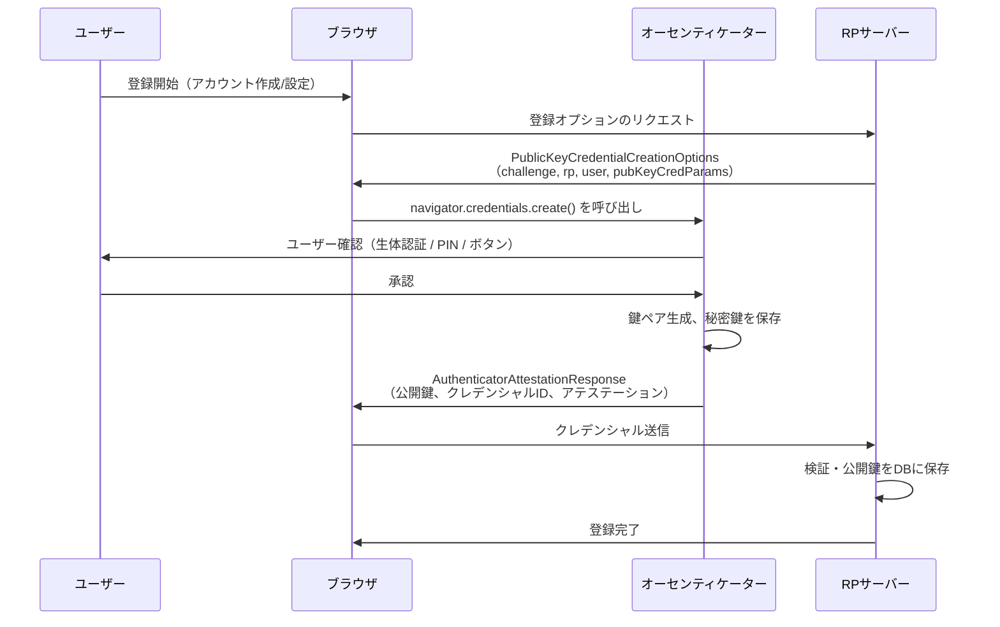
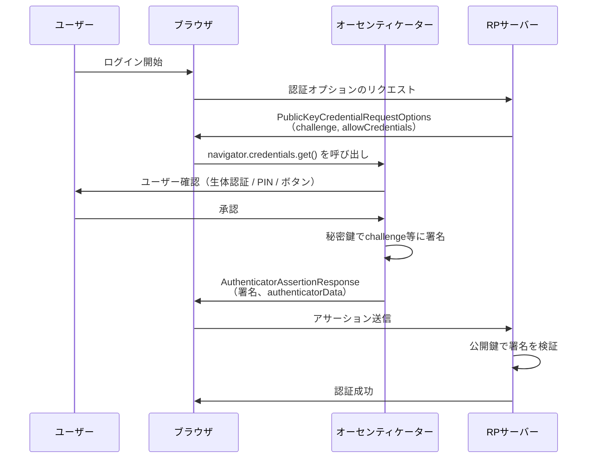

# WebAuthn - Web Authentication API Level 2

## 概要

**Web Authentication API（WebAuthn）**は、W3Cが策定したウェブブラウザ上での強力な認証を実現するためのAPI仕様である。パスワードに代わり、公開鍵暗号方式に基づく認証情報（クレデンシャル）を用いることで、フィッシング耐性を持つ高セキュリティな認証を可能にする。

WebAuthnはFIDOアライアンスが開発したFIDO2フレームワークの一部を構成し、FIDO2の他コンポーネントであるCTAP2（Client to Authenticator Protocol）と組み合わせて使用される。Level 1が2019年3月にW3C勧告となり、**Level 2**は2021年4月に勧告となった現行バージョンである。

## 解決する課題

従来のパスワード認証には以下の問題があった。

- **フィッシング攻撃**: ユーザーが偽サイトにパスワードを入力してしまうリスク
- **クレデンシャルスタッフィング**: 流出したパスワードの使い回しによる不正アクセス
- **サーバー側の漏洩リスク**: パスワードハッシュがサーバーに保存されるため、DB漏洩時に危険
- **ユーザビリティの低下**: 複雑なパスワードポリシーへの対応コスト

WebAuthnはこれらの問題をゼロにすることを目的として設計された。秘密鍵はデバイス（オーセンティケーター）内に閉じ込められ、ネットワークには公開鍵のみが流通する。またオリジンへのバインディングによりフィッシングサイトでの利用が不可能になる。

## 主要概念・用語

### 登場人物

| 用語                     | 説明                                                                                                                 |
| ------------------------ | -------------------------------------------------------------------------------------------------------------------- |
| **RP（Relying Party）**  | WebAuthn認証を実装するウェブサービス（サーバー）とそのWebアプリケーション                                            |
| **RP ID**                | RPのスコープを定めるドメイン名ベースの識別子。`example.com` のように指定し、サブドメインも含めてスコープを共有できる |
| **ユーザーエージェント** | ブラウザ。WebAuthn APIを仲介し、オーセンティケーターとRPをつなぐ                                                     |
| **オーセンティケーター** | 秘密鍵を生成・保管し、認証主張を生成する暗号エンティティ                                                             |

### オーセンティケーターの種類

| 種類                                     | 説明                     | 例                                       |
| ---------------------------------------- | ------------------------ | ---------------------------------------- |
| **プラットフォームオーセンティケーター** | デバイスに内蔵           | Touch ID, Windows Hello, Android指紋認証 |
| **ローミングオーセンティケーター**       | 外部接続の携帯型デバイス | YubiKey, FIDO2セキュリティキー           |

### クレデンシャル関連用語

- **クレデンシャルID**: オーセンティケーターが生成するクレデンシャルの一意識別子
- **公開鍵クレデンシャルソース**: 秘密鍵・クレデンシャルID・その他メタデータで構成される、オーセンティケーター内に保存された認証情報の実体
- **アテステーション**: 登録時にオーセンティケーターが提供する、自身の種別や真正性を証明する暗号的な証明
- **アサーション**: 認証時にオーセンティケーターが生成するチャレンジへの署名

## 2つのセレモニー

WebAuthnには**登録（Registration）**と**認証（Authentication）**の2つのセレモニーがある。

### 登録セレモニー

ユーザーが初めてRPにWebAuthnクレデンシャルを登録する手続き。



RPサーバーは以下のオプションを生成してブラウザに返す。

```json
{
  "challenge": "<サーバー生成のランダムバイト列>",
  "rp": { "name": "Example Corp", "id": "example.com" },
  "user": {
    "id": "<ユーザーのバイナリID>",
    "name": "alice@example.com",
    "displayName": "Alice"
  },
  "pubKeyCredParams": [
    { "type": "public-key", "alg": -7 }, // ES256
    { "type": "public-key", "alg": -257 } // RS256
  ],
  "authenticatorSelection": {
    "residentKey": "required",
    "userVerification": "required"
  },
  "timeout": 60000
}
```

### 認証セレモニー

登録済みのクレデンシャルでユーザーがログインする手続き。



## 詳細解説

### authenticatorData

登録・認証の両セレモニーでオーセンティケーターが生成するバイト列。以下の情報を含む。

| フィールド                 | 説明                                                         |
| -------------------------- | ------------------------------------------------------------ |
| **rpIdHash**               | RP IDのSHA-256ハッシュ。オリジンバインディングの核心         |
| **flags**                  | ユーザー確認実施フラグ（UV）、ユーザー存在確認フラグ（UP）等 |
| **signCount**              | 署名カウンター。クレデンシャルのクローン検知に使用           |
| **attestedCredentialData** | 登録時のみ含まれる。クレデンシャルIDと公開鍵                 |
| **extensions**             | 拡張データ                                                   |

### アテステーション

登録時、RPはオーセンティケーターの種別や真正性を確認できる。アテステーションの形式は7種類定義されている。

| 形式                  | 説明                                                                         |
| --------------------- | ---------------------------------------------------------------------------- |
| **packed**            | 汎用的な形式。自己アテステーションと完全なアテステーション両対応             |
| **tpm**               | Trusted Platform Module（TPM）ハードウェアを使用するオーセンティケーター向け |
| **android-key**       | Androidデバイスのキーストアシステムを使用                                    |
| **android-safetynet** | GoogleのSafetyNetサービスを利用                                              |
| **fido-u2f**          | 旧来のFIDO U2Fオーセンティケーターとの後方互換性                             |
| **none**              | アテステーション情報を省略。プライバシー保護に有効                           |
| **apple**             | Appleのプライバシー保護アテステーション形式                                  |

RPは全オーセンティケーターを信頼する（`none`相当の扱い）か、FIDO Metadata Service（MDS）を利用してオーセンティケーターの種別・セキュリティレベルを確認するかを選択できる。

### ディスカバラブルクレデンシャル（常駐クレデンシャル）

`residentKey: "required"` を指定すると、クレデンシャルがオーセンティケーター内に保存される（非常駐の場合はRPサーバーがクレデンシャルIDを管理し `allowCredentials` で渡す）。

ディスカバラブルクレデンシャルはパスワードレスログインを実現する基盤となり、ユーザーはメールアドレスすら入力せずに認証できる（**Usernameless Authentication**）。パスキー（Passkeys）の技術的基盤はこのディスカバラブルクレデンシャルである。

### ユーザー確認（User Verification）

`userVerification` パラメータによってオーセンティケーターへのユーザー確認要否を指定する。

| 値            | 意味                                       |
| ------------- | ------------------------------------------ |
| `required`    | 生体認証またはPINによる確認が必須          |
| `preferred`   | 可能であれば確認を実施（デフォルト）       |
| `discouraged` | ユーザー確認を求めない（物理タップのみ等） |

ユーザー確認が実施された場合、`authenticatorData` の UVフラグが立つ。RPは認証後にこのフラグを確認して、2要素認証の2要素目として機能したかを判断できる。

### 拡張機能（Extensions）

WebAuthnは拡張機能による機能追加メカニズムを持つ。代表的な拡張として：

- **`credProps`**: クレデンシャルのプロパティ（常駐か否か等）を返す
- **`largeBlob`**: オーセンティケーターに任意のデータを保存する
- **`prf`**: HMAC Pseudo-Random Functionで鍵素材を派生させる（暗号化用途）

## セキュリティに関する考慮事項

### フィッシング耐性

WebAuthnの最大のセキュリティ上の優位性は**フィッシング耐性**である。

`authenticatorData` の `rpIdHash` にはRP IDのハッシュが含まれ、オーセンティケーターはブラウザから受け取ったオリジンとRP IDの整合性を確認してから署名する。ユーザーが `evil-example.com` のような偽サイトに誘導されても、RP IDが `example.com` と異なるためオーセンティケーターは署名を拒否する。

### リプレイ攻撃への対策

各セレモニーにサーバー生成のチャレンジが含まれ、オーセンティケーターはそのチャレンジを含むデータに署名する。チャレンジはセッションごとに異なる使い捨て値であるため、過去のアサーションを再利用する攻撃は無効になる。

### 署名カウンター

`authenticatorData` に含まれる `signCount`（署名カウンター）は、認証のたびにインクリメントされる。RPは前回のカウンター値より新しい値かを確認することで、クレデンシャルのクローン（秘密鍵の複製）を検知できる。ただしパスキーの普及に伴いクラウド同期型の実装では常に0を返すケースも増えており、カウンターが0の場合はクローン検知を行わないことが仕様上認められている。

### 秘密鍵の保護

秘密鍵はオーセンティケーターの論理的なセキュリティ境界の外に出ない。所有者であってもエクスポートは不可能であり、これにより秘密鍵の窃取・漏洩リスクを根本的に排除する。

### プライバシー保護

- **RPスコープ分離**: あるRPのクレデンシャルは別のRPから検出・使用できない
- **不透明な識別子**: クレデンシャルIDはランダム生成であり、ユーザーを識別する情報を含まない
- **クロスオリジン追跡の防止**: 異なるRPに対して同一のクレデンシャルを使い回すことができず、RP間でのユーザー追跡が困難になる

## 関連仕様

| 仕様                                                 | 関連内容                                                                                                                                 |
| ---------------------------------------------------- | ---------------------------------------------------------------------------------------------------------------------------------------- |
| **CTAP2（FIDO Client to Authenticator Protocol 2）** | ブラウザとオーセンティケーター間の通信プロトコル。WebAuthnと対をなすFIDO2の構成要素                                                      |
| **FIDO Metadata Service（MDS）**                     | FIDOアライアンスが運営するオーセンティケーターのメタデータサービス。アテステーション検証に使用                                           |
| **Passkeys**                                         | ディスカバラブルクレデンシャルを軸に、Apple/Google/Microsoftが推進するパスワードレス認証エコシステム。WebAuthnを基盤として実装されている |
| **FIDO U2F**                                         | WebAuthnの前身。2要素認証専用だったFIDO U2Fの後継として、より汎用的なWebAuthnが設計された                                                |

## 参考文献

- [Web Authentication: An API for accessing Public Key Credentials - Level 2（W3C Recommendation）](https://www.w3.org/TR/webauthn-2/)
- [FIDO2 Project（FIDOアライアンス）](https://fidoalliance.org/fido2/)
- [CTAP2 仕様（FIDOアライアンス）](https://fidoalliance.org/specs/fido-v2.1-ps-20210615/fido-client-to-authenticator-protocol-v2.1-ps-20210615.html)
- [FIDO Metadata Service](https://fidoalliance.org/metadata/)
